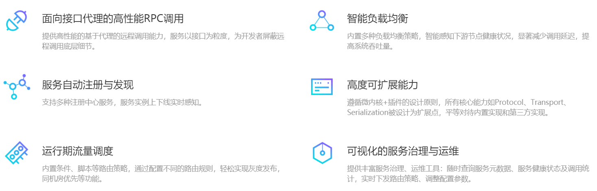

# 1 Dubbo特性

# 2 整体框架

* **调用关系说明**
  1. 服务容器负责启动，加载，运行服务提供者。
  2. 服务提供者在启动时，向注册中心注册自己提供的服务。
  3. 服务消费者在启动时，向注册中心订阅自己所需的服务。
  4. 注册中心返回服务提供者地址列表给消费者，如果有变更，注册中心将基于长连接推送变更数据给消费者。
  5. 服务消费者，从提供者地址列表中，基于软负载均衡算法，选一台提供者进行调用，如果调用失败，再选另一台调用。
  6. 服务消费者和提供者，在内存中累计调用次数和调用时间，定时每分钟发送一次统计数据到监控中心。

