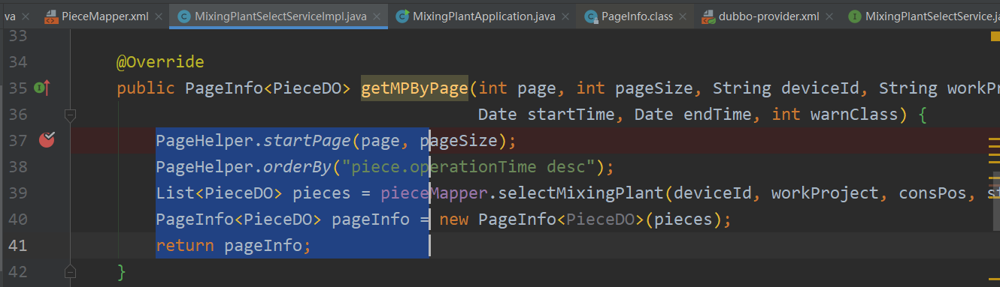

[toc]

---

## 查找和替换

> 查找：在当前文件查找                    Ctrl+F

> 替换：替换当前文件内容快捷键	  Ctrl+R
>
> ​			全局搜索替换内容			    Ctrl+Shift+R

## 查找文件

​	双击shift

## 重命名类名、方法名、参数名等

Shift + F6

## Declaration&Usages	Implementations

​	Declaration&Usages:	Ctrl + B					(查看方法的声明和使用)

​	查找方法所有使用的地方：Alt + F7

​	Implementations:		   Ctrl + Alt +B             (查看接口方法的具体实现)

​		

## 矩形选择工具

​	Shift + Alt + Insert

