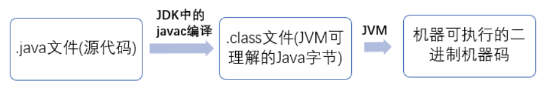
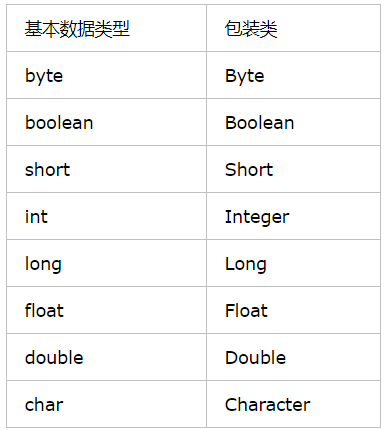
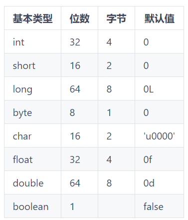
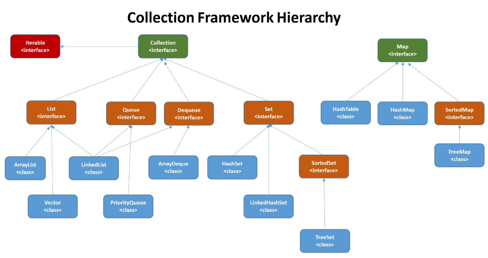

[toc]

---

# 一、基础

## 1.1JVM

 	Java 虚拟机（JVM）是运行 Java 字节码的虚拟机。JVM 有针对不同系统的特定实现（Windows，Linux，macOS），目的是使用相同的字节码，它们都会给出相同的结果。 




## 1.2Java和C++的区别

- 都是面向对象的语言，都支持封装、继承和多态
- Java 不提供指针来直接访问内存，程序内存更加安全
- Java 的类是单继承的，C++ 支持多重继承；虽然 Java 的类不可以多继承，但是接口可以多继承。
- Java 有自动内存管理机制，不需要程序员手动释放无用内存


## 1.3基本数据类型和包装数据类型



​		简单地说，包装类就是对基本数据类型的一个面向对象的封装，使其具有属性和方法，符合面向对象的设计要求 


## 1.4线程安全和非线程安全

* 线程安全就是多线程访问时，采用了加锁机制，当一个线程访问该类的某个数据时，进行保护，其他线程不能进行访问直到该线程读取完，其他线程才可使用。 

>  线程安全必须要使用很多synchronized关键字来同步控制，所以必然会导致性能的降低。 

*  非线程安全就是不提供数据访问保护，有可能出现多个线程先后更改数据造成所得到的数据是脏数据 


## 1.5反射

​		JAVA反射机制是在运行状态中，对于任意一个类，都能够知道这个类的所有属性和方法；对于任意一个对象，都能够调用它的任意一个方法和属性；这种动态获取的信息以及动态调用对象的方法的功能称为java语言的反射机制。 

* **获取 `Class ` 对象的三种方式**

  1.知道具体类的情况下可以使用：

  ```java
  Class alunbarClass = TargetClass.class;
  ```

  但是我们一般是不知道具体类的，基本都是通过遍历包下面的类来获取 Class 对象

  2.通过 `Class.forName()`传入类的路径获取：

  ```java
  Class alunbarClass1 = Class.forName("cn.javaguide.TargetClass");
  ```

  3.通过对象实例`instance.getClass()`获取：

  ```java
  Employee e;
  Class alunbarClass2 = e.getClass();
  ```

* **代码实例**

  1.创建一个我们要使用反射操作的类 `TargetObject`：

  ```java
  package cn.javaguide;
  
  public class TargetObject {
      private String value;
  
      public TargetObject() {
          value = "JavaGuide";
      }
  
      public void publicMethod(String s) {
          System.out.println("I love " + s);
      }
  
      private void privateMethod() {
          System.out.println("value is " + value);
      }
  }
  ```

  2.使用反射操作这个类的方法以及参数

  ```java
  package cn.javaguide;
  
  import java.lang.reflect.Field;
  import java.lang.reflect.InvocationTargetException;
  import java.lang.reflect.Method;
  
  public class Main {
      public static void main(String[] args) throws ClassNotFoundException, NoSuchMethodException, IllegalAccessException, InstantiationException, InvocationTargetException, NoSuchFieldException {
          /**
           * 获取TargetObject类的Class对象并且创建TargetObject类实例
           */
          Class<?> tagetClass = Class.forName("cn.javaguide.TargetObject");
          TargetObject targetObject = (TargetObject) tagetClass.newInstance();
          /**
           * 获取所有类中所有定义的方法
           */
          Method[] methods = tagetClass.getDeclaredMethods();
          for (Method method : methods) {
              System.out.println(method.getName());
          }
          /**
           * 获取指定方法并调用
           */
          Method publicMethod = tagetClass.getDeclaredMethod("publicMethod",
                  String.class);
  
          publicMethod.invoke(targetObject, "JavaGuide");
          /**
           * 获取指定参数并对参数进行修改
           */
          Field field = tagetClass.getDeclaredField("value");
          //为了对类中的参数进行修改我们取消安全检查
          field.setAccessible(true);
          field.set(targetObject, "JavaGuide");
          /**
           * 调用 private 方法
           */
          Method privateMethod = tagetClass.getDeclaredMethod("privateMethod");
          //为了调用private方法我们取消安全检查
          privateMethod.setAccessible(true);
          privateMethod.invoke(targetObject);
      }
  }
  ```

  输出内容：

  ```tex
  publicMethod
  privateMethod
  I love JavaGuide
  value is JavaGuide
  ```

  

## 1.6多线程

[超链接：Java并发基础常见面试题总结](https://snailclimb.gitee.io/javaguide/#/docs/java/Multithread/JavaConcurrencyBasicsCommonInterviewQuestionsSummary?id=_10-为什么我们调用-start-方法时会执行-run-方法，为什么我们不能直接调用-run-方法？) 

[超链接：Java并发进阶常见面试题总结]( https://github.com/Snailclimb/JavaGuide/blob/master/docs/java/Multithread/JavaConcurrencyAdvancedCommonInterviewQuestions.md )


# 二、基础语法

## 2.1基本数据类型

1. ​	6种数字类型 ：byte、short、int、long、float、double
2. ​    1种字符类型：char
3. ​    1种布尔型：boolean




## 2.2容器



### 2.2.1  List、Set、Map三者的区别

- `List`(对付顺序的好帮手)： 存储的元素是有序的、可重复的。
- `Set`(注重独一无二的性质): 存储的元素是无序的、不可重复的。
- `Map`(用 Key 来搜索的专家): 使用键值对（kye-value）存储，类似于数学上的函数 y=f(x)，“x”代表 key，"y"代表 value，Key 是无序的、不可重复的，value 是无序的、可重复的，每个键最多映射到一个值。


### 2.2.2  List

- `Arraylist`： `Object[]`数组

- `Vector`：`Object[]`数组

- `LinkedList`： 双向链表(JDK1.6 之前为循环链表，JDK1.7 取消了循环)

  

  <u>Arraylist 和 Vector 的区别?</u>

1. ArrayList 是 List 的主要实现类，底层使用 Object[ ]存储，==适用于频繁的查找工作，线程不安全==；

2. Vector 是 List 的古老实现类，底层使用 Object[ ]存储，==线程安全的==。

   

   <u>Arraylist 与 LinkedList 区别?</u>

1. *是否保证线程安全：** `ArrayList` 和 `LinkedList` ==都是不同步的，也就是不保证线程安全==；
4. **底层数据结构：** `Arraylist` 底层使用的是 **`Object` 数组**；`LinkedList` 底层使用的是 **双向链表** 数据结构（JDK1.6 之前为循环链表，JDK1.7 取消了循环。注意双向链表和双向循环链表的区别，下面有介绍到！）

5. **插入和删除是否受元素位置的影响：** ① **`ArrayList` 采用数组存储，所以插入和删除元素的时间复杂度受元素位置的影响。** 比如：执行`add(E e)`方法的时候， `ArrayList` 会默认在将指定的元素追加到此列表的末尾，这种情况时间复杂度就是 O(1)。但是如果要在指定位置 i 插入和删除元素的话（`add(int index, E element)`）时间复杂度就为 O(n-i)。因为在进行上述操作的时候集合中第 i 和第 i 个元素之后的(n-i)个元素都要执行向后位/向前移一位的操作。 ② **`LinkedList` 采用链表存储，所以对于`add(E e)`方法的插入，删除元素时间复杂度不受元素位置的影响，近似 O(1)，如果是要在指定位置`i`插入和删除元素的话（`(add(int index, E element)`） 时间复杂度近似为`o(n))`因为需要先移动到指定位置再插入。**

6. **是否支持快速随机访问：** `LinkedList` 不支持高效的随机元素访问，而 `ArrayList` 支持。快速随机访问就是通过元素的序号快速获取元素对象(对应于`get(int index)`方法)。

7. **内存空间占用：** ArrayList 的空 间浪费主要体现在在 list 列表的结尾会预留一定的容量空间，而 LinkedList 的空间花费则体现在它的每一个元素都需要消耗比 ArrayList 更多的空间（因为要存放直接后继和直接前驱以及数据）。


### 2.2.3  Set

​	<u>比较 HashSet、LinkedHashSet 和 TreeSet 三者的异同</u>

* HashSet 是 Set 接口的主要实现类 ，HashSet 的底层是 HashMap，线程不安全的，可以存储 null 值；

* LinkedHashSet 是 HashSet 的子类，能够按照添加的顺序遍历；

* TreeSet 底层使用红黑树，能够按照添加元素的顺序进行遍历，排序的方式有自然排序和定制排序。


### 2.2.4  Map

> ​	java为数据结构中的映射定义了一个接口java.util.Map;它有四个实现类,分别是HashMap、 Hashtable、 LinkedHashMap 和 TreeMap. 

**HashMap** 是一个最常用的Map,它根据键的HashCode值存储数据,根据键可以直接获取它的值，具有很快的访问速度，遍历时，取得数据的顺序是完全随机的。 HashMap最多只允许一条记录的键为Null;允许多条记录的值为 Null;HashMap不支持线程的同步，即任一时刻可以有多个线程同时写HashMap;可能会导致数据的不一致。如果需要同步，可以用 Collections的synchronizedMap方法使HashMap具有同步的能力，或者使用ConcurrentHashMap。

**Hashtable** 与 HashMap类似,它继承自Dictionary类，不同的是:它不允许记录的键或者值为空;它支持线程的同步，即任一时刻只有一个线程能写Hashtable,因此也导致了 Hashtable在写入时会比较慢。

**LinkedHashMap** 是HashMap的一个子类，保存了记录的插入顺序，在用Iterator遍历LinkedHashMap时，先得到的记录肯定是先插入的.也可以在构造时用带参数，按照应用次数排序。在遍历的时候会比HashMap慢，不过有种情况例外，当HashMap容量很大，实际数据较少时，遍历起来可能会比 LinkedHashMap慢，因为LinkedHashMap的遍历速度只和实际数据有关，和容量无关，而HashMap的遍历速度和他的容量有关。

**TreeMap** 实现SortMap接口，能够把它保存的记录根据键排序,默认是按键值的升序排序，也可以指定排序的比较器，当用Iterator 遍历TreeMap时，得到的记录是排过序的。

一般情况下，我们用的最多的是HashMap,在Map 中插入、删除和定位元素，HashMap 是最好的选择。但如果您要按自然顺序或自定义顺序遍历键，那么TreeMap会更好。如果需要输出的顺序和输入的相同,那么用LinkedHashMap 可以实现,它还可以按读取顺序来排列.


### 2.2.5 HashMap的几种遍历方式

[参考链接](https://mp.weixin.qq.com/s/Zz6mofCtmYpABDL1ap04ow)

1. 迭代器EntrySet

```java 
public class HashMapTest {
    public static void main(String[] args) {
        // 创建并赋值 HashMap
        Map<Integer, String> map = new HashMap();
        map.put(1, "Java");
        map.put(2, "JDK");
        map.put(3, "Spring Framework");
        map.put(4, "MyBatis framework");
        map.put(5, "Java中文社群");
        // 遍历
        Iterator<Map.Entry<Integer, String>> iterator = map.entrySet().iterator();
        while (iterator.hasNext()) {
            Map.Entry<Integer, String> entry = iterator.next();
            System.out.print(entry.getKey());
            System.out.print(entry.getValue());
        }
    }
}
// 执行结果
1 Java 2 JDK 3 Spring Framework 4 MyBatis framework 5 Java中文社群
```

2. 迭代器KeySet

```java
public class HashMapTest {
    public static void main(String[] args) {
        // 创建并赋值 HashMap
        Map<Integer, String> map = new HashMap();
        map.put(1, "Java");
        map.put(2, "JDK");
        map.put(3, "Spring Framework");
        map.put(4, "MyBatis framework");
        map.put(5, "Java中文社群");
        // 遍历
        Iterator<Integer> iterator = map.keySet().iterator();
        while (iterator.hasNext()) {
            Integer key = iterator.next();
            System.out.print(key);
            System.out.print(map.get(key));
        }
    }
}
// 执行结果
1 Java 2 JDK 3 Spring Framework 4 MyBatis framework 5 Java中文社群
```

3. ForEach EntrySet

```java
public class HashMapTest {
    public static void main(String[] args) {
        // 创建并赋值 HashMap
        Map<Integer, String> map = new HashMap();
        map.put(1, "Java");
        map.put(2, "JDK");
        map.put(3, "Spring Framework");
        map.put(4, "MyBatis framework");
        map.put(5, "Java中文社群");
        // 遍历
        for (Map.Entry<Integer, String> entry : map.entrySet()) {
            System.out.print(entry.getKey());
            System.out.print(entry.getValue());
        }
    }
}
// 执行结果
1 Java 2 JDK 3 Spring Framework 4 MyBatis framework 5 Java中文社群
```

4. ForEach KeySet

```java
public class HashMapTest {
    public static void main(String[] args) {
        // 创建并赋值 HashMap
        Map<Integer, String> map = new HashMap();
        map.put(1, "Java");
        map.put(2, "JDK");
        map.put(3, "Spring Framework");
        map.put(4, "MyBatis framework");
        map.put(5, "Java中文社群");
        // 遍历
        for (Integer key : map.keySet()) {
            System.out.print(key);
            System.out.print(map.get(key));
        }
    }
}
// 执行结果
1 Java 2 JDK 3 Spring Framework 4 MyBatis framework 5 Java中文社群
```

5. Lambda

```java
public class HashMapTest {
    public static void main(String[] args) {
        // 创建并赋值 HashMap
        Map<Integer, String> map = new HashMap();
        map.put(1, "Java");
        map.put(2, "JDK");
        map.put(3, "Spring Framework");
        map.put(4, "MyBatis framework");
        map.put(5, "Java中文社群");
        // 遍历
        map.forEach((key, value) -> {
            System.out.print(key);
            System.out.print(value);
        });
    }
}
// 执行结果
1 Java 2 JDK 3 Spring Framework 4 MyBatis framework 5 Java中文社群
```

6. Streams API 单线程

```java
public class HashMapTest {
    public static void main(String[] args) {
        // 创建并赋值 HashMap
        Map<Integer, String> map = new HashMap();
        map.put(1, "Java");
        map.put(2, "JDK");
        map.put(3, "Spring Framework");
        map.put(4, "MyBatis framework");
        map.put(5, "Java中文社群");
        // 遍历
        map.entrySet().stream().forEach((entry) -> {
            System.out.print(entry.getKey());
            System.out.print(entry.getValue());
        });
    }
}
// 执行结果
1 Java 2 JDK 3 Spring Framework 4 MyBatis framework 5 Java中文社群
```

7. Streams API 多线程

```java
public class HashMapTest {
    public static void main(String[] args) {
        // 创建并赋值 HashMap
        Map<Integer, String> map = new HashMap();
        map.put(1, "Java");
        map.put(2, "JDK");
        map.put(3, "Spring Framework");
        map.put(4, "MyBatis framework");
        map.put(5, "Java中文社群");
        // 遍历
        map.entrySet().parallelStream().forEach((entry) -> {
            System.out.print(entry.getKey());
            System.out.print(entry.getValue());
        });
    }
}
// 执行结果
4 MyBatis framework 5 Java中文社群 1 Java 2 JDK 3 Spring Framewor
```


	>HashMap 和 Hashtable 的区别：

1. **线程是否安全：** HashMap 是非线程安全的，HashTable 是线程安全的,因为 HashTable 内部的方法基本都经过`synchronized` 修饰。（如果你要保证线程安全的话就使用 ConcurrentHashMap 吧！）；
2. **效率：** 因为线程安全的问题，HashMap 要比 HashTable 效率高一点。另外，HashTable 基本被淘汰，不要在代码中使用它；
3. **对 Null key 和 Null value 的支持：** HashMap 可以存储 null 的 key 和 value，但 null 作为键只能有一个，null 作为值可以有多个；HashTable 不允许有 null 键和 null 值，否则会抛出 NullPointerException。
4. **初始容量大小和每次扩充容量大小的不同 ：** ① 创建时如果不指定容量初始值，Hashtable 默认的初始大小为 11，之后每次扩充，容量变为原来的 2n+1。HashMap 默认的初始化大小为 16。之后每次扩充，容量变为原来的 2 倍。② 创建时如果给定了容量初始值，那么 Hashtable 会直接使用你给定的大小，而 HashMap 会将其扩充为 2 的幂次方大小（HashMap 中的`tableSizeFor()`方法保证，下面给出了源代码）。也就是说 HashMap 总是使用 2 的幂作为哈希表的大小,后面会介绍到为什么是 2 的幂次方。
5. **底层数据结构：** JDK1.8 以后的 HashMap 在解决哈希冲突时有了较大的变化，当链表长度大于阈值（默认为 8）（将链表转换成红黑树前会判断，如果当前数组的长度小于 64，那么会选择先进行数组扩容，而不是转换为红黑树）时，将链表转化为红黑树，以减少搜索时间。Hashtable 没有这样的机制。


## 2.3 Collections工具类和Arrays工具类

### Collections

1. **排序**

```java
void reverse(List list)//反转
void shuffle(List list)//随机排序
void sort(List list)//按自然排序的升序排序
void sort(List list, Comparator c)//定制排序，由Comparator控制排序逻辑
void swap(List list, int i , int j)//交换两个索引位置的元素
void rotate(List list, int distance)//旋转。当distance为正数时，将list后distance个元素整体移到前面。当distance为负数时，将 list的前distance个元素整体移到后面。
```

​		定制排序：

```java
// 定制按降序排序的排序用法
Collections.sort(arrayList, new Comparator<Integer>() {
    @Override
    public int compare(Integer o1, Integer o2) {
        // public static int compare(int x, int y) {
        // 		return (x < y) ? -1 : ((x == y) ? 0 : 1);
        //}
        return o2.compareTo(o1);	// 当 o2>01 时，返回1
    }
});
```


2. **查找和替换**

```java
int binarySearch(List list, Object key) //对List进行二分查找，返回索引，注意List必须是有序的
int max(Collection coll) //根据元素的自然顺序，返回最大的元素。 类比int min(Collection coll)
int max(Collection coll, Comparator c) //根据定制排序，返回最大元素，排序规则由Comparatator类控制。类比int min(Collection coll, Comparator c)
void fill(List list, Object obj) //用指定的元素代替指定list中的所有元素。
int frequency(Collection c, Object o) //统计元素出现次数
int indexOfSubList(List list, List target) //统计target在list中第一次出现的索引，找不到则返回-1，类比int lastIndexOfSubList(List source, list target).
boolean replaceAll(List list, Object oldVal, Object newVal) //用新元素替换指定旧元素
```


3. **Collections.toArray()方法使用的坑&如何反转数组**

   该方法是一个泛型方法：` T[] toArray(T[] a);` 如果`toArray`方法中没有传递任何参数的话返回的是`Object`类型数组。

   ```java
   String [] s= new String[]{"dog", "lazy", "a", "over", "jumps", "fox", "brown", "quick", "A"};
   List<String> list = new ArrayList<>(Arrays.asList(s));
   Collections.reverse(list);
   s=list.toArray(new String[0]);	//没有指定类型的话会报错
   ```

   由于JVM优化，`new String[0]`作为`Collections.toArray()`方法的参数现在使用更好，`new String[0]`就是起一个模板的作用，指定了返回数组的类型，0是为了节省空间，因为它只是为了说明返回的类型。详见：https://shipilev.net/blog/2016/arrays-wisdom-ancients/


### Array

1. **排序 : `sort()`**

```java
int a[] = { 1, 3, 2, 7, 6, 5, 4, 9 };
// sort(int[] a)方法按照数字顺序排列指定的数组。
Arrays.sort(a);			//[1,2,3,4,5,6,7,9]
// sort(int[] a,int fromIndex,int toIndex)按升序排列数组的指定范围
Arrays.sort(a, 2, 6);	//[1,3,2,4,5,6,7,9]
// parallelSort(int[] a) 按照数字顺序排列指定的数组(并行的)。同sort方法一样也有按范围的排序
Arrays.parallelSort(a);	//[1,2,3,4,5,6,7,9]
```

ps: sort()适合对小的数组进行排序，效率较高；对于大的数组，使用 parallelSort()可使用系统多核，效率更高

在做算法面试题的时候，我们还可能会经常遇到对字符串排序的情况,`Arrays.sort()` 对每个字符串的特定位置进行比较，然后按照升序排序。

```java
String[] strs = { "abcdehg", "abcdefg", "abcdeag" };
Arrays.sort(strs);
System.out.println(Arrays.toString(strs));//[abcdeag, abcdefg, abcdehg]
```


2. 查找 : `binarySearch()`

```java
// *************查找 binarySearch()****************
char[] e = { 'a', 'f', 'b', 'c', 'e', 'A', 'C', 'B' };
// 排序后再进行二分查找，否则找不到
Arrays.sort(e);				// [A, B, C, a, b, c, e, f]
int s = Arrays.binarySearch(e, 'c');	// s=5
System.out.println("字符c在数组的位置：" + s);
```


3. 比较: `equals()`

```java
// *************比较 equals****************
char[] e = { 'a', 'f', 'b', 'c', 'e', 'A', 'C', 'B' };
char[] f = { 'a', 'f', 'b', 'c', 'e', 'A', 'C', 'B' };
/*
* 元素数量相同，并且相同位置的元素相同。 另外，如果两个数组引用都是null，则它们被认为是相等的 。
*/
// 输出true
System.out.println("Arrays.equals(e, f):" + Arrays.equals(e, f));
```


4. 填充 : `fill()`

```java
// *************填充fill(批量初始化)****************
int[] g = { 1, 2, 3, 3, 3, 3, 6, 6, 6 };
// 数组中所有元素重新分配值
Arrays.fill(g, 3);
System.out.println("Arrays.fill(g, 3)：");
// 输出结果：333333333
for (int i : g) {
    System.out.print(i);
}
// 换行
System.out.println();

int[] h = { 1, 2, 3, 3, 3, 3, 6, 6, 6, };
// 数组中指定范围元素重新分配值
Arrays.fill(h, 0, 2, 9);
System.out.println("Arrays.fill(h, 0, 2, 9);：");
// 输出结果：993333666
for (int i : h) {
    System.out.print(i);
}
```


5. 转列表: `asList()`

```java
// *************转列表 asList()****************
/*
* 返回由指定数组支持的固定大小的列表。
* （将返回的列表更改为“写入数组”。）该方法作为基于数组和基于集合的API之间的桥梁，与Collections.toArray()相结合 。
* 返回的列表是可序列化的，并实现RandomAccess 。
* 此方法还提供了一种方便的方式来创建一个初始化为包含几个元素的固定大小的列表如下：
*/
List<String> stooges = Arrays.asList("Larry", "Moe", "Curly");
System.out.println(stooges);		// 输出 [Larry, Moe, Curly]
```

关于 `Arrays.asList()`的注意要点：

* 使用工具类 Arrays.asList() 将数组转换为集合后，底层其实还是数组。

  **使用 Arrays.asList() 把数组转换为集合后，不能使用其修改集合相关的方法，它的 add/remove/clear 方法会抛出UnsupportedOperationException 异常**，**因为 Arrays.asList() 的返回对象是 java.util.Arrays 的一个内部类，并没有实现集合的修改方法**。Arrays.asList() 体现的是适配器模式，知识转换接口，后台的数据仍是数组。

```java
String[] str = new String[]{"you", "wu"};
List list = Arrays.asList(str);
// 第一种情况：list.add("victory");  运行时异常
// 第二种情况：str[0] = "gujin";     list.get(0)会随之改变
```

* **传递的数组必须是对象数组，而不是基本类型**

  `Arrays.asList()`是泛型方法，传入的对象必须是对象数组。

```java
int[] myArray = { 1, 2, 3 };
List myList = Arrays.asList(myArray);
System.out.println(myList.size());//1
System.out.println(myList.get(0));//数组地址值
System.out.println(myList.get(1));//报错：ArrayIndexOutOfBoundsException
int [] array=(int[]) myList.get(0);
System.out.println(array[0]);//1
```

当传入一个原生数据类型数组时，`Arrays.asList()` 的真正得到的参数就不是数组中的元素，而是数组对象本身！此时	List 的唯一元素就是这个数组，这也就解释了上面的代码。

我们使用包装类型数组就可以解决这个问题。

```java
Integer[] myArray = { 1, 2, 3 };
```

* 正确的将数组转换为ArrayList

```java
// 最简便的方法
List list = new ArrayList<>(Arrays.asList("a", "b", "c"))
```

```java
// 使用 java8 的 Stream
Integer [] myArray = { 1, 2, 3 };
List myList = Arrays.stream(myArray).collect(Collectors.toList());
//基本类型也可以实现转换（依赖boxed的装箱操作）
int [] myArray2 = { 1, 2, 3 };
List myList = Arrays.stream(myArray2).boxed().collect(Collectors.toList());
```


6. 转字符串 : `toString()`

```java
// *************转字符串 toString()****************
/*
		* 返回指定数组的内容的字符串表示形式。
		*/
char[] k = { 'a', 'f', 'b', 'c', 'e', 'A', 'C', 'B' };
System.out.println(Arrays.toString(k));// [a, f, b, c, e, A, C, B]
```


7. 复制: `copyOf()`

```java
// *************复制 copy****************
// copyOf 方法实现数组复制,h为数组，6为复制的长度
int[] h = { 1, 2, 3, 3, 3, 3, 6, 6, 6, };
int i[] = Arrays.copyOf(h, 6);
System.out.println("Arrays.copyOf(h, 6);：");
// 输出结果：123333
for (int j : i) {
    System.out.print(j);
}
// 换行
System.out.println();
// copyOfRange将指定数组的指定范围复制到新数组中
int j[] = Arrays.copyOfRange(h, 6, 11);
System.out.println("Arrays.copyOfRange(h, 6, 11)：");
// 输出结果66600(h数组只有9个元素这里是从索引6到索引11复制所以不足的就为0)
for (int j2 : j) {
    System.out.print(j2);
}
// 换行
System.out.println();
```

