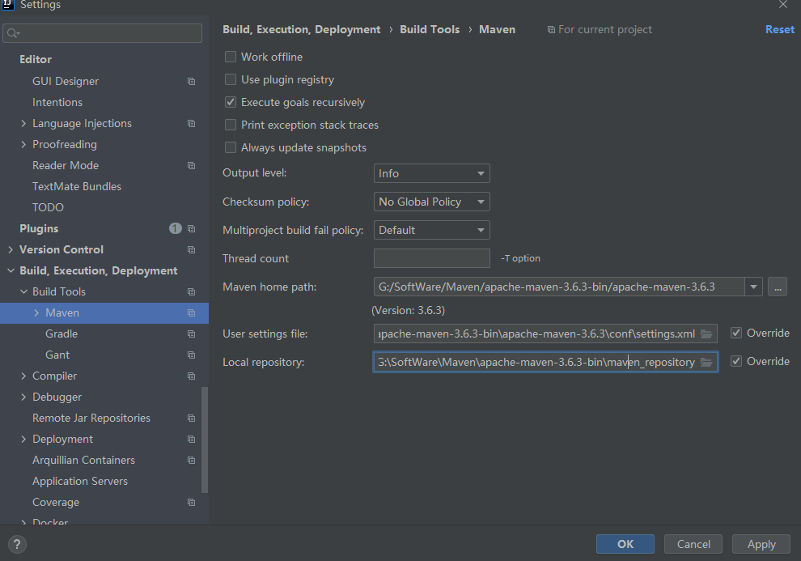

# Maven安装与配置

​	参考：https://www.cnblogs.com/javajetty/p/10051156.html

​	配置好环境变量和settings.xml文件后，可以在cdm终端使用 `mvn help:system`命令检验settings.xml文件是否配置正确，如果正确会在设定的repository文件夹中多出文件，否则会报出错误信息，注意根据错误信息仔细核对。


目前 IDEA中使用的 Maven 配置如下：



Maven home path:    G:\SoftWare\Maven\apache-maven-3.6.3-bin\apache-maven-3.6.3

User settings file: G:\SoftWare\Maven\apache-maven-3.6.3-bin\apache-maven-3.6.3\conf\settings.xml

Local repository: G:\SoftWare\Maven\apache-maven-3.6.3-bin\maven_repository


# 依赖无法下载解决方案：

参考：https://blog.csdn.net/weixin_36795183/article/details/79408167

**大致步骤：**

> 1. 在cdm中使用`mvn help:system`检验settings.xml文件是否有错误
>
> 2. 确保pom文件正确后，在pom文件中将未导入的依赖删除，并执行clean操作，再加上依赖，重新进行一次导入；如果依然不行，再次把pom文件中的依赖删除并执行clean，同时将本地repostory的对应的依赖包删除掉，再次重新导入
>
> 3. 如果仍然不行，可以在pom文件中加入以下配置，重新执行第二步中的操作
>
>    ```xml
>        <repositories>
>            <repository>
>                <id>nexus-aliyun</id>
>                <name>nexus-aliyun</name>
>                <url>http://maven.aliyun.com/nexus/content/groups/public/</url>
>                <releases>
>                    <enabled>true</enabled>
>                </releases>
>                <snapshots>
>                    <enabled>false</enabled>
>                </snapshots>
>            </repository>
>        </repositories>
>    ```