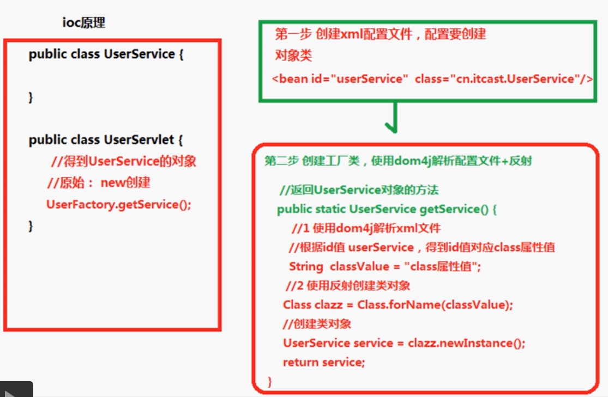

[toc]

---

spring概念：spring是开源的轻量级Java框架

核心：

>  AOP（面向切面编程），扩展功能不通过修改源代码实现
>
> IOC（控制反转），比如有一个类，在类里面有方法（不是静态的方法），调用类里面的方法。首先创建类的对象，使用对象调用方法。对象的创建不是通过new方式实现，而是交给spring配置创建类对象。

# 1. IOC

1.1 概念

Inversion of Control（控制反转），把对象的创建交给spring进行管理

上层控制下层，而不是下层控制着上层。我们用依赖注入（Dependency Injection）这种方式来实现控制反转。**所谓依赖注入，就是把底层类作为参数传入上层类，实现上层类对下层类的“控制**”。 

[控制反转、依赖注入（知乎第二条回答）](https://www.zhihu.com/question/23277575/answer/853179950)

1.2 IOC底层原理

（1）xml配置文件

（2）dom4j解析xml

（3）工厂设计模式

（4）反射

作用：降低类之间的耦合度

