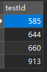
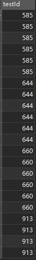
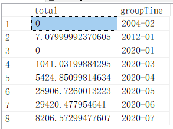

[toc]

---

参考资料： https://www.w3school.com.cn/sql/index.asp 

# 一、MySQL

## 基础教程

### 1.1  distinct

 仅仅列出不同（distinct）的值 

```mysql
SELECT DISTINCT 列名称 FROM 表名称
```


### 1.2  where

| 操作符  | 描述         |
| :------ | :----------- |
| =       | 等于         |
| <>      | 不等于       |
| >       | 大于         |
| <       | 小于         |
| >=      | 大于等于     |
| <=      | 小于等于     |
| BETWEEN | 在某个范围内 |
| LIKE    | 搜索某种模式 |

 **注释：**在某些版本的 SQL 中，操作符 <> 可以写为 != 


### 1.3  order by

ORDER BY 语句默认按照升序对记录进行排序。

如果您希望按照降序对记录进行排序，可以使用 DESC 关键字。


### 1.4  insert into

 INSERT INTO 语句用于向表格中插入新的行。 

```mysql
INSERT INTO 表名称 VALUES (值1, 值2,....)
```

```mysql
指定所要插入数据的列：
INSERT INTO table_name (列名1, 列名2,...) VALUES (值1, 值2,....)
```


### 1.5  update

```mysql
UPDATE 表名称 SET 列名称 = 新值 WHERE 列名称 = 某值
```

```mysql
更新某一行中的若干列:
UPDATE Person SET Address = 'Zhongshan 23', City = 'Nanjing'
WHERE LastName = 'Wilson'
```


### 1.6  delete

```mysql
删除某行：
DELETE FROM 表名称 WHERE 列名称 = 值
```

```mysql
可以在不删除表的情况下删除所有的行。这意味着表的结构、属性和索引都是完整的：
DELETE FROM table_name
或者：
DELETE * FROM table_name
```


## 高级教程

### 2.1  like

 LIKE 操作符用于在 WHERE 子句中搜索列中的指定模式。 

SQL LIKE 操作符语法：

```mysql
SELECT column_name(s)
FROM table_name
WHERE column_name LIKE pattern
```

在搜索数据库中的数据时，SQL 通配符可以替代一个或多个字符。SQL 通配符必须与 LIKE 运算符一起使用。

在 SQL 中，可使用以下通配符：

| 通配符                     | 描述                   |
| :------------------------- | :--------------------- |
| %                          | 替代一个或多个字符     |
| _                          | 仅替代一个字符         |
| [charlist]                 | 字符列中的任何单一字符 |
| [^charlist]或者[!charlist] | 不在字符               |


### 2.2  as

通过使用 SQL，可以为列名称和表名称指定别名（Alias）。 

```mysql
表的 SQL Alias 语法：
SELECT column_name(s)
FROM table_name
AS alias_name
```

假设我们有两个表分别是："Persons" 和 "Product_Orders"。我们分别为它们指定别名 "p" 和 "po"。

现在，我们希望列出 "John Adams" 的所有定单。

我们可以使用下面的 SELECT 语句：

```mysql
SELECT po.OrderID, p.LastName, p.FirstName
FROM Persons AS p, Product_Orders AS po
WHERE p.LastName='Adams' AND p.FirstName='John'
```


### 2.3  join

 join 用于根据两个或多个表中的列之间的关系，从这些表中查询数据。 

下面列出了您可以使用的 JOIN 类型，以及它们之间的差异。

- [JOIN](https://www.w3school.com.cn/sql/sql_join.asp): 如果表中有至少一个匹配，则返回行
- [LEFT JOIN](https://www.w3school.com.cn/sql/sql_join_left.asp): 即使右表中没有匹配，也从左表返回所有的行
- [RIGHT JOIN](https://www.w3school.com.cn/sql/sql_join_right.asp): 即使左表中没有匹配，也从右表返回所有的行
- [FULL JOIN](https://www.w3school.com.cn/sql/sql_join_full.asp): 只要其中一个表中存在匹配，就返回行


### 2.4  select into

SELECT INTO 语句从一个表中选取数据，然后把数据插入另一个表中。

SELECT INTO 语句常用于创建表的备份复件或者用于对记录进行存档。

下面的例子会创建一个名为 "Persons_Order_Backup" 的新表，其中包含了从 Persons 和 Orders 两个表中取得的信息：

```mysql
SELECT Persons.LastName,Orders.OrderNo
INTO Persons_Order_Backup
FROM Persons
INNER JOIN Orders
ON Persons.Id_P=Orders.Id_P
```


### 2.5  约束

约束用于限制加入表的数据的类型。

可以在创建表时规定约束（通过 CREATE TABLE 语句），或者在表创建之后也可以（通过 ALTER TABLE 语句）。

我们将主要探讨以下几种约束：

- [NOT NULL](https://www.w3school.com.cn/sql/sql_notnull.asp)
- [UNIQUE](https://www.w3school.com.cn/sql/sql_unique.asp)
- [PRIMARY KEY](https://www.w3school.com.cn/sql/sql_primarykey.asp)
- [FOREIGN KEY](https://www.w3school.com.cn/sql/sql_foreignkey.asp)
- [CHECK](https://www.w3school.com.cn/sql/sql_check.asp)
- [DEFAULT](https://www.w3school.com.cn/sql/sql_default.asp)


### 2.6  create index

CREATE INDEX 语句用于在表中创建索引。

在不读取整个表的情况下，索引使数据库应用程序可以更快地查找数据。

**索引：**

您可以在表中创建索引，以便更加快速高效地查询数据。

用户无法看到索引，它们只能被用来加速搜索/查询。

**注释：**更新一个包含索引的表需要比更新一个没有索引的表更多的时间，这是由于索引本身也需要更新。因此，理想的做法是仅仅在常常被搜索的列（以及表）上面创建索引。

```mysql
在表上创建一个简单的索引。允许使用重复的值：
CREATE INDEX index_name
ON table_name (column_name)
注释："column_name" 规定需要索引的列
```

```mysql
在表上创建一个唯一的索引。唯一的索引意味着两个行不能拥有相同的索引值。
CREATE UNIQUE INDEX index_name
ON table_name (column_name)
```

```mysql
假如您希望索引不止一个列，您可以在括号中列出这些列的名称，用逗号隔开：
CREATE INDEX PersonIndex
ON table_name (column_name1, column_name2)
```


### 2.7  drop

 通过使用 DROP 语句，可以轻松地删除索引、表和数据库。 

1. DROP INDEX 语句

   我们可以使用 DROP INDEX 命令删除表格中的索引。

   ```mysql
   ALTER TABLE table_name DROP INDEX index_name
   ```

2. SQL DROP TABLE 语句

   DROP TABLE 语句用于删除表（表的结构、属性以及索引也会被删除）：

   ```mysql
   DROP TABLE 表名称
   ```

3. SQL DROP DATABASE 语句

   DROP DATABASE 语句用于删除数据库：

   ```mysql
   DROP DATABASE 数据库名称
   ```


  SQL TRUNCATE TABLE 语句

  如果我们仅仅需要除去表内的数据，但并不删除表本身，那么我们该如何做呢？

  请使用 TRUNCATE TABLE 命令（仅仅删除表格中的数据）：

```mysql
TRUNCATE TABLE 表名称
```


### 2.8  alter

 ALTER TABLE 语句用于在已有的表中添加、修改或删除列。 

**SQL ALTER TABLE 语法**

1. 如需在表中添加列，请使用下列语法:

```mysql
ALTER TABLE table_name
ADD column_name datatype
```

2. 要删除表中的列，请使用下列语法：

```mysql
ALTER TABLE table_name 
DROP COLUMN column_name
```

**注释：**某些数据库系统不允许这种在数据库表中删除列的方式 (DROP COLUMN column_name)。

3. 要改变表中列的数据类型，请使用下列语法：

```mysql
ALTER TABLE table_name
ALTER COLUMN column_name datatype
```


### 2.9  数据类型

在 MySQL 中，有三种主要的类型：文本、数字和日期/时间类型。

1. **Text 类型：**

| 数据类型         | 描述                                                         |
| :--------------- | :----------------------------------------------------------- |
| CHAR(size)       | 保存固定长度的字符串（可包含字母、数字以及特殊字符）。在括号中指定字符串的长度。最多 255 个字符。 |
| VARCHAR(size)    | 保存可变长度的字符串（可包含字母、数字以及特殊字符）。在括号中指定字符串的最大长度。最多 255 个字符。注释：如果值的长度大于 255，则被转换为 TEXT 类型。 |
| TINYTEXT         | 存放最大长度为 255 个字符的字符串。                          |
| TEXT             | 存放最大长度为 65,535 个字符的字符串。                       |
| BLOB             | 用于 BLOBs (Binary Large OBjects)。存放最多 65,535 字节的数据。 |
| MEDIUMTEXT       | 存放最大长度为 16,777,215 个字符的字符串。                   |
| MEDIUMBLOB       | 用于 BLOBs (Binary Large OBjects)。存放最多 16,777,215 字节的数据。 |
| LONGTEXT         | 存放最大长度为 4,294,967,295 个字符的字符串。                |
| LONGBLOB         | 用于 BLOBs (Binary Large OBjects)。存放最多 4,294,967,295 字节的数据。 |
| ENUM(x,y,z,etc.) | 允许你输入可能值的列表。可以在 ENUM 列表中列出最大 65535 个值。如果列表中不存在插入的值，则插入空值。注释：这些值是按照你输入的顺序存储的。可以按照此格式输入可能的值：ENUM('X','Y','Z') |
| SET              | 与 ENUM 类似，SET 最多只能包含 64 个列表项，不过 SET 可存储一个以上的值。 |

2. **Number 类型：**

| 数据类型        | 描述                                                         |
| :-------------- | :----------------------------------------------------------- |
| TINYINT(size)   | -128 到 127 常规。0 到 255 无符号*。在括号中规定最大位数。   |
| SMALLINT(size)  | -32768 到 32767 常规。0 到 65535 无符号*。在括号中规定最大位数。 |
| MEDIUMINT(size) | -8388608 到 8388607 普通。0 to 16777215 无符号*。在括号中规定最大位数。 |
| INT(size)       | -2147483648 到 2147483647 常规。0 到 4294967295 无符号*。在括号中规定最大位数。 |
| BIGINT(size)    | -9223372036854775808 到 9223372036854775807 常规。0 到 18446744073709551615 无符号*。在括号中规定最大位数。 |
| FLOAT(size,d)   | 带有浮动小数点的小数字。在括号中规定最大位数。在 d 参数中规定小数点右侧的最大位数。 |
| DOUBLE(size,d)  | 带有浮动小数点的大数字。在括号中规定最大位数。在 d 参数中规定小数点右侧的最大位数。 |
| DECIMAL(size,d) | 作为字符串存储的 DOUBLE 类型，允许固定的小数点。             |

\* 这些整数类型拥有额外的选项 UNSIGNED。通常，整数可以是负数或正数。如果添加 UNSIGNED 属性，那么范围将从 0 开始，而不是某个负数。

3. **Date 类型：**

| 数据类型    | 描述                                                         |
| :---------- | :----------------------------------------------------------- |
| DATE()      | 日期。格式：YYYY-MM-DD注释：支持的范围是从 '1000-01-01' 到 '9999-12-31' |
| DATETIME()  | *日期和时间的组合。格式：YYYY-MM-DD HH:MM:SS注释：支持的范围是从 '1000-01-01 00:00:00' 到 '9999-12-31 23:59:59' |
| TIMESTAMP() | *时间戳。TIMESTAMP 值使用 Unix 纪元('1970-01-01 00:00:00' UTC) 至今的描述来存储。格式：YYYY-MM-DD HH:MM:SS注释：支持的范围是从 '1970-01-01 00:00:01' UTC 到 '2038-01-09 03:14:07' UTC |
| TIME()      | 时间。格式：HH:MM:SS 注释：支持的范围是从 '-838:59:59' 到 '838:59:59' |
| YEAR()      | 2 位或 4 位格式的年。注释：4 位格式所允许的值：1901 到 2155。2 位格式所允许的值：70 到 69，表示从 1970 到 2069。 |

\* 即便 DATETIME 和 TIMESTAMP 返回相同的格式，它们的工作方式很不同。在 INSERT 或 UPDATE 查询中，TIMESTAMP 自动把自身设置为当前的日期和时间。TIMESTAMP 也接受不同的格式，比如 YYYYMMDDHHMMSS、YYMMDDHHMMSS、YYYYMMDD 或 YYMMDD。


### 2.10  事务隔离级别

[Github讲解](https://github.com/Snailclimb/JavaGuide/blob/master/docs/database/%E4%BA%8B%E5%8A%A1%E9%9A%94%E7%A6%BB%E7%BA%A7%E5%88%AB(%E5%9B%BE%E6%96%87%E8%AF%A6%E8%A7%A3).md)


## 具体实践

### 3.1 inner join

​	目标描述：统计Tb_JiaoBanZhuang_Stat表中 depth 字段的总和，需要按 ProjectCode 和 Department 字段来统计，例如需要统计 “余温公路-一分部” 的depth 总和，ProjectCode 和 Department在另一张表Tb_JiaoBanZhuang_Device中

```mysql
select sum(depth) as total from Tb_JiaoBanZhuang_Stat 
inner join Tb_JiaoBanZhuang_Device
on Tb_JiaoBanZhuang_Stat.device_key=Tb_JiaoBanZhuang_Device.DeviceFacId and Tb_JiaoBanZhuang_Device.ProjectCode='余温公路' and Tb_JiaoBanZhuang_Device.Department='一分部'
```


**3.2 group by ... having count()    +     inner join**

​	目标描述：查询实验室曲线超过3条的实验类型，实验类型在另一张表中(数据库：**mysql->tess_lab_ms**)

```mysql
# 查询表中 testId 字段出现超过3次的 testId
SELECT testId from test_curve group by testId having count(testId)>3
```



```mysql
# 查询表中 testId 字段出现超过3次的  所有 testId
SELECT testId FROM test_curve where testId in
(SELECT testId from test_curve group by testId having count(testId)>3)
```



```mysql
# 联合查询另一张表 查看大于3条曲线的实验曲线类型等信息
select * from test_record inner join test_curve
on test_record.testId=test_curve.testId and 
test_curve.testId in(SELECT testId FROM test_curve where testId in
(SELECT testId from test_curve group by testId having count(testId)>3))
```


### 3.3 left(convert(), )

​	目标描述：统计表中某个数值字段——depth的总和（按月或按日分组）

```mysql
  # 以下为sql server代码
   select sum(depth) as total,
   left(convert(varchar,end_time,120),7) as groupTime 		# 按月
   from Tb_JiaoBanZhuang_Stat 
   group by left(convert(varchar,end_time,120),7)			# 这里直接写groupTime会显示列表无效
   order by groupTime
```

sql server的`convert(, )`函数，将日期转换为新数据类型，[具体见]( https://www.w3school.com.cn/sql/func_convert.asp )；`left(, )` 取字符串中的前几个字符

查询结果如下：




# 二、Redis

**RE**mote **DI**ctionary **S**erver(远程字典服务器)

NoSQL(Not only SQL)

CAP原理：

* C：Consistency(强一致性)
* A：Availability(高可用性)
* P：Partition tolerance(分布式容错性)

CAP理论的核心是：一个分布式系统不可能同时很好的满足一致性、可用性和分区容错性三个特性，最多只能同时较好的满足两个


1. 五大数据类型

String、Hash、List、Set、Zset(sorted set：有序集合)
