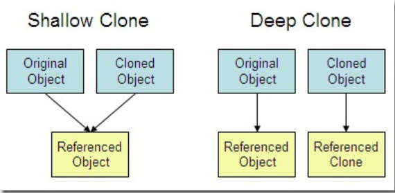
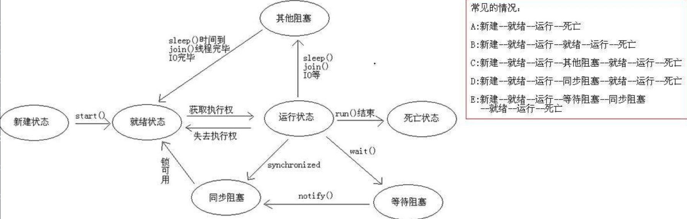
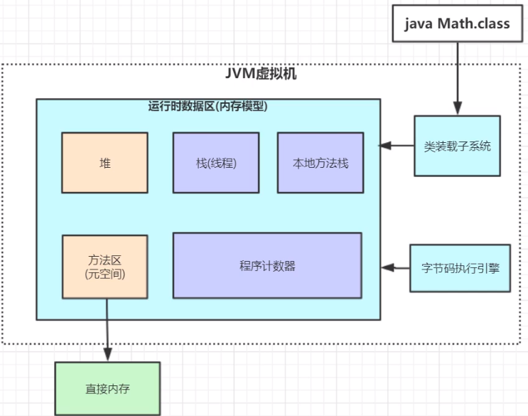
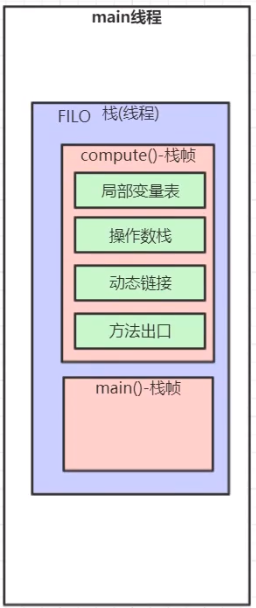
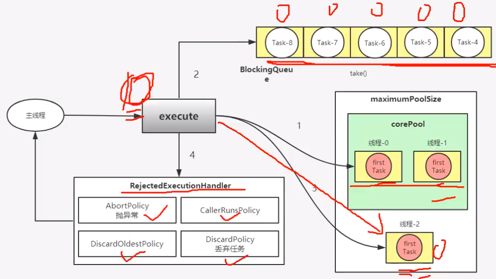
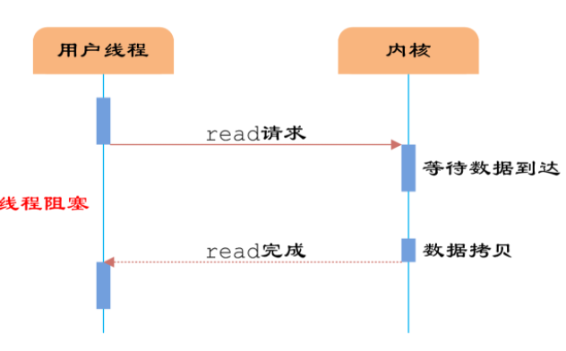
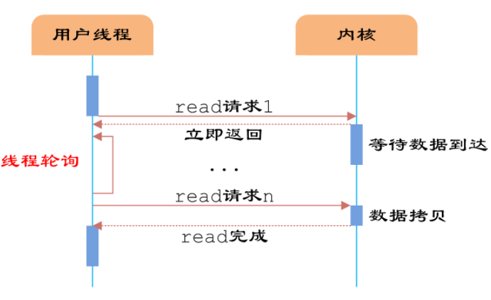
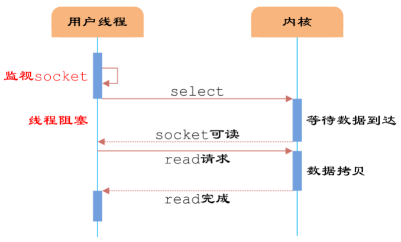
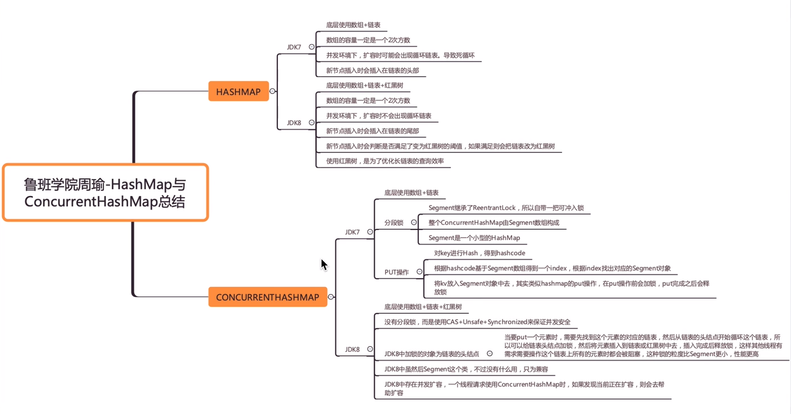

[toc]

---

# 一、Java基础

## 1 static

> 问题：解释static是什么意思？Java中是否可以覆盖（override）一个private 或者是 static 的方法？

* **静态方法** 

    通常，在一个类中定义一个方法为static，那就是说，无需本类的对象即可调用此方法

    声明为static的方法有以下限制： 

    　　**它们只能访问类的 static 成员（方法和属性）**。 它们不能以任何方式引用 this 或 super。（因为类的静态方法随类的加载而加载，也就是说类创建了，静态方法就存在于方法区了，可能这个时候还没有进行对象的初始化，既然没有对象的初始化，那对象的成员变量和成员方法自然就不存在，静态方法就访问不了）

    　　调用一个静态方法就是“类名.方法名”,静态方法的使用很简单如上所示。一般来说，静态方法常常为应用程序中的其它类提供一些实用工具所用，在Java的类库中大量的静态方法正是出于此目的而定义的。此类方法，不需要创建对象。 

* **静态变量**

  ​	<u>声明为static的变量实质上就是全局变量。当声明一个对象时，并不产生static变量的拷贝</u>，而是该类所有的实例变量共用同一个static变量。静态变量与静态方法类似。所有此类实例共享此静态变量，也就是说在类装载时，只分配一块存储空间，所有此类的对象都可以操控此块存储空间，当然对于final则另当别论了

* 静态类

  ​     通常一个普通类不允许声明为静态的，只有一个内部类才可以。这时这个声明为静态的内部类可以直接作为一个普通类来使用，而不需实例一个外部类。

## 2 hashcode 和 equals 的区别和作用

[讲解链接](https://www.jianshu.com/p/5a7f5f786b75)

总结： `hashCode()`的默认行为是对堆上的对象产生独特值。如果没有重写 `hashCode()`，则该 class 的两个对象无论如何都不会相等（即使这两个对象指向相同的数据） 

## 3 Java中参数都是按值传递的

 Java 程序设计语言总是采用按值调用。也就是说，方法得到的是所有参数值的一个拷贝，也就是说，方法不能修改传递给它的任何参数变量的内容。 

https://blog.csdn.net/bjweimengshu/article/details/79799485

​	下面总结一下 Java 中方法参数的使用情况：

- 一个方法不能修改一个基本数据类型的参数（即数值型或布尔型）。
- 一个方法可以改变一个对象参数的状态。（这里的改变并不能作为是引用传递的依据）
- 一个方法不能让对象参数引用一个新的对象。

## 4 深拷贝 vs 浅拷贝

1. **浅拷贝**：对基本数据类型进行值传递，对引用数据类型进行引用传递般的拷贝，此为浅拷贝。
2. **深拷贝**：对基本数据类型进行值传递，对引用数据类型，创建一个新的对象，并复制其内容，此为深拷贝。

## 5 接口和抽象类的区别

[参考链接](https://www.zhihu.com/question/297328937/answer/696698721)

**1.语法层面上的区别**

1）抽象类可以提供成员方法的实现细节，而接口中只能存在public abstract 方法；

2）抽象类中的成员变量可以是各种类型的，而接口中的成员变量只能是public static final类型的；

3）接口中不能含有静态代码块以及静态方法，而抽象类可以有静态代码块和静态方法；

4）一个类只能继承一个抽象类，而一个类却可以实现多个接口。

**2.设计层面上的区别**

1）抽象类是对一种事物的抽象，即对类抽象，而接口是对行为的抽象。抽象类是对整个类整体进行抽象，包括属性、行为，但是接口却是对类局部（行为）进行抽象。举个简单的例子，飞机和鸟是不同类的事物，但是它们都有一个共性，就是都会飞。那么在设计的时候，可以将飞机设计为一个类Airplane，将鸟设计为一个类Bird，但是不能将 飞行 这个特性也设计为类，因此它只是一个行为特性，并不是对一类事物的抽象描述。此时可以将 飞行 设计为一个接口Fly，包含方法fly( )，然后Airplane和Bird分别根据自己的需要实现Fly这个接口。然后至于有不同种类的飞机，比如战斗机、民用飞机等直接继承Airplane即可，对于鸟也是类似的，不同种类的鸟直接继承Bird类即可。从这里可以看出，**继承是一个 "是不是"的关系，而 接口 实现则是 "有没有"的关系**。如果一个类继承了某个抽象类，则子类必定是抽象类的种类，而接口实现则是有没有、具备不具备的关系，比如鸟是否能飞（或者是否具备飞行这个特点），能飞行则可以实现这个接口，不能飞行就不实现这个接口。

2）设计层面不同，抽象类作为很多子类的父类，它是一种模板式设计。而接口是一种行为规范，它是一种辐射式设计。什么是模板式设计？最简单例子，大家都用过ppt里面的模板，如果用模板A设计了ppt B和ppt C，ppt B和ppt C公共的部分就是模板A了，如果它们的公共部分需要改动，则只需要改动模板A就可以了，不需要重新对ppt B和ppt C进行改动。而辐射式设计，比如某个电梯都装了某种报警器，一旦要更新报警器，就必须全部更新。也就是说对于抽象类，如果需要添加新的方法，可以直接在抽象类中添加具体的实现，子类可以不进行变更；而对于接口则不行，如果接口进行了变更，则所有实现这个接口的类都必须进行相应的改动。

## 6 HashMap 的长度为什么是 2 的幂次方

为了能让 HashMap 存取高效，尽量较少碰撞，也就是要尽量把数据分配均匀。我们上面也讲到了过了，Hash 值的范围值-2147483648 到 2147483647，前后加起来大概 40 亿的映射空间，只要哈希函数映射得比较均匀松散，一般应用是很难出现碰撞的。但问题是一个 40 亿长度的数组，内存是放不下的。所以这个散列值是不能直接拿来用的。用之前还要先做对数组的长度取模运算，得到的余数才能用来要存放的位置也就是对应的数组下标。**这个算法应该如何设计呢？**我们首先可能会想到采用%取余的操作来实现。但是，重点来了：**“取余(%)操作中如果除数是 2 的幂次则等价于与其除数减一的与(&)操作（也就是说 hash%length==hash&(length-1)的前提是 length 是 2 的 n 次方；）。”** 并且 **采用二进制位操作 &，相对于%能够提高运算效率，这就解释了 HashMap 的长度为什么是 2 的幂次方。**

所以HashMap的长度是2的幂次方，原因在于：

1. 为了均匀数据分布，减少碰撞，数据存入时哈希要经过取余运算
2. 位操作符 & 的计算效率高于 % 运算，而hash%length==hash&(length-1)的前提是 length 是 2 的 n 次方

7 ArrayList 和 LinkedList 的区别以及各自的扩容机制

8 线程安全的 List 有哪些

9 HashMap 在什么情况下会再将红黑树转化成链表

## 10 synchronized 和 lock 的区别

- 实现层面不一样

  **synchronized** 是 Java 关键字，**JVM层面** 实现加锁和释放锁；**Lock 是一个接口**，在代码层面实现加锁和释放锁， 它有比synchronized更精确的线程语义 （synchronized 加锁可重入、不可中断、非公平；Lock 可重入、可中断、可公平和不公平、细分读写锁提高效率）

-  性能上的不同
  lock接口的实现类ReentrantLock，不仅具有和synchronized相同的并发性和内存语义，还多了超时的获取锁、定时锁、等候和中断锁等。
  在竞争不是很激烈的情况下，synchronized的性能优于ReentrantLock，竞争激烈的情况下synchronized的性能会下降的非常快，而ReentrantLock则基本不变。 

- 是否自动释放锁

  synchronized 在线程代码执行完或出现异常时自动释放锁；Lock 不会自动释放锁，需要再 finally {} 代码块显式地中释放锁

- 是否一直等待

  synchronized 会导致线程拿不到锁一直等待；Lock 可以设置尝试获取锁或者获取锁失败一定时间超时

- 获取锁成功是否可知

  synchronized 无法得知是否获取锁成功；Lock 可以通过 tryLock 获得加锁是否成功

  

11 动态代理的原理是什么

## 12 请说明”static”关键字是什么意思？Java中是否可以覆盖(override)一个private或者是static的方法？

考察点：static变量

参考回答：

“static”关键字表明一个成员变量或者是成员方法可以在没有所属的类的实例变量的情况下被访问。
Java中static方法不能被覆盖，因为**方法覆盖是基于运行时动态绑定的**，而**static方法是编译时静态绑定的**。static方法跟类的任何实例都不相关，所以概念上不适用。

## 13 请详细描述一下线程从创建到死亡的几种状态都有哪些？

1. 新建( new )：新创建了一个线程对象。
2. 可运行( runnable )：线程对象创建后，其他线程(比如 main 线程）调用了该对象 的 start ()方法。该状态的线程位于可运行线程池中，等待被线程调度选中，获 取 cpu 的使用权 。
3. 运行( running )：可运行状态( runnable )的线程获得了 cpu 时间片（ timeslice ） ，执行程序代码。
4. 阻塞( block )：阻塞状态是指线程因为某种原因放弃了 cpu 使用权，也即让出了 cpu timeslice ，暂时停止运行。直到线程进入可运行( runnable )状态，才有 机会再次获得 cpu timeslice 转到运行( running )状态。阻塞的情况分三种：
   (一). 等待阻塞：运行( running )的线程执行 o . wait ()方法， JVM 会把该线程放 入等待队列( waitting queue )中。
   (二). 同步阻塞：运行( running )的线程在获取对象的同步锁时，若该同步锁 被别的线程占用，则 JVM 会把该线程放入锁池( lock pool )中。
   (三). 其他阻塞: 运行( running )的线程执行 Thread . sleep ( long ms )或 t . join ()方法，或者发出了 I / O 请求时， JVM 会把该线程置为阻塞状态。 当 sleep ()状态超时、 join ()等待线程终止或者超时、或者 I / O 处理完毕时，线程重新转入可运行( runnable )状态。
5. 死亡( dead )：线程 run ()、 main () 方法执行结束，或者因异常退出了 run ()方法，则该线程结束生命周期。死亡的线程不可再次复生。 

## 14 线程池的种类有哪些？

Java通过Executors提供四种线程池，分别为：
1.newCachedThreadPool创建一个**可缓存线程池**，如果线程池长度超过处理需要，可灵活回收空闲线程，若无可回收，则新建线程。
2.newFixedThreadPool 创建一个**定长线程池**，可控制线程最大并发数，超出的线程会在队列中等待。
3.newScheduledThreadPool 创建一个**定长线程池**，**支持定时及周期性任务**执行。
4.newSingleThreadExecutor 创建一个**单线程化的线程池**，它只会用唯一的工作线程来执行任务，保证所有任务按照指定顺序(FIFO, LIFO, 优先级)执行。

## 15 请说明一下线程池有什么优势？

第一：降低资源消耗。通过重复利用已创建的线程降低线程创建和销毁造成的消耗。

第二：提高响应速度。当任务到达时，任务可以不需要等到线程创建就能执行。

第三：提高线程的可管理性，线程是稀缺资源，如果无限制地创建，不仅会消耗系统资源，还会降低系统的稳定性，使用线程池可以进行统一分配、调优和监控。

## 16 多态

* **概念**

    发送消息给某个对象，让该对象自己决定响应哪种行为。  通过将子类对象引用赋值给超类对象引用变量来实现动态方法调用。 

* **多态的三个必要条件**

  继承、重写、向上转型

## 17 JVM内存模型

* **总体模型**

  1. 虚拟机栈

     描述java方法执行时的内存模型，每个方法在执行时会创建一个栈帧，用于存储局部变量表、操作数栈、动态链接、方法出口。

  2. 堆

     在jdk1.8之前，存放对象和数组，jdk1.8中，将方法区中的常量池也移到了堆中。堆是GC管理的主要区域。java堆还可以细分为新生代、老年代，新生代又可以细分为Edan区、From Survivor（S0）区、To Survivor（S1）区。

  3. 元空间

     jdk1.8将方法区替换为元空间，存放类元信息，使用系统内存

  4. 程序计数器
  
     可以看做是当前线程所执行字节码的行号指示器。
  
  5. 本地方法栈
  
     为虚拟机使用到的Native方法服务。
  
  线程共享的：堆、元空间
  
  线程私有：Java虚拟机栈、本地方法栈、程序计数器

​	**栈**

​		**一个线程对应一个栈**，同一个线程中的多个方法会在同一个栈中开辟多个对应的栈帧（栈帧对应方法）

==局部变量表==用于存储某个方法中的局部变量

==操作数栈==用于计算的临时数据存储区

==动态链接==将符号引用在程序运行过程中转变为直接引用

* **堆**

  堆是JVM调优的主要内容

  

## 18 面向对象4个特性

​	**抽象**：把事物的共性抽离出来，创建为类

​	**封装**：把对象封装成相对独立，高度自制的个体

​	**继承**：一个类继承另外一个类的内容，并且可以修改或增加新的方法使它更适合特殊的需要

​	**多态**： 引用对象的类型在编译时不确定，在运行时确定

## 19 类加载和类加载器

​	加载 验证 准备 解析 初始化 使用 卸载

​	加载：将 类的 二进制字节码 放入 虚拟机

​	验证：为了安全

​	准备：为静态变量赋初始值

​	解析：将符号引用转换为直接引用

​	初始化：执行 cinit 类构造器方法

1. 什么是类加载？

   将Class文件加载到内存，并对数据进行校验、转换解析和初始化，最终形成可以被虚拟机直接使用的 java 类型

2. 类的初始化时机

   有且只有以下5种情况必须立即对类进行初始化

   > 1.遇到 **new** 指令，或者读取/设置 **静态变量/方法**（final 修饰的常量除外，final修饰的常量在编译阶段就已经把结果放在常量池）
   >
   > 2.使用 **java.lang.reflect** 包的方法对类进行反射调用的时候，如果类没有进行过初始化，则先触发其初始化
   >
   > 3.当初始化一个类的时候，如果发现其**父类还没有进行初始化**，则需要先触发其父类的初始化（接口初始化例外，不要求所有父接口全部都初始化，只有真正调用到父接口的时候才初始化）
   >
   > 4.当启动虚拟机时，用户需要指定一个**执行的主类**，虚拟机先初始化这个主类
   >
   > 5.使用**动态语言**支持时，如果一个MethodHandle实例在解析时，该方法对应的类没有进行初始化，则需要先触发其初始化

3. 类加载器

   ==启动类加载器==（Bootstrap classLoader）：主要负责加载Java一些核心类库

   ==拓展类加载器==（Extension classLoader)：主要加载Java中的一些拓展类

   ==应用类加载器==（System classLoader）：主要用于加载我们自己写的类

   > ==类加载器的三大特性==：**委托性**（ 当一个类加载器要加载一个类时，它会先委托自己的父类加载器来加载，只有当父加载器无法加载类时，才会自己去加载 ）、**可见性**（ 父加载器无法利用子加载器加载的类，而子加载器可以利用父加载器加载的类 ）、**单一性** （ 一个类只会被一个类加载器加载一次，不会被重复加载 ）

## 20 mysql调优

1. 定位

   根据慢日志定位慢查询sql

   SHOW VARIABLES LIKE '%query%'

2. 使用explain等工具分析sql

   在要执行的sql前加上explain

   如果出现Using filesort或者Using temporary则意味着mysql根本不能使用索引，效率会受到很大影响，应尽可能对此进行优化

3. 修改sql或者尽量让sql走索引

## 21 线程（如何创建一个线程）

继承Thread类

实现Runnable接口

通过Callable和FutureTask创建线程

通过线程池创建线程

## 22 线程池

ThreadPoolExecutor(corePoolSize, maximumPoolSize, keepAliveTime, TimeUnit, BlockQueue<Runnable>, ThreadFactory, RejectedExecutionHandler);

​			参数介绍：

> > 1. corePoolSize  int
> >
> > 　　线程池中存在的线程数量（即使线程空闲），除非设置了allowCoreThreadTimeOut。
> >
> > 2. maximumPoolSize  int
> >
> > 　　线程池中允许的最大线程数量。
> >
> > 3. keepAliveTime  long
> >
> > 　　线程池中若线程数量超过 corePoolSize ，空闲线程等待新任务的最长时间。
> >
> > 4. unit  TimeUnit
> >
> > 　　参数 keepAliveTime 的时间单位。
> >
> > 5. workQueue  BlockQueue<Runnable>
> >
> > 　　用来持有执行前的任务。且这个队列只能用于被 execute 调用的 Runnable 任务。
> >
> > 6. threadFactory  ThreadFactory
> >
> > 　　执行程序用来创建新线程使用的工厂。　　
> >
> > 7. handler RejectedExecutionHandler 
> >
> > 　　用于超过线程上限或达到队列容量而致使程序阻塞时所用的处理程序。

​			拒绝策略

> > AbortPolicy（拒绝策略）： 该策略是线程池的默认策略。使用该策略时，如果线程池队列满了丢掉这个任务并且抛出RejectedExecutionException异常。 
> >
> > CallerRunsPolicy	
> >
> > DiscardOldestPolicy	
> >
> > DiscardPolicy					丢弃任务

## 23 多路IO

1. 同步阻塞IO（Blocking IO）

   

2. 同步非阻塞IO（Non-blocking IO）

   

    同步非阻塞IO是在同步阻塞IO的基础上，将socket设置为NONBLOCK。这样做用户线程可以在发起IO请求后可以立即返回。  由于socket是非阻塞的方式，因此用户线程发起IO请求时立即返回。但并未读取到任何数据，用户线程需要不断地发起IO请求，直到数据到达后，才真正读取到数据，继续执行。 

3. IO多路复用（IO Multiplexing，也叫异步阻塞）

   IO多路复用模型是建立在内核提供的==多路分离函数select==基础之上的，使用select函数可以==避免==同步非阻塞IO模型中==轮询等待==的问题。 

   

    用户首先将需要进行IO操作的socket添加到select中，然后阻塞等待select系统调用返回。当数据到达时，socket被激活，select函数返回。用户线程正式发起read请求，读取数据并继续执行。

   从流程上来看，使用select函数进行IO请求和同步阻塞模型没有太大的区别，甚至还多了添加监视socket，以及调用select函数的额外操作，效率更差。但是，==使用select以后最大的优势是用户可以在一个线程内同时处理多个socket的IO请求==。用户可以注册多个socket，然后不断地调用select读取被激活的socket，即可达到在同一个线程内同时处理多个IO请求的目的。而在同步阻塞模型中，必须通过多线程的方式才能达到这个目的。

4. 异步IO（Asynchronous IO，也叫异步非阻塞）

## 24 唯一索引和普通索引的区别

区别就是唯一索引可以保证索引列数据记录的唯一性，

对于普通索引来说，查找到满足条件的第一个记录后，需要查找下一个，直到找到一个不满足条件的记录

对于唯一索引，由于索引定义了唯一性，查找到第一个满足条件的记录后，就会停止继续检索

事实上，在许多场合，创建唯一索引的目的往往不是为了提高访问速度，而是为了避免数据出现重复

25 如何实现对ArrayList中存放的自定义类的排序

26 String类是否可以继承？你常用的String方法有哪些？

27 线程的五种状态？各种状态之间如何切换的？wait()、sleep()都是object中的方法吗？

28 线程池种类？

29 Java设计模式？

30 MySQL 和 SQL Server的分页查询分别是怎么查的？

## 31 JDK1.7   1.8 之 HashMap 与 ConcurrentHashMap 的区别

# 二、Spring

## 1 请简要说明一下IOC和AOP是什么？

依赖注入的三种方式：（1）接口注入（2）Construct注入（3）Setter注入

控制反转（IoC）与依赖注入（DI）是同一个概念，引入IOC的目的：（1）脱开、降低类之间的耦合；（2）倡导面向接口编程、实施依赖倒换原则； （3）提高系统可插入、可测试、可修改等特性。

具体做法：（1）将bean之间的依赖关系尽可能地转换为关联关系；

（2）将对具体类的关联尽可能地转换为对Java interface的关联，而不是与具体的服务对象相关联；

（3）Bean实例具体关联相关Java interface的哪个实现类的实例，在配置信息的元数据中描述；

（4）由IoC组件（或称容器）根据配置信息，实例化具体bean类、将bean之间的依赖关系注入进来。

AOP（Aspect Oriented Programming），即面向切面编程，可以说是OOP（Object Oriented Programming，面向对象编程）的补充和完善。OOP引入封装、继承、多态等概念来建立一种对象层次结构，用于模拟公共行为的一个集合。不过**OOP允许开发者定义纵向的关系，但并不适合定义横向的关系**，**例如日志功能**。**日志代码往往横向地散布在所有对象层次中**，而与它对应的对象的核心功能毫无关系对于其他类型的代码，如安全性、异常处理和透明的持续性也都是如此，**这种散布在各处的无关的代码被称为横切（cross cutting），在OOP设计中，它导致了大量代码的重复，而不利于各个模块的重用。**

**AOP技术恰恰相反，它利用一种称为"横切"的技术，剖解开封装的对象内部，并将那些影响了多个类的公共行为封装到一个可重用模块，并将其命名为"Aspect"，即切面**。所谓"切面"，简单说就是那些与业务无关，却为业务模块所共同调用的逻辑或责任封装起来，**便于减少系统的重复代码，降低模块之间的耦合度，并有利于未来的可操作性和可维护性**。

使用"横切"技术，AOP把软件系统分为两个部分：核心关注点和横切关注点。业务处理的主要流程是核心关注点，与之关系不大的部分是横切关注点。横切关注点的一个特点是，他们经常发生在核心关注点的多处，而各处基本相似，比如权限认证、日志、事物。AOP的作用在于分离系统中的各种关注点，将核心关注点和横切关注点分离开来。

## 2 请问AOP的原理是什么？

考察点：动态代理

参考回答：

AOP（Aspect Orient Programming），指面向切面编程，作为面向对象的一种补充，用于处理系统中分布于各个模块的横切关注点，比如事务管理、日志、缓存等等。**AOP实现的关键在于AOP框架自动创建的AOP代理，AOP代理主要分为静态代理和动态代理，静态代理的代表为AspectJ；而动态代理则以Spring AOP为代表**。通常使用AspectJ的编译时增强实现AOP，AspectJ是静态代理的增强，所谓的静态代理就是AOP框架会在编译阶段生成AOP代理类，因此也称为编译时增强。

Spring AOP中的动态代理主要有两种方式，JDK动态代理和CGLIB动态代理。JDK动态代理通过反射来接收被代理的类，并且要求被代理的类必须实现一个接口。JDK动态代理的核心是InvocationHandler接口和Proxy类。

如果目标类没有实现接口，那么Spring AOP会选择使用CGLIB来动态代理目标类。CGLIB（Code Generation Library），是一个代码生成的类库，可以在运行时动态的生成某个类的子类，注意，CGLIB是通过继承的方式做的动态代理，因此如果某个类被标记为final，那么它是无法使用CGLIB做动态代理的。

## 3 请说明一下Spring框架为企业级开发带来的好处有哪些？

考察点：框架

参考回答：

\- 非侵入式：支持基于POJO的编程模式，不强制性的要求实现Spring框架中的接口或继承Spring框架中的类。
\- **IoC**容器：IoC容器帮助应用程序管理对象以及对象之间的依赖关系，对象之间的依赖关系如果发生了改变只需要修改配置文件而不是修改代码，因为代码的修改可能意味着项目的重新构建和完整的回归测试。有了IoC容器，程序员再也不需要自己编写工厂、单例，这一点特别符合Spring的精神"不要重复的发明轮子"。
\- **AOP**（面向切面编程）：将所有的横切关注功能封装到切面（aspect）中，通过配置的方式将横切关注功能动态添加到目标代码上，进一步实现了业务逻辑和系统服务之间的分离。另一方面，有了AOP程序员可以省去很多自己写代理类的工作。
\- MVC：Spring的MVC框架为Web表示层提供了更好的解决方案。
\- 事务管理：Spring以宽广的胸怀接纳多种持久层技术，并且为其提供了声明式的事务管理，在不需要任何一行代码的情况下就能够完成事务管理。
\- 其他：选择Spring框架的原因还远不止于此，Spring为Java企业级开发提供了一站式选择，你可以在需要的时候使用它的部分和全部，更重要的是，甚至可以在感觉不到Spring存在的情况下，在你的项目中使用Spring提供的各种优秀的功能。

## 4 SpringBoot常用注解：

- @Component

- @Repository

- @Service

- @Controller

- @RestController

- @Scope

- @RequestMapping

   RequestMapping是一个用来处理请求地址映射的注解 

- @ResponseBody

   该方法的返回结果直接写入HTTP response body中 

- @PathVariable

   路径变量 

# 三、数据库

## 1 连接池

**1.1 普遍的连接池**

* **概念：**数据库连接池就是用于存储数据库连接的一个容器（该容器其实就是一个集合对象，该集合必须是线程安全的，不能两个线程拿到同一个连接；该集合还必须实现队列的特性，即：先进先出）

* **作用：**可减少我们获取连接所消耗的时间

**1.2 mybatis中的连接池**

* **3种配置方式**

  > 1    POOLED						采用传统的 `javax.sql.DataSource规范中的连接池`
  >
  > 2    UNPOOLED				   采用传统的获取连接的方式，虽然也实现了 `javax.sql.DataSource` 接口，但是没有使用池的思想。
  >
  > 3    JNDI								采用服务器提供的JNDI技术实现，来获取 `DataSource` 对象，注意：如果不是web或者maven的war工程，是不能使用的

2 索引

2.1 什么情况下需要建立索引，对表中的哪个字段建立索引

2.2 索引什么情况下会失效
