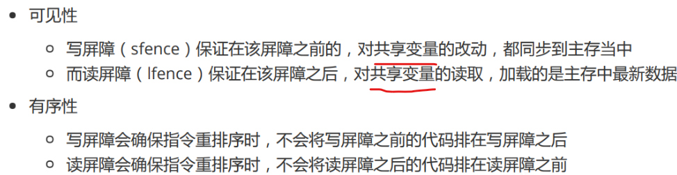
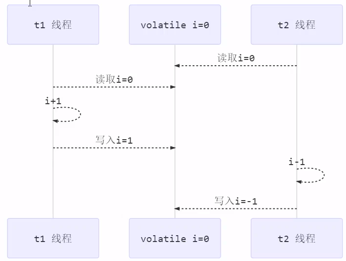

[toc]

---


先学thread，创建、使用


锁和volatile是并发安全性相关的内容，共享资源你得先搞清楚，JMM内存模型


什么是并发安全性，并发安全性就是多线程访问共享变量


如果没有共享变量，线程使用的都是自己的局部变量，那也没有并发安全性问题


我建议先学thread


这两种创建方式


会用了再去学学多线程访问共享变量


JMM，锁，volatile


锁做个了解就行


了解了这些概念，知道是什么原因造成的就行


然后学闭锁，栅栏，信号量


也就了解就行


然后学线程池


先整个按照这个节奏了解下来


之后再去看实现


锁是怎么实现的


这个就是涉及到AQS


cas


会了AQS CAS


你就知道闭锁，栅栏，信号量是怎么实现的了，你就能看懂了


这些懂了你就能看懂线程池实现的逻辑了


当然还有些多线程之间的信息交流


比如wait notify

terminate


# 一、Java线程

## 1.1 volatile

### 1.1.1 volatile 作用

​	`volatile` 修饰变量，主要用来保证变量对于所有线程的<u>可见性</u>和程序执行的<u>有序性</u>。

### 1.1.2 volatile 原理

​	如果一个变量被`volatile`修饰，那么当前线程对该变量进行了改动后，会将该变量同步到主存；如果当前线程读取被`volatile`修饰的变量，那么会将本地内存中的该变量的值置为无效，而是从主存中获取最新值。通过上面的方式，保证了`volatile`变量对于所有线程的可见性。

* **可见性和有序性的底层原理**

  ​	`volatile` 能保证可见性和有序性，其底层都是通过<u>内存屏障</u>实现的

  

  ​	**注意：** 上面红线标注的共享变量不一定都是被`volatile`修饰的，只要是对其中一个`volatile`变量的写入或读取操作，就会对其他的共享变量做同样的操作。

  ​	虽然 `volatile`可以保证可见性和有序性，但是并不能解决指令交错的问题，以两个线程分别对 i 进行 i++ 和 i-- 的操作为例：

  

  ​	`volatile`的有序性<u>只是保证了本线程内相关代码不被重排序</u>，<u>不能保证线程间代码的执行顺序</u>，例如上例中 t2 线程的读跑到 t1 线程操作的前面，依然会得到预期之外的结果（最终 i = -1）
  
* **单例的正确实现**

  ​	饿汉式的单例模式在类加载时进行对象的初始化，单例由JVM保证，不存在线程安全问题，但是懒汉式的单例模式需要进行一些特殊的操作，才能保证在多线程环境下的正确性

  ```java
  public class Singleton {
      private Singleton(){}
  	// 加入 volatile ，主要禁止代码的第15行进行对象的初始化和赋值操作时的指令重排，防止第二个线程在进入第一个 if 后拿到一个没有经过构造方法初试化的对象 
      private static volatile Singleton INSTANCE = null;
  
      public static Singleton getInstance(){
          // 这里的 if 在 synchronized 代码块之外，INSTANCE 并不是完全被保护起来的（不能完全保证原子性、有序性），所以可能会出现线程A进入了下面的synchronized代码块，执行第15行时，可能会发生指令重排，使得原本应该先调用构造方法后对静态成员变量INSTANCE赋值的执行顺序颠倒，此时，如果线程A先执行了对INSTANCE赋值,还没有调用构造方法进行初始化操作（即把一个还没有经过构造方法初始化的引用赋值给了INSTANCE），此时线程B进行第一个if判断并进入，将会拿到一个空的对象，所以需要在上面定义INSTANCE时加入 volatile 关键字，以禁止指令重排序
          if(INSTANCE != null){
              return INSTANCE;
          }
          synchronized (Singleton.class){
              // 这里再进行一次是否为空的判断的原因在于：上面的第一个if判断，可能有两个线程同时对INSTANCE进行判断，都判断为空，随后同时进入了第一个if的代码块，在这里使用synchronized进行加锁处理，此时线程A进入下面的代码块，进行对象的初始化操作，线程B阻塞在此处，A完成初始化操作后退出代码块，如果这里B不再一次进行为空的判断，将再一次进行对象的初始化，就不是单例了
              if(INSTANCE != null){
                  return INSTANCE;
              }
              INSTANCE = new Singleton();
              return INSTANCE;
          }
      }
  }
  ```


## 1.2 happens-before

​	happens-before 规定了对共享变量的写操作对其它线程的读操作可见，它是可见性与有序性的一套规则总结。

* **多线程环境下访问共享变量时，当前线程的写入是否对其他线程的读可见，可见的情况分为以下七种：**

  1. 线程释放锁 m 之前对共享变量的写，对于接下来对 m 加锁的其它线程对该共享变量的读可见

     ```java
     static int x;
     static Object m = new Object();
     
     new Thread(()->{
         synchronized(m){
             x = 10;
         }
     }, "t1").start();
     
     new Thread(()->{
         synchronized(m){
             System.out.println(x);
         }
     }, "t2").start();
     ```

  2. 线程对 `volatile` 变量的写，对接下来其它线程对该变量的读可见

     ```java
     volatile static int x;
     
     new Thread(()->{ 
         x = 10;
     },"t1").start();
     
     new Thread(()->{ 
         System.out.println(x);
     },"t2").start();
     ```

  3. 线程 start 前对变量的写，对该线程开始后对该变量的读可见

     ```java 
     static int x; 
     x = 10;
     
     new Thread(()->{ 
         System.out.println(x);
     },"t2").start();
     ```

  4. 线程结束前对变量的写，对其它线程得知它结束后的读可见（比如其它线程调用 t1.isAlive() 或 t1.join()等待 它结束）

     ```java
     static int x;
     
     Thread t1 = new Thread(()->{ 
         x = 10;
     },"t1"); t1.start();
     
     t1.join();
     System.out.println(x);
     ```

  5. 线程 t1 打断 t2（interrupt）前对变量的写，对于其他线程得知 t2 被打断后对变量的读可见（通过 t2.interrupted 或 t2.isInterrupted）

     ```java
     static int x;
     
     public static void main(String[] args) {
         Thread t2 = new Thread(()->{
             while(true) {
                 if(Thread.currentThread().isInterrupted()) {
                     System.out.println(x);
                     break;
                 }}
         },"t2");
         t2.start();
     
         new Thread(()->{
             Thread.sleep(1);
             x = 10;
             t2.interrupt();
         },"t1").start();
     
         while(!t2.isInterrupted()) {
             Thread.yield();
         }
         System.out.println(x);
     }
     ```

  6. 对变量默认值（0，false，null）的写，对其它线程对该变量的读可见

  7. 具有传递性，如果 x hb-> y 并且 y hb-> z 那么有 x hb-> z ，配合 volatile 的防指令重排，有下面的例子

     ```java
     volatile static int x; 
     static int y;
     
     new Thread(()->{ 
         y = 10;
         x = 20;
         // 由于 volatile 变量x，会在这里加入一个写屏障，防止写屏障之前的内容重排序到写屏障的后面
     },"t1").start();
     
     new Thread(()->{ // x=20 对 t2 可见, 同时 y=10 也对 t2 可见
         System.out.println(y);
     },"t2").start();
     ```


## 1.3 变量的线程安全分析

### 1.3.1 成员变量和静态变量是否安全

