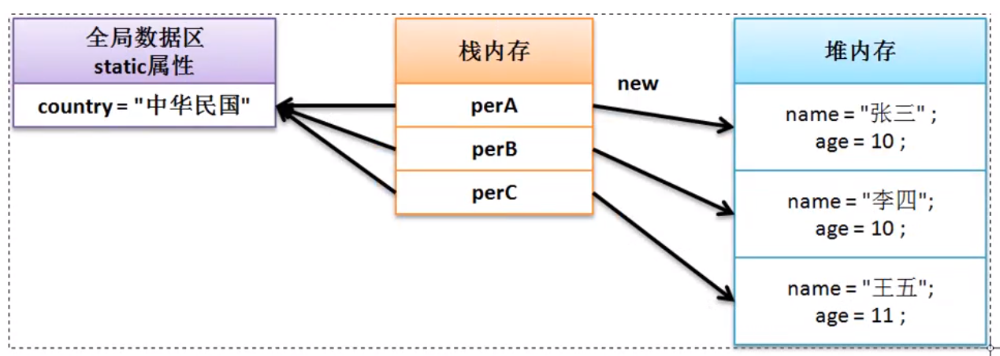
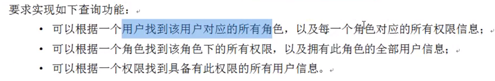

[toc]

---

# 1.构造方法

​	构造方法是没有返回值的

```java
class Person{
    private String name;
    private int age;
    public  Person(String n, int a){
        name = n;
        age = a;
    }
    public void tell(){
        System.out.println("姓名：" + name + "年龄：" + age);
    }
}
```

​	疑问：既然构造方法是一个方法，那么为什么不让它定义返回值类型呢？既然构造方法不会返回数据，为什么不用void定义呢？

​	答：如果在构造方法上使用了void，那么此结构就与普通方法的结构完全相同了，这样<u>编译器会认为此方法是一个普通方法</u>，普通方法与构造方法最大的区别：构造方法是在类对象实例化的时候调用的，而普通方法是在类对象实例化产生之后调用的。

# 2.匿名对象

```java
new Person("张三", 10).tell();
```

​	此时依然通过了对象进行了类中tell()方法的调用，但是由于此对象没有任何的引用名称，所以该对象使用一次之后就将成为垃圾，而所有的垃圾将被GC进行回收与释放。

# 3.this关键字

- **this的三个使用场景**：

​		（1）当前类的属性：`this.属性`

​		（2）当前类中的方法（普通方法、构造方法）：`this()`、`this.方法名称（）`

​		（3）描述当前对象

- **不使用this的一个问题**：

```java
class Person{
    private String name;
    private int age;
    public Person(String name, int age){
        name = name;		// 在Java中“{}”是作为一个结构体的边界符，那么在程序里面进行变量（参数和属性都称为变量）使用的时候都会以“{}”作为查找边界	因此该赋值语句，没有访问到类的属性 name
        age = age;
    }
    public void tell(){
        System.out.println("姓名：" + name + "、年龄：" + age);
    }
}
public class JavaDemo {
    public static void main(String[] args) {
        Person per1 = new Person("张三", 18);
        per1.tell();			// 输出为 	姓名：null、年龄：0
    }
}

```

- **注意**：在自己所编写的程序代码中，只要是访问本类中属性的时候，一定要加上"this"实现访问

- **对于本类构造方法的互相调用需要注意以下三点重要问题：**

  构造方法必须在实例化新对象的时候调用，所以`this()`的语句只允许放在==构造方法==的==首行==

  类的构造方法中可以调用类的普通方法，但是类的普通方法不能调用类的构造方法

  构造方法互相调用时，请保留有程序的出口（避免递归构造器调用错误）

```java
class Person{
    private String name;
    private int age;
    public Person(){
        //this("调用下面的双参构造", 18);	     // 报错，和下面的双参构造形成递归调用
        System.out.println("类的一个对象实例化了");
    };
    public Person(String name){
        this();
        this.name = name;
        //this();					// 报错，this()必须放在构造方法的首行
    }
    public Person(String name, int age){
        this(name);
        this.age = age;
    }
    public void tell(){
        // this();				// 报错，普通方法不能调用类的构造函数，因为类的构造函数都是在类的实例化时调用的，类的普通方法则是在类的实例化完成之后调用的
        System.out.println("姓名：" + this.name + "、年龄：" + this.age);
    }
}
```

# 4.写一个简单类

​	对于简单Java类而言，其核心的开发结构如下：

> （1）类名称一定要有意义，可以明确的描述某一类事物
>
> （2）类之中的所有属性都必须使用private进行封装，同时封装后的属性必须要提供有setter、getter方法
>
> （3）类之中可以提供无数多个构造方法，但是必须要保留有无参构造方法
>
> （4）类之中不允许出现有任何的输出语句，所有内容的获取必须返回

```java
class Dept{
    private long deptNo;
    private String dname;
    private String loc;
    public Dept(){}				// 保留无参构造
    public Dept(long deptNo, String dname, String loc){
        this.deptNo = deptNo;
        this.dname = dname;
        this.loc = loc;
    }
    public String getInfo(){
        return "【部门信息】 部门编号：" + this.deptNo + "、部门名称：" + this.dname + "、部门位置：" + this.loc;
    }

    public void setDeptNo(long deptNo){
        this.deptNo = deptNo;
    }
    public void setDname(String dname){
        this.dname = dname;
    }
    public void setLoc(String loc){
        this.loc = loc;
    }
    public long getDeptNo(){
        return this.deptNo;
    }
    public String getDname(){
        return this.dname;
    }
    public String getLoc(){
        return this.loc;
    }
}

public class JavaDemo {
    public static void main(String[] args) {
        Dept dept = new Dept(001, "清华大学", "北京");
        System.out.println(dept.getInfo());
    }
}
```

# 5.Static

- **属性**



​		由于`static`修饰的是一个==公共==属性，虽然可以通过类的某个实例化对象来访问，但是最好是通过所有对象的最高代表（类）来进行访问，<u>static属性可以由类名称直接调用</u>

​		static 属性虽然定义在类之中，但是其并不受到类实例化对象的控制。==static属性可以在没有实例化对象的时候使用==。

- **方法**

  （1）static方法只允许调用static属性或static方法

  （2）非static方法允许调用static属性或static方法

# 6.代码块

​	在程序中使用“{}”定义的结构就称为代码块，而后根据代码块出现的位置以及 定义的关键字的不同，代码块可以分为：

普通代码块、构造代码块、静态代码块、同步代码块。

（1）普通代码块

​		普通代码块的主要特点是定义在一个方法之中的代码块

```java
public class JavaDemo {
    public static void main(String[] args) {
        {//代码块
            int x = 10;
            System.out.println("x:" + x);   // 10
        }
        int x = 100;
        System.out.println("x:" + x);      // 100
    }
}
```

​		普通代码块，可以在一个方法之中进行一些结构的拆分，以防止相同变量名称所带来的互相影响。

（2）构造代码块

​		构造块是定义在一个类之中的

```java
class Person{
    public Person(){
        System.out.println("【构造方法】Person类构造方法执行");
    }
    { // 构造代码块，会优先于 构造方法 先执行
        System.out.println("【构造块】Person类构造块执行");
    }
}

public class JavaDemo {
    public static void main(String[] args) {
        new Person();
        new Person();
    }
}
// 输出结果   
【构造块】Person类构造块执行
【构造方法】Person类构造方法执行
【构造块】Person类构造块执行
【构造方法】Person类构造方法执行
```

​		构造块会优先于构造方法执行，并且每一次实例化新对象的时候都会调用构造块中的代码

（3）静态代码块

​		静态代码块的定义需要考虑到两种情况：非主类中定义静态代码块、主类中定义静态代码块

​	（3.1）在非主类中进行静态块的定义

```java
class Person{
    public Person(){
        System.out.println("【构造方法】Person类构造方法执行");
    }
    {
        System.out.println("【构造块】Person类构造块执行");
    }
    static {
        System.out.println("【静态块】Person类静态代码块执行");
    }
}

public class JavaDemo {
    public static void main(String[] args) {
        new Person();
        new Person();
        new Person();
    }
}
// 执行结果
【静态块】Person类静态代码块执行
【构造块】Person类构造块执行
【构造方法】Person类构造方法执行
【构造块】Person类构造块执行
【构造方法】Person类构造方法执行
【构造块】Person类构造块执行
【构造方法】Person类构造方法执行
```

​		此时可以发现==静态代码块会优先于构造块和构造方法先执行==，并且不管有多少个实例化对象出现，静态代码块==只会执行一次==，静态代码块的主要目的是为类中的静态属性初始化

​	（3.2）在主类中的静态代码块

```java
public class JavaDemo {
    static {
        System.out.println("*******************");
    }
    public static void main(String[] args) {
        System.out.println("主方法执行的内容");
    }
}
// 执行结果
*******************
主方法执行的内容
```

​		==静态代码块优先于主方法先执行==

# 7.数组

* **编写一个工具类实现数组的倒置**

  ```java
  class ArrayUtil{
      public static void reverse(int[] arr){
          int tail = arr.length-1;
          if(tail<0) {
              System.out.println("数组长度为0");
              return;
          }
          int head = 0;
          int center = arr.length/2;
          for(int i=0; i<center; i++){
              int temp = arr[head];
              arr[head] = arr[tail];
              arr[tail] = temp;
              head++;
              tail--;
          }
      }
  }
  
  public class JavaDemo {
      public static void main(String[] args) {
          int[] arr = new int[]{1,2,3,4,5,6,7,8,9,10};
          ArrayUtil.reverse(arr);
          for(int num: arr){
              System.out.print(num+" ");
          }
      }
  }
  
  ```

* **数组相关类库**

  ```java
  java.util.Arrays.sort();
  System.arraycopy(源数组，源数组开始点，目标数组，目标数组开始点，拷贝长度);
  ```

* **方法可变参数**

  ```java
  class ArrayUtil{
      // 可变参数的写法 ...   本质是一个数组
      public static int sum(int ... data){
          int sum = 0;
          for(int temp: data){
              sum += temp;
          }
          return sum;
      }
  }
  
  public class JavaDemo {
      public static void main(String[] args) {
          System.out.println(ArrayUtil.sum(1,2,3,4,5,6,7,8,9,10));
      }
  }
  ```

  ​	可变参数的最大作用在于，在以后进行一些程序类设计或者开发者调用的时候，利用此种形式就可以避免数组的传递操作了，但是可变参数的本质需要清楚的是：依然是数组


**面向对象编程的一个例子**




```java
// 权限类
class Permission{
    private String id;
    private String name;
    private Role role;			// 一个权限对应一个角色

    public Permission(){}
    public Permission(String id, String name){
        this.id = id;
        this.name = name;
    }

    public void setRole(Role role) {
        this.role = role;
    }

    public Role getRole() {
        return this.role;
    }

    public String getInfo(){
        return "【权限信息】权限ID:" + this.id + "、权限名称：" + this.name;
    }

    // setter、getter方法省略
}

// 角色类
class Role{
    private String id;
    private String name;
    private User[] users;					// 一个角色对应多个用户
    private Permission[] permissions;		// 一个角色对应多个权限

    public Role(){}
    public Role(String id, String name){
        this.id = id;
        this.name = name;
    }

    public void setUsers(User[] users) {
        this.users = users;
    }

    public void setPermissions(Permission[] permissions) {
        this.permissions = permissions;
    }

    public User[] getUsers() {
        return this.users;
    }

    public Permission[] getPermissions() {
        return this.permissions;
    }

    public String getInfo(){
        return "【角色信息】角色ID:" + this.id + "、角色名称：" + this.name;
    }
    // setter、getter方法省略
}

// 用户类
class User{
    private String id;
    private String name;
    private Role[] roles;			// 一个用户对应多个角色

    public User(){}
    public User(String id, String name){
        this.id = id;
        this.name = name;
    }

    public void setRoles(Role[] roles) {
        this.roles = roles;
    }
    public Role[] getRoles() {
        return this.roles;
    }

    public String getInfo(){
        return "【用户信息】用户ID:" + this.id + "、用户姓名：" + this.name;
    }
    // setter、getter方法省略
}

public class JavaDemo {
    public static void main(String[] args) {
        User userA = new User("A", "张三");
        User userB = new User("B", "李四");
        Role roleA = new Role("1", "系统配置");
        Role roleB = new Role("2", "备份管理");
        Role roleC = new Role("3", "人事管理");
        Permission perA = new Permission("I", "系统初始化");
        Permission perB = new Permission("II", "系统还原");
        Permission perC = new Permission("III", "系统环境修改");
        Permission perD = new Permission("IIII", "备份员工数据");
        Permission perE = new Permission("IIIII", "备份部门数据");
        Permission perF = new Permission("IIIIII", "备份公文数据");
        Permission perG = new Permission("IIIIIII", "增加员工");
        Permission perH = new Permission("IIIIIIII", "编辑员工");
        Permission perI = new Permission("IIIIIIIII", "浏览员工");
        Permission perJ = new Permission("IIIIIIIIII", "员工离职");

        // 增加角色与权限的关系
        roleA.setPermissions(new Permission[]{perA,perB,perC});
        roleB.setPermissions(new Permission[]{perD,perE,perF});
        roleC.setPermissions(new Permission[]{perG,perG,perI});

        // 增加权限与角色的关系
        perA.setRole(roleA);
        perB.setRole(roleA);
        perC.setRole(roleA);
        perD.setRole(roleB);
        perE.setRole(roleB);
        perF.setRole(roleB);
        perG.setRole(roleC);
        perH.setRole(roleC);
        perI.setRole(roleC);
        perJ.setRole(roleC);

        // 增加用户与角色的对应关系
        userA.setRoles(new Role[] {roleA, roleB});
        userB.setRoles(new Role[] {roleA, roleB, roleC});
        roleA.setUsers(new User[] {userA, userB});
        roleB.setUsers(new User[] {userA, userB});
        roleC.setUsers(new User[] {userB});

        System.out.println("---------通过用户查找信息------------");
        System.out.println(userB.getInfo());
        for(int i=0; i<userB.getRoles().length; i++){
            System.out.println("\t|-" +  userB.getRoles()[i].getInfo());
            for(int j=0; j<userB.getRoles()[i].getPermissions().length; j++){
                System.out.println("\t\t|-" + userB.getRoles()[i].getPermissions()[j].getInfo());
            }
        }

        System.out.println("---------通过角色查找信息------------");
        System.out.println(roleB.getInfo());
        System.out.println("\t|- 浏览此角色下的所有权限信息");
        for(int i=0; i<roleB.getPermissions().length; i++){
            System.out.println("\t\t|-" + roleB.getPermissions()[i].getInfo());
        }
        System.out.println("\t|- 浏览此角色下的所有用户信息");
        for (int i=0; i<roleB.getUsers().length; i++){
            System.out.println("\t\t|-" + roleB.getUsers()[i]. getInfo());
        }

        System.out.println("---------通过权限查找用户信息------------");
        System.out.println(perA.getInfo());
        for (int i=0; i<perA.getRole().getUsers().length; i++){
            System.out.println("\t\t|-" + perA.getRole().getUsers()[i].getInfo());
        }
    }
}
```

​	总结：（1）首先确定需要建立哪几个类 （2）先抛开类与类之间的关系，确定各个类中的基本属性，补充构造函数、各个属性的setter、getter，以及返回信息的getInfo()方法 （3）根据类之间的关系（一对一，一对多，多对多），在类中添加相应的属性，同时添加setter、getter方法。

# 8.String

​	在 JDK1.9 之前，所有的 String 都利用了字符数组实现了包装的处理，所以在String类里面是提供有相应的转换处理方法的，这些方法包含有构造方法与普通方法两类。

| No.  | 方法名称                                                     | 类型 | 描述                           |
| ---- | ------------------------------------------------------------ | ---- | ------------------------------ |
|      | 字符串与字符数组的转换                                       |      |                                |
| 01   | public String(char[] value)                                  | 构造 | 将传入的全部字符数组变为字符串 |
| 02   | public String(char[] value, int offset, int count)           | 构造 | 将部分字符数组变为字符串       |
| 03   | public char charAt(int index)                                | 普通 | 获取指定索引位置的字符         |
| 04   | public char[] toCharArray()                                  | 普通 | 将字符串转换为字符数组         |
|      |                                                              |      |                                |
|      | 以下是字节数组与字符串的转换，目的是进行二进制的数据传输，或者是进行编码转换 |      |                                |
| 05   | public String(byte[] bytes)                                  | 构造 | 将全部的字节数组变为字符串     |
| 06   | public String(byte[] bytes, int offset, int length)          | 构造 | 将部分字节数组变为字符串       |
| 07   | public byte[] getBytes()                                     | 普通 | 将字符串转为字节数组           |
| 08   | public byte[] getBytes(String charsetName) throws UnsupportedEncodingException | 普通 | 编码转换                       |

* **字符串比较**

  | No.  | 方法名称                                              | 类型 | 描述                           |
  | ---- | ----------------------------------------------------- | ---- | ------------------------------ |
  | 01   | public boolean equals(String anObject)                | 普通 | 区分大小写的相等判断           |
  | 02   | public boolean equalsIgnoreCase(String anotherString) | 普通 | 不区分大小写比较               |
  | 03   | **public int compareTo(String anotherString)**        | 普通 | 进行字符串大小比较             |
  | 04   | public int compareToIgnoreCase(String str)            | 普通 | 不区分大小写进行字符串大小比较 |

* **字符串查找**

  | No.  | 方法名称                                              | 类型 | 描述                                       |
  | ---- | ----------------------------------------------------- | ---- | ------------------------------------------ |
  | 01   | public boolean contains(String s)                     | 普通 | 判断子字符串是否存在                       |
  | 02   | public int indexOf(String str)                        | 普通 | 从头查找指定字符串的位置，找不到的话返回-1 |
  | 03   | public int indexOf(String str, int fromIndex)         | 普通 | 从指定位置查找指定字符串的位置             |
  | 04   | public int lastIndexOf(String str)                    | 普通 | 由后向前查找指定字符串的位置               |
  | 05   | public int lastIndexOf(String str, int )              | 普通 | 从指定位置由后向前查找指定字符串的位置     |
  | 06   | public boolean startsWith(String prefix)              | 普通 | 判断是否以指定的字符串开头                 |
  | 07   | public boolean startsWith(String prefix, int toffset) | 普通 | 由指定位置判断是否以指定的字符串开头       |
  | 08   | public boolean endsWith(String suffix)                | 普通 | 判断是否以指定的字符串结尾                 |

* **字符串替换**

  | No.  | 方法名称                                                     | 类型 | 描述     |
  | ---- | ------------------------------------------------------------ | ---- | -------- |
  | 01   | public String replaceAll(String regex, String replacement)   | 普通 | 全部替换 |
  | 02   | public String replaceFirst(String regex, String replacement) | 普通 | 替换首个 |

* **字符串拆分**

  | No.  | 方法名称                                       | 类型 | 描述                                       |
  | ---- | ---------------------------------------------- | ---- | ------------------------------------------ |
  | 01   | public String[] split(String regex)            | 普通 | 按照指定的字符串全部拆分                   |
  | 02   | public String[] split(String regex, int limit) | 普通 | 按照指定的字符串拆分为指定个数，后面不拆了 |

* **字符串截取**

  | No.  | 方法名称                                              | 类型 | 描述                         |
  | ---- | ----------------------------------------------------- | ---- | ---------------------------- |
  | 01   | public String substring(int beginIndex)               | 普通 | 从指定索引截取到结尾         |
  | 02   | public String substring(int beginIndex, int endIndex) | 普通 | 截取指定索引范围内的子字符串 |

* **字符串格式化**

  从 JDK1.5 开始为了吸引更多的传统开发人员，Java提供了格式化数据的处理操作，类似于C语言的格式化输出语句，可以利用占位符实现数据的输出，对于占位符而言，常用的：字符串(%s)、字符(%c)、整数(%d)、小数(%f)

  | No.  | 方法名称                                                     | 类型 | 描述                           |
  | ---- | ------------------------------------------------------------ | ---- | ------------------------------ |
  | 01   | public static String format(String format, 各种类型 ... args) | 普通 | 根据指定结构进行文本格式化显示 |

* **其他方法**

  | No.  | 方法名称                         | 类型 | 描述                   |
  | ---- | -------------------------------- | ---- | ---------------------- |
  | 01   | public String concat(String str) | 普通 | 描述的就是字符串的拼接 |
  | 02   | public String intern()           | 普通 | 字符串入池             |
  | 03   | public boolean isEmpty()         | 普通 | 判断一个字符串是否为空 |
  | 04   | pubilc int length()              | 普通 | 计算字符串的长度       |
  | 05   | public String trim()             | 普通 | 去除左右的空格信息     |
  | 06   | public String toUpperCase()      | 普通 | 转大写                 |
  | 07   | public String toLowerCase()      | 普通 | 转小写                 |

# 9.继承

​	继承性的主要特点在于：可以扩充已有类的功能

* **继承实例**

  ```java
  class Person{
  	public Person(){
  		System.out.println("【Person父类】一个新的Person父类实例化对象创建了");
  	}
  }
  
  class Student extends Person{
      public Student(){
          //super();		// 写与不写此语句效果一样,都会默认调用父类的无参构造
          System.out.println("【Student子类】一个新的Student实例化对象创建了");
      }
  }
  
  public class  JavaDemo{
      public static void main(String args[]){
          new Student();	
      }
  }
  // 输出
  // 【Person父类】一个新的Person父类实例化对象创建了
  // 【Student子类】一个新的Student实例化对象创建了
  ```

  super()表示的就是子类构造调用父类构造的语句，该语句只允许放在子类构造方法的首行。在默认情况下的实例化处理，子类只会调用父类中的无参构造方法，所以写与不写“super()”区别不大，但是如果说你的父类里面没有提供无参构造，这时必须使用 super() 明确调用有参构造。

  **结论**：无论如何书写继承代码，在实例化子类对象的同时一定会实例化父类对象，目**的是为了所有的属性可以进行空间的分配**。

* **继承的相关限制**

  1.Java之中不允许多重继承，只允许多层继承

  ​	在实际的生活之中，一个人只会有一位父亲，那么在程序的逻辑之中也是奉行此标准的

  2.在进行继承关系定义的时候，实际上子类可以继承父类中的所有的操作结构。但是对于私有操作属于隐式继承，而所有的非私有操作属于显式继承

* **方法的覆写**

  方法覆写就是子类重写父类的方法，在子类进行方法的覆写之后，如果现在要想继续调用父类中的方法，那么就必须使用 `super().方法`。