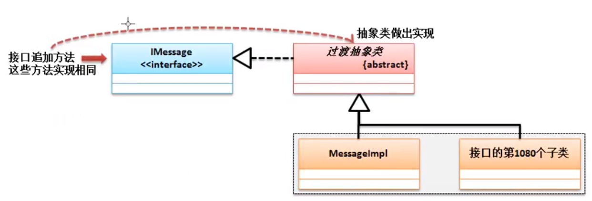
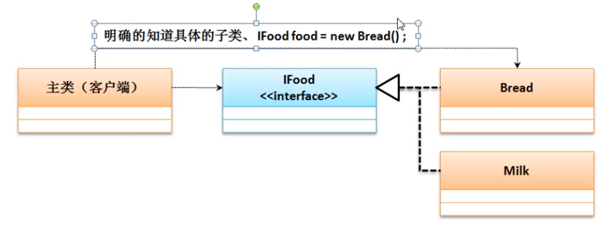
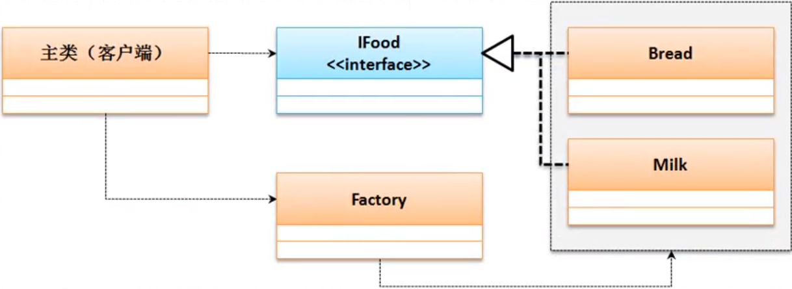
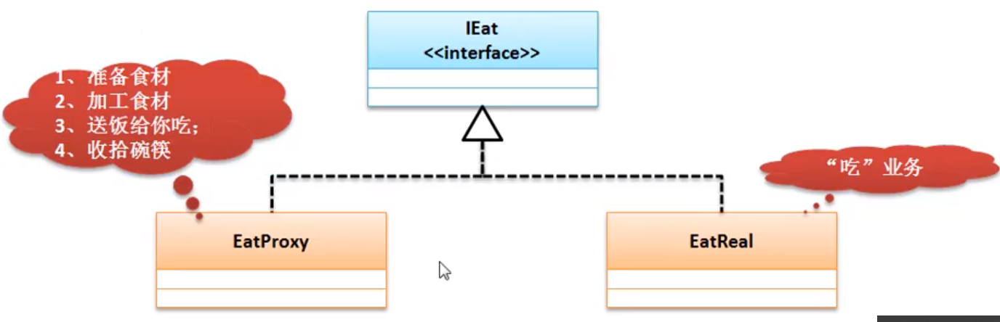
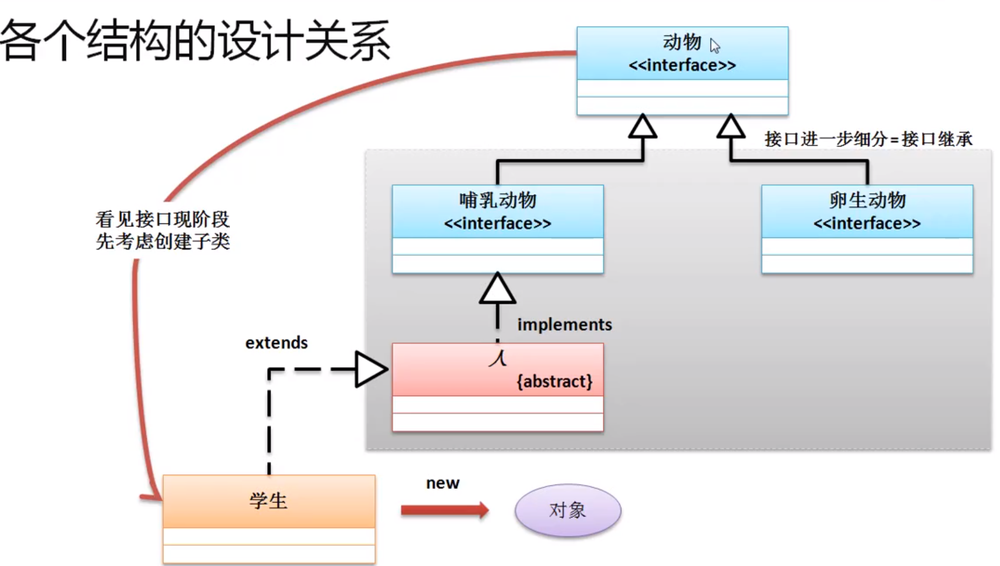

[toc]

---

# 1.构造方法

​	构造方法是没有返回值的

```java
class Person{
    private String name;
    private int age;
    public Person(String n, int a){
        name = n;
        age = a;
    }
    public void tell(){
        System.out.println("姓名：" + name + "年龄：" + age);
    }
}
```

​	疑问：既然构造方法是一个方法，那么为什么不让它定义返回值类型呢？既然构造方法不会返回数据，为什么不用void定义呢？

​	答：如果在构造方法上使用了void，那么此结构就与普通方法的结构完全相同了，这样<u>编译器会认为此方法是一个普通方法</u>，普通方法与构造方法最大的区别：构造方法是在类对象实例化的时候调用的，而普通方法是在类对象实例化产生之后调用的。

# 2.匿名对象

```java
new Person("张三", 10).tell();
```

​	此时依然通过了对象进行了类中tell()方法的调用，但是由于此对象没有任何的引用名称，所以该对象使用一次之后就将成为垃圾，而所有的垃圾将被GC进行回收与释放。

# 3.this关键字

- **this的三个使用场景**：

​		（1）当前类的属性：`this.属性`

​		（2）当前类中的方法（普通方法、构造方法）：`this.方法名称（）`、`this()`

​		（3）描述当前对象

- **不使用this的一个问题**：

```java
class Person{
    private String name;
    private int age;
    public Person(String name, int age){
        name = name;		// 在Java中“{}”是作为一个结构体的边界符，那么在程序里面进行变量（参数和属性都称为变量）使用的时候都会以“{}”作为查找边界	因此该赋值语句，没有访问到类的属性 name
        age = age;
    }
    public void tell(){
        System.out.println("姓名：" + name + "、年龄：" + age);
    }
}
public class JavaDemo {
    public static void main(String[] args) {
        Person per1 = new Person("张三", 18);
        per1.tell();			// 输出为 	姓名：null、年龄：0
    }
}

```

- **注意**：在自己所编写的程序代码中，只要是访问本类中属性的时候，一定要加上"this"实现访问

- **对于本类构造方法的互相调用需要注意以下三点重要问题：**

  构造方法必须在实例化新对象的时候调用，所以`this()`的语句只允许放在==构造方法==的==首行==

  类的构造方法中可以调用类的普通方法，但是类的普通方法不能调用类的构造方法

  构造方法互相调用时，请保留有程序的出口（避免递归构造器调用错误）

```java
class Person{
    private String name;
    private int age;
    public Person(){
        //this("调用下面的双参构造", 18);	     // 报错，和下面的双参构造形成递归调用
        System.out.println("类的一个对象实例化了");
    };
    public Person(String name){
        this();
        this.name = name;
        //this();					// 报错，this()必须放在构造方法的首行
    }
    public Person(String name, int age){
        this(name);
        this.age = age;
    }
    public void tell(){
        // this();				// 报错，普通方法不能调用类的构造函数，因为类的构造函数都是在类的实例化时调用的，类的普通方法则是在类的实例化完成之后调用的
        System.out.println("姓名：" + this.name + "、年龄：" + this.age);
    }
}
```

# 4.写一个简单类

​	对于简单Java类而言，其核心的开发结构如下：

> （1）类名称一定要有意义，可以明确的描述某一类事物
>
> （2）类之中的所有属性都必须使用private进行封装，同时封装后的属性必须要提供有setter、getter方法
>
> （3）类之中可以提供无数多个构造方法，但是必须要保留有无参构造方法
>
> （4）类之中不允许出现有任何的输出语句，所有内容的获取必须返回

```java
class Dept{
    private long deptNo;
    private String dname;
    private String loc;
    public Dept(){}				// 保留无参构造
    public Dept(long deptNo, String dname, String loc){
        this.deptNo = deptNo;
        this.dname = dname;
        this.loc = loc;
    }
    public String getInfo(){
        return "【部门信息】 部门编号：" + this.deptNo + "、部门名称：" + this.dname + "、部门位置：" + this.loc;
    }

    public void setDeptNo(long deptNo){
        this.deptNo = deptNo;
    }
    public void setDname(String dname){
        this.dname = dname;
    }
    public void setLoc(String loc){
        this.loc = loc;
    }
    public long getDeptNo(){
        return this.deptNo;
    }
    public String getDname(){
        return this.dname;
    }
    public String getLoc(){
        return this.loc;
    }
}

public class JavaDemo {
    public static void main(String[] args) {
        Dept dept = new Dept(001, "清华大学", "北京");
        System.out.println(dept.getInfo());
    }
}
```

# 5.Static

- **属性**


​		由于`static`修饰的是一个==公共==属性，虽然可以通过类的某个实例化对象来访问，但是最好是通过所有对象的最高代表（类）来进行访问，<u>static属性可以由类名称直接调用</u>

​		static 属性虽然定义在类之中，但是其并不受到类实例化对象的控制。==static属性可以在没有实例化对象的时候使用==。

- **方法**

  （1）static方法==只==允许调用static属性或static方法

  （2）非static方法允许调用static属性或static方法

# 6.代码块

​	在程序中使用“{}”定义的结构就称为代码块，而后根据代码块出现的位置以及 定义的关键字的不同，代码块可以分为：

普通代码块、构造代码块、静态代码块、同步代码块。

（1）普通代码块

​		普通代码块的主要特点是定义在一个方法之中的代码块

```java
public class JavaDemo {
    public static void main(String[] args) {
        {//代码块
            int x = 10;
            System.out.println("x:" + x);   // 10
        }
        int x = 100;
        System.out.println("x:" + x);      // 100
    }
}
```

​		普通代码块，可以在一个方法之中进行一些结构的拆分，以防止相同变量名称所带来的互相影响。

（2）构造代码块

​		构造块是定义在一个类之中的

```java
class Person{
    public Person(){
        System.out.println("【构造方法】Person类构造方法执行");
    }
    { // 构造代码块，会优先于 构造方法 先执行
        System.out.println("【构造块】Person类构造块执行");
    }
}

public class JavaDemo {
    public static void main(String[] args) {
        new Person();
        new Person();
    }
}
// 输出结果   
【构造块】Person类构造块执行
【构造方法】Person类构造方法执行
【构造块】Person类构造块执行
【构造方法】Person类构造方法执行
```

​		构造块会优先于构造方法执行，并且每一次实例化新对象的时候都会调用构造块中的代码

（3）静态代码块

​		静态代码块的定义需要考虑到两种情况：非主类中定义静态代码块、主类中定义静态代码块

​	（3.1）在非主类中进行静态块的定义

```java
class Person{
    public Person(){
        System.out.println("【构造方法】Person类构造方法执行");
    }
    {
        System.out.println("【构造块】Person类构造块执行");
    }
    static {
        System.out.println("【静态块】Person类静态代码块执行");
    }
}

public class JavaDemo {
    public static void main(String[] args) {
        new Person();
        new Person();
        new Person();
    }
}
// 执行结果
【静态块】Person类静态代码块执行
【构造块】Person类构造块执行
【构造方法】Person类构造方法执行
【构造块】Person类构造块执行
【构造方法】Person类构造方法执行
【构造块】Person类构造块执行
【构造方法】Person类构造方法执行
```

​		此时可以发现==静态代码块会优先于构造块和构造方法先执行==，并且不管有多少个实例化对象出现，静态代码块==只会执行一次==，静态代码块的主要目的是为类中的静态属性初始化

​	（3.2）在主类中的静态代码块

```java
public class JavaDemo {
    static {
        System.out.println("*******************");
    }
    public static void main(String[] args) {
        System.out.println("主方法执行的内容");
    }
}
// 执行结果
*******************
主方法执行的内容
```

​		==静态代码块优先于主方法先执行==

# 7.数组

* **编写一个工具类实现数组的倒置**

  ```java
  class ArrayUtil{
      public static void reverse(int[] arr){
          int tail = arr.length-1;
          if(tail<0) {
              System.out.println("数组长度为0");
              return;
          }
          int head = 0;
          int center = arr.length/2;
          for(int i=0; i<center; i++){
              int temp = arr[head];
              arr[head] = arr[tail];
              arr[tail] = temp;
              head++;
              tail--;
          }
      }
  }
  
  public class JavaDemo {
      public static void main(String[] args) {
          int[] arr = new int[]{1,2,3,4,5,6,7,8,9,10};
          ArrayUtil.reverse(arr);
          for(int num: arr){
              System.out.print(num+" ");
          }
      }
  }
  
  ```

* **数组相关类库**

  ```java
  java.util.Arrays.sort();
  System.arraycopy(源数组，源数组开始点，目标数组，目标数组开始点，拷贝长度);
  ```

* **方法可变参数**

  ```java
  class ArrayUtil{
      // 可变参数的写法 ...   本质是一个数组
      public static int sum(int ... data){
          int sum = 0;
          for(int temp: data){
              sum += temp;
          }
          return sum;
      }
  }
  
  public class JavaDemo {
      public static void main(String[] args) {
          System.out.println(ArrayUtil.sum(1,2,3,4,5,6,7,8,9,10));
      }
  }
  ```

  ​	可变参数的最大作用在于，在以后进行一些程序类设计或者开发者调用的时候，利用此种形式就可以避免数组的传递操作了，但是可变参数的本质需要清楚的是：依然是数组


**面向对象编程的一个例子**


```java
// 权限类
class Permission{
    private String id;
    private String name;
    private Role role;			// 一个权限对应一个角色

    public Permission(){}
    public Permission(String id, String name){
        this.id = id;
        this.name = name;
    }

    public void setRole(Role role) {
        this.role = role;
    }

    public Role getRole() {
        return this.role;
    }

    public String getInfo(){
        return "【权限信息】权限ID:" + this.id + "、权限名称：" + this.name;
    }

    // setter、getter方法省略
}

// 角色类
class Role{
    private String id;
    private String name;
    private User[] users;					// 一个角色对应多个用户
    private Permission[] permissions;		// 一个角色对应多个权限

    public Role(){}
    public Role(String id, String name){
        this.id = id;
        this.name = name;
    }

    public void setUsers(User[] users) {
        this.users = users;
    }

    public void setPermissions(Permission[] permissions) {
        this.permissions = permissions;
    }

    public User[] getUsers() {
        return this.users;
    }

    public Permission[] getPermissions() {
        return this.permissions;
    }

    public String getInfo(){
        return "【角色信息】角色ID:" + this.id + "、角色名称：" + this.name;
    }
    // setter、getter方法省略
}

// 用户类
class User{
    private String id;
    private String name;
    private Role[] roles;			// 一个用户对应多个角色

    public User(){}
    public User(String id, String name){
        this.id = id;
        this.name = name;
    }

    public void setRoles(Role[] roles) {
        this.roles = roles;
    }
    public Role[] getRoles() {
        return this.roles;
    }

    public String getInfo(){
        return "【用户信息】用户ID:" + this.id + "、用户姓名：" + this.name;
    }
    // setter、getter方法省略
}

public class JavaDemo {
    public static void main(String[] args) {
        User userA = new User("A", "张三");
        User userB = new User("B", "李四");
        Role roleA = new Role("1", "系统配置");
        Role roleB = new Role("2", "备份管理");
        Role roleC = new Role("3", "人事管理");
        Permission perA = new Permission("I", "系统初始化");
        Permission perB = new Permission("II", "系统还原");
        Permission perC = new Permission("III", "系统环境修改");
        Permission perD = new Permission("IIII", "备份员工数据");
        Permission perE = new Permission("IIIII", "备份部门数据");
        Permission perF = new Permission("IIIIII", "备份公文数据");
        Permission perG = new Permission("IIIIIII", "增加员工");
        Permission perH = new Permission("IIIIIIII", "编辑员工");
        Permission perI = new Permission("IIIIIIIII", "浏览员工");
        Permission perJ = new Permission("IIIIIIIIII", "员工离职");

        // 增加角色与权限的关系
        roleA.setPermissions(new Permission[]{perA,perB,perC});
        roleB.setPermissions(new Permission[]{perD,perE,perF});
        roleC.setPermissions(new Permission[]{perG,perG,perI});

        // 增加权限与角色的关系
        perA.setRole(roleA);
        perB.setRole(roleA);
        perC.setRole(roleA);
        perD.setRole(roleB);
        perE.setRole(roleB);
        perF.setRole(roleB);
        perG.setRole(roleC);
        perH.setRole(roleC);
        perI.setRole(roleC);
        perJ.setRole(roleC);

        // 增加用户与角色的对应关系
        userA.setRoles(new Role[] {roleA, roleB});
        userB.setRoles(new Role[] {roleA, roleB, roleC});
        roleA.setUsers(new User[] {userA, userB});
        roleB.setUsers(new User[] {userA, userB});
        roleC.setUsers(new User[] {userB});

        System.out.println("---------通过用户查找信息------------");
        System.out.println(userB.getInfo());
        for(int i=0; i<userB.getRoles().length; i++){
            System.out.println("\t|-" +  userB.getRoles()[i].getInfo());
            for(int j=0; j<userB.getRoles()[i].getPermissions().length; j++){
                System.out.println("\t\t|-" + userB.getRoles()[i].getPermissions()[j].getInfo());
            }
        }

        System.out.println("---------通过角色查找信息------------");
        System.out.println(roleB.getInfo());
        System.out.println("\t|- 浏览此角色下的所有权限信息");
        for(int i=0; i<roleB.getPermissions().length; i++){
            System.out.println("\t\t|-" + roleB.getPermissions()[i].getInfo());
        }
        System.out.println("\t|- 浏览此角色下的所有用户信息");
        for (int i=0; i<roleB.getUsers().length; i++){
            System.out.println("\t\t|-" + roleB.getUsers()[i]. getInfo());
        }

        System.out.println("---------通过权限查找用户信息------------");
        System.out.println(perA.getInfo());
        for (int i=0; i<perA.getRole().getUsers().length; i++){
            System.out.println("\t\t|-" + perA.getRole().getUsers()[i].getInfo());
        }
    }
}
```

​	总结：（1）首先确定需要建立哪几个类 （2）先抛开类与类之间的关系，确定各个类中的基本属性，补充构造函数、各个属性的setter、getter，以及返回信息的getInfo()方法 （3）根据类之间的关系（一对一，一对多，多对多），在类中添加相应的属性，同时添加setter、getter方法。

# 8.String

​	在 JDK1.9 之前，所有的 String 都利用了字符数组实现了包装的处理，所以在String类里面是提供有相应的转换处理方法的，这些方法包含有构造方法与普通方法两类。

| No.  | 方法名称                                                     | 类型 | 描述                           |
| ---- | ------------------------------------------------------------ | ---- | ------------------------------ |
|      | 字符串与字符数组的转换                                       |      |                                |
| 01   | public String(char[] value)                                  | 构造 | 将传入的全部字符数组变为字符串 |
| 02   | public String(char[] value, int offset, int count)           | 构造 | 将部分字符数组变为字符串       |
| 03   | public char charAt(int index)                                | 普通 | 获取指定索引位置的字符         |
| 04   | public char[] toCharArray()                                  | 普通 | 将字符串转换为字符数组         |
|      |                                                              |      |                                |
|      | 以下是字节数组与字符串的转换，目的是进行二进制的数据传输，或者是进行编码转换 |      |                                |
| 05   | public String(byte[] bytes)                                  | 构造 | 将全部的字节数组变为字符串     |
| 06   | public String(byte[] bytes, int offset, int length)          | 构造 | 将部分字节数组变为字符串       |
| 07   | public byte[] getBytes()                                     | 普通 | 将字符串转为字节数组           |
| 08   | public byte[] getBytes(String charsetName) throws UnsupportedEncodingException | 普通 | 编码转换                       |

* **字符串比较**

  | No.  | 方法名称                                              | 类型 | 描述                           |
  | ---- | ----------------------------------------------------- | ---- | ------------------------------ |
  | 01   | public boolean equals(String anObject)                | 普通 | 区分大小写的相等判断           |
  | 02   | public boolean equalsIgnoreCase(String anotherString) | 普通 | 不区分大小写比较               |
  | 03   | **public int compareTo(String anotherString)**        | 普通 | 进行字符串大小比较             |
  | 04   | public int compareToIgnoreCase(String str)            | 普通 | 不区分大小写进行字符串大小比较 |

* **字符串查找**

  | No.  | 方法名称                                              | 类型 | 描述                                       |
  | ---- | ----------------------------------------------------- | ---- | ------------------------------------------ |
  | 01   | public boolean contains(String s)                     | 普通 | 判断子字符串是否存在                       |
  | 02   | public int indexOf(String str)                        | 普通 | 从头查找指定字符串的位置，找不到的话返回-1 |
  | 03   | public int indexOf(String str, int fromIndex)         | 普通 | 从指定位置查找指定字符串的位置             |
  | 04   | public int lastIndexOf(String str)                    | 普通 | 由后向前查找指定字符串的位置               |
  | 05   | public int lastIndexOf(String str, int )              | 普通 | 从指定位置由后向前查找指定字符串的位置     |
  | 06   | public boolean startsWith(String prefix)              | 普通 | 判断是否以指定的字符串开头                 |
  | 07   | public boolean startsWith(String prefix, int toffset) | 普通 | 由指定位置判断是否以指定的字符串开头       |
  | 08   | public boolean endsWith(String suffix)                | 普通 | 判断是否以指定的字符串结尾                 |

* **字符串替换**

  | No.  | 方法名称                                                     | 类型 | 描述     |
  | ---- | ------------------------------------------------------------ | ---- | -------- |
  | 01   | public String replaceAll(String regex, String replacement)   | 普通 | 全部替换 |
  | 02   | public String replaceFirst(String regex, String replacement) | 普通 | 替换首个 |

* **字符串拆分**

  | No.  | 方法名称                                       | 类型 | 描述                                       |
  | ---- | ---------------------------------------------- | ---- | ------------------------------------------ |
  | 01   | public String[] split(String regex)            | 普通 | 按照指定的字符串全部拆分                   |
  | 02   | public String[] split(String regex, int limit) | 普通 | 按照指定的字符串拆分为指定个数，后面不拆了 |

* **字符串截取**

  | No.  | 方法名称                                              | 类型 | 描述                         |
  | ---- | ----------------------------------------------------- | ---- | ---------------------------- |
  | 01   | public String substring(int beginIndex)               | 普通 | 从指定索引截取到结尾         |
  | 02   | public String substring(int beginIndex, int endIndex) | 普通 | 截取指定索引范围内的子字符串 |

* **字符串格式化**

  从 JDK1.5 开始为了吸引更多的传统开发人员，Java提供了格式化数据的处理操作，类似于C语言的格式化输出语句，可以利用占位符实现数据的输出，对于占位符而言，常用的：字符串(%s)、字符(%c)、整数(%d)、小数(%f)

  | No.  | 方法名称                                                     | 类型 | 描述                           |
  | ---- | ------------------------------------------------------------ | ---- | ------------------------------ |
  | 01   | public static String format(String format, 各种类型 ... args) | 普通 | 根据指定结构进行文本格式化显示 |

* **其他方法**

  | No.  | 方法名称                         | 类型 | 描述                   |
  | ---- | -------------------------------- | ---- | ---------------------- |
  | 01   | public String concat(String str) | 普通 | 描述的就是字符串的拼接 |
  | 02   | public String intern()           | 普通 | 字符串入池             |
  | 03   | public boolean isEmpty()         | 普通 | 判断一个字符串是否为空 |
  | 04   | pubilc int length()              | 普通 | 计算字符串的长度       |
  | 05   | public String trim()             | 普通 | 去除左右的空格信息     |
  | 06   | public String toUpperCase()      | 普通 | 转大写                 |
  | 07   | public String toLowerCase()      | 普通 | 转小写                 |

# 9.继承

​	继承性的主要特点在于：可以扩充已有类的功能

* **继承实例**

  ```java
  class Person{
  	public Person(){
  		System.out.println("【Person父类】一个新的Person父类实例化对象创建了");
  	}
  }
  
  class Student extends Person{
      public Student(){
          //super();		// 写与不写此语句效果一样,都会默认调用父类的无参构造
          System.out.println("【Student子类】一个新的Student实例化对象创建了");
      }
  }
  
  public class  JavaDemo{
      public static void main(String args[]){
          new Student();	
      }
  }
  // 输出
  // 【Person父类】一个新的Person父类实例化对象创建了
  // 【Student子类】一个新的Student实例化对象创建了
  ```

  ​	super()表示的就是子类构造调用父类构造的语句，该语句只允许放在子类构造方法的首行。在默认情况下的实例化处理，子类只会调用父类中的无参构造方法，所以写与不写“super()”区别不大，但是如果说你的父类里面没有提供无参构造，这时必须使用 super() 明确调用有参构造。

  **结论**：无论如何书写继承代码，在实例化子类对象的同时一定会实例化父类对象，目**的是为了所有的属性可以进行空间的分配**。

* **继承的相关限制**

  1.Java之中不允许多重继承，只允许多层继承

  ​	在实际的生活之中，一个人只会有一位父亲，那么在程序的逻辑之中也是奉行此标准的

  2.在进行继承关系定义的时候，实际上子类可以继承父类中的所有的操作结构。但是对于私有操作属于隐式继承，而所有的非私有操作属于显式继承

* **方法的覆写**

  ​	方法覆写就是子类重写父类的方法，在子类进行方法的覆写之后，如果现在要想继续调用父类中的方法，那么就必须使用 `super().方法`。

* **方法覆写的限制**

  被覆写的方法不能够拥有比父类方法更为严格的访问控制权限。

* **final关键字**

  ​	final在程序之中描述的是终结器的概念，在java里面使用final关键字可以实现如下的功能：修饰类和方法，表示该类或方法不能被覆写；修饰变量，意为常量

* 一个示例：建立一个可以实现数组的操作类（Array)，而后在里面可以操作数组的大小，数组的大小由外部来决定，而后在该类中需要提供有数组的如下处理：进行数据的增加（如果数据满了则无法增加）、可以实现数组的容量扩充、取得全部数组内容。完成之后在此基础上再派生出两个子类：

  1. 数组排序类：返回的数据必须是排序后的结果
  2. 数组反转类：可以实现内容的首尾交换

  ```java
  class Array{
      private int[] data;
      private int foot; //进行角标控制
      public Array(int len){
          if(len>0){
              this.data = new int[len];
          }
          else {
              this.data = new int[1];
          }
      }
      public void increament(int num){
          int newData [] = new int[this.data.length + num];	// 重新申请一个数组
          System.arraycopy(this.data, 0 , newData, 0, this.data.length);
          this.data = newData;	// 改变数组引用指向
      }
      public boolean add(int num){
          if(this.foot < this.data.length){
              this.data[this.foot++] = num;
              return true;
          }
          return false;
      }
      public int[] getData(){
          return this.data;
      }
  }
  
  class SortArray extends Array{
      public SortArray(int len){
          super(len);
      }
      @Override
      public int[] getData(){
          java.util.Arrays.sort(super.getData());
          return super.getData();
      }
  
  }
  
  class ReverseArray extends Array{
      public ReverseArray(int len){
          super(len);
      }
      @Override
      public int[] getData(){
          int center = super.getData().length/2;
          int head = 0;
          int tail = super.getData().length-1;
          for(int x=0; x<center; x++){
              int temp = super.getData()[head];
              super.getData()[head++] = super.getData()[tail];
              super.getData()[tail--] = temp;
          }
          return super.getData();
      }
  }
  
  public class Example{
      public static void main(String[] args) {
          ReverseArray arr = new ReverseArray(5);
          System.out.println(arr.add(1));
          System.out.println(arr.add(2));
          System.out.println(arr.add(10));
          System.out.println(arr.add(4));
          System.out.println(arr.add(5));
          arr.increament(3);
          System.out.println(arr.add(7));
          System.out.println(arr.add(7));
          System.out.println(arr.add(7));
          int[] result = arr.getData();
          for(int num: result){
              System.out.print(num + "、");
          }
      }
  }
  ```

# 10. Annotation注解

​	Annotation是JDK1.5之后提出的一个新的开发技术结构，利用Annotation可以有效的减少程序配置的代码，并且可以利用Annotation进行一些结构化的定义。

# 11. 多态

* **Java中多态性的两种实现模式**

  1. <u>方法多态性</u>

     方法重载

     方法覆写

  2. <u>对象多态性</u>：父子实例之间的转换处理

  > 对象向上转型： 父类 父类实例 = 子类实例                          （自动完成转换）
  >
  > 对象向下转型：子类 子类实例 = （子类）父类实例             （强制完成转换）

  ​		从实际的转型处理来讲，大部分情况下考虑最多的是对象的向上转型，对于对象的向下转型往往是在使用子类特殊功能（子类可以对父类进行功能扩充）的时候要采用向下转型。

* **对象转型**

  1. <u>向上转型</u>

     ​	实现接收或返回参数的统一性

     ​	向上转型时，主要看实例化的是哪个子类（new 后面的类型），另外看子类是否覆写了父类的方法，如果覆写了，则调用的是子类方法

     ```java
     // 向上转型
     List<Integer> list = new ArrayList<>();
     ```

  2. <u>向下转型</u>

     ​	向下转型的主要特点在于需要使用到一些子类自己特殊的定义处理

  > * 向上转型描述的是一些公共的特征，向下转型描述的是子类自己特殊的定义方法
  >
  > * 以后只要是发生对象的向下转型之前一定要先发生向上转型，两个没有任何关系的实例如果想发生强制转换，就会出现“java.lang.ClassCastException”错误。上面没有关系的两个实例，指的是父类在定义时，并不知道哪些子类会继承自己，所以执行下面的代码会报错
  >
  >   ```java
  >   Father father = new Father();
  >   Son son = (Son)father;
  >   // 上面的代码时会报ClassCastException错
  >   ```
  >
  >   应该先向上转型，再向下转型
  >
  >   ```java
  >   Father father = new Son();	// 向上转型
  >   Son son = (Son)father;		// 向下转型
  >   ```

# 12. Object类

​	Object 类的主要特点是可以解决参数的统一问题，Object类可以接收所有的数据类型。

* **对象比较** `public boolean equals(Object obj)`

  ```java
  class Person{
      private String name;
      private int age;
      public Person(String name, int age){
          this.name = name;
          this.age = age;
      }
      @Override
      public String toString(){
          return "姓名：" + this.name + "、年龄：" + this.age;
      }
      @Override
      public boolean equals(Object obj){
          // obj为空，直接返回false
          if(obj == null){
              return false;
          }
          // 相同的地址
          if(this == obj){
              return true;
          }
          // 不同类型的两个对象比较，直接返回false
          if(!(obj instanceof Person)){
              return false;
          }
  
          Person per = (Person) obj;      // 向下转型，目的在于获取类中的属性
          return this.name.equals(per.name) && this.age==per.age;
      }
  }
  ```

# 13. 抽象类

​	类继承的主要作用在于可以扩充已有类的功能，但是对于之前的继承操作而言，子类可以有自己的选择——是否要覆写某一个方法，但是父类无法对子类做出强制性约定（强制你必须覆写某些方法），这种情况下往往不会采用类的继承（在实际的开发之中很少会出现继承一个已经完善的类，即可以直接使用的类），而是必须要继承**抽象类**，以后在程序设计中，优先考虑抽象类

​	抽象类的最大好处是：1、方便对子类方法的统一管理；2、可以自身提供一些普通方法，并且这些普通方法可以调用抽象方法（这些抽象方法必须在有子类提供实现的时候才会生效）。实际上抽象类提供了一种模板，供子类参考

* **抽象类的基本定义**

  ​	抽象类的主要作用在于对子类中覆写方法进行约定，在抽象类中可以去定义一些抽象方法以实现这样的约定。

  ​	从整体上讲，抽象类只是比普通类增加了抽象方法以及对子类的强制性的覆写要求，其他的使用过程和传统的类继承是完全相同的。

* **抽象类使用的几点注意事项**
  
  1. 抽象类使用很大程度上有一个核心问题：抽象类自己无法直接实例化
2. 抽象类主要目的是进行过渡操作使用，所以当你要使用抽象类进行开发时，往往都是在你需要解决类继承问题时所带来的的代码重复处理

* **抽象类的相关说明**
  1. 定义抽象类时，不能用final关键字进行定义，因为抽象类必须有子类继承，否则抽象类没有意义
  2. 抽象类是作为一个普通类的加强版出现的，所以可以有构造方法
  3. 抽象类中允许没有抽象方法，但是即便没有抽象方法，也无法直接使用关键字new获取抽象类的实例化对象，必须依靠子类对象完成
  4. 抽象类中可以提供有`static`方法，并且该方法不受到抽象类对象实例化的限制

* **抽象类范例**

  ```java
  abstract class Action{
      public static final int EAT = 1;
      public static final int SLEEP = 5;
      public static final int WORK = 10;
  
      public void command(int code){
          switch (code){
              case EAT:{
                  this.eat(); // 普通方法调用抽象方法
                  break;
              }
              case SLEEP:{
                  this.sleep(); // 普通方法调用抽象方法
                  break;
              }
              case WORK:{
                  this.work(); // 普通方法调用抽象方法
                  break;
              }
              case EAT + SLEEP + WORK:{
                  this.eat();
                  this.sleep();
                  this.work();
                  break;
              }
          }
      }
      public abstract void eat();
      public abstract void sleep();
      public abstract void work();
  }
  
  class Robot extends Action{
      @Override
      public void eat() { 
          
      }
  
      @Override
      public void sleep() {
  
      }
  
      @Override
      public void work() {
  		System.out.println();
      }
  
  }
  ```

# 14. 接口

​	抽象类与普通类相比最大的优势在于：可以实现对子类覆写方法的控制，但是在抽象类里面可能依然会保留有一些普通方法，而普通方法里面可能会涉及到一些安全或者隐私的操作问题，那么这样在进行开发的过程中，如果要想对外部隐藏全部的实现细节，则可以通过接口来进行描述

* **接口的基本定义**

  接口可以理解为一个纯粹的抽象类（最原始的接口中，只包含抽象方法与全局常量）

* **接口的多继承**

  一个接口不能继承任何的类，但是可以继承多个接口，使用关键字`extends`

* **接口使用场景**

  在实际的开发之中，接口的使用往往有三种形式：

  > 1	进行标准设置
  >
  > 2	表示一种操作的能力
  >
  > 3	暴露远程方法视图（一般在RPC分布式开发中使用）

* **接口定义加强**

  ​	接口是一种辐射式设计，考虑这样一种情况，IService接口下有1000个类实现了该接口，如果接口IService哪天需要扩充一个公共的功能，那么需要在1000个子类中各实现一遍该方法，以前的做法是在接口和实现类中间追加一个过渡的抽象类，因为抽象类中可以定义一个方法的具体实现，所以避免了重复代码的书写

  

  <u>	而在JKD1.8后，为了解决接口设计的缺陷，所以在接口中允许开发者定义普通方法</u>

  ​	接口中的普通方法必须追加`default`的声明，但是需要提醒的是，该操作属于挽救功能，所以如果不是必须的情况下， 不应该作为你程序设计的首选

  ​	除了可以追加普通方法之外，接口中也可以定义`static`方法了，而`static`方法就可以通过接口直接调用了

  ​	JDK1.8后，可以在接口里面定义普通方法或static方法，这个功能已经可以取代抽象类了，但是，不应该将这两个组成作为接口的主要设计原则。以后所写的代码里面还是应该奉行：接口就是抽象方法。

* **接口定义标准**

  ​	对于接口而言，在开发之中最为重要的应用就是进行标准的制定，实际上在日常的生活之中也会听见许多接口的名词：USB接口、PCI接口、鼠标接口等等，那么这些实际上都是属于标准的应用。

* **工厂设计模式**

  ​	对于接口而言，已经可以明确的知道，接口必须有子类，并且子类可以通过对象的向上转型来获取接口的实例化对象，但是我们在进行对象实例化的过程中也可能存在有设计问题，如客户端主类与具体的子类可能存在耦合（主类需要明确的知道具体的子类）

  

  ​	往往需要将解决主类与子类的耦合问题，使得主类不需要关注具体的子类，如下所示，日后，如果需要添加子类，在Factory中添加即可，主类不去关注具体的子类。工厂设计模式的最大用处就是隐藏了具体子类，主类可以不用去关注具体的子类。

  

  ```java
  interface IFood{
      void eat();
  }
  
  class Bread implements IFood{
      @Override
      public void eat(){
          System.out.println("吃面包。");
      }
  }
  
  class Milk implements IFood{
      @Override
      public void eat() {
          System.out.println("喝牛奶。");
      }
  }
  
  // 加入一个工厂,返回具体的子类
  class Factory{
      public static IFood getInstance(String className){
          if("bread".equals(className)){
              return new Bread();
          }
          else if("milk".equals(className)){
              return new Milk();
          }
          else {
              return null;
          }
      }
  }
  
  public class FactoryMain {
      public static void main(String[] args) {
          IFood food = Factory.getInstance(args[0]);
          food.eat();
      }
  }
  
  ```

* **代理设计模式（Proxy）**

  ​	代理设计模式的主要功能是可以帮助用户将所有的开发注意力只集中在核心业务功能的处理上，例如：肚子饿了，思考的是：如何可以吃到东西。

  

  ```java
  interface IEat{
      public void get();
  }
  
  // 真正吃饭的人
  class EatReal implements IEat{
      @Override
      public void get(){
          System.out.println("【真实主题】得到一份食物，而后开始品尝");
      }
  }
  
  class EatProxy implements IEat {    // 服务代理
      private IEat eat;               // 为吃饭的人而服务
      public EatProxy(IEat eat){      // 一定要有一个代理项
          this.eat = eat;
      }
  
      public void prepare(){          // 准备过程
          System.out.println("【代理主题】1、精心购买食材");
          System.out.println("【代理主题】2、小心的处理食材");
      }
      public void clear(){
          System.out.println("【代理主题】3、收拾碗筷");
      }
  
      @Override
      public void get() {
          this.prepare();
          this.eat.get();          // 真正的吃饭的人
          this.clear();
      }
  }
  
  class Main{
      public static void main(String[] args) {
          IEat eat = new EatProxy(new EatReal());
          eat.get();
      }
  }
  ```
  
  代理设计模式的主要特点是：一个接口提供有两个子类，其中一个子类是真实业务操作类，另外一个子类是代理业务操作类，没有代理业务操作类，真实业务无法进行
  
* **抽象类与接口的区别**

  | No.  | 区别       | 抽象类                                                       | 接口                                         |
  | ---- | ---------- | ------------------------------------------------------------ | -------------------------------------------- |
  | 1    | 定义关键字 | abstract class 抽象类名称 { }                                | interface 接口名称 { }                       |
  | 2    | 组成       | 构造、全局常量、成员属性、抽象方法、普通方法、静态方法       | 全局常量、抽象方法、普通方法、静态方法       |
  | 3    | 权限       | 可以使用各种权限定义                                         | 只能使用public                               |
  | 4    | 子类使用   | 子类使用extends关键字可以继承一个抽象类                      | 子类使用implements关键字可以实现多个接口     |
  | 5    | 两者关系   | 抽象类可以实现若干个接口                                     | 接口不允许继承抽象类，但是允许继承多个父接口 |
  | 6    | 使用       | 1、抽象类或接口必须定义子类；2、子类一定要覆写抽象类或接口中的全部抽象方法；3、通过子类的向上转型实现抽象类或接口对象实例化 |                                              |

  ​	当抽象类和接口都可以使用的情况下优先考虑接口，因为接口可以避免子类的单继承局限。

  ​	另外，从一个正常的设计角度而言，也需要先从接口来进行项目的整体设计。

  

# 15. 泛型

​	泛型从JDK1.5之后追加到Java语言中，其主要目的是为了解决 ClassCastException 的问题，在进行对象的向下转型时，总是可能存在着安全隐患，而 Java 希望通过泛型可以慢慢解决掉此类问题。

* **泛型问题的引出**

  现在假设定义一个描述x与y坐标的处理类，并且在这个类之中允许开发者保存三类数据：

  > 整形数据：x=10    y=20
  >
  > 浮点型数据：x=10.1	y=20.9
  >
  > 字符串型数据：x=东经120度、北纬30度

  泛型之前，程序设计如下：

  ```java
  class Point{
      private Object x;
      private Object y;
  
      public Object getX() {
          return this.x;
      }
  
      public Object getY() {
          return this.y;
      }
  
      public void setX(Object x) {
          this.x = x;
      }
  
      public void setY(Object y) {
          this.y = y;
      }
  }
  
  class Demo{
      public static void main(String[] args) {
          Point point = new Point();
          // 第一步：根据需求进行内容的设置
          point.setX(10);     // 自动装箱
          point.setY(20);
          // 第二步：从里面获取数据
          int x = (Integer) point.getX();
          int y = (Integer) point.getY();
          System.out.println("x坐标：" + x + "、y坐标：" + y);
      }
  }
  ```

  ​	本程序之所以可以解决当前的设计问题，主要原因在于，Object 可以接收所有的数据类型，但是正因为如此，本代码也会出现严重的安全隐患：

  ```java
  class Demo{
      public static void main(String[] args) {
          Point point = new Point();
          point.setX(10);    
          point.setY("北纬20度");
          // 第二步：从里面获取数据
          int x = (Integer) point.getX();
          int y = (Integer) point.getY();
          System.out.println("x坐标：" + x + "、y坐标：" + y);
      }
  }
  ```

  ​	此时的程序明显出现了问题，在程序编译时，实际上没有任何的错误产生，而程序执行的时候，就会出现`ClassCastException`异常，所以本程序的设计是存在有安全隐患的。此安全隐患存在的依据是使用了Object类型，因为Object可以涵盖的范围太广了，而对于这样的错误，如果可以直接出现在编译时，那么就可以避免运行时的异常。

* **泛型基本定义**

  ​	如果想避免项目之中出现`ClassCastException`异常，最好的做法是直接回避掉对象的强制转换，所以在JDK1.5之后提供有泛型技术，而泛型的本质在于，类中的属性或方法的参数与返回值的类型可以由对象实例化的时候动态决定。那么此时就需要在类定义的时候，明确的定义占位符（泛型标记）。

* **泛型通配符**

  ​	虽然泛型帮助开发者解决了一系列的对象的强制转换所带来的安全隐患，但从另一个角度来讲，泛型也带来了一些新的问题（“引用”传递时的问题）。观察下面的程序：

  ```java
  class Message <T>{
      private T content;
      public void setContent(T content){
          this.content = content;
      }
      public T getContent(){
          return this.content;
      }
  }
  
  class Demo{
      public static void main(String[] args) {
          Message<String> msg = new Message<>();
          msg.setContent("pcr");
          fun(msg);
      }
  
      public static void fun(Message<String> temp){	// 这里指定了泛型的类型为String，如果上面传递的是Integer类型或其他类型都无法编译
          System.out.println(temp.getContent());
      }
  }
  ```

  ​	而如果在上面的`fun()`中不设置泛型，改为 `public static void fun(Message temp)`的话，则可以在该方法中更改`main()`函数中传递过来的数据，例如`main()`中传递过来的是“pcr”，可以在`fun()`中进行`temp.setContent(0.8)`将数据改为0.8。

  ​	所以此时需要找一种方案：可以接收所有的泛型类型，并且不能修改里面的数据（允许获取），那么就需要通过<u>通配符“？</u>”来解决。

  ```java
  class Demo{
      public static void main(String[] args) {
          Message<String> msg = new Message<>();
          msg.setContent("pcr");
          fun(msg);
      }
  
      public static void fun(Message<?> temp){
          System.out.println(temp.getContent());
      }
  }
  ```

  ​	此时在`fun()`方法里由于采用了通配符的处理，所以可以接收所有类型的数据，并且不允许修改只允许获取数据

  ​	在 “?” 这个通配符之上，还提供有两类小的通配符：

  > ​		? extends 类 ： 
  >
  > ​				设置泛型的上限，例如：定义 "? extends Number"，表示只允许设置`Number`或`Number`的子类
  >
  > ​		? super 类：
  >
  > ​				设置泛型的下限，例如：定义 "? super String"，表示只能够使用`String`或`String`的父类
  >
  > ​				

* **泛型接口**

  泛型除了可以在类上定义之外，也可以直接在接口中进行使用。

  对于泛型接口的子类，有两种实现方式：

  1. 在子类中继续设置泛型定义

     ```java
     interface IMessage<T>{
         public String echo(T t);
     }
     
     class MeaageImpl<S> implements IMessage<S>{
         @Override
         public String echo(S s) {
             return "【ECHO】" + s;		// 任何对象类型碰到String都变为String
         }
     }
     
     class Demo{
         public static void main(String[] args) {
             IMessage<String> msg = new MeaageImpl<>();
             System.out.println(msg.echo("test"));
         }
     }
     ```

  2. 在子类实现父接口时，直接定义出具体泛型类型

     ```java
     interface IMessage<T>{
         public String echo(T t);
     }
     
     class MeaageImpl implements IMessage<String>{
         @Override
         public String echo(String s) {
             return "【ECHO】" + s;			// 任何对象类型碰到String都变为String
         }
     }
     
     class Demo{
         public static void main(String[] args) {
             IMessage<String> msg = new MeaageImpl();
             System.out.println(msg.echo("test"));
         }
     }
     ```

* **泛型方法**

  ​	在之前的程序类中可以发现，在泛型类中，如果将泛型标记写在方法上，那么这样的方法就被称为泛型方法，但是需要注意的是，泛型方法不一定非要出现在泛型类之中，即如果一个类上没有定义泛型，那么也可以使用泛型方法。

  ```java
  class Demo{
      public static void main(String[] args) {
          Integer[] num = fun(1,2,3);
          for (int temp:num){
              System.out.print(temp + "、");
          }
      }
  
      public static <T> T[] fun(T ... args){
          return args;
      }
  }
  ```

# 16. 单例设计模式

​	特点：构造方法私有化，类中提供`static`方法获取实例化对象，这样不管外部如何操作永远只有一个实例化对象

```java
public class Singleton {
    // 1.饿汉式
    // 提供一个静态实例并返回给调用者
    private static final Singleton INSTANCE = new Singleton();
    // 类的构造函数定义为 private，保证其他类不能实例化此类
    private Singleton(){};
    public static Singleton newInstance(){
        return INSTANCE;
    }
    
    // 2.懒汉式
    private static Singleton instance;
    private Singleton(){};
    public static Singleton newInstance(){
        if(instance == null){
            instance = new Singleton();
        }
        return instance;
    }
}
```

# 17. 异常

​	在Java中，可以使用：try、catch、finally 这几个关键字进行异常的处理，基本结构的如下：

```java
try {
    // 可能出现异常的语句
}
[catch (异常类型 异常对象) {
    // 异常处理
}
catch (异常类型 异常对象) {
    // 异常处理
}
catch (异常类型 异常对象) {
    // 异常处理
} ... ]
[finally {
    // 不管异常是否处理都要执行
}]
```

打印 异常的详细信息：`printStackTrace()`

* **处理多个异常**

  将大的异常都放在小的异常之后

* **throws关键字**

  明确的告诉使用者，某个方法中的程序代码可能会出现何种异常
  
  异常交给被调用处处理则一定要在方法上使用throws，多个异常中间用逗号隔开

# 18. 内部类

* **基本定义**

  内部类本身是一个独立且完善的类结构，在一个类的内部，除了属性和方法之外可以继续使用class定义内部类。

  ```java
  class Outer{		// 外部类
      private String msg = "pcr";		// 私有成员属性
      public void fun(){			// 普通方法
          Inner in = new Inner();		// 实例化内部类对象
          in.print();				// 调用内部类方法
      }
      class Inner{			// 在Outer类的内部定义了Inner类
          public void print(){
              System.out.println(Outer.this.msg);		// Outer类中的属性
          }
      }
  }
  
  class Demo{
      public static void main(String[] args) {
          Outer out = new Outer();
          out.fun();
      }
  }
  ```

  ​	为什么有内部类这样的结构呢？试将以上程序分成两个类：

  ```java
  class Outer{
      private String msg = "pcr";
      public void fun(){
          // 思考五：需要将当前对象Outer传递到Inner类之中
          Inner in = new Inner(this);
          in.print();
      }
      // 思考一：msg属性如果要被外部访问需要提供有getter方法
      public String getMsg(){
          return this.msg;
      }
  }
  
  class Inner{
      // 思考三：Inner这个类对象实例化的时候，需要Outer类的对象
      private Outer out;
      // 思考四：应该通过Inner类的构造方法获取Outer类对象
      public Inner(Outer out){
          this.out = out;
      }
      public void print(){
          // 思考二：如果要想调用外部类中的getter方法，那么一定需要有Outer类对象
          System.out.println(this.out.getMsg());
      }
  }
  
  class Demo{
      public static void main(String[] args) {
          Outer out = new Outer();
          out.fun();
      }
  }
  ```

  ​	可以发现，<u>以上代码的目的就在于为了让Inner这个类可以访问Outer这个类中的私有属性</u>。所以可以得出内部类的优势：轻松的访问外部类中的私有属性。

* **内部类相关说明**

  ​	内部类可以轻松的访问外部类中的私有属性或方法，同样地，外部类也可以轻松的访问内部类中的私有属性和方法。

  ```java
  class Outer{
      private String msg = "pcr";
      public void fun(){
          Inner in = new Inner();
          in.print();
          System.out.println(in.info);        // 外部类访问内部类的私有属性
      }
      class Inner{
          private String info = "adgjioadgas";		// 内部类的私有属性
          public void print(){
              System.out.println(Outer.this.msg);
          }
      }
  }
  ```

  ​	使用了内部类之后，内部类与外部类之间的私有操作的访问就不再需要通过 setter、getter 以及其他的间接方式来完成，而是可以直接进行处理操作。

  ​	但是需要注意的是，内部类本身也是一个类，虽然在大部分情况下内部类往往是被外部类包裹的，但是外部依然可以产生内部类的实例化对象，而此时内部类实例化对象的格式如下：

  ```java
  外部类.内部类 内部类对象 = new 外部类().new 内部类();
  ```

  ​	若使用private修饰内部类，则不能在外部类中访问内部类

* **方法中定义内部类**

  ​	内部类可以在任意的结构中进行定义，这就包括了：类中、方法中、代码块中，但是在实际的开发中，在方法中定义内部类的情况较多。

  ```java
  class Outer{
      private String msg = "pcr";
      public void fun(int num){
          class Inner{    // 内部类
              public void print(){
                  System.out.println(msg);
                  System.out.println(num);
              }
          }
          new Inner().print();    // 方法中直接实例化内部类对象
      }
  }
  
  class Demo{
      public static void main(String[] args) {
          new Outer().fun(66);
      }
  }
  ```

  ​	此时在`fun()`方法内部提供有Inner内部类的定义，并且可以发现内部类可以直接访问外部类中的私有属性，也可以直接访问方法中的参数，但是对于方法中的参数的直接访问是从JDK1.8开始支持的（1.8开始提供Lamda表达式）；而在1.8之前，如果方法中定义的内部类要想访问方法中的参数，则方法中的参数前必须追加final。

* **匿名内部类**

  匿名内部类是一种简化的内部类的处理形式，其主要是在抽象类和接口的子类上使用的。

  ```java
  interface IMessage{
      public void send(String str);
  }
  
  class MessageImpl implements IMessage{
      @Override
      public void send(String str) {
          System.out.println(str);
      }
  }
  
  class Demo{
      public static void main(String[] args) {
          IMessage msg = new MessageImpl();
          msg.send("测试");
      }
  }
  
  
  // 以下是匿名内部类写法
  interface IMessage{
      public void send(String str);
  }
  
  class Demo{
      public static void main(String[] args) {
          IMessage msg = new IMessage() {		// 匿名内部类
              @Override
              public void send(String str) {
                  System.out.println(str);
              }
          };
          msg.send("测试");
      }
  }
  ```

# 19. 函数式编程

​	从JDK1.8开始，为了简化使用者进行代码的开发，专门提供有Lambda表达式的支持，利用此操作形式可以实现函数式的编程，利用函数式编程可以避免面向对象编程之中的一些繁琐的处理问题。

​	面向对象在其长期的发展过程中一直有一部分的反对者，这些反对者认为面向对象的设计过于复杂了，并且过于繁琐了。以一个最简单的程序为例：

```java
interface IMessage{
    public void send(String str);
}

class Demo{
    public static void main(String[] args) {
        IMessage msg = new IMessage() {		// 匿名内部类
            @Override
            public void send(String str) {
                System.out.println(str);
            }
        };
        msg.send("测试");
    }
}
```

​	在这样一个程序中，实际上核心的功能只有一行语句`System.out.println(str)`，但是为了这一行核心语句，依然需要按照完整的面向对象给出的设计结构进行开发。于是这些问题随着技术的不断发展也是越来越突出了。

* **Lambda表达式**

  下面使用Lambda表达式实现与之前完全一样的功能。

```java
interface IMessage{
    public void send(String str);
}

class Demo{
    public static void main(String[] args) {
        IMessage msg = (str)-> {
                System.out.println(str);
        };
        msg.send("测试");
    }
}
```

​	Lambda表达式避免了复杂的面向对象结构化的要求。

​	Lambda表达式如果要想使用，那么必须有一个重要的实现要求：SAM( Single Abstract Method )，只有一个抽象方法，以上面的`IMessage`接口为例，在这个接口中只有一个send()抽象方法，除此之外没有任何的其他方法定义，所以这样的接口就被称为函数式接口，而只有函数式接口才可以被Lambda表达式所使用。

​	@FunctionalInterface注解用来声明函数式接口，即该接口中只应有一个抽象方法

​	对于Lambda表达式，提供有如下几种格式：

> * 方法没有参数：	( )->{ };
> * 方法有参数：       (参数，参数)->{ };
> * 如果现在只有一行语句返回：(参数，参数)->语句；

