[toc]


# 一、多线程

## 1.1 多线程编程

### 1.1.1 **继承Thread类实现多线程**

```java
class MyThread extends Thread{
    private String title;
    public MyThread(String title){
        this.title = title;
    }

    @Override
    public void run() {
        for(int x = 0; x<10; x++){
            System.out.println(this.title + "运行，x=" + x);
        }
    }
}

class ThreadDemo{
    public static void main(String[] args) {
        new MyThread("线程A").start();	// 这里如果使用run方法，三个线程是顺序执行的，并没有并行执行
        new MyThread("线程B").start();
        new MyThread("线程C").start();
    }
}
```

​	虽然调用的是start()方法，但最终执行的是run()方法，并且所有的线程对象都是交替执行的，执行顺序是不可控的。为什么多线程的启动不直接使用run()方法，而必须使用Thread类中的start()方法呢？

​	在Java程序的执行过程之中，考虑到对于不同层次开发者的需求，所以其支持有本地的操作系统函数调用，而这项技术被称为JNI（Java Native Interface），但是Java开发过程之中并不推荐这样使用，利用这项技术可以使用一些操作系统提供的底层函数进行一些特殊的处理，而在Thread类里面提供的`start0()` 就表示需要将此方法依赖于不同的操作系统实现。


### 1.1.2 基于Runnable接口实现多线程


### 1.1.3 Thread 与 Runnable 的关系

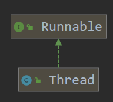

​	例子：利用卖票程序来实现多个线程的资源并发访问

```java
class MyThread implements Runnable{
    private int ticket = 5;
    @Override
    public void run(){
        for(int x=0; x<100; x++){
            if(this.ticket > 0){
                System.out.println("卖票，ticket = " + this.ticket--);
            }
        }
    }
}

class Example{
    public static void main(String[] args) {
        MyThread mt = new MyThread();
        new Thread(mt).start();         // 第一个线程启动
        new Thread(mt).start();         // 第二个线程启动
        new Thread(mt).start();         // 第三个线程启动
    }
}
```


### 1.1.4 Callable 实现多线程

​	Runnable接口有一个缺点：当线程执行完毕之后，无法获取一个返回值。从JDK1.5之后提出了一个新的线程实现接口：java.util.concurrent.Callable接口

```java
public interface Callable<V>{
    public V call() throws Excetion;
}
```

​	可以发现Callable定义的时候可以设置一个泛型，此泛型的类型就是返回数据的类型，这样的好处是可以避免向下转型带来的安全隐患。

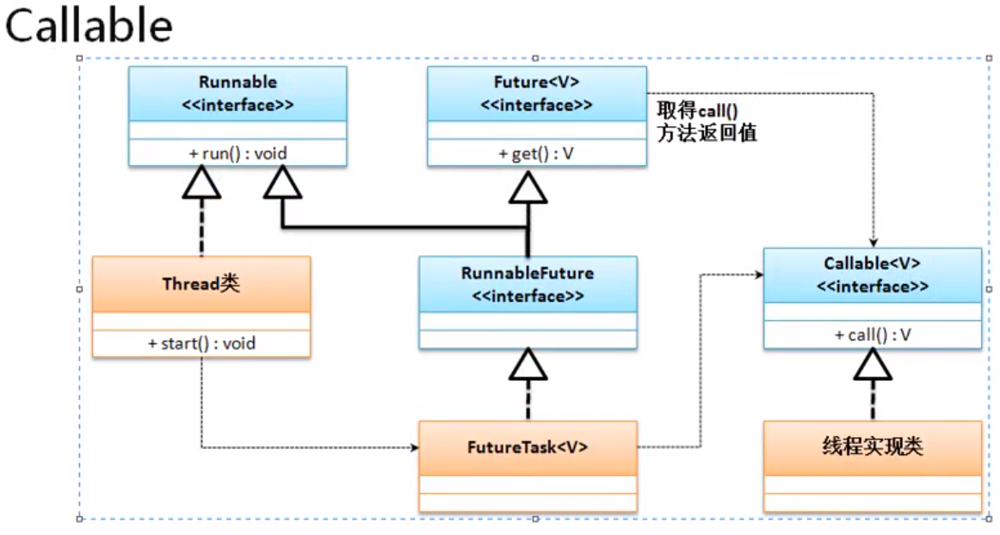

* **示例：**

  使用Callable实现多线程

```java
import java.util.concurrent.Callable;
import java.util.concurrent.ExecutionException;
import java.util.concurrent.FutureTask;

class MyThread implements Callable<String>{
    @Override
    public String call() throws Exception{
        for(int x=0; x<10; x++){
            System.out.println("********* 线程执行" + x);
        }
        return "线程执行完毕";
    }
}

class Example{
    public static void main(String[] args) throws ExecutionException, InterruptedException {
        FutureTask<String> task = new FutureTask<>(new MyThread());
        new Thread(task).start();
        System.out.println("【线程返回数据】" + task.get());
    }
}
```

* **面试题：请解释Runnable与Callable的区别？**

  java.lang.Runnable 接口之中只提供有一个run()方法，并且没有返回值

  java.util.concurrent.Callable接口提供有Call()方法，可以有返回值


### 1.1.5 线程运行状态

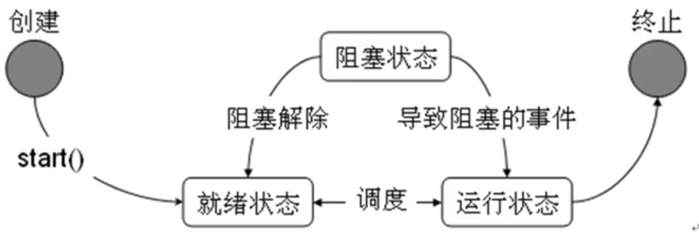


## 1.2 线程常用操作方法

### 1.2.1 线程的命名与取得

​	多线程的运行状态是不确定的，那么在程序的开发之中为了可以获取到一些需要使用的线程就只能够依靠线程的名字来进行操作。所以线程的名字是一个至关重要的概念，这样在Thread类之中就提供有线程名称的处理。

|          |                                             |
| -------- | ------------------------------------------- |
| 构造方法 | public Thread(Runnable target, String name) |
| 设置名字 | public final void setName(String name)      |
| 取得名字 | public final String getName()               |


### 1.2.2 线程的休眠

| 方法定义                                                     |
| ------------------------------------------------------------ |
| public static void sleep(long millis) throws InterruptedExcetion |
| public static void sleep                                     |

​	在进行休眠的时候可能会产生中断异常`InterruptedExcetion`，中断异常属于Exception的子类，所以证明该异常必须进行处理。

```java
class Demo{
    public static void main(String[] args) {
        new Thread(()->{
           for(int x=0; x<10; x++){
               System.out.println(Thread.currentThread().getName() + "、x=" + x);
               try {
                   Thread.sleep(1000);      // 暂缓执行
               } catch (InterruptedException e) {
                   e.printStackTrace();
               }
           }
        },"线程对象").start();
    }
}
```

​	休眠的主要特点是可以自动进行线程的唤醒，以继续进行后续的处理。但是需要注意的是，如果现在你有多个线程对象，那么休眠也是有先后顺序的。

* **示例：产生多个线程对象进行休眠**

```java
public class Demo {
    public static void main(String[] args) {
        Runnable run = ()->{
            for(int x=0; x<10; x++){
                System.out.println(Thread.currentThread().getName() + "、x=" + x);
                try {
                    Thread.sleep(1000);
                } catch (InterruptedException e) {
                    e.printStackTrace();
                }
            }
        };
        for(int num=0; num<5; num++){
            new Thread(run, "线程对象-" + num).start();			// 产生五个线程对象
        }
    }
}
```

​	此时将产生5个线程对象，并且这五个线程对象执行的方法体是相同的。此时从程序执行的感觉上来讲，好像是若干个线程一起进行了休眠，而后一起进行了自动唤醒，但是实际上是有差别的。

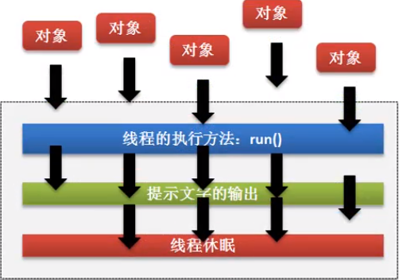


### 1.2.3 线程中断

​	某个线程的中断是由其它线程完成的，在Thread类中提供有两种中断执行的处理方法：

> * 判断线程是否被中断：public boolean isInterrupted()
> * 中断线程执行：public void interrupt()

* **示例：线程中断的处理操作**

  ```java
  class Demo{
      public static void main(String[] args) throws Exception {
          Thread thread = new Thread(()->{
              System.out.println("***线程启动***");
              try{
                  Thread.sleep(10000);
                  System.out.println("***线程执行完毕***");
              }catch (InterruptedException e){
                  e.printStackTrace();
              }
          });
          thread.start();
          if(!thread.isInterrupted()){    // 判断线程是否中断，如果没有中断，则执行线程的中断操作
              thread.interrupt();         // 中断线程的执行
          }
      }
  }
  ```

  ​	执行结果：

  

  所有正在执行的线程都是可以被中断的，中断线程必须进行异常的处理。


### 1.2.4 线程强制运行

​	所谓的线程的强制执行指的是当满足某些条件之后，某一个线程对象将可以一直独占资源，一直到该线程的程序执行结束。线程的强制执行可以使用Thread中提供的方法：`join()`

* **示例：观察一个没有强制执行的程序**

  ```java
  class Demo{
      public static void main(String[] args) throws Exception {
          Thread thread = new Thread(()->{
              for(int x=0; x<100; x++){
                  try {
                      Thread.sleep(100);
                  } catch (InterruptedException e) {
                      e.printStackTrace();
                  }
                  System.out.println(Thread.currentThread().getName() + "执行、x=" + x);
              }
          },"玩耍的线程");
          thread.start();
          for(int x=0; x<100; x++){
              Thread.sleep(100);
              System.out.println("【霸道的main线程】number=" + x);
          }
      }
  }
  ```

  ​	以上程序代码，主线程和子线程在交替执行着，但是如果希望主线程独占执行，那么可以使用Thread类中的方法：强制执行。

* **线程强制执行的程序**

  ```java
  class Demo{
      public static void main(String[] args) throws Exception {
          Thread mainThread = Thread.currentThread();     // 获得主线程
          Thread thread = new Thread(()->{
              for(int x=0; x<100; x++){
                  if(x==3){       // 现在霸道的线程要来了
                      try {
                          mainThread.join();      // 霸道线程要先执行
                      } catch (InterruptedException e) {
                          e.printStackTrace();
                      }
                  }
                  try {
                      Thread.sleep(100);
                  } catch (InterruptedException e) {
                      e.printStackTrace();
                  }
                  System.out.println(Thread.currentThread().getName() + "执行、x=" + x);
              }
          },"玩耍的线程");
          thread.start();
          for(int x=0; x<100; x++){
              Thread.sleep(100);
              System.out.println("【霸道的main线程】number=" + x);
          }
      }
  }
  ```

  ​	在进行线程强制执行的时候，一定要获取强制执行线程对象之后，才可以执行`join()`的调用。


### 1.2.5 线程礼让

​	线程的礼让指的是先将资源让出去，让别的线程先执行。线程的礼让可以使用Thread中提供的方法：`public static void yield()`

* **示例：线程的礼让操作**

  ```java
  class Demo{
      public static void main(String[] args) throws Exception {
          Thread thread = new Thread(()->{
              for(int x=0; x<100; x++){
                  if(x%3 == 0){
                      Thread.yield(); // 线程礼让
                      System.out.println("### 玩耍的线程礼让执行 ###");
                  }
                  try {
                      Thread.sleep(100);
                  } catch (InterruptedException e) {
                      e.printStackTrace();
                  }
                  System.out.println(Thread.currentThread().getName() + "执行、x=" + x);
              }
          },"玩耍的线程");
          thread.start();
          for(int x=0; x<100; x++){
              Thread.sleep(100);
              System.out.println("【霸道的main线程】number=" + x);
          }
      }
  }
  ```


### 1.2.6 线程优先级

​	从理论上说，线程的优先级越高越有可能先执行（越有可能先抢占到资源）。Thread类中针对优先级操作提供有以下两个处理方法：

| 功能       | 方法                                           |
| ---------- | ---------------------------------------------- |
| 设置优先级 | public final void setPriority(int newPriority) |
| 获取优先级 | public final int getPriority()                 |

​	在进行优先级定义的时候都是通过int型的数字来完成的，而对于此数字的选择在Thread类中定义有三个常量：

| 功能       | 常量                                  |
| ---------- | ------------------------------------- |
| 最高优先级 | public static final int MAX_PRIORITY  |
| 中等优先级 | public static final int NORM_PRIORITY |
| 最低优先级 | public static final int MIN_PRIORITY  |

* **示例：线程优先级操作**

  ```java
  class Demo{
      public static void main(String[] args) throws Exception {
          Runnable run = ()->{
              for(int x=0; x<10; x++){
                  try {
                      Thread.sleep(1000);
                  } catch (InterruptedException e) {
                      e.printStackTrace();
                  }
                  System.out.println(Thread.currentThread().getName() + "执行。");
              }
          };
          Thread threadA = new Thread(run, "线程对象A");
          Thread threadB = new Thread(run, "线程对象B");
          Thread threadC = new Thread(run, "线程对象C");
          threadA.setPriority(Thread.MAX_PRIORITY);
          threadB.setPriority(Thread.MIN_PRIORITY);
          threadC.setPriority(Thread.MIN_PRIORITY);
          threadA.start();
          threadB.start();
          threadC.start();
      }
  }
  ```

  ​	以上程序，A有较大概率先执行，但并不是每次都最先执行。即优先级高的线程有可能先执行，并不是绝对会先执行。


## 1.3 线程同步与死锁

​	在多线程的处理中，可以利用Runnable描述多个线程操作的资源，而Thread描述每一个线程对象，于是当多个线程访问同一资源的时候，如果处理不当，就会产生数据的错误操作。

### 1.3.1 同步问题的引出

​	下面编写一个简单的卖票程序，将创建若干个线程对象实现卖票的处理操作。

```JAVA
class MyThread implements Runnable{
    private int ticket = 10; //总票数为10张
    @Override
    public void run() {
        while(true){
            if(this.ticket>0){
                try {
                    Thread.sleep(100);      // 模拟网络延迟
                }catch (InterruptedException e){
                    e.printStackTrace();
                }
                System.out.println(Thread.currentThread().getName() + "卖票，ticket = " + this.ticket --);
            } else{
                System.out.println("*** 票已售罄 ***");
                break;
            }
        }
    }
}

class Demo{
    public static void main(String[] args) throws Exception {
        MyThread myThread = new MyThread();
        new Thread(myThread, "票贩子A").start();
        new Thread(myThread, "票贩子B").start();
        new Thread(myThread, "票贩子C").start();
    }
}
```

​	由于手动添加了线程休眠来模拟网络延迟的情况，以上程序在多次运行中可能出现剩余票数为-1的情况，程序运行过程如下：

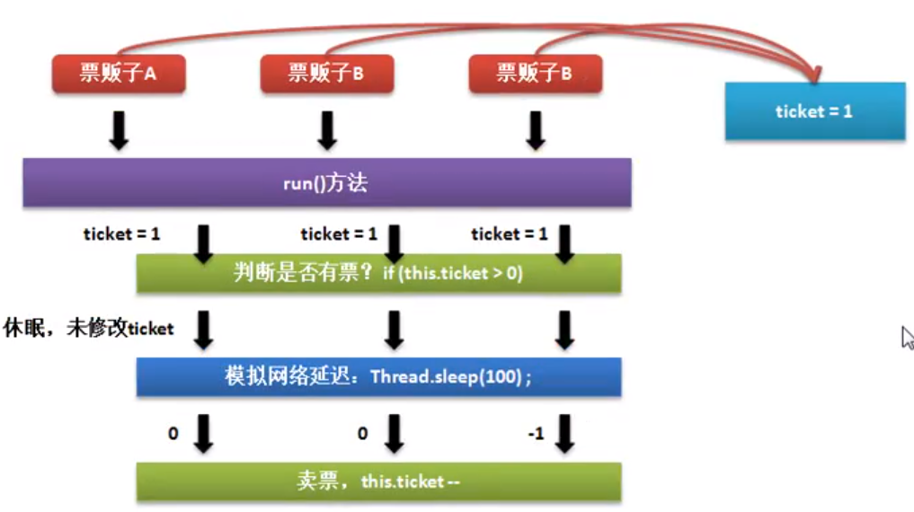


### 1.3.2 线程同步处理

​	解决同步问题的关键在于锁。锁指的是当某一个线程执行操作的时候，其它线程在外面等着。

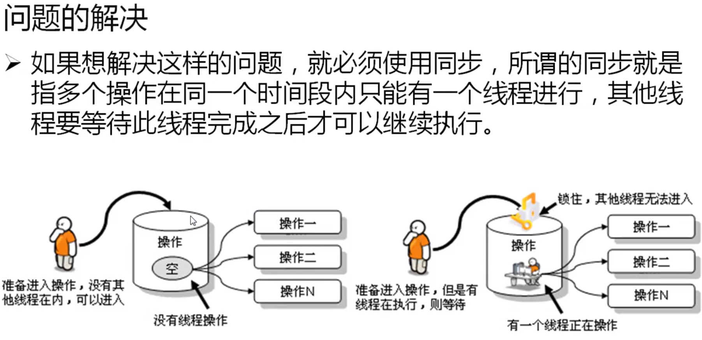

​	如果想在程序之中实现这把锁的功能，就可以使用synchronized关键字来实现，利用此关键字可以定义同步方法或同步代码块，在同步代码块的操作里面的代码只允许一个线程执行。

* **利用同步代码块进行处理**

  ```java
  synchronized(同步对象){
      同步代码操作;
  }
  ```

  ​	一般要进行同步对象处理的时候可以采用当前对象this进行同步

  * 示例：利用同步代码块解决数据同步访问问题

    ```java
    class MyThread implements Runnable{
        private int ticket = 10000;
        @Override
        public void run() {
            while(true){
                synchronized (this){        // 每次只允许一个线程进行访问
                    if(this.ticket>0){
                        try {
                            Thread.sleep(1);      // 模拟网络延迟
                        }catch (InterruptedException e){
                            e.printStackTrace();
                        }
                        System.out.println(Thread.currentThread().getName() + "卖票，ticket = " + this.ticket --);
                    } else{
                        System.out.println("*** 票已售罄 ***");
                        break;
                    }
                }
            }
        }
    }
    
    class Demo{
        public static void main(String[] args) throws Exception {
            MyThread myThread = new MyThread();
            new Thread(myThread, "票贩子A").start();
            new Thread(myThread, "票贩子B").start();
            new Thread(myThread, "票贩子C").start();
        }
    }
    ```

* **利用同步方法解决：只需要在方法定义上使用synchronized关键字即可**

  ```java
  class MyThread implements Runnable{
      private int ticket = 10;
  
      public synchronized boolean sale(){
          if(this.ticket>0){
              try {
                  Thread.sleep(100);      // 模拟网络延迟
              }catch (InterruptedException e){
                  e.printStackTrace();
              }
              System.out.println(Thread.currentThread().getName() + "卖票，ticket = " + this.ticket --);
              return true;
          } else{
              System.out.println("*** 票已售罄 ***");
              return false;
          }
      }
  
      @Override
      public void run() {
          while(this.sale()){
          }
      }
  }
  
  class Demo{
      public static void main(String[] args) throws Exception {
          MyThread myThread = new MyThread();
          new Thread(myThread, "票贩子A").start();
          new Thread(myThread, "票贩子B").start();
          new Thread(myThread, "票贩子C").start();
      }
  }
  ```


## 1.4 经典示例(生产者消费者)

​		在多线程的开发过程中，最为著名的案例是生产者与消费者操作，该操作的主要流程如下：

> * 生产者负责信息内容的生产
>
> * 每当生产者生产完成一项完整的信息之后消费者要从这里面取走信息
>
> * 如果生产者没有生产则消费者要等待它生产完成，如果消费者还没有对信息进行消费，则生产者应该等待消费处理完成后再继续生产。


* **程序的基本实现**

  ​	可以将生产者与消费者定义为两个独立的线程类对象，但是对于现在生产的数据，可以使用如下的组成：

  > * 数据一：title = 张大、content = 家中老大
  > * 数据二：title = 张二、content = 家中老二

  ​	既然生产者与消费者是两个独立的线程，那么这两个独立的线程之间就需要有一个数据保存的集中点，那么可以单独定义一个Message类来进行数据的保存

  ```java
  // 生产者
  class Producer implements Runnable{
      private Message msg;
      public Producer(Message msg){
          this.msg = msg;
      }
      @Override
      public void run() {
          for(int x=0; x<100; x++){
              if(x%2 == 0){
                  this.msg.setTitle("张大");
                  try{
                      Thread.sleep(100);
                  } catch (InterruptedException e){
                      e.printStackTrace();
                  }
                  this.msg.setContent("家中老大");
              }else{
                  this.msg.setTitle("张二");
                  try{
                      Thread.sleep(100);
                  } catch (InterruptedException e){
                      e.printStackTrace();
                  }
                  this.msg.setContent("家中老二");
              }
          }
      }
  }
  
  // 消费者
  class Consumer implements Runnable{
      private Message msg;
      public Consumer(Message msg){
          this.msg = msg;
      }
      @Override
      public void run() {
          for(int x=0; x<100; x++){
              try{
                  Thread.sleep(10);
              } catch (InterruptedException e){
                  e.printStackTrace();
              }
              System.out.println(this.msg.getTitle() + "   -   " + this.msg.getContent());
          }
      }
  }
  
  // 保存的数据
  class Message{
      private String title;
      private String content;
  
      public void setTitle(String title) {
          this.title = title;
      }
      public void setContent(String content) {
          this.content = content;
      }
      public String getTitle() {
          return title;
      }
      public String getContent() {
          return content;
      }
  }
  
  // 主方法
  class Demo{
      public static void main(String[] args) throws Exception {
          Message msg = new Message();
          new Thread(new Producer(msg)).start();      // 启动生产者线程
          new Thread(new Consumer(msg)).start();      // 启动消费者线程
      }
  }
  ```

  ​	通过整个代码的执行会发现此时有两个主要问题：

  > 问题一：数据不同步（出现了“张大-家中老二”和“张二-家中老大”的记录）
  >
  > 问题二：应该是生产一个取走一个，但是发现有了重复生产和重复取出的问题

* **解决数据同步的问题**

  ​	如果要想解决数据同步，最简单的做法是使用synchronized关键字定义同步代码块或同步方法，于是这个时候对于同步的处理就可以直接在Message类中完成。

  ```java
  class Producer implements Runnable{
      private Message msg;
      public Producer(Message msg){
          this.msg = msg;
      }
      @Override
      public void run() {
          for(int x=0; x<100; x++){
              if(x%2 == 0){
                  this.msg.set("张大", "家中老大");
              }else{
                  this.msg.set("张二", "家中老二");
              }
          }
      }
  }
  
  class Consumer implements Runnable{
      private Message msg;
      public Consumer(Message msg){
          this.msg = msg;
      }
      @Override
      public void run() {
          for(int x=0; x<100; x++){
              System.out.println(this.msg.get());
          }
      }
  }
  
  class Message{
      private String title;
      private String content;
  
      public synchronized void set(String title, String content){		// 同步方法
          this.title = title;
          try{
              Thread.sleep(100);
          } catch (InterruptedException e){
              e.printStackTrace();
          }
          this.content = content;
      }
      public synchronized String get(){				// 同步方法
          try{
              Thread.sleep(100);
          } catch (InterruptedException e){
              e.printStackTrace();
          }
          return this.title + "   -   " + this.content;
      }
  }
  
  class Demo{
      public static void main(String[] args) throws Exception {
          Message msg = new Message();
          new Thread(new Producer(msg)).start();      // 启动生产者线程
          new Thread(new Consumer(msg)).start();      // 启动消费者线程
      }
  }
  ```
  
  ​	上面程序的执行结果：数据已经可以保持一致了（不再出现“张大-家中老二”和“张二-家中老大”的情况），但是对于重复操作的问题依然存在。

* **线程等待与唤醒**

  ​	如果要解决生产者与消费者问题，最好的解决方案是使用等待与唤醒机制。而对于等待与唤醒的机制，主要依赖Object类中提供的方法处理：

  | 功能         | 方法                                                         |
  | ------------ | ------------------------------------------------------------ |
  | 等待         | public final void wait() throws InterruptedException         |
  | 设置等待时间 | public final void wait(long timeout) throws InterruptedExption |
  | 设置等待时间 | public final void wait(long timeout, int nanos) throws InterruptedExption |

  | 功能               | 方法                          |
  | ------------------ | ----------------------------- |
  | 唤醒第一个等待线程 | public final void notify()    |
  | 唤醒全部等待线程   | public final void notifyAll() |

  ​	对于当前的问题主要的解决方法应该通过Message类完成

  ```java
  class Producer implements Runnable{
      private Message msg;
      public Producer(Message msg){
          this.msg = msg;
      }
      @Override
      public void run() {
          for(int x=0; x<100; x++){
              if(x%2 == 0){
                  this.msg.set("张大", "家中老大");
              }else{
                  this.msg.set("张二", "家中老二");
              }
          }
      }
  }
  
  class Consumer implements Runnable{
      private Message msg;
      public Consumer(Message msg){
          this.msg = msg;
      }
      @Override
      public void run() {
          for(int x=0; x<100; x++){
              System.out.println(this.msg.get());
          }
      }
  }
  
  class Message{
      private String title;
      private String content;
      private boolean flag = true;       // 表示生产或消费的形式
      // flag = true;             // 允许生产，不允许消费
      // flag = false;            // 允许消费，不允许生产
      public synchronized void set(String title, String content){
          if(this.flag == false){         // 无法进行生产，应该等待被消费
              try{
                  super.wait();
              } catch (InterruptedException e){
                  e.printStackTrace();
              }
          }
          this.title = title;
          try{
              Thread.sleep(100);
          } catch (InterruptedException e){
              e.printStackTrace();
          }
          this.content = content;
          this.flag = false;          // 已经生产过了
          super.notify();             // 生产完成后，也有可能存在等待的消费者，所以这里唤醒等待的线程（有就唤醒，没有就什么也不做）
      }
      public synchronized String get(){
          if(this.flag == true){      // 还未生产，需要等待
              try{
                  super.wait();
              } catch (InterruptedException e){
                  e.printStackTrace();
              }
          }
          try{
              Thread.sleep(100);
          } catch (InterruptedException e){
              e.printStackTrace();
          }
          try{
              return this.title + "   -   " + this.content;
          } finally {     // 不管如何都要执行
              this.flag = true; // 继续生产
              super.notify();     // 唤醒等待线程
          }
  
      }
  }
  
  class Demo{
      public static void main(String[] args) throws Exception {
          Message msg = new Message();
          new Thread(new Producer(msg)).start();      // 启动生产者线程
          new Thread(new Consumer(msg)).start();      // 启动消费者线程
      }
  }
  ```

  ​	这种处理形式就是在进行多线程开发过程之中最原始的处理方案，整个的等待、同步、唤醒机制都由开发者自行通过原生代码实现控制。


## 1.5 多线程深入

### 1.5.1 优雅的停止线程

​	多线程如果需要进行停止处理，Thread类原本提供有stop()方法，但是对于这些方法从jdk1.2开始就已经将其废除了，而且一直到现在也不再建议出现在代码之中，除了stop()方法之外，也有几个方法被废除了：

> 停止多线程：public void stio()
>
> 销毁多线程：public void destroy()
>
> 挂起线程：public final void suspend()、暂停执行
>
> 恢复挂起的线程执行：public final void resume()

​	之所以废除这些方法，主要原因是因为这些方法有可能导致线程死锁，所以从jdk1.2开始就不建议使用了。如果这个时候要实现线程的停止需要通过一种柔和的方式来进行。

* **示例：实现线程柔和的停止**

  ```java
  public class Demo {
      public static boolean flag = true;
  
      public static void main(String[] args) throws InterruptedException {
          new Thread(()->{
              long num = 0;
              while(flag){
                  try {
                      Thread.sleep(5);
                  } catch (InterruptedException e){
                      e.printStackTrace();
                  }
                  System.out.println(Thread.currentThread().getName() + "正在运行、num = " + num++);
              }
          }, "执行线程").start();
          Thread.sleep(20);	// 运行20毫秒
          flag = false;	// 停止线程
      }
  }
  ```

  ​	通过其它的线程去控制flag的内容，那么这个时候对于线程的停止也不是说停就立刻停止的，而是会在执行中判断flag的内容来完成。


### 1.5.2 后台守护线程

| 功能               | 方法                                    |
| ------------------ | --------------------------------------- |
| 设置为守护线程     | public final void setDaemon(boolean on) |
| 判断是否为守护线程 | public final boolean isDaemon()         |

```java
public class Demo {
    public static boolean flag = true;

    public static void main(String[] args) throws InterruptedException {
        Thread userThread = new Thread(()->{
            for(int x=0; x<10; x++){		// 核心业务线程执行10次
                try {
                    Thread.sleep(100);
                } catch (InterruptedException e){
                    e.printStackTrace();
                }
                System.out.println(Thread.currentThread().getName() + "正在运行、x = " + x);
            }
        }, "用户线程");     // 完成核心的业务

        Thread daemoThread = new Thread(()->{
            for(int x=0; x<Integer.MAX_VALUE; x++){
                try {
                    Thread.sleep(100);
                } catch (InterruptedException e){
                    e.printStackTrace();
                }
                System.out.println(Thread.currentThread().getName() + "正在运行、x = " + x);
            }
        }, "守护线程");     // 完成核心的业务

        daemoThread.setDaemon(true);    // 设置为守护线程
        userThread.start();
        daemoThread.start();
    }
}
```

​	可以发现所有的守护线程都是围绕在用户线程周围，如果程序执行完毕了，守护线程也就消失了，在整个的JVM里面最大的守护线程就是GC线程。

​	程序执行中GC线程会一直存在，如果程序执行完毕，GC线程也将消失。


### 1.5.3 volatile关键字

​	在多线程的定义之中，volatile关键字主要是在属性定义上使用的，表示此属性为直接数据操作，而不进行副本的拷贝处理，这样在一些书上就将其错误的理解为同步属性了。

​	在正常进行变量处理的时候往往会经历如下的几个步骤：

> * 获取变量原有的数据内容副本
> * 利用副本为变量进行数学计算
> * 将计算后的变量，保存到原始空间之中

​	而如果一个属性上追加了volatile关键字，表示的就是<u>不使用副本，而是直接操作原始变量</u>，相当于节约了：拷贝副本、重新保存的步骤。

* **面试题：请解释volatile与synchronized的区别**

  > * volatile 主要在属性上使用，而synchronized是在代码块与方法上使用的
  > * volatile 无法描述同步的处理，它只是一种直接内存的处理，避免了副本的操作


## 1.6 多线程综合案例

* **案例一：**设计一个生产电脑和搬运电脑的类，要求生产一台电脑就搬走一台电脑，如果没有新的电脑生产出来，则搬运工要等待新电脑产出；如果生产出的电脑没有搬走，则要等待电脑搬走之后再生产，并统计生产出的电脑数量。

  ```java
  // 生产者
  class Producer_1 implements Runnable{
      private Resource resource;
      public Producer_1(Resource resource){
          this.resource = resource;
      }
      @Override
      public void run() {
          for(int x=0; x<50; x++){
              try {
                  this.resource.make();
              } catch (Exception e) {
                  e.printStackTrace();
              }
          }
      }
  }
  
  // 消费者
  class Consumer_1 implements Runnable{
      private Resource resource;
      public Consumer_1(Resource resource){
          this.resource = resource;
      }
      @Override
      public void run() {
          for(int x=0; x<50; x++){
              try {
                  this.resource.get();
              } catch (Exception e) {
                  e.printStackTrace();
              }
          }
      }
  }
  
  class Resource{
      private Computer computer;
      public synchronized void make() throws Exception{
          if(this.computer != null){     // 已经生产过了
              super.wait();
          }
          Thread.sleep(100);
          this.computer = new Computer("Lenovon拯救者", 8999.0);
          System.out.println("【生产电脑】" + this.computer);
          super.notify();
      }
      public synchronized void get() throws Exception {
          if(this.computer == null){      // 没有生产过
              super.wait();
          }
          Thread.sleep(10);
          System.out.println("【取走电脑】" + this.computer);
          this.computer = null;
          super.notify();
      }
  }
  
  class Computer{
      private static int count = 0 ;     // 表示生产的电脑台数
      private String name;
      private double price;
      public Computer(String name, Double price){
          this.name = name;
          this.price = price;
          count++;
      }
      @Override
      public String toString(){
          return "【第" + count + "台电脑】" + "电脑名字：" + this.name + "、价值：" + this.price;
      }
  
  }
  
  public class Demo {
      public static void main(String[] args) throws InterruptedException {
          Resource resource = new Resource();
          new Thread(new Producer_1(resource)).start();
          new Thread(new Consumer_1(resource)).start();
      }
  }
  ```

* **案例二：**实现一个竞拍抢答程序，要求设置三个抢答者（三个线程），而后同时发出抢答指令，抢答成功给出成功提示，未抢答成功给出失败提示。

  分析：该案例的多线程操作涉及到数据的返回问题，所以最好使用Callable进行实现。

  ```JAVA
  import java.util.concurrent.Callable;
  import java.util.concurrent.FutureTask;
  
  class MyThread implements Callable<String>{
      private boolean flag = false;
      @Override
      public String call() throws Exception {
          synchronized (this){
              if(this.flag == false){
                  this.flag = true;
                  return Thread.currentThread().getName() + "抢答成功！";
              }
              else {
                  return Thread.currentThread().getName() + "抢答失败！";
              }
          }
      }
  }
  
  public class Demo {
      public static void main(String[] args) throws Exception {
          MyThread mt = new MyThread();
          FutureTask<String> taskA = new FutureTask<>(mt);
          FutureTask<String> taskB = new FutureTask<>(mt);
          FutureTask<String> taskC = new FutureTask<>(mt);
          new Thread(taskA, "竞赛者A").start();
          new Thread(taskB, "竞赛者B").start();
          new Thread(taskC, "竞赛者C").start();
          System.out.println(taskA.get());
          System.out.println(taskB.get());
          System.out.println(taskC.get());
      }
  }
  ```

# 二、Java常用类库

## 2.1 StringBuffer

​	String 类拥有如下的特性：

> * 每个字符串的常量都属于一个 String 类的匿名对象，并且不可更改
> * String 有两个常量池：静态常量池、运行时常量池
> * String 类对象实例化建议使用直接赋值的形式完成， 这样可以直接将对象保存在对象池中中以方便下次重用

​	虽然 String 类很好使用，但是其最大的弊端：内容不允许修改。为了解决此问题，专门提供有一个 StringBuffer 类可以实现字符串内容的修改处理。

​	StringBuffer 并不像 String 类那样拥有两种对象的实例化方式，StringBuffer 必须像普通类那样首先对象实例化，而后才可以调用方法执行处理，而这个时候可以考虑使用StringBuffer类中的如下方法：

> 构造方法：pubilc StringBuffer()
>
> 构造方法：public StringBuffer(String str)，接受初始化字符串内容
>
> 数据追加：public StringBuffer append(数据类型 变量)，相当于字符串中的“+”操作

​	StringBuffer类中除了可以支持字符串内容的修改之外，实际上也提供有一些 String 类所不具备的方法：

> 插入数据：public StringBuffer insert(int offset, 数据类型 b)
>
> 删除指定范围的数据：public StringBuffer delete(int start, int end)
>
> 字符串内容反转：public StringBuffer reverse()

​	实际上与 StringBuffer 类还有一个类似的功能类：StringBuilder 类，这个类是在 JDK1.5 开始提供的，该类中提供的方法与 StringBuffer 功能相同，最大的区别在于 StringBuffer类中的方法属于线程安全，全部使用了 synchronized 关键字进行标注，而 StringBuilder 类属于非线程安全。


## 2.2 CharSequence 接口

​	`CharSequence`是一个描述字符串结构的接口，在这个接口中一般有三种常用子类：

| String类                                                     | StringBuffer类                                               | StringBuilder类                                              |
| ------------------------------------------------------------ | ------------------------------------------------------------ | ------------------------------------------------------------ |
| public final class String extends Object implements Serializable, Comparable<String>, <u>CharSequence</u> | public final class StringBuffer extends Object implements Serializable, <u>CharSequence</u> | public final class StringBuilder extends Object implements Serializable, <u>CharSequence</u> |

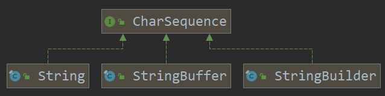

​	现在只要有字符串，就可以为CharSequence接口实例化

​	CharSequence本身也是一个接口，在该接口中也定义有如下的操作方法：

> * 获取指定索引字符：public char charAt(int index)
> * 获取字符串的长度：public int length()
> * 截取部分字符串：public CharSequence subSequence(int start, int end)


## 2.3 AutoCloseable接口

​	`AutoCloseable`主要是用于日后进行资源开发的处理上，以实现资源的自动关闭（释放资源），例如，在以后进行文件、网络、数据库开发的过程之中，由于服务器的资源有限，所以使用之后一定要关闭资源，这样做才可以被更多的使用者使用。

​	该接口在JDK1.7时提出，并且该接口只提供有一个方法：

```java
public void close() throws Exception
```

​	要想实现自动关闭处理，除了要使用AutoCloseable之外，<u>==还需要结合异常处理语句才可以完成资源的自动关闭==</u>

```java
public class Demo {
    public static void main(String[] args) throws Exception {
        try (IMessage nm = new NetMessage("www.pcr.com")){
            nm.send();          // 不用显示调用close方法也能关闭资源
        } catch (Exception e){

        }
    }
}

interface IMessage extends AutoCloseable{
    public void send();     // 消息发送
}

class NetMessage implements IMessage{
    private String msg;
    public NetMessage(String msg){
        this.msg = msg;
    }
    public boolean open(){
        System.out.println("【OPEN】获取消息发送连接资源。");
        return true;
    }
    @Override
    public void send(){
        if(this.open()){
            System.out.println("【*** 发送消息 ***】" + this.msg);
        }
    }
    @Override
    public void close() throws Exception{
        System.out.println("【Close】关闭消息发送通道");
    }
}
```


## 2.4 Runtime类

​	Runtime描述的是运行时的状态，也就是说在整个的JVM之中，Runtime类是唯一一个与JVM运行状态有关的类，并且都会默认提供一个该类的实例化对象。

​	由于在每一个JVM进程里面只允许有一个Runtime类的对象，所以这个类的构造方法被默认私有化了，那么就证明该类使用的是单例设计模式，并且单例设计模式一定会提供有一个static方法获取本类的实例。

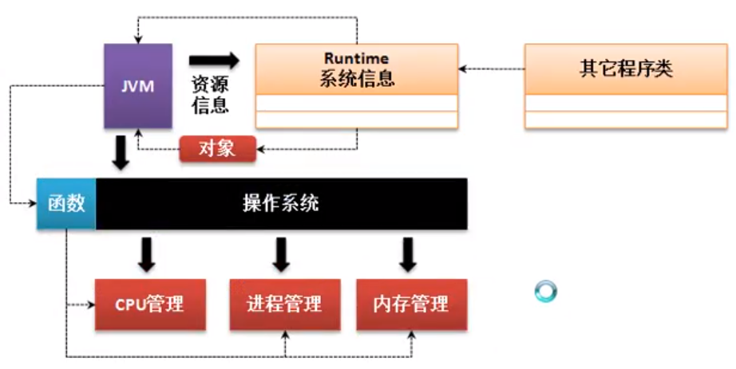

​	由于Runtime类属于单例设计模式，如果要想获取实例化对象，那么就可以依靠类中的`getRuntime()`方法完成：获取实例化对象：public static Runtime getRuntime()

```java
public class Demo {
    public static void main(String[] args) throws Exception {
        Runtime rt = Runtime.getRuntime();      // 获取实例化对象
        System.out.println(rt.availableProcessors());
    }
}
// 通过该类中的availableProcessors()方法可以获取本机的CPU内核数量
```

​	除了以上的方法之外，在Runtime类中还提供有以下四个重要的操作方法：

| 功能                 | 方法                    |
| -------------------- | ----------------------- |
| 获取最大可用内存空间 | public long maxMemory   |
| 获取可用内存空间     | public long totalMemory |
| 获取空闲内存空间     | public long freeMemory  |
| 手工进行GC处理       | public void gc()        |


## 2.6 System类

| 功能                   | 方法                                                         |
| ---------------------- | ------------------------------------------------------------ |
| 数组拷贝               | public static void arraycopy(Object src, int srcPos, Object dest, int destPos, int length) |
| 获取当前的日期时间数值 | public static long currentTimeMillis()                       |
| 进行垃圾回收           | public static void gc()                                      |

* **示例：操作耗时的统计**

  ```java
  public class Demo {
      public static void main(String[] args) throws Exception {
          long start = System.currentTimeMillis();
          String str = "";
          for(int x=0; x<30000; x++){
              str += x;
          }
          long end = System.currentTimeMillis();
          System.out.println("操作耗时：" + (end-start));
      }
  }
  ```

* **gc()**

  等价于 `Runtime.getRuntime.gc()`


## 2.7 对象克隆

​	所谓的对象克隆指的就是对象的复制，而且属于全新的复制。即：使用已有对象内容创建一个新的对象，如果要进行对象的克隆，需要用到Object类中提供的`clone()`方法：`protected Object clone() throws CloneNotSupportedException`

​	所有的类都会继承Object类，所以所有的类都一定会有clone()方法，但是并不是所有的类都希望被克隆。所以要想实现对象的克隆，那么对象所在的类需要实现一个Cloneable接口，<u>此接口并没有任何的方法提供，是因为它描述的是一种能力</u>。

* **示例：实现对象克隆**

  ```java
  class Member implements Cloneable{
      private String name;
      private int age;
      public Member(String name, int age){
          this.name = name;
          this.age = age;
      }
      @Override
      public String toString() {
          return "【" + super.toString() + "】name = " + this.name + "、age = " + this.age;
      }
      @Override
      protected Object clone() throws CloneNotSupportedException {
          return super.clone();          // 调用父类中提供的clone()方法
      }
  }
  
  public class Demo {
      public static void main(String[] args) throws Exception {
          Member memberA = new Member("钢铁侠", 45);
          Member memberB = (Member) memberA.clone();
          System.out.println(memberA);
          System.out.println(memberB);
      }
  }
  ```

  ​	如果在开发之中，不是非常特别的需求下，很少会出现有对象克隆的需求。


## 2.8 数字操作类

### 2.8.1 Math数学计算类

​	Math类的主要功能是进行数学计算的操作类，提供有基础的计算公式。这个类的构造方法被私有化了（但不是单例），而且该类中提供的所有方法都是static型的方法，即：这些方法都可以通过类名称直接调用。

```java
public class Demo {
    public static void main(String[] args) {
        System.out.println(Math.abs(-10.1));
        System.out.println(Math.max(-10.1, 51));
        System.out.println(Math.log(53));
        System.out.println(Math.round(15.1));   //15
        System.out.println(Math.round(15.5));   //16
        System.out.println(Math.round(15.51));  //16
        System.out.println(Math.round(-15.1));  //-15
        System.out.println(Math.round(-15.5));  //-15
        System.out.println(Math.round(-15.51)); //-16
        System.out.println(Math.pow(2,8)); //256
    }
}
```

​	虽然在Math类中提供有四舍五入的处理方法，但是这个四舍五入在进行处理的时候，是直接将小数点后的所有位进行进位处理了，这样不方便，我们可以实现指定位数的保留：

```java
class MathUtil {
    private MathUtil(){}	// 构造函数私有化，这样该工具类不存在实例化对象

    /**
     * 实现数据的四舍五入操作
     * @param num   要进行四舍五入操作的数字
     * @param scale 四舍五入保留的小数位数
     * @return  四舍五入处理后的结果
     */
    public static double round(double num, int scale){
        return Math.round(num * Math.pow(10, scale)) / Math.pow(10, scale);
    }
}

public class Demo {
    public static void main(String[] args) {
        System.out.println(MathUtil.round(19.454324, 3));
    }
}
```

​	Math类中提供的基本上都是基础的数学公式，需要的时候需要自己重新整合。


### 2.8.2 Random随机数生成类

​	java.util.Random类的主要功能是产生随机数，该类主要是依靠内部提供的方法来完成的：

| 功能                                                    | 方法                          |
| ------------------------------------------------------- | ----------------------------- |
| 产生一个不大于边界的随机整数（0和正整数，不包含负整数） | public int nextInt(int bound) |

```java
import java.util.Random;

public class Demo {
    public static void main(String[] args) {
        Random random = new Random();
        for(int x=0; x<100; x++){
            System.out.print(random.nextInt(10) + "、");
        }
    }
}
```


### 2.8.3 大数字处理类

​	在进行数学计算的工程中，还有一个大数字的操作类，可以实现海量数字的计算（能提供的也只是基础计算）：BigInteger、BigDecimal

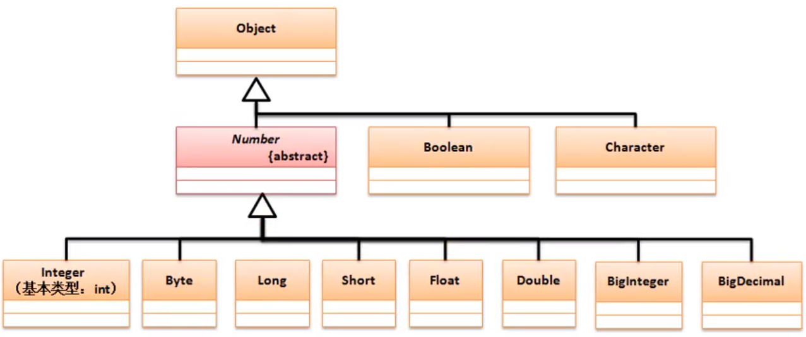

​	BigInteger类构造：public BigInteger(String val)

​	BigDecimal类构造：public BigDecimal(String val)

* **示例：使用BigInteger实现四则运算**

  ```java
  import java.math.BigInteger;
  
  public class Demo {
      public static void main(String[] args) {
          BigInteger bigA = new BigInteger("454531324657465413644165423100454341354513246541564");
          BigInteger bigB = new BigInteger("74434113545415645401231544541546516547554123");
          System.out.println("加法操作：" + bigA.add(bigB));
          System.out.println("减法操作：" + bigA.subtract(bigB));
          System.out.println("乘法操作：" + bigA.multiply(bigB));
          System.out.println("除法操作：" + bigA.divide(bigB));
      }
  }
  ```


## 2.9 日期操作类

### 2.9.1 Date 日期处理类

​	java.util.Date

​	将 long 转为 Date: public Date(long date)

​	将 Date 转为 long: public long getTime()

* **示例：Date与 long 之间的转换**

  ```java
  import java.util.Date;
  
  public class Demo {
      public static void main(String[] args) {
          Date date = new Date();
          System.out.println(date);
          long current = date.getTime();
          current += 864000 * 1000;		// 10天的毫秒数
          System.out.println(new Date(current));		// long 转为 Date
      }
  }
  ```


### 2.9.2 日期的格式化处理——SimpleDateFormat日期处理类

​	默认情况下Date类输出的的日期时间结构并不能够被国人所习惯，需要对时间显示的格式进行格式化的处理，在`java.text`包中提供有 `SimpleDateFormat`程序类，该类中提供有如下方法：

| 功能                                 | 方法                                                         |
| ------------------------------------ | ------------------------------------------------------------ |
| 构造方法                             | public SimpleDateFormat(String pattern)  日期格式：年（yyyy）、月（MM）、日（dd）、时（HH）、 分（mm）、秒（ss）、毫秒（SSS） |
| 【从DateFormat继承】将日期转为String | public final String format(Date date)                        |
| 【从DateFormat继承】将String转为日期 | public Date parse(String source) throws ParseException       |

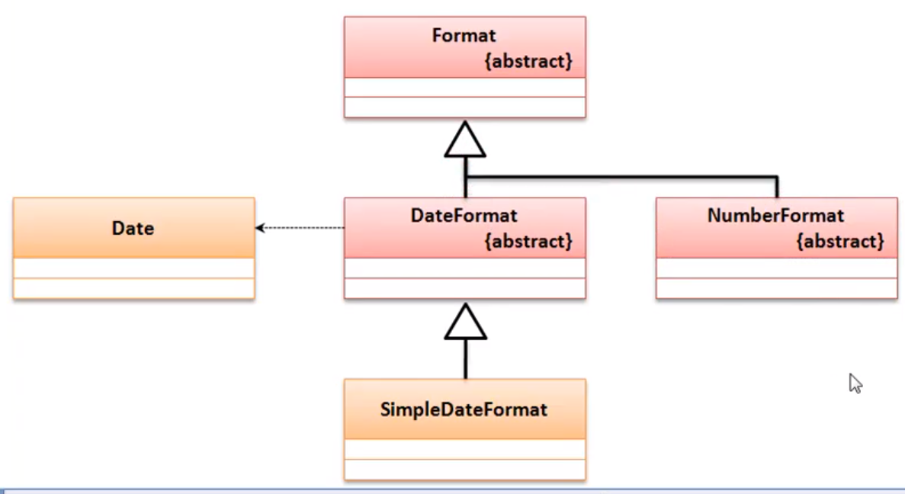

* **示例：格式化日期显示**

  ```java
  import java.text.SimpleDateFormat;
  import java.util.Date;
  
  public class Demo {
      public static void main(String[] args) {
          Date date = new Date();
          SimpleDateFormat sdf = new SimpleDateFormat("yyyy-MM-dd HH:mm:ss.SSS");
          String str = sdf.format(date);		// format()，日期转为字符串
          System.out.println(str);
      }
  }
  // 输出：2020-10-21 10:12:39.540
  ```

  除了可以将日期格式化为字符串，也可以实现将字符串转化为日期

* **示例：将字符串转为日期**

  ```java
  import java.text.ParseException;
  import java.text.SimpleDateFormat;
  import java.util.Date;
  
  public class Demo {
      public static void main(String[] args) throws ParseException {
          String birthday = "1996-6-7 12:12:12.111";      // 字符串的日期
          SimpleDateFormat sdf = new SimpleDateFormat("yyyy-MM-dd HH:mm:ss.SSS");
          Date date = sdf.parse(birthday);	// parse(), 字符串转为日期
          System.out.println(date);
      }
  }
  // 输出：Fri Jun 07 12:12:12 CST 1996
  ```

  ​	如果在字符串定义时，所使用的日期时间超过了指定的合理范围，则会自动进行进位处理


## 2.10 正则表达式

​	通过之前的分析，String是一个非常万能的类型，因为String不仅仅可以支持各种字符串的处理操作，也支持向各个数据类型的转换功能，所以在项目的开发之中，只要是用户输入的信息，基本上都用String表示。于是在向其它数据类型转换的时候，为了保证转换的正确性，往往需要对其进行一些<u>复杂的验证处理</u>，那么这种情况下，如果只是单纯的依靠String类中的方法是非常麻烦的。

### 2.10.1 认识正则表达式

​	假设有一个字符串，要求判断该字符串是否由数字组成，如果由数字组成则将其变为数字，进行乘法计算。

```java
public class Demo {
    public static void main(String[] args) {
        String str = "123";
        if(str.matches("\\d+")){
            int num = Integer.parseInt(str);
            System.out.println(num*2);
        }
    }
}
```

​	正则表达式最早是从Perl语言中发展而来，而后在JDK1.4之前如果需要使用到正则表达式的相关定义，则需要单独引入其它的*.jar文件，但是从JDK1.4之后，正则已经默认被JDK所支持，并且提供有java.util.regex开发包，同时针对String类也进行了一些修改，使其可以有方法直接支持正则处理。


### 2.10.2 常用正则标记

1. **字符匹配【数量：单个】**
   * 任意字符：表示由任意字符组成
   * \\\：匹配“\”
   * \n：匹配换行
   * \t：匹配制表符

2. **字符集【数量：单个】**

   * [abc]: 表示可能是字母abc中的任意一个的单个字母

   * [^abc]:表示不是字母abc中的任意一个字母的单个字母

   * [a-zA-Z]: 表示由一个任意字母所组成，不区分大小写

   * [0-9]：表示任意一位数字

3. **简化的字符集【数量：单个】**

   * .：点（.）表示任意的一个字符
   * \d：等价于[0-9]，表示任意的一位数字
   * \D：等价于[ ^0-9]，表示任意的一个非数字的字符
   * \s：匹配任意的一位空格，可能是空格、换行或制表符
   * \S：匹配任意一位的非空格字符
   * \w：匹配任意字母、数字、下划线的单个字符，等价于[a-zA-Z_0-9]
   * \W：匹配任意非字符、数字、下划线的单个字符，等价于[ ^a-zA-Z_0-9]

4. **边界匹配**

   * ^：匹配边界开始
   * $：匹配边界结束

5. **数量表示**

   ​	默认情况下，只有添加上了数量单位才可以匹配多位字符

   * 表达式?：该正则可以出现0次或1次
   * 表达式*：该正则可以出现0次、1次或多次
   * 表达式+：该正则可以出现1次、多次
   * 表达式{n}：表达式的长度正好为n次
   * 表达式{n,}：表达式的长度为n次以上
   * 表达式{n,m}：表达式的长度在n~m次

6. **逻辑表达式：可以连接多个正则**

   * 表达式X表达式Y：X表达式之后紧跟Y表达式，两者同时满足才行
   * 表达式X|Y：有一个表达式满足即可
   * （表达式）：为表达式设置一个整体描述，可以为整体描述设置一个数量单位


### 2.10.3 String类对正则的支持

​	在进行正则表达式大部分处理的情况下，都会基于String类来完成，并且在String类中提供有如下与正则有关的操作方法：

| No.  | 方法名称                                                     | 类型 | 描述                     |
| ---- | ------------------------------------------------------------ | ---- | ------------------------ |
| 01   | public boolean matches(String regex)                         | 普通 | 将指定字符串进行正则判断 |
| 02   | public String replaceAll(String regex, String replacement)   | 普通 | 替换全部                 |
| 03   | public String replaceFirst(String regex, String replacement) | 普通 | 替换首个                 |
| 04   | public String[] split(String regex)                          | 普通 | 正则拆分                 |
| 05   | public String[] split(String regex, int limit)               | 普通 | 正则拆分，拆出指定个数   |

* **示例：实现字符串的替换（删除掉字符串中的非字母与数字）**

  ```java
  public class Demo {
      public static void main(String[] args) {
          String str = "dhg4q7i4yt98klajfo&^*&^(*&aog&%&^$%#$^_Hiohohiuh9&(^&hjh90";
          String regex = "[^a-zA-Z0-9]+";        // 匹配一位或多位的非数字和字母
          System.out.println(str.replaceAll(regex, ""));
      }
  }
  ```

* **示例：判断一个字符串是否由日期所组成，如果是由日期所组成，则将其转为Date类型**

  ```java
  import java.text.ParseException;
  import java.text.SimpleDateFormat;
  
  public class Demo {
      public static void main(String[] args) throws ParseException {
          String str = "2020-10-21";
          String regex = "\\d{4}-\\d{2}-\\d{2}";
          if(str.matches(regex)){
              System.out.println(new SimpleDateFormat("yyyy-MM-dd").parse(str));
          }
      }
  }
  ```

  ​	需要注意的是，正则表达式无法对里面的内容进行判断，只能够对格式进行判断处理

* **示例：判断给定的电话号码是否正确？**

  电话号码：4013433											\\\d{7,8}

  ​				 05634013433									(\\\d{3,4})?\\\d{7,8}

  ​				(0563)-4013433								((\\d{3,4})|(\\(\\d{3,4}\\)-))?\\d{7,8}

  ```java
  import java.text.ParseException;
  
  public class Demo {
      public static void main(String[] args) throws ParseException {
          String str = "(0563)-4013433";
          String regex = "((\\d{3,4})|(\\(\\d{3,4}\\)-))?\\d{7,8}";
          System.out.println(str.matches(regex));
      }
  }
  ```

* **示例：验证email格式**

  > * email 的用户名可以由字母、数字、_所组成（不应该使用“\_”开头）
  > * email 的域名可以由字母、数字、_、-所组成
  > * 域名的后缀必须是 .cn、.com、.net、.com.cn、.gov

  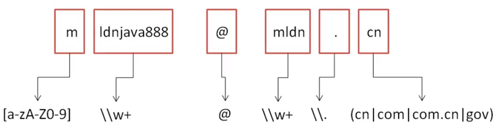

  ```java
  import java.text.ParseException;
  
  public class Demo {
      public static void main(String[] args) throws ParseException {
          String email = "chengruiPan@126-1.com";
          String regex = "[a-zA-Z0-9]\\w+@[a-zA-Z_0-9\\-]+\\.(cn|com|net|com.cn|gov)";
          System.out.println(email.matches(regex));
      }
  }
  ```


### 2.10.4  java.util.regex包支持

​	虽然在大部分情况下都可以利用String类实现正则的操作，但是也有一些情况下需要使用到 `java.util.regex` 开发包中提供的正则处理类。在该包中，一共定义有两个类：Pattern（正则表达式编译）、Matcher（正则表达式匹配）

* **Pattern 类**

  ​	Pattern 类提供有正则表达式的编译处理支持：public static Pattern complie(String regex)

  ​	同时也提供有字符串的拆分操作：public String[] split(CharSequence input)

  ```java
  import java.util.regex.Pattern;
  
  public class Demo {
      public static void main(String[] args) {
          String str = "gjkah(&()hjkhkjhi&()*_)&(^kjhhgiu5*^*(hjkklh";
          String regex = "[^a-zA-Z]+";
          Pattern pattern = Pattern.compile(regex);       // 编译正则表达式
          String[] result = pattern.split(str);
          for(String temp: result){
              System.out.println(temp);
          }
      }
  }
  ```

* **Matcher 类**

  ​	实现了正则匹配的处理类，这个类的对象实例化依靠Pattern类完成

  ​	Pattern 类提供的方法：public Matcher matcher(CharSequence input)

  ​	当获取了Matcher类的对象之后就可以利用该类中的方法进行如下操作：

  > * 正则匹配：public boolean matches()
  > * 字符串替换：public String replaceAll(String replacement)

  ```java
  import java.util.regex.Matcher;
  import java.util.regex.Pattern;
  
  public class Demo {
      public static void main(String[] args) {
          String str = "101";
          String regex = "\\d+";
          Pattern pattern = Pattern.compile(regex);       // 编译正则表达式
          Matcher mat = pattern.matcher(str);
          System.out.println(mat.matches());
      }
  }
  ```

  ​	如果纯粹的是以<u>拆分、替换、匹配</u>三种操作为例，根本用不到java.util.regex开发包，只依靠String类就都可以实现了。但是Matcher类中提供有一种分组的功能，而这种分组的功能是String不具备的：

  ```java
  import java.util.regex.Matcher;
  import java.util.regex.Pattern;
  
  public class Demo {
      public static void main(String[] args) {
          // 要求取出“#{内容}”标记中的所有内容
          String str = "INSERT INTO dept(deptno, dname, loc) VALUES (#{deptno}, #{dname}, #{loc})";
          String regex = "#\\{\\w+\\}";
          Pattern pat = Pattern.compile(regex);   // 编译正则表达式
          Matcher mat = pat.matcher(str);
          while(mat.find()) {             // 是否有匹配成功的内容
              System.out.println(mat.group(0).replaceAll("#|\\{|\\}", ""));
          }
      }
  }
  ```

  ​	java.util.regex 开发包，如果不是进行一些更为复杂的正则处理是很难使用到的，而String类所提供的功能只适合于正则的基本操作。


## 2.11 开发支持类库

### 2.11.1 UUID类

​	UUID 是一种生成无重复字符串的一个程序类，这个程序类的主要功能是根据时间戳实现一个自动的无重复的字符串定义。

​	获取UUID对象：public static UUID randomUUID()

​	根据字符串获取UUID内容：public static UUID fromString(String name)

```java
import java.util.UUID;

public class Demo {
    public static void main(String[] args) {
        System.out.println(UUID.randomUUID());	// UUID.randomUUID()返回的是UUID对象，打印时自动调用toString()方法
    }
}
```

​	在对一些文件进行自动命名处理的情况下，UUID类型非常好用。


### 2.11.2 Optional类

​	`Optional` 类的主要功能是进行null的相关处理，在以前进行程序开发的时候，如果为了防止程序之中出现空指向异常，可以追加对象是否为null的验证。

```java
class MessageUtil{
    private MessageUtil(){};
    public static IMessage getMessage(){
        return null;
    }
    public static void userMessage(IMessage msg){
        if(msg != null){                                // 在引用接受的一方，是被动的进行判断
            System.out.println(msg.getContent());
        }
    }
}

interface IMessage{
    public String getContent();
}

class MessageImpl implements IMessage{
    @Override
    public String getContent() {
        return "pcr";
    }
}

public class Demo {
    public static void main(String[] args) {
        MessageUtil.userMessage(MessageUtil.getMessage());
    }
}
```

​	为了解决这种被动的处理操作，在Java中提供有一个 Optional 的类，这个类可以实现null的处理操作，在这个类中，提供有如下的一些操作方法：

| 功能                         | 方法                                              |
| ---------------------------- | ------------------------------------------------- |
| 返回空数据                   | public static <T> Optional<T> empty()             |
| 获取数据                     | public T get()                                    |
| 保存数据，但是不允许出现null | public static <T> Optional<T> of(T value)         |
| 保存数据，允许为null         | public static <T> Optional<T> ofNullable(T value) |
| 空的时候返回其他数据         | public T orElse(T other)                          |


### 2.11.3 ThreadLocal类

​	在真正去了解 ThreadLocal 类的作用之前，先编写一个简单的程序做一个分析：

* **示例：现在定义这样一个结构**

  ```java
  class Message1{ // 要发送的消息体
      private String info;
      public void setInfo(String info) {
          this.info = info;
      }
      public String getInfo() {
          return info;
      }
  }
  
  class Channel1{     // 消息的发送通道
      private static Message1 message;
      private Channel1(){}
      public static void setMessage(Message1 message) {
          Channel1.message = message;
      }
  
      public static void send(){
          System.out.println("【消息发送】" + message.getInfo());
      }
  }
  
  public class Demo {
      public static void main(String[] args) {
          Message1 msg1 = new Message1();     // 实例化消息主体对象
          msg1.setInfo("保时捷911");                // 设置要发送的内容
          Channel1.setMessage(msg1);          // 设置要发送的消息
          Channel1.send();                    // 发送消息
      }
  }
  ```

  ​	对于当前的程序实际上采用的是一种单线程的模式进行处理的：

  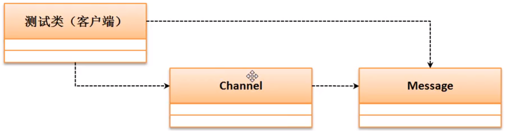

  ​	那么如果在多线程的状态下，能否实现完全一致的操作效果呢？为此我们将启动三个线程进行处理：

* **示例：多线程的影响**

  ```JAVA
  class Message1{ // 要发送的消息体
      private String info;
      public void setInfo(String info) {
          this.info = info;
      }
      public String getInfo() {
          return info;
      }
  }
  
  class Channel1{     // 消息的发送通道
      private static Message1 message;		// Message1 是静态属性
      private Channel1(){}
      public static void setMessage(Message1 message) {
          Channel1.message = message;
      }
  
      public static void send(){
          System.out.println("【" + Thread.currentThread().getName() + "、消息发送】" + message.getInfo());
      }
  }
  
  public class Demo {
      public static void main(String[] args) {
          // 三个线程对象
          new Thread(()->{
              Message1 msg1 = new Message1();     // 实例化消息主体对象
              msg1.setInfo("保时捷911-A");                // 设置要发送的内容
              Channel1.setMessage(msg1);          // 设置要发送的消息
              Channel1.send();                    // 发送消息
          }, "消息发送者A").start();
          new Thread(()->{
              Message1 msg1 = new Message1();     // 实例化消息主体对象
              msg1.setInfo("保时捷912-B");                // 设置要发送的内容
              Channel1.setMessage(msg1);          // 设置要发送的消息
              Channel1.send();                    // 发送消息
          }, "消息发送者B").start();
          new Thread(()->{
              Message1 msg1 = new Message1();     // 实例化消息主体对象
              msg1.setInfo("保时捷913-C");                // 设置要发送的内容
              Channel1.setMessage(msg1);          // 设置要发送的消息
              Channel1.send();                    // 发送消息
          }, "消息发送者C").start();
      }
  }
  // 出现如下的输出
  // 【消息发送者A、消息发送】保时捷913-C
  // 【消息发送者C、消息发送】保时捷913-C
  // 【消息发送者B、消息发送】保时捷912-B
  ```

  ​	此时，多线程之间的消息传输相互影响（出现了线程名与消息不匹配的情况），出现了线程不同步的问题

  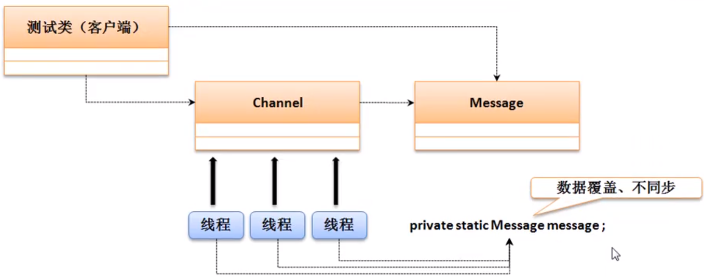

  

  ​	在保持Channel（所有消息发送的通道）核心结构不改变的情况下，需要考虑到每个线程的独立操作问题。发现对于Channel类而言，除了保留要发送的消息之外，还应该多存放有每一个线程的标记，那么这个时候就可以通过`ThreadLocal`类来存放数据。在ThreadLocal类中提供有如下的操作方法：

  | 功能     | 方法                     |
  | -------- | ------------------------ |
  | 构造方法 | public ThreadLocal()     |
  | 设置数据 | public void set(T value) |
  | 取出数据 | public T get()           |
  | 删除数据 | public void remove()     |

  ​	ThreadLocal类中，存放着线程对象和数据对象，线程对象对外是隐藏的，不需要我们人为去定义或记录

  

  ​	最终的程序结构如下：

  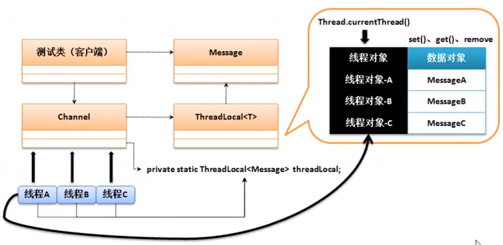

* **示例：ThreadLocal解决线程同步问题**

  ```java
  class Message1{
      private String info;
      public void setInfo(String info) {
          this.info = info;
      }
      public String getInfo() {
          return info;
      }
  }
  
  class Channel1{
      private final static ThreadLocal<Message1> THREADLOCAL = new ThreadLocal<Message1>();   // 更改Channel1中存放的数据，由Message1变为ThreadLocal<Message1>
      private Channel1(){}
      public static void setMessage(Message1 message) {
          THREADLOCAL.set(message);       // 向 ThreadLocal 中保存数据
      }
      public static void send(){
          System.out.println("【" + Thread.currentThread().getName() + "、消息发送】" + THREADLOCAL.get().getInfo());    // 根据当前线程对象去取出
      }
  }
  
  public class Demo {
      public static void main(String[] args) {
          new Thread(()->{
              Message1 msg1 = new Message1();
              msg1.setInfo("保时捷911-A");
              Channel1.setMessage(msg1);
              Channel1.send();
          }, "消息发送者A").start();
          new Thread(()->{
              Message1 msg1 = new Message1();
              msg1.setInfo("保时捷912-B");
              Channel1.setMessage(msg1);
              Channel1.send();
          }, "消息发送者B").start();
          new Thread(()->{
              Message1 msg1 = new Message1();
              msg1.setInfo("保时捷913-C");
              Channel1.setMessage(msg1);
              Channel1.send();                    
          }, "消息发送者C").start();
      }
  }
  // 最后三个线程的线程和消息是完全对应的，不会出现不匹配的非同步问题
  ```

  

### 2.11.4 定时器

​	定时器的主要操作是进行定时任务的处理。在Java中提供有定时任务的支持，但是这种任务的处理只是实现了一种间隔触发的操作。

​	如果要想实现定时的处理操作，主要需要一个定时操作的主体类，以及一个定时任务的控制。可以使用两个类来实现：

> * `java.util.TimerTask` 类： 实现定时任务处理 , TimerTask 是一个抽象类
>
> 
>
> * `java.util.Timer` 类： 进行任务的启动，启动的方法：
>
>   > * 延迟毫秒数启动：public void schedule(TimerTask task, long delay)              	 延迟单位为毫秒
>   > * 延迟到某日期启动：public void schedule(TimerTask task, Date time)
>   > * 间隔触发：public void scheduleAtFixedRate(TimerTask task, long delay, long period)

* **示例：实现定时任务处理**

  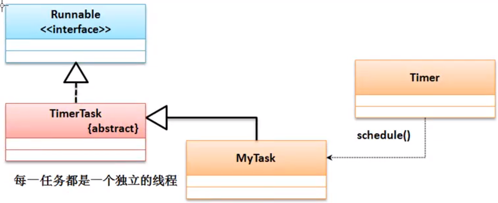

  ```java
  import java.util.Timer;
  import java.util.TimerTask;
  
  class MyTask extends TimerTask{     // 任务主体
      @Override
      public void run() {   // TimerTask继承自Runnable接口
          System.out.println(Thread.currentThread().getName() + "、定时任务执行，当前时间：" + System.currentTimeMillis());
      }
  }
  
  public class Demo {
      public static void main(String[] args) {
          Timer timer = new Timer();
  //        timer.schedule(new MyTask(), 3000);	// 延迟3秒后执行
          timer.scheduleAtFixedRate(new MyTask(), 1000, 3000);   // 1秒后启动，之后每间隔2秒执行一次
      }
  }
  ```

  ​	这种定时是由JDK最原始的方式提供的支持，实际的开发之中利用此类方式进行的定时处理实现的代码会非常的复杂。


### 2.11.5 Base64加密与解密

​	`Base64` 是用来做加密和解密处理的操作类，该类中提供有两个内部类：

> * Base64.Encoder：加密
>
>   ​	public byte[] encode(byte[] src)
>
> * Base64.Decoder：解密
>
>   ​	public byte[] decode(String src)

* **示例：加密与解密处理**

  ```java
  import java.util.Base64;
  
  public class Demo {
      public static void main(String[] args) {
          String msg = "Audi";
          String encMsg = new String(Base64.getEncoder().encode(msg.getBytes()));     // 加密
          System.out.println(encMsg);
          String oriMsg = new String(Base64.getDecoder().decode(encMsg));             // 解密
          System.out.println(oriMsg);
      }
  }
  ```

  ​	虽然 `Base64`可以实现加密与解密的处理，但是由于其是一个公版的算法，所以如果直接对数据进行加密往往并不安全，那么最好的做法是使用盐值操作：

  ```java
  import java.util.Base64;
  
  public class Demo {
      public static void main(String[] args) {
          String salt = "加盐";
          String msg = "Audi" + "{" + salt + "}";
          String encMsg = new String(Base64.getEncoder().encode(msg.getBytes()));     // 加密
          System.out.println(encMsg);
          String oriMsg = new String(Base64.getDecoder().decode(encMsg));             // 解密
          System.out.println(oriMsg);
      }
  }
  ```

  ​	即便现在有盐值，实际上发现加密的保密性也不是很好，更好的方法是进行多次加密：

  ```java
  import java.util.Base64;
  
  class StringUtil{
      private static final String SALT = "{公版盐值}";      // 公共的盐值
      private static final int REPEAT = 5;                // 默认的加密重复次数
      /**
       * 加密处理
       * @param str       要加密的字符串，需要与盐值整合
       * @return          加密后的数据
       */
      public static String encode(String str){           // 加密处理
          String temp = str + SALT ;                   // 盐值对外不公布
          byte[] data = temp.getBytes();      // 将字符串变为字节数组
          for(int x=0; x< REPEAT; x++){
              data = Base64.getEncoder().encode(data);        // 重复加密
          }
          return new String(data);
      }
  
      /**
       * 解密
       * @param str   要解密的内容
       * @return      解密后的原始数据
       */
      public static String decode(String str){
          byte[] data = str.getBytes();
          for(int x=0; x<REPEAT; x++){
              data = Base64.getDecoder().decode(data);
          }
          return new String(data).replaceAll("\\{\\W+\\}", "");
      }
  }
  
  public class Demo {
      public static void main(String[] args) {
          String str = StringUtil.encode("ph764134674");
          System.out.println(str);
          String oriStr = StringUtil.decode(str);
          System.out.println(oriStr);
      }
  }
  ```


## 2.12 类库使用案例

### 2.13.1 StringBuffer使用

* **示例**

  ​	定义一个StringBuffer类对象，然后通过append()方法向对象中添加26个小写字母，要求每次只添加一个，共添加26次，然后按照逆序的方式输出，并且可以删除前5个字符。

  ```java
  public class Demo {
      public static void main(String[] args) {
          StringBuffer stringBuffer = new StringBuffer();
          for(int x='a'; x<='z'; x++){
              stringBuffer.append((char) x);
          }
          stringBuffer.reverse();     // 反转处理
          stringBuffer.delete(0, 5);
          System.out.println(stringBuffer.toString());
      }
  }
  ```


### 2.13.2 随机数组

* **示例：利用Random类产生5个1-30之间（包括1和30）的随机整数**

  ​	说明：Random 产生随机数的操作中会产生数字0

  ```java
  import java.util.Arrays;
  import java.util.Random;
  
  class NumberFactory{
      private static Random random = new Random();
      /**
       * 通过随机数来生成一个数组的内容，该内容不包括0
       * @param len       要开辟的数组大小
       * @return          包含有随机数的内容
       */
      public static int[] create(int len){
          int data[] = new int [len];
          int foot = 0;
          while(foot<data.length){
              int num = random.nextInt(30);
              if(num!=0){
                  data[foot++] = num;     //保存数据
              }
          }
          return data;
      }
  }
  
  public class Demo {
      public static void main(String[] args) {
          int[] result = NumberFactory.create(10);
          System.out.println(Arrays.toString(result));
      }
  }
  ```

  


# 三、比较器

​	所谓的比较器指的就是进行大小关系的确定判断，首先分析一下比较器存在的意义：

## 3.1 比较器问题的引出

​	如果要进行数组操作，肯定使用 `java.util.Arrays`的操作类完成，这个类里面提供有绝大部分的数组操作支持，同时在这个类中还提供有一种对象数组的排序支持：public static void sort(Object[] a)

* **示例：实现对象数组的排序**

  ```java
  import java.util.Arrays;
  
  public class Demo {
      public static void main(String[] args) {
          Integer[] data = new Integer[]{15,6,7,6,45,86,13,47};
          Arrays.sort(data);
          System.out.println(Arrays.toString(data));
      }
  }
  ```

  ​	同样，如果给定的是String类型的对象数组，那么也是可以进行排序处理的：

  ```java
  import java.util.Arrays;
  
  public class Demo {
      public static void main(String[] args) {
          String[] data = new String[]{"x","g","i","q","l","y",};
          Arrays.sort(data);
          System.out.println(Arrays.toString(data));
      }
  }
  ```

  ​	问题：`java.lang.Integer`和`java.lang.String`两个类都是由系统提供的程序类，那么如果现在有一个自定义类需要实现排序处理呢？

* **示例：采用自定义类型进行排序**

  ```java
  import java.util.Arrays;
  
  class Person{
      private String name;
      private int age;
  
      public Person(String name, int age) {
          this.name = name;
          this.age = age;
      }
      @Override
      public String toString() {
          return "【Person类对象】姓名：" + this.name + "、年龄：" + this.age + "\n";
      }
      // 无参构造、setter、getter这里省略不写了
  }
  
  public class Demo {
      public static void main(String[] args) {
          Person[] per = new Person[]{
              new Person("小陈-A", 22),
              new Person("小陈-B", 26),
              new Person("小陈-C", 18),
          };
          Arrays.sort(per);
          System.out.println(Arrays.toString(per));
      }
  }
  ```

  ​	以上程序编译时没有错误，但是运行时出现异常：

  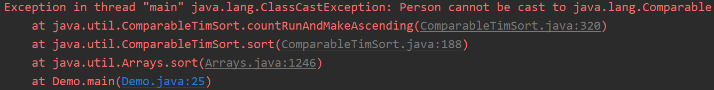

  ​	任意的一个类，默认情况下是无法使用系统内部的类实现数组排序或比较功能的，不能比较的原因在于我们没有明确的指定该如何进行比较的定义（没有比较规则），在Java中为了统一比较规则的定义，所以提供有比较器的接口：`Comparable`接口。


## 3.2 Comparable 比较器

​	通过上节分析可以发现如果要实现对象的比较肯定需要有比较器来制定比较规则，而比较的规则就通过Comparable接口来实现，对于Comparable而言，需要清楚其基本的定义结构：`public int compareTo(T o)`

```java
public interface Comparable<T> {
    /**
     * 实现对象间的比较
     * @param o     要比较的对象
     * @return      当前对象比传入的对象小，返回负数，如果大于，返回整数，相等则返回0
     */
    public int compareTo(T o);
}
```

* **示例：实现自定义对象数组排序操作**

  ```java
  import java.util.Arrays;
  
  class Person implements Comparable<Person>{
      private String name;
      private int age;
  
      @Override
      public int compareTo(Person per) {
          return this.age - per.age;
      }
  
      public Person(String name, int age) {
          this.name = name;
          this.age = age;
      }
      @Override
      public String toString() {
          return "【Person类对象】姓名：" + this.name + "、年龄：" + this.age + "\n";
      }
  
      // 无参构造、setter、getter这里省略不写了
  }
  
  public class Demo {
      public static void main(String[] args) {
          Person[] per = new Person[]{
              new Person("小陈-A", 22),
              new Person("小陈-B", 26),
              new Person("小陈-C", 18),
          };
          Arrays.sort(per);			// public static void sort(Object[] a)
          System.out.println(Arrays.toString(per));
      }
  }
  ```

  ​	排序中，只需要有一个compareTo()方法进行排序规则的定义，而后整个Java系统中，就可以为其实现排序处理。


## 3.3 Comparator 比较器

​	`Comparator` 属于一种挽救的比较器支持，其主要目的是解决一些没有使用`Comparable`排序的类的对象数组排序。

* **示例：现在程序项目已经开发完成了，并且由于先期的设计并没有考虑到所谓的比较器功能**

  ```java
  class Person{
      private String name;
      private int age;
  
      public Person(String name, int age) {
          this.name = name;
          this.age = age;
      }
      @Override
      public String toString() {
          return "【Person类对象】姓名：" + this.name + "、年龄：" + this.age + "\n";
      }
  
      // 无参构造、setter、getter这里省略不写了
  }
  ```

  ​	后来经过了若干版本的迭代更新之后，发现需要对Person类进行排序处理，但是又不能去修改Person类（意味着无法实现Comparable接口），所以这时就需要采用一种挽救的形式来实现比较——Comparator。

  ​	在 `java.util.Comparator` 中，最初只定义有一个排序的 compare() 方法：`public int compare(T o1, T o2)`		但是后来持续发展又出现了许多的static方法。

* **示例：使用Comparator定义排序规则类**

  ```java
  class PersonComparator implements Comparator<Person>{
      @Override
      public int compare(Person p1, Person p2) {
          return p1.getAge() - p2.getAge();
      }
  }
  ```

  ​	完成程序代码：

  ```java
  import java.util.Arrays;
  import java.util.Comparator;
  
  class Person{
      private String name;
      private int age;
  
      public Person(String name, int age) {
          this.name = name;
          this.age = age;
      }
      @Override
      public String toString() {
          return "【Person类对象】姓名：" + this.name + "、年龄：" + this.age + "\n";
      }
  
      public String getName() {
          return name;
      }
      public void setName(String name) {
          this.name = name;
      }
      public int getAge() {
          return age;
      }
      public void setAge(int age) {
          this.age = age;
      }
  }
  
  class PersonComparator implements Comparator<Person>{
      @Override
      public int compare(Person p1, Person p2) {
          return p1.getAge() - p2.getAge();
      }
  }
  
  public class Demo {
      public static void main(String[] args) {
          Person[] per = new Person[]{
                  new Person("小陈-A", 22),
                  new Person("小陈-B", 26),
                  new Person("小陈-C", 18),
          };
          Arrays.sort(per, new PersonComparator());	//public static <T> void sort(T[] a, Comparator<? super T> c)
          System.out.println(Arrays.toString(per));
      }
  }
  ```

  ​	对于这种排序的操作，如果不是必须的情况下，强烈建议不要使用`Comparator`，**最好以`Comparable`为主。**

* **面试题：请解释 Comparable 与 Comparator 的区别？**
  
  1. `java.lang.Comparable`是在类定义的时候去实现该接口，主要用于定义排序规则，里面只有`compareTo()`方法
  2. `java.util.Comparator`是挽救的比较器操作，<u>需要设置单独的比较器规则类</u>实现排序，里面有`compare()`方法和其他很多方法

# 四、IO操作

​	Java中在`java.io.File`中提供有对文件操作的支持，如果要进行`File`类的操作，必须要提供完整的路径，而后调用相应的方法。

## 4.1 File类基本操作

​	`File`类是Comparable接口的子类，所以File类的对象是可以进行排序处理的。在进行`File`类处理的时候，需要为其设置访问路径，对于路径的配置，主要通过`File`类的构造方法：

> * 构造方法：==public File(String pathname)==						设置要操作的完整路径
> * 构造方法：public File(String parent, String child)          设置父路径与子目录

​	进行文件的基本操作，使用如下方法：

> * 判断文件是否存在：==public boolean exists()==
> * 创建新的文件：public boolean createNewFile() throws IOException		返回true表示不存在该文件名，可以创建该文件；返回false表示该目录中存在该文件名，不可以重复创建
> * 删除文件：==public boolean delete()==

* **示例：使用`File`类创建一个文件**

  ```java
  import java.io.File;
  import java.io.IOException;
  
  public class Demo {
      public static void main(String[] args) throws IOException {
          File file = new File("d:\\File.txt");      // 注意这里是两个“\”
          if(file.exists()){  // 文件已存在
              file.delete();  // 删除文件
              System.out.println("删除文件成功！");
          }
          System.out.println(file.createNewFile());       // 创建新的文件
      }
  }
  ```


## 4.2 File 类操作深入

* **不同系统的路径分隔符**

  ​	在实际的软件开发和运行过程中，往往会在Windows中进行项目开发，在项目部署时基于Linux以保证生产环节的安全性。

  ​	在不同的操作系统中会存在有不同的路径分隔符：Windows分隔符“\”，Linux分隔符“/”，所以在最初进行开发时就必须考虑不同系统环境下的分隔符的问题，所以为了解决此问题，File类提供有一个常量：public static final String separator，所以规范的路径应该如下：

  ```java
  File file = new File("d:" + File.separator + "File.txt");
  ```

  ​	但是随着系统的适应性的不断加强，对于当前的路径操作，也可以随意使用了。（Windows系统当中也可以使用“/”作为分隔符，或者Linx也可以使用"\\"作为分隔符）

*  **注意事项**

  ​	在进行文件创建时有一个重要前提：文件的父路径必须首先存在

  > * ==获取父路径：public File getParentFile()==
  >
  > * ==创建目录：public boolean mkdirs()==

  * 示例

    ```java
    import java.io.File;
    import java.io.IOException;
    
    public class Demo {
        public static void main(String[] args) throws IOException {
            File file = new File("d:"+ File.separator + "FileCreate" + File.separator  +  "test" + File.separator + "demo" + File.separator  +"File.txt");
            if(!file.getParentFile().exists()){     // 目录不存在
                file.mkdirs();              // 创建目录
            }
            if(file.exists()){  // 文件已存在
                file.delete();  // 删除文件
                System.out.println("删除文件成功！");
            }
            System.out.println(file.createNewFile());       // 创建新的文件
        }
    }
    ```

    ​	这种判断并且建立父目录的操作在很多情况下可能只需要一次，但是如果将这个判断一直停留在代码中，那么会造成时间复杂度的提升，所以这个时候如果要想提升性能，请先保证目录已经创建。


## 4.3 获取文件信息

​	除了可以进行文件的操作之外，也可以通过`File`类来获取一些文件本身提供的信息。

| 功能                   | 方法                                              |
| ---------------------- | ------------------------------------------------- |
| 文件是否可读           | public boolean canRead()                          |
| 文件是否可写           | public boolean canWrite()                         |
| 获取文件长度           | public long length()               返回的是字节数 |
| 最后一次修改的日期时间 | public long lastModified()                        |
| 判断是否是目录         | public boolean isDirectory()                      |
| 判断是否是文件         | public boolean isFile()                           |
| 列出目录内容           | public File[] listFiles()                         |

* **列出目录结构**

  ​	列出指定目录中的全部文件：可以由开发者任意设置一个目录的路径，之后将这个目录中所有的文件信息全部列出，包括子目录中的所有文件，在这样的处理情况下，最好的做法是利用递归的形式来完成。

  ```java
  import java.io.File;
  import java.io.IOException;
  
  public class Demo {
      public static void main(String[] args) throws IOException {
          File file = new File("D:" + File.separator);
          listDir(file);
      }
  
      public static void listDir(File file){
          if(file.isDirectory()){     // 是一个目录
              File[] results = file.listFiles();
              if(results != null){
                  for(int x=0; x<results.length; x++){
                      listDir(results[x]);       // 继续依次判断
                  }
              }
          }
          System.out.println(file);   // 获得完整路径
      }
  }
  ```

* **示例：批量重命名**

  ​	编写程序，程序运行时输入目录名称，并把该目录下的所有文件名后缀改为.txt。

  ​	对于这类操作，必须设置一些假设的约定，能够重命名的文件都是有后缀的，如果没有后缀的路径，则为其追加路径，如果有后缀的路径，则必须以最后一个“.”进行截取

  ```java
  import java.io.File;
  import java.io.IOException;
  
  public class Demo {
      public static void main(String[] args) throws IOException {
          File file = new File("H:" + File.separator + "javaFileRename");		// 定义一个目录
          renameDir(file);
      }
  
      public static void renameDir(File file) {
          if (file.isDirectory()) {     // 是一个目录
              File[] results = file.listFiles();      // 列出子目录中的内容
              if (results != null) {
                  for (int x = 0; x < results.length; x++) {
                      renameDir(results[x]);
                  }
              }
          } else {
              if (file.isFile()) {         // 如果是文件则进行重命名
                  String fileName = file.getName();
                  if(fileName.contains(".")){
                      fileName = fileName.substring(0, fileName.lastIndexOf(".")) + ".txt";
                  }
                  else {
                      fileName = fileName + ".txt";
                  }
                  File newFile = new File(file.getParentFile(), fileName);       // 新的文件名称
                  file.renameTo(newFile);     // 重命名方法 renameTo(file)
              }
          }
      }
  }
  ```


## 4.4 字节流与字符流

### 4.4.1 流的基本概念

​	在`java.io`包中，`File`类是唯一一个与文件本身有关的程序类，但是File只能够操作本身，而不能操作文件的内容。在实际的开发中，IO操作的核心意义在于：输入与输出操作。对于程序而言，输入与输出可能来自于不同的环境，例如：通过电脑连接服务器进行浏览的时候，实际上此时客户端发出了一个信息，而后服务器接收到客户端接收到此信息之后进行回应处理。

​	对于服务器或者客户端而言，实际传递的就是一种数据流的处理形式，而所谓的数据流指的就是字节数据。而对于这种字节流的处理形式，在`java.io`包中提供有两类支持：

> * 字节处理流：OutputStream（输出字节流）		InputStream(输入字节流)
> * 字符处理流：Writer(输出字符流)                          Reader(输入字符流)

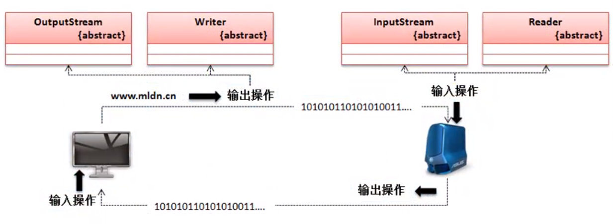

​		所有的流操作，都应该采用如下统一的步骤进行，下面以文件处理的流程为例：

> * 如果要进行的是文件的读写操作，则一定要通过`File`类找到一个文件路径
> * ==通过字节流或字符流的子类为父类对象实例化==
> * 利用字节流或字符流中的方法实现数据的输入与输出操作
> * 流的操作属于资源的操作，资源操作必须进行关闭处理


### 4.4.2 字节输出流：OutputStream

​	字节的数据是以`byte`类型为主实现的操作，在进行字节内容输出的时候可以使用OutputStream类完成，这个类的基本定义如下：

```java
public abstract class OutputStream extends Object implements Closeable, Flushable
```

​	首先可以发现这个类实现了两个接口，于是基本的对应关系如下：

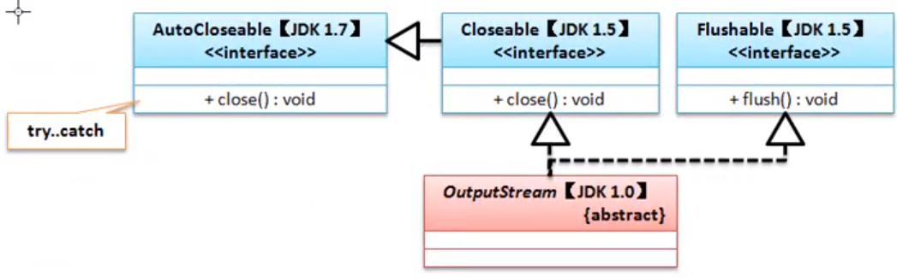

​	`OutputStream`类定义的是一个公共的输出操作标准，而在这个操作标准中，一共定义有三个内容输出的方法：

| No.  | 方法                                                         | 描述             |
| ---- | ------------------------------------------------------------ | ---------------- |
| 01   | public abstract void write(int b) throws IOException         | 输出单个字节数据 |
| 02   | public void write(byte[] b) throws IOException               | 输出一组字节数据 |
| 03   | ==public void write(byte[] b, int off, int len) throws IOException== | 输出部分字节数据 |

​	但是需要注意的一个核心问题在于：`OutputStream`是一个抽象类，而这个抽象类如果想要获得实例化对象，按照传统的认识，应该通过子类的向上转型完成，如果当前要进行的是文件处理操作，则可以使用FileOutputStream的子类。

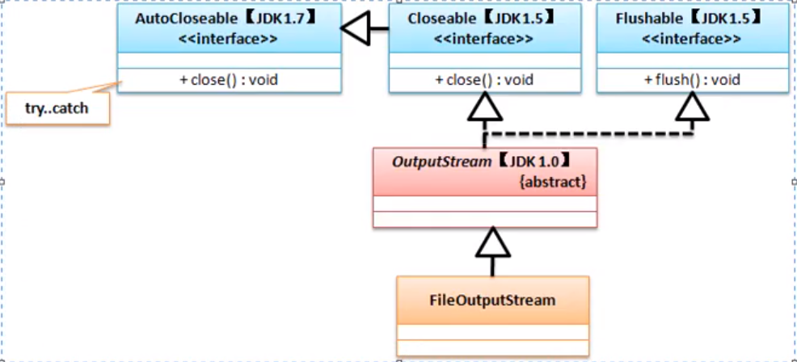

​	因为最终都需要发生向上转型的处理，所以对于此时的`FileOutputStream`子类，核心的关注点就可以放在构造方法上，它提供有两个构造方法：

> * 【覆盖】构造方法：`public FileOutputStream(File file) throws FileNotFoundException`
> * 【追加】构造方法：`public FileOutputStream(File file, boolean append) throws FileNotFoundException`

* **示例：使用OutputStream类实现内容的输出**

  ```java
  import java.io.File;
  import java.io.FileOutputStream;
  import java.io.IOException;
  import java.io.OutputStream;
  
  public class Demo {
      public static void main(String[] args) throws IOException {
          File file = new File("H:" + File.separator + "javaDemo" + File.separator +
                  "OutputStream" + File.separator + "FileOutputStream.txt");        // 指定要操作的文件路径
          if(!file.getParentFile().exists()){                         // 父目录不存在
              file.getParentFile().mkdirs();                          // 创建父目录，注意不是创建文件，而是创建文件所在的父目录
          }
          OutputStream outputStream = new FileOutputStream(file);     // 通过子类实例化
          String str = "pcr";     // 要输出的内容
          outputStream.write(str.getBytes());     // 将字符串变为字节数组并输出
          outputStream.close();       // 关闭资源
      }
  }
  ```

  ​	本程序是采用了最为标准的形式实现了输出的操作处理，并且在整体的处理之中，只有并没有创建文件，而在执行后可以发现文件可以自动帮助用户创建。另外需要提醒的是，由于`OutputStream`子类也属于`AutoCloseable`接口的子类，所以对于`close()`方法也可以简化使用。

* **示例：自动关闭处理**

  ```java
  import java.io.File;
  import java.io.FileOutputStream;
  import java.io.IOException;
  import java.io.OutputStream;
  
  public class Demo {
      public static void main(String[] args) throws IOException {
          File file = new File("H:" + File.separator + "javaDemo" + File.separator +
                  "OutputStream" + File.separator + "FileOutputStream.txt");        
          if(!file.getParentFile().exists()){                         
              file.getParentFile().mkdirs();                          
          }
          try {	// 实现自动的关闭资源处理，因为OutputStream是AutoCloseable接口的子类
              OutputStream outputStream = new FileOutputStream(file, true);     // 通过子类实例化，第二个参数表示是否为追加（默认为false——覆盖）
              String str = "pcr\r\n";     // 要输出的内容,  "\r\n"为标准换行
              outputStream.write(str.getBytes());     
          } catch (IOException e){
              e.printStackTrace();
          }
      }
  }
  ```

  ​	是否使用自动的关闭取决于项目的整体结构，需要主要的是，整个程序最终输出了一组的字节数据，但是不要忘记，`OutputStream`中定义的输出方法共有三个。


### 4.4.3 InputStream字节输入流

​	`InputStream`类主要实现的就是字节数据读取，该类定义如下：

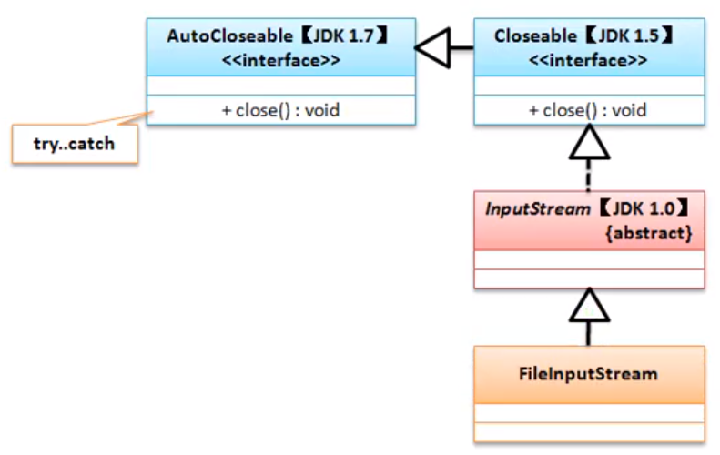

​	在`InputStream`类中定义有如下几个核心方法：

| No.  | 方法                                                         | 描述                                                         |
| ---- | ------------------------------------------------------------ | ------------------------------------------------------------ |
| 1    | public abstract int read() throws IOException                | 读取单个字节数据，如果现在已经读取到底了，返回-1             |
| 2    | ==public int read(byte[] b) throws IOException==             | 读取一组字节数据，返回的是读取的字节数，如果没有数据可读取了，则返回-1 |
| 3    | public int read(byte[] b, int off, int len) throws IOException | 读取一组字节数据的部分内容                                   |

​	`InputStream`类属于一个抽象类，此时应该依靠它的子类来实例化对象，如果要从文件中读取则使用`FileInputStream`子类。`InputStream`的构造方法：

> * 构造方法：`public FileInputStream(File file) throws FileNotFoundException`

* **示例：FileInputStream读取文件**

  ```java
  import java.io.*;
  
  public class Demo {
      public static void main(String[] args) throws IOException {
          File file = new File("H:" + File.separator + "javaDemo" + File.separator +
                  "OutputStream" + File.separator + "FileOutputStream.txt");        // 指定要操作的文件路径
          InputStream inputStream = new FileInputStream(file);
          byte[] data = new byte[1024];   // 开辟一个字节数组的缓冲区读取数据
          int len = inputStream.read(data);         // 读取数据，数据全部保存在字节数组之中，并返回读取到的字节个数
          System.out.println("【" + new String(data, 0, len) + "】");
          inputStream.close();
      }
  }
  ```

  ​	对于字节输入流中，最为麻烦的问题在于：使用read()方法读取的时候，只能够以字节数组为主进行接收。


### 4.4.4 Writer字符输出流

​	使用`OutputStream`字节输出流进行数据输出的时候使用的都是字节类型的数据，而很多的情况下，字符串的输入是比较方便的，对于`java.io`包而言，在JDK1.1的时候又推出了字符（char）输出流：Writer。`Writer`类的定义如下：

```java
public abstract class Writer extends Object implements Appendable, Closeable, Flushable
```


​	在`Writer`类中提供有许多的输出操作方法，重点来看两个：

| 功能         | 方法                                              |
| ------------ | ------------------------------------------------- |
| 输出字符数组 | public void write(char[] cbuf) throws IOException |
| 输出字符串   | public void wirte(String str) throws IOException  |

* **示例：使用`Writer`类输出**

  ```java
  import java.io.*;
  
  public class Demo {
      public static void main(String[] args) throws IOException {
          File file = new File("H:" + File.separator + "javaDemo" + File.separator +
                  "Writer" + File.separator + "FileWriter.txt");        // 指定要操作的文件路径
          if(!file.getParentFile().exists()){  // 如果父目录不存在
              file.getParentFile().mkdirs();  // 创建父目录
          }
  //        Writer out = new FileWriter(file);  // 覆盖
          Writer out = new FileWriter(file, true);  // 追加
          String str = "pcrtest";
          out.write(str);
          out.append("中国人民万岁");		// 可以很方便的在Writer对象上追加
          out.close();
      }
  }
  ```

  ​	使用`Writer`输出的最大优势在于可以直接利用字符串完成。`Writer`是字符流，字符处理的优势在于中文数据上。


### 4.4.5 Reader 字符输入流

​	`Reader`是实现字符输入流的一种类型，其本身属于一个抽象类，这个类的定义如下：

```java
public abstract class Reader extends Object implements Readable, Closeable
```

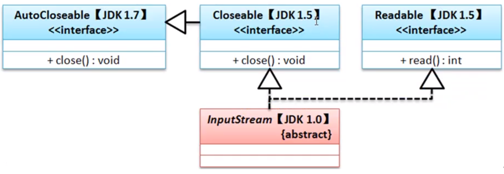

​	`Reader`类中并没有像`Writer`类一样提供有整个字符串的输入处理操作，只能够利用字符数组来实现接收：

> 接收数据：public int read (char[] cbuf) throws IOException

* **示例：Reader实现数据读取**

  ```java
  import java.io.*;
  
  public class Demo {
      public static void main(String[] args) throws IOException {
          File file = new File("H:" + File.separator + "javaDemo" + File.separator +
                  "Writer" + File.separator + "FileWriter.txt");        // 指定要操作的文件路径
          if(file.exists()){
              Reader in = new FileReader(file);
              char[] data = new char[1024];		// 开辟一个字符数组的缓冲区读取数据
              int len = in.read(data);// 读取数据，数据全部保存在字符数组之中，并返回读取到的字符个数
              System.out.println("读取内容为：" + new String(data, 0, len));
              in.close();
          }
      }
  }
  ```

  ​	字符流读取的时候只能够按照字符数组的形式来实现处理操作。


### 4.4.6 字节流与字符流的区别

​	重点来看一下字节流和字符流的输出处理操作的区别。在使用`OutputStream`和`Writer`输出的最后发现都使用了close()方法进行了关闭处理。

​	在使用`OutputStream`类输出的时候如果没有使用close()方法关闭输出流，内容依然可以实现正常的输出；但如果在使用`Writer`的时候如果没有使用close()方法关闭输出流，那么此时内容将无法进行输出，因为`Writer`==使用到了缓冲区==，当使用了close()方法的时候实际上会出现强制刷新缓冲区的操作，所以这个时候会将内容进行输出，如果没有关闭，那么将无法进行输出操作，所以此时如果在不关闭的情况下， 要想将全部的内容输出可以使用flush()的方法强制性清空。

* **示例：使用Writer并强制性清空**

  ```java
  import java.io.*;
  
  public class Demo {
      public static void main(String[] args) throws IOException {
          File file = new File("H:" + File.separator + "javaDemo" + File.separator +
                  "Writer" + File.separator + "FileWriter.txt");        // 指定要操作的文件路径
          if(!file.getParentFile().exists()){  // 如果父目录不存在
              file.getParentFile().mkdirs();  // 创建父目录
          }
          Writer out = new FileWriter(file);
          String str = "pcrtest";
          out.write(str);
  //        out.close();      // Writer类如果最后不调用close()方法，将没有内容输出，因为它用到了缓冲区
          out.flush();        // 使用flush()方法强制刷新
      }
  }
  ```

  ​	字节流在进行处理的时候并不会使用到缓冲区，而字符流会使用到缓冲区。另外使用缓冲区的字符流更加适合于中文数据的处理，所以在日后的程序开发之中，如果要涉及到包含有中文信息的输出，一般都会使用字符流处理，但是从另外一方面来讲，字节流和字符流的基本处理形式是相似的，由于IO很多情况下都是进行数据的传输使用（二进制），所以本次的讲解将以字节流为主。


### 4.4.7 字节流和字符流的转换

​	在`java.io`包中提供有两个类：`OutputStreamWriter`、`InputStreamReader`，两个类的定义如下：

| 类       | OutputStreamWriter                             | InputStreamReader                             |
| -------- | ---------------------------------------------- | --------------------------------------------- |
| 定义     | public class OutputStreamWriter extends Writer | public class InputStreamReader extends Reader |
| 构造方法 | public OutputStreamWriter(OutputStream out)    | public InputStreamReader(InputStream in)      |

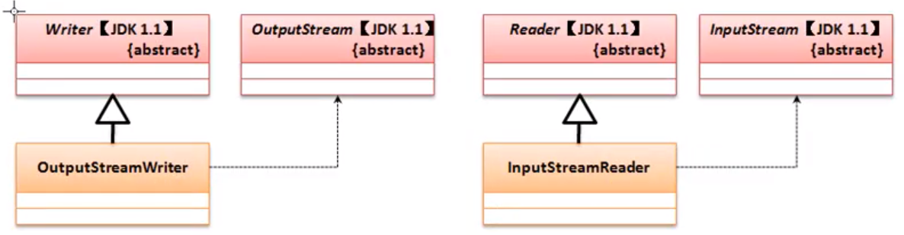

​	通过类的继承结构与构造方法可以发现，所谓的转换处理就是将接收到的字节流对象向上转型变为字符流。

* **示例:以输出流为例**

  

  ```java
  import java.io.*;
  
  public class Demo {
      public static void main(String[] args) throws IOException {
          File file = new File("H:" + File.separator + "javaDemo" + File.separator +
                  "OutputStreamWriter" + File.separator + "OutputStreamWriter.txt");        // 指定要操作的文件路径
          if(!file.getParentFile().exists()){  // 如果父目录不存在
              file.getParentFile().mkdirs();  // 创建父目录
          }
          OutputStream output = new FileOutputStream(file);
          Writer out = new OutputStreamWriter(output);    // 将接收到的字节流变为字符流
          out.write("www.baidu.com");     // 直接输出字符串，字符流适合于处理中文
          out.close();
      }
  }
  ```

​	讲解转换流的主要目的基本上不是为了让开发者去记住它，而是知道有这样一种功能，但同时更多的是<u>需要进行结构的分析处理</u>。通过之前的字节流与字符流的一系列的分析之后，会发现`OutputStream`类有`FileOutStream`直接子类，`InputStream`类有`FileInputStream`直接子类，但是来观察`FileWriter`、`FileReader`类的继承关系：

| FileWriter                                         | FileReader                                        |
| -------------------------------------------------- | ------------------------------------------------- |
| public class FileWriter extends OutputStreamWriter | public class FileReader extends InputStreamReader |

> * FileWriter继承结构：
>
>   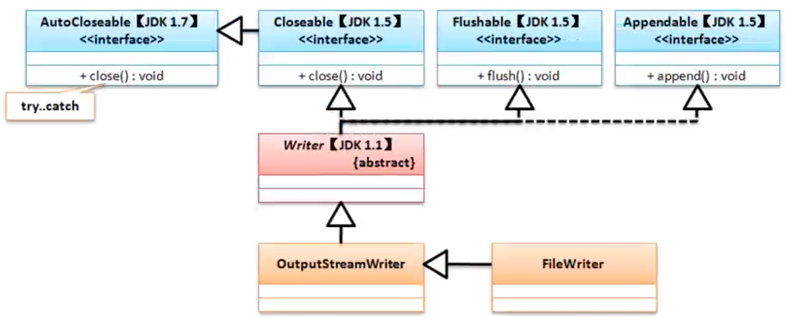
>
> * FileReader继承结构：
>
>   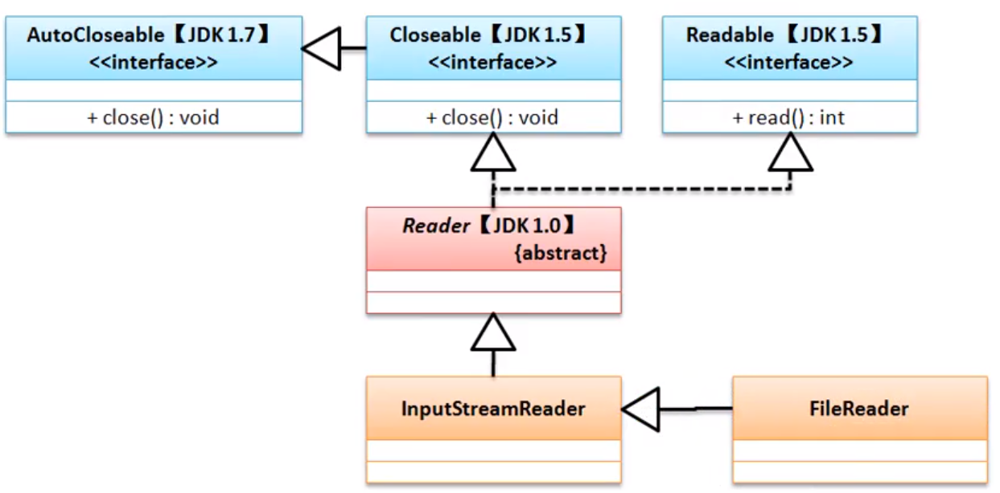

​	实际上所谓的缓存都是指的是程序中间的一道处理缓冲区。

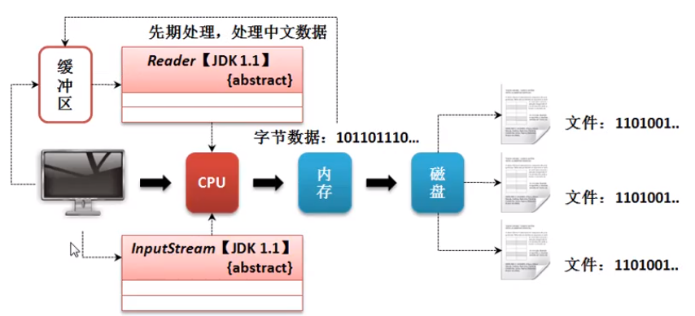

​	字符流实际上是将读取到的字节数据经过一个缓冲区的先期处理，将其转换为字符流


### 4.4.8 实战：文件拷贝

* **需求分析**

  拷贝可能是包含各种类型的文件，此时使用字节流比较合适；同时需要考虑到大文件的拷贝问题

* **实现方案**

  方案一：使用InputStream将全部要拷贝的内容直接读取到程序中，而后一次性的输出到目标文件

  > 方案一存在问题：如果拷贝的文件很大，程序会卡死

  方案二：采用部分拷贝，读取一部分输出一部分数据，如果要采用此方案，核心的操作方法：

  > InputStream:		public int read(byte[] b) throws IOException
  >
  > OutputStream:	 public void write(byte[] b, int off, int len) throws IOException

* **示例：实现文件拷贝处理**

  ```java
  import java.io.*;
  
  // 定义一个文件操作的工具类
  class FileUtil{
      private File srcFile;   // 源文件路径的File对象
      private File desFile;   // 目标文件路径的File对象
  
      public FileUtil(String src, String des){
          this(new File(src), new File(des));          // 用户除了可传File对象，也可传文件路径
      }
      public FileUtil(File srcFile, File desFile) {
          this.srcFile = srcFile;
          this.desFile = desFile;
      }
      public boolean copy() throws Exception{      // 文件拷贝处理
          if(!this.srcFile.exists()){      // 源文件必须存在
              System.out.println("要拷贝的源文件不存在");
              return false;
          }
          if(!this.desFile.getParentFile().exists()){
              this.desFile.getParentFile().mkdirs();      // 创建目标文件
          }
          byte[] data = new byte[1024];      // 开辟一个拷贝的缓冲区
          InputStream inputStream = null;
          OutputStream outputStream = null;
          try{
              inputStream = new FileInputStream(this.srcFile);
              outputStream = new FileOutputStream(this.desFile);
  
              int len = 0;
              // 1、读取数据到数据之中，随后返回读取的个数:len = inputStream.read(data)
              // 2、判断个数是否是-1，如果不是则进行写入:outputStream.write(data, 0, len)
              while((len=inputStream.read(data)) != -1){
                  outputStream.write(data, 0, len);
              }
              // do-while不常用
  //            do{
  //                len = inputStream.read(data);       // 拷贝的内容都在 data 数组中
  //                if(len != -1){
  //                    outputStream.write(data, 0, len);
  //                }
  //            }while (len != -1);
              return true;
          }catch (Exception e){
              throw e;
          } finally {
              if(inputStream != null){
                  inputStream.close();
              }
              if(outputStream != null){
                  outputStream.close();
              }
          }
      }
  }
  
  
  public class Demo {
      public static void main(String[] args) throws Exception {
          try {
              FileUtil fileUtil = new FileUtil(args[0], args[1]);
              System.out.println(fileUtil.copy()? "文件拷贝成功！": "文件拷贝失败！");
          } catch (Exception e){
              throw e;
          }
  
      }
  }
  ```

  ​	但是需要注意的是，以上的做法是属于文件拷贝的最原始实现，而从JDK1.9开始`InputStream`和`Reader`类中，都追加有数据转存的处理操作方法。

* **InputStream和Reader的数据转存方法**

  InputStream：public long transferTo(OutputStream out) throws IOException

  Reader：public long transferTo(Writer out) throws IOException


## 4.5 IO操作深入

### 4.5.1 字符编码

​	实际的开发中有如下几种常用的编码：

> GBK/GB2312：国标编码，可以描述中文信息，其中GB2312只描述简体中文，GBK包含有简体中文与繁体中文
>
> ISO8859-1：国际通用编码，可以用其描述所有的字母信息，如果是象形文字则需要进行编码处理
>
> UNICODE：采用十六进制的方式存储，可以描述所有的文字信息
>
> UTF：象形文字部分使用十六进制编码，而普通的字母采用的是ISO8859-1通用编码，它的优势在于适合于快速的传输，节约带宽，也就成为了我们在开发中首选的编码，主要使用“UTF-8”编码。

​	如果要想知道当前系统中支持的编码规则，则可以采用如下代码列出全部的本机属性：


### 4.5.2 内存操作流

​	之前使用的都是文件操作流，文件操作流程的特点是，程序利用InputStream读取文件内容，而后程序利用OutputStream向文件输出内容，所有的操作都是以文件为终端的。

​	而内存操作流是以内存为终端，并不是从文件中读取或写入数据，而是从内存中读取或写入数据。

​	在Java中提供有两类的内存操作流：

> * 字节内存操作流：ByteArrayOutputStream、ByteArrayInputStream
>
>   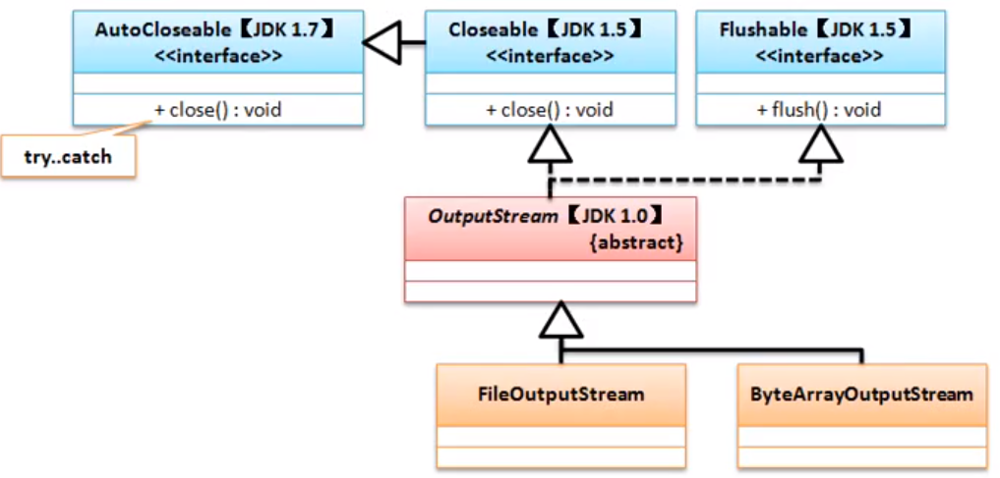
>
>   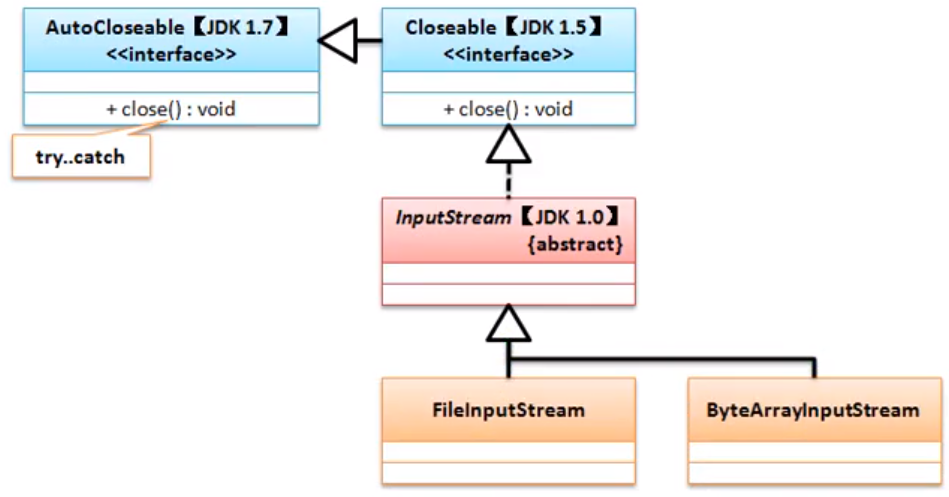
>
>   
>
> * 字符内存操作流程：CharArrayWrite、CharArrayReader
>
>   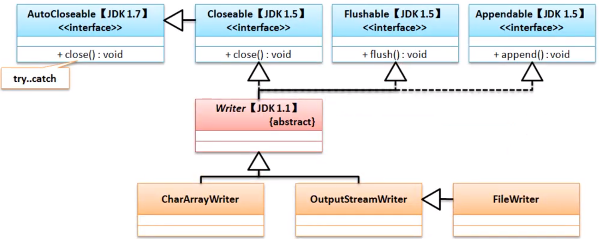
>
>   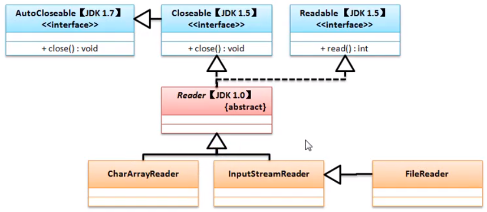

​	下面以 ByteArrayOutputStream 和 ByteArrayInputStream 类为主，进行内容的使用分析，首先分析它们的构造方法：

> * 【构造方法】ByteArrayOutputStream：public ByteArrayOutputStream()
> * 【构造方法】ByteArrayInputStream：public ByteArrayInputStream(byte[] buf)

* **示例：利用内存流实现一个小写字母转大写字母的操作**

  ```java
  import java.io.*;
  
  public class Demo {
      public static void main(String[] args) throws Exception {
          String str = "pcr";
          InputStream inputStream = new ByteArrayInputStream(str.getBytes());  // 将数据保存到内存流
          OutputStream outputStream = new ByteArrayOutputStream();             // 读取内存中的数据
          int data = 0;
          while((data = inputStream.read()) != -1){       // 每次读取一个字节
              outputStream.write(Character.toUpperCase((char)data));      // 保存数据
          }
          System.out.println(outputStream);
          inputStream.close();
          outputStream.close();
      }
  }
  ```


### 4.5.3 管道流

​	管道流主要的功能是实现两个线程之间的IO处理操作。

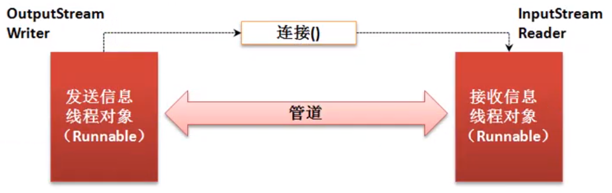

* **分类**

  对于管道流，也是分为两类：

  字节管道流：	PipedOutputStream、PipedInputStream

  > ​	连接处理：public void connect(PipedInputStream snk) throws IOException

  字符管道流：    PipedWriter、PipedReader

  > ​	连接处理：public void connect(PipedReader snk) throws IOException

  

* **示例：实现管道操作**

  ```java
  import java.io.*;
  
  class SendThread implements Runnable{
      private PipedOutputStream output;   // 管道输出流
      public SendThread(){
          this.output = new PipedOutputStream();      // 实例化管道输出流
      }
      public PipedOutputStream getOutput() {
          return this.output;
      }
  
      @Override
      public void run() {
          for(int x = 0; x<10; x++){
              try {       // 利用管道实现数据的发送处理
                  output.write(("第" + (x+1) + "次消息发送-" + Thread.currentThread().getName() +"\n").getBytes());
              } catch (IOException e) {
                  e.printStackTrace();
              }
          }
          try {
              output.close();
          } catch (IOException e) {
              e.printStackTrace();
          }
      }
  }
  
  class ReceiveThread implements Runnable{
      private PipedInputStream input;			// 管道输入流
      public ReceiveThread() {
          this.input = new PipedInputStream();
      }
      public PipedInputStream getInput() {
          return this.input;
      }
  
      @Override
      public void run() {
          byte[] data = new byte[1024];       // 开辟读取数据的缓冲区
          int len = 0;
          ByteArrayOutputStream baos = new ByteArrayOutputStream();       // 内存操作流
          try{
              while((len=this.input.read(data)) != -1){
                  baos.write(data, 0, len);
              }
              System.out.println(Thread.currentThread().getName() + "接收消息" + new String(baos.toByteArray()));//ByteArrayOutputStream 内存字节输出流的toByteArray()是获取全部字节数据
          } catch (IOException e) {
              e.printStackTrace();
          }
          try {
              input.close();
          } catch (IOException e) {
              e.printStackTrace();
          }
      }
  }
  
  public class Demo {
      public static void main(String[] args) throws Exception {
          SendThread sendThread = new SendThread();
          ReceiveThread receiveThread = new ReceiveThread();
          sendThread.getOutput().connect(receiveThread.getInput());  // 将输出流管道和输入流管道连接
          new Thread(sendThread, "【消息发送线程】").start();
          new Thread(receiveThread, "【消息接收线程】").start();
      }
  }
  ```


## 4.6 输入与输出支持

### 4.6.1 打印流

​	对OutputStream进行了功能上的扩展，方便打印

​	在java.io包中提供有两种打印流：PrintStream(字节打印流)、PrintWriter(字符打印流)

| PrintStream                                                  | PrintWriter                                                  |
| ------------------------------------------------------------ | ------------------------------------------------------------ |
| public clss PrintStream extends FilterOutputStream implements Appendable, Closeable | public class PrintWriter extends Writer                      |
| 【构造方法】public PrintStream(OutputStream out)             | 【构造方法】public PrintWriter(OutputStream out)          【构造方法】public PrintWriter(Writer out) |

* **示例：数据输出**

  从JDK1.5开始PrintWriter类中追加有格式化输出的操作支持：public PrintWriter printf(String format, Object ... args)

  ```java
  import java.io.*;
  
  public class Demo {
      public static void main(String[] args) throws Exception {
          File file = new File("H:\\javaDemo\\PrintWriter\\PrintWriter.txt");
          if(!file.getParentFile().exists()){
              file.getParentFile().mkdirs();
          }
          OutputStream out = new FileOutputStream(file);
          PrintWriter pu = new PrintWriter(out); 	// PrintWriter可以接收字节流和字符流
          String name = "刘亦菲";
          int age = 30;
          double salary = 7451356.47846453;
          pu.printf("姓名：%s、年龄：%d、收入：%9.2f", name, age, salary);
          pu.close();
      }
  }
  ```

  ​	比起直接使用 `OutputStream` 类，使用 PrintWriter、PrintStream 类的处理操作更加简单。以后只要是程序进行内容输出的时候，全部使用打印流。


### 4.6.2 System 类对 IO 的支持

​	System是一个系统类，在这个类中提供有三个常量：

> 标准输出（显示器输出）：public static final PrintStream out
>
> 错误输出：public static final PrintStream err
>
> 标准输入（键盘）：public static final InputStream in

* **示例：一个标准输入**

  ```java
  import java.io.*;
  
  public class Demo {
      public static void main(String[] args) throws Exception {
          InputStream input = System.in;
          byte[] data = new byte[1024];
          System.out.print("请输入信息：");
          int len = input.read(data);
          System.out.println(new String(data, 0, len));
      }
  }
  ```

  

### 4.6.3 Scanner

​	`java.util.Scanner` 是从JDK1.5之后追加的一个程序类，其主要的目的是为了解决输入流的访问问题的。在`Scanner`类中有如下几种操作方法：

| 功能           | 方法                                        |
| -------------- | ------------------------------------------- |
| 构造           | public Scanner(InputStream source)          |
| 判断是否有数据 | public boolean hasNext()                    |
| 取出数据       | public String next()                        |
| 设置分隔符     | public Scanner useDelimiter(String pattern) |

* **示例：使用Scanner实现键盘数据输入**

  ```java
  import java.util.Scanner;
  
  public class Demo {
      public static void main(String[] args) throws Exception {
          Scanner scan = new Scanner(System.in);      // System.in 是 InputStream 对象
          System.out.print("请输入年龄：");
          if(scan.hasNextInt()){     // 判断是否有整数输入
              int age = scan.nextInt();
              System.out.println(age);
          }
          scan.close();
      }
  }
  ```

  使用Scanner输入数据还有一个最大的特点：可以直接利用正则进行验证判断

* **示例：输入一个人的生日**

  ```java
  import java.text.SimpleDateFormat;
  import java.util.Scanner;
  
  public class Demo {
      public static void main(String[] args) throws Exception {
          Scanner scan = new Scanner(System.in);      // System.in 是 InputStream 对象
          System.out.print("请输入您的生日：");
          if(scan.hasNext("\\d{4}(-\\d{2}){2}")){     // 判断是否有整数输入
              String birthday = scan.next();
              System.out.println("输入信息为：" + new SimpleDateFormat("yyyy-MM-dd").parse(birthday));			// String 转换为 Date
          }
          scan.close();
      }
  }
  ```

  <u>以后在开发中，如果程序需要输出数据一定使用打印流，输入数据一定使用Scanner。</u>


## 4.7 对象序列化

* **基本定义**

  ​	对象序列化指的是将内存中保存的对象以二进制数据流的形式进行处理，可以实现对象的保存或者是网络传输。

  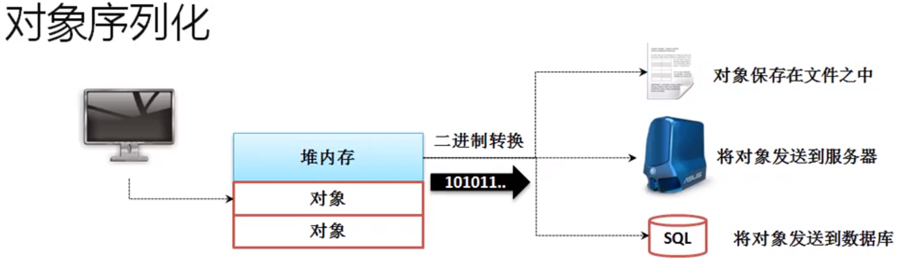

​	然而并不是所有的对象都可以被序列化，在Java中有一个强制性的要求：如果要序列化对象，那么对象所在的类一定要实现 `java.io.Serializable` 父接口，作为序列化的标记，而这个接口中没有任何的方法，因为它描述的是一种能力

* **序列化与反序列化**

  序列化与反序列化的操作可以利用以下两个类完成

  | 类名称   | 序列化：ObjectOutputStream                                   | 反序列化：ObjectInputStream                                  |
  | -------- | ------------------------------------------------------------ | ------------------------------------------------------------ |
  | 类定义   | public class ObjectOutStream extends OutputStream implements ObjectOutput, ObjectStreamConstants | public class ObjectInputStream extends InputStream implements ObjectInput, ObjectStreamConstants |
  | 构造方法 | public ObjectOutputStream(OutputStream out) throws IOException | public ObjectInputStream(InputStream in) throws IOException  |
  | 处理方法 | public final void writeObject(Object obj) throws IOException | public final Object readObject() throws IOException, ClassNotFoundExpetion |

  * **示例：实现序列化与反序列化**

    ```java
    import javax.xml.ws.WebServiceException;
    import java.io.*;
    
    public class Demo {
        private static final File SAVE_FILE = new File("H:" + File.separator +"javaDemo" + File.separator + "Serializable"
                + File.separator + "Serializable.txt");
        public static void main(String[] args) throws Exception {
            saveObject(new Person("小A", 10));
            System.out.println(loadObject());
        }
    
        public static void saveObject(Object obj) throws Exception{
            if(!SAVE_FILE.getParentFile().exists()){
                SAVE_FILE.getParentFile().mkdirs();
            }
            ObjectOutputStream oos = new ObjectOutputStream(new FileOutputStream(SAVE_FILE));
            oos.writeObject(obj);       // 序列化
            oos.close();
        }
    
        public static Object loadObject() throws Exception{
            ObjectInputStream ois = new ObjectInputStream(new FileInputStream(SAVE_FILE));
            Object obj = ois.readObject();      // 反序列化
            ois.close();
            return obj;
        }
    }
    
    class Person implements Serializable{
        private String name;
        private int age;
        public Person(String name, int age){
            this.name = name;
            this.age = age;
        }
        @Override
        public String toString() {
            return "姓名：" + this.name + "、年龄：" + this.age;
        }
    }
    ```

    ​	在Java中的对象序列化与反序列化必须使用内部提供的对象操作流，因为这里面牵扯到二进制数据的格式，所以不能够自定义处理，另外如果要想实现一组对象的序列化，则可以使用对象数组完成。

    ​	在很多的实际项目开发过程中，开发者很少能够见到ObjectOutputStream、ObjectInputStream 类的直接操作，因为会有一些容器帮助开发者自动实现。

* **transient 关键字**

  ​	默认情况下，当执行了对象序列化的时候会将类中的全部属性的内容进行全部的序列化，但是很多情况下，有一些属性并不需要进行序列化的处理，这时就可以在属性定义上使用 transient 关键字来完成。被transient修饰的属性，在执行对象的反序列化以后，在该属性上的值为默认值，如String属性为null，int属性为0。

# 五、反射

## 5.1 认识反射

### 5.1.1 简介

​	所有的技术实现的目标只有一点：重用性。

​	对于反射技术首先来考虑的是“反”与“正”的操作，所谓的“正”操作指的是当我们要使用一个类的时候，一定要先导入程序所在的包，而后根据类进行对象的实例化，并且依靠对象调用类中的方法。“反”，即根据实例化对象反推出其类型。

​	如果要实现“反”的处理操作，那么首先要采用的是`Object`类中所提供的方法：

> 获取对象的类信息：public final Class<?> getClass()


### 5.1.2 Class 类对象的三种实例化模式

​	反射中所有的核心操作都是通过`Class`类对象展开的，可以说Class类是反射操作的根源所在，但是这个类，如果想获取它的实例化对象，可以采用三种方式完成，首先来观察`Class`类的定义：

```java
public final class Class<T> extends Object implements Serializable, GenericDeclaration, Type, AnnotatedElement
```

* **三种实例化形式**

  1. 【Object类支持】

     该方式有一个不是缺点的缺点：如果现在只想获得Class类对象，则必须产生指定类对象后才可以获得

     ```java
     class Person{
     }
     
     public class Demo {
         public static void main(String[] args){
             Person per = new Person();      // 需要存在有指定类的实例化对象
             Class cls = per.getClass();
             System.out.println(cls);
         }
     }
     
     ```

  2. 【JVM直接支持】采用 “类.class” 的形式实例化

     特点：<u>如果要采用此种方式，则必须导入程序所对应的开发包</u>

     ```java
     class Person{
     }
     
     public class Demo {
         public static void main(String[] args){
             Class cls = Person.class;
             System.out.println(cls);
         }
     }
     
     ```

  3. 【Class类支持】在 `Class` 类中提供有一个 static 方法：

     加载类：public static Class<?> forName(==String className==) throws ClassNotFoundException

     ```java
     public class Demo {
         public static void main(String[] args) throws Exception{
             Class cls = Class.forName("study.pcr.day1.Person");
             System.out.println(cls);
         }
     }
     ```

     ​	这种方式最大的特点是可以直接采用字符串的形式定义要使用的类型，并且程序中不需要任何的import语句。如果定义的程序类不存在，则会抛出“java.lang.ClassNotFoundException”异常。

  <u>以上三种方式必须全部掌握，没有孰先孰后之分</u>


## 5.2 反射应用案例

​	经过一系列的分析之后，可以发现虽然获得了`Class`类的实例化对象，但是依然觉得这个对象获得的意义不是很大，所以为了帮助理解反射的核心意义所在，下面通过几个示例进行程序的说明（这几个示例都是在实际的开发中会使用到的）

### 5.2.1 示例：反射实例化对象

```java
package study.pcr.day1;

public class Person {
    // 任何情况下，如果要实例化对象，一定会调用类的构造方法
    public Person() {
        System.out.println("**********【Person类】对象的无参构造方法");
    }

    @Override
    public String toString() {
        return "我是一个人，一个奋斗的人。";
    }
}
```

```java
public class Demo {
    public static void main(String[] args) throws Exception{
        Class cls = Class.forName("study.pcr.day1.Person");
        Object obj = cls.newInstance();		// 实例化对象，JDK1.9后被废除了
        System.out.println(obj);		    // 输出对象调用toString()方法
    }
}
// 执行结果
**********【Person类】对象的无参构造方法
我是一个人，一个奋斗的人。
```

​	现在通过反射实现的对象实例化处理，依然要调用类中的无参构造方法，其本质等价于 “类 对象 = new 类() ”，也就是说相当于隐含了关键字 new。

​	从JDK1.9开始， `newInstance()`被替代了，因为默认的`Class`类中的`newInstance()`方法只能调用无参构造方法，所以很多开发者认为其描述的不够准确，于是将其变换了命名形式。


### 5.2.2 反射与工厂设计模式

​	如果要想进行对象的实例化处理除了可以使用关键字new之外，还可以使用反射机制来完成，此时引发思考：为什么要提供一个反射的实例化方法？到底使用关键字new还是使用反射？

​	想理解此类问题，最好的解释方案是通过工厂设计模式来解决。工厂设计模式的最大特点是：客户端的程序类不直接牵扯到对象的实例化管理，只与接口发生关联，通过工厂类获取指定接口的实例化对象。下面是不采取工厂设计模式时的程序：

```java
package study.pcr;

interface IMessage{
    public void send();  // 消息发送
}

class NetMessage implements IMessage{
    @Override
    public void send() {
        System.out.println("【网络消息发送】数钮科技");
    }
}

public class Demo {
    public static void main(String[] args) {
        IMessage msg = new NetMessage();    // 如果直接实例化则存在耦合问题
    }
}

```

​	此时，主程序与具体子类间存在耦合问题。

* **示例：工厂设计模式解决上述耦合问题**

  ```java
  package study.pcr;
  
  interface IMessage{
      public void send();
  }
  
  class NetMessage implements IMessage{
      @Override
      public void send() {
          System.out.println("【网络消息发送】数钮科技");
      }
  }
  
  class Factory{
      private Factory(){}     // 没有产生实例化对象的意义，所以构造方法私有化
      public static IMessage getInstance(String className){
          if ("netmessage".equalsIgnoreCase(className)){
              return new NetMessage();
          }
          return null;
      }
  }
  
  public class Demo {
      public static void main(String[] args) {
          IMessage msg = Factory.getInstance("netmessage");
          msg.send();
      }
  }
  ```

  ​	以上程序的结构图：

  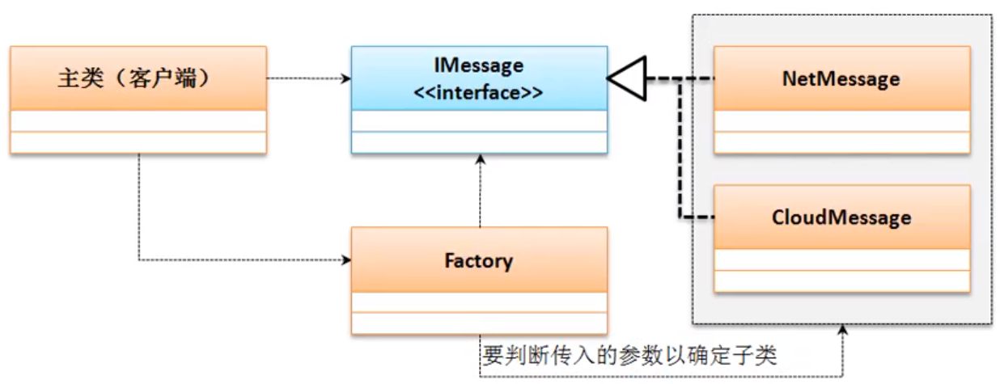

  ​	此类工厂设计模式属于静态工厂设计模式，如果现在要追加一个子类，则意味着工厂类一定要做出修改，因为如果不追加这种判断，是无法获取指定接口对象的。

  ​	例如，现在追加一个IMessage的子类：

  ```java
  class CloudMessage implements IMessage{
      @Override
      public void send() {
          System.out.println("【云消息发送】云端消息");
      }
  }
  ```

  ​		那么需要在工厂中再加入一个判断：

  ```java
  class Factory{
      private Factory(){}
      public static IMessage getInstance(String className){
          if ("netmessage".equalsIgnoreCase(className)){
              return new NetMessage();
          } else if ("cloudmessage".equalsIgnoreCase(className)){		// 新增的判断
              return new CloudMessage();
          }
          return null;
      }
  }
  ```

  ​	工厂设计模式最有效解决的是子类与客户端的耦合问题，但是解决的核心思想是在于提供有一个工厂类作为过渡端，但是随着项目的进行，IMessage接口下可能会有更多的子类，而且随着时间的推移，子类可能会产生的越来越多，那么意味着工厂类一直要进行修改，永无停止之日。

  ​	此时最好的解决方案就是不使用关键字new来完成，因为关键字new在使用的时候需要有一个明确的类存在。而newInstance()方法只需要有一个明确表示类名称的字符串即可应用。

  ```java
  package study.pcr;
  
  interface IMessage{
      public void send();
  }
  
  class NetMessage implements IMessage{
      @Override
      public void send() {
          System.out.println("【网络消息发送】数钮科技");
      }
  }
  
  class CloudMessage implements IMessage{
      @Override
      public void send() {
          System.out.println("【云消息发送】云端消息");
      }
  }
  
  class Factory {
      private Factory() { }
  
      public static IMessage getInstance(String className) {
          IMessage instance = null;
          try {
              instance = (IMessage) Class.forName(className).newInstance();	// 反射机制使得某个接口扩充子类，将不再需要修改该工厂类中的内容，只要传入表示具体子类的字符串即可
          } catch (Exception e) {
              e.printStackTrace();
          }
          return instance;
      }
  }
  
  public class Demo {
      public static void main(String[] args) throws Exception {
          IMessage msg = Factory.getInstance("study.pcr.NetMessage");
          msg.send();
          IMessage ser = Factory.getInstance("study.pcr.CloudMessage");
          ser.send();
      }
  }
  ```

  ​	此时可以发现，利用反射机制实现的工厂设计模式，最大的优势在于，对于接口子类的扩充，将不再需要修改工厂类的内容。此时程序代码的结构如下：

  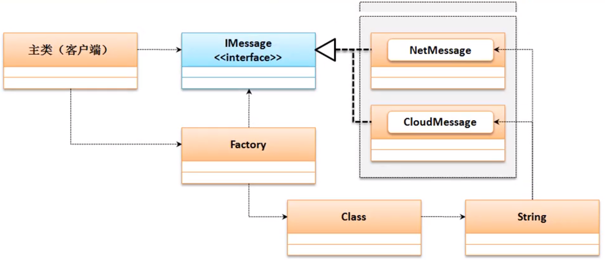

  

  ​	需要进一步思考的是，在实际的项目开发中，会存在有大量的接口，并且这些接口都可能需要通过工厂类实例化，所以此时的工厂设计模式不应该只为一个IMessage接口服务，而应该变为为所有的接口服务。需要在工厂类定义中用到泛型，完整代码如下：

  ```java
  package study.pcr;
  
  interface IMessage {
      public void send();
  }
  
  interface IService{     // 新增接口
      public void service();
  }
  
  class HouseService implements IService{     // 新增IService接口的子类
      @Override
      public void service() {
          System.out.println("【服务】为您的住房提供服务");
      }
  }
  
  class NetMessage implements IMessage {
      @Override
      public void send() {
          System.out.println("【网络消息发送】数钮科技");
      }
  }
  
  class CloudMessage implements IMessage {
      @Override
      public void send() {
          System.out.println("【云消息发送】云端消息");
      }
  }
  
  // 该工厂类不关心具体的接口
  class Factory {
      private Factory() { }
      /**
       * 获取接口实例化对象
       * @param className 接口子类的名称
       * @param clazz 描述的是一个接口类型,由调用处（主类）确定传入
       * @param <T>	描述的是一个接口类型,由调用处（主类）确定传入
       * @return  如果子类存在则返回指定接口的实例化对象
       */
      public static <T> T getInstance(String className, Class<T> clazz) {
          T instance = null;
          try {
              instance = (T) Class.forName(className).newInstance();
          } catch (Exception e) {
              e.printStackTrace();
          }
          return instance;
      }
  }
  
  public class Demo {
      public static void main(String[] args) throws Exception {
          IMessage msg = Factory.getInstance("study.pcr.NetMessage", IMessage.class);
          msg.send();
          IMessage cluMsg = Factory.getInstance("study.pcr.CloudMessage", IMessage.class);
          cluMsg.send();
          IService ser = Factory.getInstance("study.pcr.HouseService", IService.class);
          ser.service();
      }
  }
  ```

  ​	该程序的结构如下：

  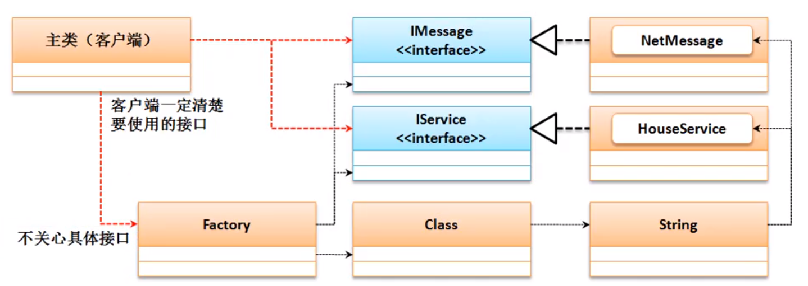

  ​	此时的工厂设计模式不再受限于指定的接口，可以为所有的接口提供实例化服务。

  

### 5.2.3 示例：反射与单例设计模式

​	单例模式的核心在于：类的构造方法私有化，在类的内部产生实例化对象，之后通过static方法获取实例化对象，进行类中的结构调用。单例设计模式一共有两类：饿汉式、懒汉式。其中，懒汉式在多线程环境中，会出现问题：

```java
package study.pcr;

// 饿汉式，在多线程环境中并不会出现问题
//class Singleton{
//    private static final Singleton INSTANCE = new Singleton();
//    private Singleton(){
//        System.out.println("【" + Thread.currentThread().getName() + "】*********实例化Singleton类对象*********");
//    };
//    public static Singleton getInstance(){
//        return INSTANCE;
//    }
//
//    public void print(){
//        System.out.println("反射与单例设计模式");
//    }
//}

// 懒汉式单例模式，
class Singleton{
    private static Singleton instance = null;
    private Singleton(){
        System.out.println("【" + Thread.currentThread().getName() + "】*********实例化Singleton类对象*********");
    }
    public static Singleton getInstance(){
        if (instance == null){
            instance = new Singleton();
        }
        return  instance;
    }

    public void print(){
        System.out.println("反射与单例设计模式");
    }
}


public class Demo {
    public static void main(String[] args) throws Exception {
        for(int i=0; i<3; i++){			// 开三个线程
            new Thread(()->{
                Singleton.getInstance().print();
            },"单例消费端-" + i).start();
        }
    }
}
// 以上饿汉式的单例模式在多线程环境中并不会产生对于一个的实例化对象，但是懒汉式的单例模式会产生多个实例化对象，上面程序的运行结果为：
【单例消费端-0】*********实例化Singleton类对象*********
【单例消费端-2】*********实例化Singleton类对象*********
反射与单例设计模式
【单例消费端-1】*********实例化Singleton类对象*********
反射与单例设计模式
反射与单例设计模式
```

​	上述懒汉式程序运行过程的示意图：

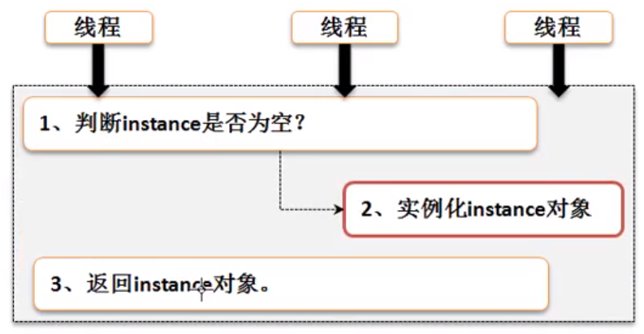

​	问题在于三个线程在判断instance是否为空时，都判断为空，而后进行了Sington类的对象实例化。产生该问题的关键在于代码本身出现了代码不同步的情况，要想解决该问题，核心在于需要进行同步处理。同步可以想到synchronized关键字，使用该关键字后的懒汉式单例定义如下：

```java
class Singleton{
    private static Singleton instance = null;
    private Singleton(){
        System.out.println("【" + Thread.currentThread().getName() + "】*********实例化Singleton类对象*********");
    }
    public static synchronized Singleton getInstance(){		// 加上 synchronized 关键字
        if (instance == null){
            instance = new Singleton();
        }
        return  instance;
    }

    public void print(){
        System.out.println("反射与单例设计模式");
    }
}
```

​	此时确实进行了同步，不会产生多个实例化对象，但是这个同步的代价比较大，导致效率大大降低。整体代码中，实际上只有一块部分需要进行同步处理——instance对象的实例化处理部分。

* **更加合理的加入同步处理**

  ```java
  class Singleton{
      private static Singleton instance = null;
      private Singleton(){
          System.out.println("【" + Thread.currentThread().getName() + "】*********实例化Singleton类对象*********");
      }
      public static Singleton getInstance(){		// 去掉方法名上的 synchronized 关键字
          if (instance == null){
              synchronized (Singleton.class){     // 在实例化这一步加入同步操作
                  if(instance == null){               // 这里同样需要加入一个判断，因为上一个if判断同样会有多个进程进入
                      instance = new Singleton();
                  }
              }
          }
          return  instance;
      }
  
      public void print(){
          System.out.println("反射与单例设计模式");
      }
  }
  ```

* **面试题：请编写单例设计模式**

  > 1. 直接编写一个饿汉式的单例设计模式，并且实现构造方法私有化
  > 2. 在Java中哪里使用到了单例设计模式？Runtime类、Spring框架
  > 3. 懒汉式单例设计的问题？


## 5.3 反射与类操作

### 5.3.1 反射获取类结构信息

​	在反射机制的处理过程中

​	如果要想获取类的一些基础信息，则可以通过Class类中的如下方法：

> * 获取包定义：public Package getPackage()
> * 获取继承父类：public Class<? super T> getSuperclass()
> * 获取实现父接口：public Class<?>[] getInterfaces()

```java
package study.pcr;

public class Demo {
    public static void main(String[] args) {
        // 获取包
        Class<?> cls1 = Person.class;        // 获取指定类的Class对象
        Package pack = cls1.getPackage();
        System.out.println(pack.getName());

        // 获取继承父类
        Class<?> cls2 = Person.class;
        Class<?> parent = cls2.getSuperclass();
        System.out.println(parent.getName());

        // 获取实现的父接口
        Class<?> cls3 = Person.class;
        Class<?>[] interf = cls3.getInterfaces();
        for(Class temp : interf){
            System.out.println(temp.getName());
        }
    }
}
```

​	当获取了一个类的Class对象之后，意味着这个对象可以获取类之中的一切继承结构信息（包括类、抽象类、接口）。


### 5.3.2 反射调用构造方法

​	所有类的构造方法的获取都可以直接通过Class类来完成，该类中定义有如下几个方法：

> * 获取所有构造方法：public Constructor<?>[] getDeclaredConstructors() throws SecurityException
>
> * 获取指定构造方法：public Constructor<T> getDeclaredConstructor(Class<?>... parameterTypes) throws             NoSuchMethodException, SecurityException
>
>   上面的两个方法和下面的两个方法貌似没有什么区别？
>
> * 获取所有构造方法：public Constructor<?>[] getConstructors() throws SecurityException
>
> * 获取指定构造方法：public Constructor<T> getConstructor(Class<?>... parameterTypes) throws NoSuchMethodException, SecurityException

* **示例：获取类中的全部构造方法**

  ```java
  package study.pcr;
  import java.lang.reflect.Constructor;
  
  public class Demo {
      public static void main(String[] args) {
          Class<?> cls = Person.class;       // 获取指定类的Class对象
          Constructor<?>[]  constructors =  cls.getConstructors();      // 获取全部构造方法
          for(Constructor<?> con : constructors){
              System.out.println(con);
          }
      }
  }
  // 运行结果
  // public study.pcr.Person()
  // public study.pcr.Person(java.lang.String,int)
  ```

  ​	此时获取的是类中全部的构造方法，但是也可以获取一个指定参数的构造，例如：现在的Person类中提供有两个构造方法，想要调用指定的构造方法来实例化对象，程序见下例。

* **示例：利用反射，指定类的某个构造方法实例化对象**

  ```java
  package study.pcr;
  import java.lang.reflect.Constructor;
  
  public class Demo {
      public static void main(String[] args) throws Exception {
          Class<?> cls = Person.class;       // 获取指定类的Class对象
          Constructor<?>  constructor =  cls.getConstructor(String.class, int.class);      // 获取指定的构造方法
          Object obj = constructor.newInstance("小王", 23);
          System.out.println(obj);
      }
  }
  ```

  ​	虽然程序代码本身允许开发者调用有参构造处理，但是如果从实际的开发来讲，所有使用反射的类中最好提供有无参构造，因为这样的实例化可以达到统一性。


### 5.3.3 反射调用普通方法

​	在进行反射处理的时候也可以通过反射来获取类之中的全部方法，但是需要注意的是，如果要想通过反射调用这些方法，必须有一个前提条件：类之中要提供有实例化对象。

​	在Class类中提供有如下的操作可以获取方法对象：

```java
// 获取全部方法：
    public Method[] getMethods() throws SecurityException
// 获取指定方法：
    public Method getMethod(String name, Class<?>... parameterTypes) throws NoSuchMethodException, SecurityException
// 获取本类全部方法：
    public Method[] getDeclaredMethods() throws SecurityException
// 获取本类指定方法：
    public Method getDeclaredMethod(String name, Class<?>... parameterTypes) throws NoSuchMethodException, SecurityException
```

​	在 `Method`类中有一个非常非常重要的方法：

```java
public Object invoke(Object obj, Object... args) throws IllegalAccessException, IllegalArgumentException, InvocationTargetException
// obj 为调用方法的对象，args 为用于方法调用的参数
```

* **示例：使用反射机制实现Person类中普通方法的调用**

  ```java
  package study.pcr;
  
  import java.lang.reflect.Method;
  
  public class Demo {
      public static void main(String[] args) throws Exception {
          Class<?> cls = Class.forName("study.pcr.Person");
          String value = "小潘";        // 要设置的属性内容
          // 1、任何情况下如果想要保存类中的属性或者调用类中的方法都必须保证存在有类的实例化对象
          Object obj = cls.newInstance();     // 调用无参构造实例化对象
          // 2、如果要想进行方法的调用，那么一定要获取方法的名称
          String setMethodName = "setName";       // 要调用的 Person 类中的方法名称
          Method setMethod = cls.getDeclaredMethod(setMethodName, String.class);   // 获取指定的方法
          setMethod.invoke(obj, value);           // 调用指定方法，等价于：Person对象.setName(value)
          String getMethodName = "getName";
          Method getMethod = cls.getDeclaredMethod(getMethodName);
          System.out.println(getMethod.invoke(obj));
      }
  }
  ```

  ​	利用此类操作整体的形式上不会有任何的明确的类对象产生，一切都是依靠反射机制处理的，这样的处理避免了与某一个类的耦合问题。


### 5.3.4 反射调用成员

​	类结构中还有一个核心组成，就是成员（Field)，对于成员信息的获取也是通过Class类完成的，在这个类中提供有如下两组操作方法：

```java
// 获取本类全部成员
public Field[] getDeclaredFields() throws SecurityException
    
// 获取本类指定的成员
public Field getDeclaredField(String name) throws NoSuchFieldException, SecurityException


// 获取父类全部成员
public Field[] getFields() throws SecurityException
    
// 获取父类指定成员
public Field getField(String name) throws NoSuchFieldException, SecurityException
```

* **示例：获取父类或子类本类中的成员**

  ```java
  package study.pcr;
  
  import java.lang.reflect.Field;
  
  public class Demo {
      public static void main(String[] args) throws Exception {
          Class<?> cls = Class.forName("study.pcr.Person");
          {   // 获取父类中的公共成员（public修饰）信息
              Field[] fields = cls.getFields();
              for (Field fie : fields) {
                  System.out.println(fie);
              }
          }
          System.out.println("--------------------------------------");
          {   // 获取子类本类中定义的成员
              Field[] fields = cls.getDeclaredFields();    // 获取成员
              for(Field fie : fields){
                  System.out.println(fie);
              }
          }
      }
  }
  ```

  ​	以上程序可以获取父类或者子类中定义的成员，但是在`Field`类中，最为重要的操作形式并不是获取全部的成员，而是如下三个方法：

  ```java
  // 设置属性内容
  public void set(Object obj, Object value) throws IllegalArgumentException, IllegalAccessException
      
  // 获取属性内容
  public Object get(Object obj) throws IllegalArgumentException, IllegalAccessException
      
  // 解除封装
  public void setAccessible(boolean flag)
  ```

  ​	所有的成员是在对象实例化之后进行空间分配的，所以此时一定要先有实例化对象之后才可以进行成员的操作

* **示例：直接调用Person类中的name私有成员**

  ```java
  package study.pcr;
  
  import java.lang.reflect.Field;
  
  public class Demo {
      public static void main(String[] args) throws Exception {
          Class<?> cls = Class.forName("study.pcr.Person");       // 获取指定类的Class对象
          Object obj = cls.newInstance();                         // 实例化对象（分配成员空间）
          Field nameField = cls.getDeclaredField("name");    // 获取成员变量
          nameField.setAccessible(true);                          // 解除封装，setAccessible()方法是AccessibleObject中的方法，意味着Constructor、Method类均可以调用此方法
          nameField.set(obj, "卡布达");                            // 等价于：Person对象.name = "卡布达"
          System.out.println(nameField.get(obj));                 // 等价于：Person对象.name
      }
  }
  ```

​	通过一系列的分析可以发现，类之中的构造、方法、成员属性都可以通过反射实现调用，但是对于成员的反射调用很少这样直接处理，大部分操作都应该通过setter或getter完成，所以对于以上的代码只能够说是反射的特色，但是不具备实际的使用能力，而对于`Field`类在实际开发中只有一个方法最为常用：

```java
// 获取成员类型
public Class<?> getType()
```

```java
package study.pcr;
import java.lang.reflect.Field;

public class Demo {
    public static void main(String[] args) throws Exception {
        Class<?> cls = Class.forName("study.pcr.Person");       // 获取指定类的Class对象
        Field nameField = cls.getDeclaredField("name");     // 获取成员变量
        System.out.println(nameField.getType());  // 返回的是 Class对象，结果是 class java.lang.String
        System.out.println(nameField.getType().getName());        // 获取完整类名称“包.类”
        System.out.println(nameField.getType().getSimpleName());    // 获取类名称
    }
}
```

​	在以后开发中进行反射处理的时候，往往会利用`Field`与`Method`类实现类中的setter方法的调用


## 5.4 反射与简单Java类

### 5.4.1 传统属性赋值弊端

​	对于简单Java类中属性的赋值，因为类中的属性通常是非常多的，并且类的个数也是非常多的，所以这种情况下编写的代码的重复性将会非常高。

​	按照传统的直观的编程方式，所带来的问题就是代码会存在有大量的重复操作。如果要想解决对象的重复处理操作，那么唯一的解决方案就是反射机制，<u>反射机制最大的特征是可以根据其自身的特点</u>（Object 类直接操作、可以直接操作属性或方法）<u>实现相同功能类的重复操作的抽象处理</u>。


### 5.4.2 属性自动赋值设计思路

​	经过分析之后已经确认了当前简单Java类操作的问题所在，而对于开发者而言，就需要想办法通过一种解决方案来实现属性的自动设置，那么这个时候的设置建议采用字符串的形式来描述对应的类型。

1. 在进行程序开发时，String字符串可以描述的内容有很多，并且可以由开发者自行定义字符串的结构，下面就采用“属性:内容|属性:内容”的形式来为Java类中的属性初始化。

2. 类设计的基本结构：应该由一个专门的ClassInstanceFactory类负责所有的反射处理，即：接收反射对象与要设置的属性内容，同时可以获取指定类的实例化对象。

3. 设计的基本结构：

   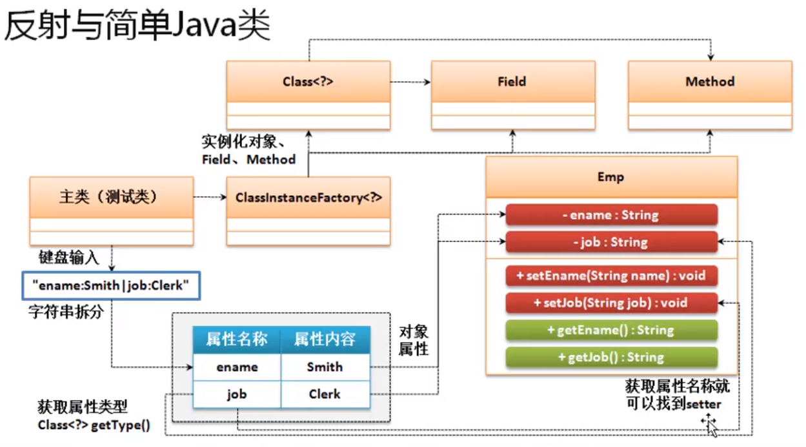

   ```java
   package study.pcr;
   
   class Emp{
       private String ename;
       private String job;
   
       public void setEname(String ename) {
           this.ename = ename;
       }
   
       public void setJob(String job) {
           this.job = job;
       }
   
       public String getEname() {
           return ename;
       }
   
       public String getJob() {
           return job;
       }
   }
   
   class ClassInstanceFactory{
       private ClassInstanceFactory(){}
       /**
        * 实例化对象的创建方法，该对象可以根据传入的字符串结构“属性:内容|属性:内容”进行属性的填充
        * @param clazz     要进行反射实例化的Class类对象（有Class就可以反射实例化对象）
        * @param value     要设置给对象的属性内容
        * @param <T>       返回的java类对象的类型
        * @return         一个已经配置好属性内容的java类对象
        */
       public static <T> T create(Class<?> clazz, String value){
           return null;
       }
   
   }
   
   public class Demo {
       public static void main(String[] args) throws Exception {
           String value = "ename:Smith|job:Clerk";
           Emp emp = ClassInstanceFactory.create(Emp.class, value);
           System.out.println("姓名：" + emp.getEname() + "、职位：" + emp.getJob());
       }
   }
   ```

   ​	在当前开发中，所需要留给用户完善的就是ClassInstanceFactory.create()方法。


### 5.4.3 单级属性赋值

​	对于上述的Emp类中会发现所给出的数据类型都没有其他的引用关联了，只是描述了Emp本类的对象，所以这样的设置称为单级设置处理，所以此时应该处理两件事情：

> * 需要通过反射进行指定类对象的实例化处理
> * 进行内容的设置（Field属性类型、方法名称、要设置的内容）

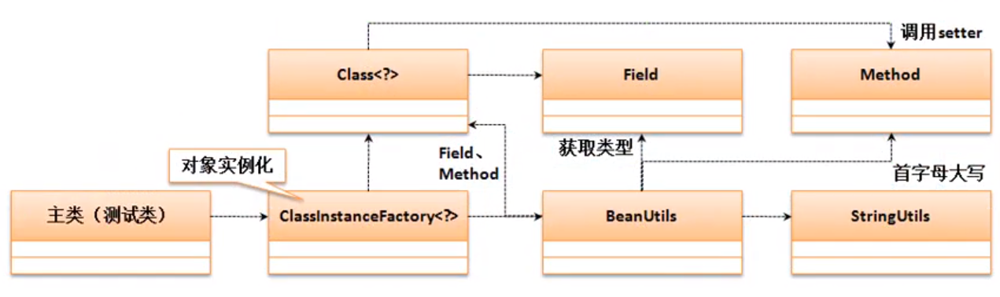

1. 定义 StringUtils实现首字母大写功能
2. 定义 BeanUtils 工具类，该工具类主要实现属性的设置
3. ClassInstanceFactory 负责实例化对象并且调用 BeanUtils 实现属性内容的设置

```java
package study.pcr;

import java.lang.reflect.Field;
import java.lang.reflect.Method;

class Emp{
    private String ename;
    private String job;

    public void setEname(String ename) {
        this.ename = ename;
    }

    public void setJob(String job) {
        this.job = job;
    }

    public String getEname() {
        return ename;
    }

    public String getJob() {
        return job;
    }
}

class ClassInstanceFactory{
    private ClassInstanceFactory(){}
    /**
     * 实例化对象的创建方法，该对象可以根据传入的字符串结构“属性:内容|属性:内容”进行属性的填充
     * @param clazz     要进行反射实例化的Class类对象，有Class就可以反射实例化对象
     * @param value     要设置给对象的属性内容
     * @param <T>       返回的java类对象的类型
     * @return         一个已经配置好属性内容的java类对象
     */
    public static <T> T create(Class<?> clazz, String value) {
        // 如果要想采用反射进行简单Java类对象属性设置的时候，类中必须要有无参构造
        try{
            Object obj = clazz.getDeclaredConstructor().newInstance();
            BeanUtils.setValue(obj, value);     // 通过反射设置属性
            return (T) obj;    // 返回对象
        } catch (Exception e){
            e.printStackTrace();
            return null;
        }
    }
}

class StringUtils{      // 该类实现首字母大写
    public static String initcap(String str){
        if(str == null || "".equals(str)){
            return str;
        }
        if(str.length() == 1){
            return str.toUpperCase();
        } else {
            return str.substring(0,1).toUpperCase() + str.substring(1);
        }
    }
}

class BeanUtils{        // 进行Bean处理的类
    private BeanUtils(){}
    /**
     *  实现指定对象的属性设置
     * @param obj       要进行反射操作的实例化对象
     * @param value     包含有指定内容的字符串，格式为“属性:内容|属性:内容”
     */
    public static void setValue(Object obj, String value) {
        String[] results = value.split("\\|");  // 按照“|”进行每一组属性的拆分，注意这里一定要加双反斜杠
        for(int x=0; x<results.length; x++){        // 循环设置属性内容
            // attval[0]保存的是属性名称，attval[1]保存的是属性内容
            String[] attval = results[x].split(":");    // 获取“属性名称”和“内容”
            try {  // 这里的try ... catch 保证属性设置时，即使有属性输入错误，其他的属性也可以得到设置,程序不会中断
                Field field = obj.getClass().getDeclaredField(attval[0]);
                Method setMethod = obj.getClass().getDeclaredMethod("set" + StringUtils.initcap(attval[0]), field.getType());
                setMethod.invoke(obj, attval[1]);       // 调用setter设置属性
            } catch (Exception e){

            }
        }
    }
}

public class Demo {
    public static void main(String[] args) throws Exception {
        String value = "enames:Smith|job:Clerk";
        Emp emp = ClassInstanceFactory.create(Emp.class, value);
        System.out.println("姓名：" + emp.getEname() + "、职位：" + emp.getJob());
    }
}
```

​	现在即使类中的属性再多，也可以轻松的实现setter的调用（类对象实例化处理）


### 5.4.4 设置多种数据类型

​	上述程序`Emp`类中所给定的数据类型只是String，下面在该类中追加其他数据类型，则现在如果仍然要按上面的方式实现属性的自动赋值，则需要为参数加入类型转换的操作。

​	在`BeanUtils`类中加入`converAttributeValue()`方法，实现不同类型参数的转换，完整的程序代码如下：

```java
package study.pcr;

import java.lang.reflect.Field;
import java.lang.reflect.Method;
import java.text.ParseException;
import java.text.SimpleDateFormat;
import java.util.Date;

class Emp{
    private Long empno;
    private String ename;
    private String job;
    private Double salary;
    private Date hiredate;

    public void setEname(String ename) {
        this.ename = ename;
    }

    public void setJob(String job) {
        this.job = job;
    }

    public String getEname() {
        return ename;
    }

    public String getJob() {
        return job;
    }

    public void setEmpno(Long empno) {
        this.empno = empno;
    }

    public void setSalary(Double salary) {
        this.salary = salary;
    }

    public void setHiredate(Date hiredate) {
        this.hiredate = hiredate;
    }

    public Long getEmpno() {
        return empno;
    }

    public Double getSalary() {
        return salary;
    }

    public Date getHiredate() {
        return hiredate;
    }
}

class ClassInstanceFactory{
    private ClassInstanceFactory(){}
    /**
     * 实例化对象的创建方法，该对象可以根据传入的字符串结构“属性:内容|属性:内容”进行属性的填充
     * @param clazz     要进行反射实例化的Class类对象，有Class就可以反射实例化对象
     * @param value     要设置给对象的属性内容
     * @param <T>       返回的java类对象的类型
     * @return         一个已经配置好属性内容的java类对象
     */
    public static <T> T create(Class<?> clazz, String value) {
        // 如果要想采用反射进行简单Java类对象属性设置的时候，类中必须要有无参构造
        try{
            Object obj = clazz.getDeclaredConstructor().newInstance();
            BeanUtils.setValue(obj, value);     // 通过反射设置属性
            return (T) obj;    // 返回对象
        } catch (Exception e){
            e.printStackTrace();
            return null;
        }
    }
}

class StringUtils{      // 该类实现首字母大写
    public static String initcap(String str){
        if(str == null || "".equals(str)){
            return str;
        }
        if(str.length() == 1){
            return str.toUpperCase();
        } else {
            return str.substring(0,1).toUpperCase() + str.substring(1);
        }
    }
}

class BeanUtils{        // 进行Bean处理的类
    private BeanUtils(){}
    /**
     *  实现指定对象的属性设置
     * @param obj       要进行反射操作的实例化对象
     * @param value     包含有指定内容的字符串，格式为“属性:内容|属性:内容”
     */
    public static void setValue(Object obj, String value) {
        String[] results = value.split("\\|");  // 按照“|”进行每一组属性的拆分，注意这里一定要加双反斜杠
        for(int x=0; x<results.length; x++){        // 循环设置属性内容
            // attval[0]保存的是属性名称，attval[1]保存的是属性内容
            String[] attval = results[x].split(":");    // 获取“属性名称”和“内容”
            try {  // 这里的try ... catch 保证属性设置时，即使有属性输入错误，其他的属性也可以得到设置,程序不会中断
                Field field = obj.getClass().getDeclaredField(attval[0]);
                Method setMethod = obj.getClass().getDeclaredMethod("set" + StringUtils.initcap(attval[0]), field.getType());
                Object val = BeanUtils.convertAttributeVaule(field.getType().getSimpleName(), attval[1]);
                setMethod.invoke(obj, val);       // 调用setter设置属性
            } catch (Exception e){

            }
        }
    }

    /**
     * 实现属性类型的转换处理
     * @param type  属性类型，通过上面的getDeclareField()方法获取的
     * @param value 属性内容，传入的都是字符串，需要将其变为指定类型
     * @return  转换后的数据
     */
    private static Object convertAttributeVaule(String type, String value){
        if("long".equalsIgnoreCase(type)){
            return Long.parseLong(value);
        } else if("double".equalsIgnoreCase(type)){
            return Double.parseDouble(value);
        } else if("Date".equals(type)){
            SimpleDateFormat sdf = null;
            if(value.matches("\\d{4}-\\d{1,2}-\\d{1,2}")){  // 日期格式
                sdf = new SimpleDateFormat("yyyy-MM-dd");
            } else if(value.matches("\\d{4}-\\d{1,2}-\\d{1,2} \\d{2}:\\d{2}:\\d{2}")){  // 日期时间格式
                sdf = new SimpleDateFormat("yyyy-MM-dd HH:mm:ss");
            } else {
                return new Date();  // 返回当前日期
            }
            try {
                return sdf.parse(value);    // 字符串转日期
            } catch (ParseException e) {
                return new Date();  // 返回当前日期
            }
        } else if("int".equals(type) || "Integer".equals(type)){
            return Integer.parseInt(value);
        } else{
            return value;   // 以上都不是，则是字符串，直接返回
        }
    }
}

public class Demo {
    public static void main(String[] args) throws Exception {
        String value = "empno:45|ename:Smith|job:Clerk|salary:16700.99|hiredate:2021-5-16";
        Emp emp = ClassInstanceFactory.create(Emp.class, value);
        System.out.println("雇员编号：" + emp.getEmpno() + "、姓名：" + emp.getEname() + "、职位：" + emp.getJob() + "、薪资：" + emp.getSalary() + "、雇佣日期：" + emp.getHiredate());
    }
}
```

​	以上只是列举了常用的几种数据类型，如果想要将其作为一个产品推广，必须要考虑所有可能出现的数据类型，并且所有可能出现的日期格式也需要考虑。


### 5.4.5 级联对象实例化和级联属性赋值

​	如果说现在给定的类对象之中存在有其它的引用的级联关系的情况下，称为多级设置。例如：<u>一个雇员属于一个部门，一个部门属于一个公司</u>，他们的关系定义如下：

```java
class Company{
    private String name;
    private Date createdate;
}

class Dept{
    private String dname;
    private String loc;
    private Company company;
}

class Emp{
    private Long empno;
    private String ename;
    private String job;
    private Double salary;
    private Date hiredate;
    private Dept dept;      // 追加部门成员
}
```

​	如果要通过Emp进行操作，则应该使用“.”作为级联关系的处理：

```java
dept.dname:财务部                           Emp类实例化对象.getDept.setDname("财务部")
dept.comanpy.name:MLDN				       Emp类实例化对象.getDept().getCompany().setName("MLDN")
```

​	在上述执行getDept()或getCompany()时，需要保证存在Department或Company的相应实例化对象，主要更改上面`BeanUtils`类中的 `setValue()`方法：

```java
class BeanUtils{        // 进行Bean处理的类
    private BeanUtils(){}
    /**
     *  实现指定对象的属性设置
     * @param obj       要进行反射操作的实例化对象
     * @param value     包含有指定内容的字符串，格式为“属性:内容|属性:内容”
     */
    public static void setValue(Object obj, String value) {
        String[] results = value.split("\\|");  // 按照“|”进行每一组属性的拆分
        for(int x=0; x<results.length; x++){        // 循环设置属性内容
            // attval[0]保存的是属性名称，attval[1]保存的是属性内容
            String[] attval = results[x].split(":");    // 获取“属性名称”和“内容”
            try {
                if(attval[0].contains(".")){        // 多级配置
                    String[] temp = attval[0].split("\\.");
                    Object currentObject = obj;
                    // 最后一位肯定是指定类中的属性名称，不在类的实例化范围内
                    for(int y=0; y<temp.length-1; y++){
                        // 调用相应的getter方法，如果getter方法返回了null表示该对象未实例化
                        Method getMethod = currentObject.getClass().getDeclaredMethod("get" + StringUtils.initcap(temp[y]));
                        Object tempObject = getMethod.invoke(currentObject); // 尝试获取当前对象的属性(另一个类)
                        if(tempObject == null){
                            Field field = currentObject.getClass().getDeclaredField(temp[y]);   // 获取属性的类型
                            Method method = currentObject.getClass().getDeclaredMethod("set" + StringUtils.initcap(temp[y]), field.getType());
                            Object newObject = field.getType().getDeclaredConstructor().newInstance();  // 将类属性实例化
                            method.invoke(currentObject, newObject);
                            currentObject = newObject;
                        } else { // 如果直接获取到了当前对象的(类,如Dept、Company)属性
                            currentObject = tempObject;
                        }
                    }
                } else {
                    Field field = obj.getClass().getDeclaredField(attval[0]);
                    Method setMethod = obj.getClass().getDeclaredMethod("set" + StringUtils.initcap(attval[0]), field.getType());
                    Object val = BeanUtils.convertAttributeVaule(field.getType().getSimpleName(), attval[1]);
                    setMethod.invoke(obj, val);       // 调用setter设置属性
                }
            } catch (Exception e){

            }
        }
    }
    
    // 用于转换类型的 convertAttributeVaule() 方法省略
}
```

​	这些自动的级联配置的实例化操作处理，在以后进行项目的编写中一定会使用到。

​	上面已经成功实现了级联的对象实例化处理，下面可以考虑级联属性的设置了。完整程序代码如下：

```java
package study.pcr;

import java.lang.reflect.Field;
import java.lang.reflect.Method;
import java.text.ParseException;
import java.text.SimpleDateFormat;
import java.util.Arrays;
import java.util.Date;

class Company{
    private String name;
    private Date createdate;

    public String getName() {
        return name;
    }

    public void setName(String name) {
        this.name = name;
    }

    public Date getCreatedate() {
        return createdate;
    }

    public void setCreatedate(Date createdate) {
        this.createdate = createdate;
    }
}

class Dept{
    private String dname;
    private String loc;
    private Company company;

    public String getDname() {
        return dname;
    }

    public void setDname(String dname) {
        this.dname = dname;
    }

    public String getLoc() {
        return loc;
    }

    public void setLoc(String loc) {
        this.loc = loc;
    }

    public Company getCompany() {
        return company;
    }

    public void setCompany(Company company) {
        this.company = company;
    }
}

class Emp{
    private Long empno;
    private String ename;
    private String job;
    private Double salary;
    private Date hiredate;
    private Dept dept;    

    public void setEname(String ename) {
        this.ename = ename;
    }

    public void setJob(String job) {
        this.job = job;
    }

    public String getEname() {
        return ename;
    }

    public String getJob() {
        return job;
    }

    public void setEmpno(Long empno) {
        this.empno = empno;
    }

    public void setSalary(Double salary) {
        this.salary = salary;
    }

    public void setHiredate(Date hiredate) {
        this.hiredate = hiredate;
    }

    public Long getEmpno() {
        return empno;
    }

    public Double getSalary() {
        return salary;
    }

    public Date getHiredate() {
        return hiredate;
    }

    public Dept getDept() {
        return dept;
    }

    public void setDept(Dept dept) {
        this.dept = dept;
    }
}


class ClassInstanceFactory{
    private ClassInstanceFactory(){}
    /**
     * 实例化对象的创建方法，该对象可以根据传入的字符串结构“属性:内容|属性:内容”进行属性的填充
     * @param clazz     要进行反射实例化的Class类对象，有Class就可以反射实例化对象
     * @param value     要设置给对象的属性内容
     * @param <T>       返回的java类对象的类型
     * @return         一个已经配置好属性内容的java类对象
     */
    public static <T> T create(Class<?> clazz, String value) {
        // 如果要想采用反射进行简单Java类对象属性设置的时候，类中必须要有无参构造
        try{
            Object obj = clazz.getDeclaredConstructor().newInstance();
            BeanUtils.setValue(obj, value);     // 通过反射设置属性
            return (T) obj;    // 返回对象
        } catch (Exception e){
            e.printStackTrace();
            return null;
        }
    }
}

class StringUtils{      // 该类实现首字母大写
    public static String initcap(String str){
        if(str == null || "".equals(str)){
            return str;
        }
        if(str.length() == 1){
            return str.toUpperCase();
        } else {
            return str.substring(0,1).toUpperCase() + str.substring(1);
        }
    }
}

class BeanUtils{        // 进行Bean处理的类
    private BeanUtils(){}
    /**
     *  实现指定对象的属性设置
     * @param obj       要进行反射操作的实例化对象
     * @param value     包含有指定内容的字符串，格式为“属性:内容|属性:内容”
     */
    public static void setValue(Object obj, String value) {
        String[] results = value.split("\\|");  // 按照“|”进行每一组属性的拆分
        for(int x=0; x<results.length; x++){        // 循环设置属性内容
            // attval[0]保存的是属性名称，attval[1]保存的是属性内容
            String[] attval = results[x].split(":");    // 获取“属性名称”和“内容”
            try {
                if(attval[0].contains(".")){        // 多级配置
                    String[] temp = attval[0].split("\\.");
                    Object currentObject = obj;
                    // 最后一位肯定是指定类中的属性名称，不在类的实例化范围内
                    for(int y=0; y<temp.length-1; y++){
                        // 调用相应的getter方法，如果getter方法返回了null表示该对象未实例化
                        Method getMethod = currentObject.getClass().getDeclaredMethod("get" + StringUtils.initcap(temp[y]));
                        Object tempObject = getMethod.invoke(currentObject); 
                        if(tempObject == null){
                            Field field = currentObject.getClass().getDeclaredField(temp[y]);   
                            Method method = currentObject.getClass().getDeclaredMethod("set" + StringUtils.initcap(temp[y]), field.getType());
                            Object newObject = field.getType().getDeclaredConstructor().newInstance();  // 将类属性实例化
                            method.invoke(currentObject, newObject);
                            currentObject = newObject;
                        } else { // 如果直接获取到了当前对象的(类,如Dept、Company)属性
                            currentObject = tempObject;
                        }
                    }
                    // 上面的for循环结束，currentObjec表示的就是可以进行setter方法调用的对象
                    // 进行属性内容的设置
                    Field field = currentObject.getClass().getDeclaredField(temp[temp.length-1]); 
                    Method setMethod = currentObject.getClass().getDeclaredMethod("set" + StringUtils.initcap(temp[temp.length-1]), field.getType());
                    Object convertValue = BeanUtils.convertAttributeVaule(field.getType().getSimpleName(), attval[1]);
                    setMethod.invoke(currentObject, convertValue);
                } else {
                    Field field = obj.getClass().getDeclaredField(attval[0]);
                    Method setMethod = obj.getClass().getDeclaredMethod("set" + StringUtils.initcap(attval[0]), field.getType());
                    Object val = BeanUtils.convertAttributeVaule(field.getType().getSimpleName(), attval[1]);
                    setMethod.invoke(obj, val);       // 调用setter设置属性
                }
            } catch (Exception e){

            }
        }
    }

    /**
     * 实现属性类型的转换处理
     * @param type  属性类型，通过上面的getDeclareField()方法获取的
     * @param value 属性内容，传入的都是字符串，需要将其变为指定类型
     * @return  转换后的数据
     */
    private static Object convertAttributeVaule(String type, String value){
//        System.out.println("type = " + type + "、value = " + value);
        if("long".equalsIgnoreCase(type)){
            return Long.parseLong(value);
        } else if("double".equalsIgnoreCase(type)){
            return Double.parseDouble(value);
        } else if("Date".equals(type)){
            SimpleDateFormat sdf = null;
            if(value.matches("\\d{4}-\\d{1,2}-\\d{1,2}")){  // 日期格式
                sdf = new SimpleDateFormat("yyyy-MM-dd");
            } else if(value.matches("\\d{4}-\\d{1,2}-\\d{1,2} \\d{2}:\\d{2}:\\d{2}")){  // 日期时间格式
                sdf = new SimpleDateFormat("yyyy-MM-dd HH:mm:ss");
            } else {
                return new Date();  // 返回当前日期
            }
            try {
                return sdf.parse(value);    // 字符串转日期
            } catch (ParseException e) {
                return new Date();  // 返回当前日期
            }
        } else if("int".equals(type) || "Integer".equals(type)){
            return Integer.parseInt(value);
        } else{
            return value;   // 以上都不是，则是字符串，直接返回
        }
    }
}

public class Demo {
    public static void main(String[] args) throws Exception {
        String value = "empno:45|ename:Smith|job:Clerk|salary:16700.99|hiredate:2021-5-16|dept.dname:财务部|dept.company.name:MLDN";
        Emp emp = ClassInstanceFactory.create(Emp.class, value);
        System.out.println("雇员编号：" + emp.getEmpno() + "、姓名：" + emp.getEname() + "、职位：" + emp.getJob() + "、薪资：" + emp.getSalary() + "、雇佣日期：" + emp.getHiredate() + "、部门：" + emp.getDept().getDname() + "、公司：" + emp.getDept().getCompany().getName());
    }
}
```


## 5.5 反射与代理设计模式

​	代理设计的核心是有真是业务实现类和代理业务实现类，并且代理类要完成比真实业务更多的处理操作。

### 5.5.1 传统代理设计模式的弊端

​	所有的代理设计模式如果按照设计要求来说，必须是基于接口的设计，即首先需要定义出核心接口的组成。

```java
package study.pcr;

interface IMessage2{     // 传统代理设计必须有接口
    public void send(); //业务方法
}

class MessageReal implements IMessage2{
    @Override
    public void send() {
        System.out.println("发送消息");
    }
}

class MessageProxy implements IMessage2{ // 代理类
    private IMessage2 message;      // 代理对象，一定是业务接口实例
    public MessageProxy(IMessage2 message) {
        this.message = message;
    }

    public boolean connect(){
        System.out.println("消息通道连接");
        return true;
    }

    public void close(){
        System.out.println("关闭消息通道");
    }

    @Override
    public void send() {
        if(this.connect()){
            this.message.send();    // 消息发送处理
            this.close();
        }
    }
}


public class Demo {
    public static void main(String[] args) {
        IMessage2 msg = new MessageProxy(new MessageReal());
        msg.send();
    }
}
```

​	上述代理模式的结构示意图如下，主类需要知道接口(IMessage)、代理类(MessageProxy)、具体业务类(MessageReal)

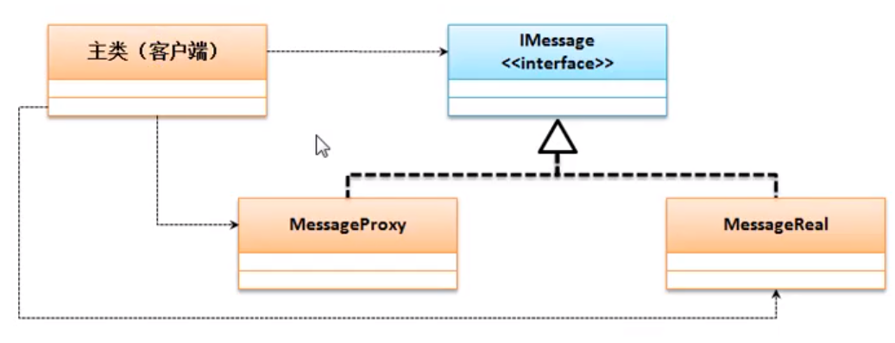

​	以上的代理设计模式为静态代理设计，这种静态代理设计的特点在于：一个代理类只为一个接口服务，如果现在有3千个业务接口，则按照此种做法意味着需要编写3千个代理类，并且这3千个代理类操作形式类似。

​	所以现在需要解决的问题在于：如何让一个代理类满足所有的业务接口操作要求。


## 5.5.2 动态代理设计模式

​	通过静态代理设计模式的缺陷可以发现，最好的做法是为所有功能一致的业务操作接口提供统一的代理处理操作，这就可以通过动态代理机制来实现，但是在动态代理机制中需要考虑如下几点问题：

> 不管是动态代理类，还是静态代理类，都一定要接收真实业务实现子类的对象
>
> 由于动态代理类不再与某一个具体的接口进行捆绑，所以应该可以动态获取类的接口信息

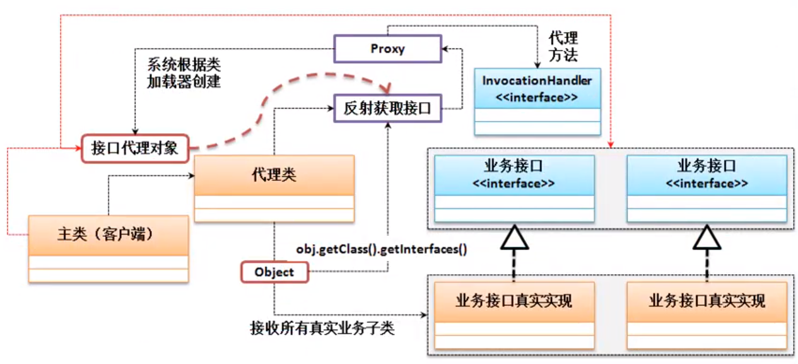

​	在进行动态代理实现的操作之中，首先要关注的就是一个`InvocationHandler`接口，这个接口规定了代理方法的执行：

```java
// 定义代理处理的方法
class MyProxy implements InvocationHandler{
    /**
     * 代理方法调用，代理主题类中执行的方法最终都是此方法
     * @param proxy     要代理的对象
     * @param method    要执行的接口方法名称
     * @param args      传递的参数
     * @return          某个方法的返回值
     * @throws Throwable
     */
    @Override
    public Object invoke(Object proxy, Method method, Object[] args) throws Throwable {
        return null;
    }
}
```

​	在进行动态代理设计的时候对于<u>动态代理对象的创建</u>是由JVM底层完成的，此时依靠的是java.lang.reflect.Proxy程序类，而这个程序类中只提供有一个核心方法：

```java
// 代理对象
public static Object newProxyInstance(ClassLoader loader, Class<?>[] interfaces, InvocationHandler h)
    |- ClassLoader loader			获取当前真实主题类的ClassLoader
    |- Class<?>[] interfaces		代理是围绕接口进行的，所以一定要获取当前真实主题类的接口信息
    |- InvocationHandler h			代理处理的方法
```

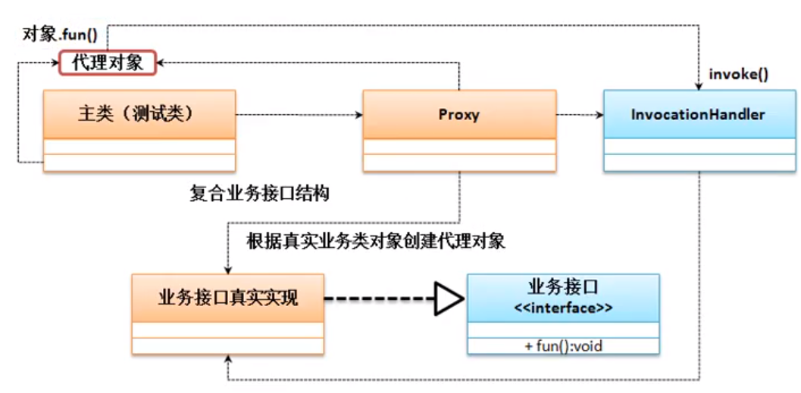

​	实现动态代理机制的完整代码：

```java
package study.pcr;

import java.lang.reflect.InvocationHandler;
import java.lang.reflect.Method;
import java.lang.reflect.Proxy;

interface IMessage2{     // 传统代理设计必须有接口
    public void open();	//新增了一个业务方法
    public void send(); //业务方法
}

class MessageReal implements IMessage2{
    @Override
    public void open() {
        System.out.println("打开文件");
    }
    @Override
    public void send() {
        System.out.println("发送消息");
    }
}

class MyProxy implements InvocationHandler{
    private Object target;      // 保存真实业务对象

    /**
     * 进行真实业务对象与代理业务对象的绑定处理
     * @param target    真实业务对象
     * @return          Proxy生成的代理业务对象
     */
    public Object bind(Object target){
        this.target = target;
        return Proxy.newProxyInstance(target.getClass().getClassLoader(), target.getClass().getInterfaces(), this);
    }

    public boolean connect(){
        System.out.println("消息通道连接");
        return true;
    }

    public void close(){
        System.out.println("关闭消息通道");
    }

    /**
     * 代理方法调用，代理主题类中执行的方法最终都是此方法
     * @param proxy     要代理的对象
     * @param method    要执行的接口方法名称
     * @param args      传递的参数
     * @return          某个方法的返回值
     * @throws Throwable
     */
    @Override
    public Object invoke(Object proxy, Method method, Object[] args) throws Throwable {
        System.out.println("******** 【执行方法：】 " + method);
        Object returnData = null;
        if(this.connect()){
            returnData = method.invoke(this.target, args);
            this.close();
        }
        return returnData;
    }
}


public class Demo {
    public static void main(String[] args) {
        IMessage2 msg = (IMessage2) new MyProxy().bind(new MessageReal());
        msg.open();
        msg.send();
    }
}
```

​	如果认真观系统中提供的`Proxy.newProxyInstance()`方法，会发现该方法会使用大量的底层机制来进行代理对象的动态创建，所有的代理类是复合所有相关功能需求的操作功能类，它不再代表具体的接口，这样在处理时就必须依赖于类加载器与接口进行代理对象的伪造。


## 5.6 反射与Annotation

### 5.6.1 获取Annotation 信息

​	在进行类、方法或属性成员定义的时候，都可以使用一系列的Annotation进行声明，于是如果想要获取这些Annotation的信息，那么就可以直接通过反射来完成。在`java.lang.reflect`中有一个`AccessibleObject`类，在本类中提供有获取Annotation类的方法：

```java
// 获取全部 Annotation
public Annotation[] getAnnotations()
// 获取指定 Annotation
public <T extends Annotation> T getAnnotation(Class<T> annotaionClass)
```

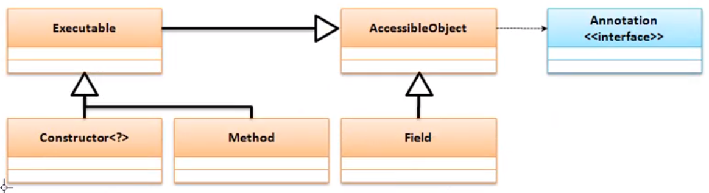

* **示例：定义一个接口，并且在接口上使用 Annotation**

  ```java
  package study.pcr;
  
  import java.io.Serializable;
  import java.lang.annotation.Annotation;
  import java.lang.reflect.Method;
  
  @FunctionalInterface
  @Deprecated()
  interface IPCRMessage{
      public void send(String msg);
  }
  
  @SuppressWarnings("serial")
  class PCRMessageImpl implements IPCRMessage, Serializable {
      @Override
      public void send(String msg) {
          System.out.println("【消息发送】" + msg);
      }
  }
  
  
  public class Demo {
      public static void main(String[] args) throws NoSuchMethodException {
          {   // 获取接口上的 Annotation信息
              Annotation[] annotations = IPCRMessage.class.getAnnotations();     // 获取接口上的全部 Annotation
              for (Annotation temp: annotations){
                  System.out.println(temp);
              }
          }
          System.out.println("-----------------------------------------------");
          {   // 获取PCRMessageImpl子类上的 Annotation
              Annotation[] annotations = PCRMessageImpl.class.getAnnotations();     // 获取子类上的全部 Annotation
              for (Annotation temp: annotations){
                  System.out.println(temp);
              }
          }
          System.out.println("-----------------------------------------------");
          {   // 获取PCRMessageImpl.send()方法上的 Annotation
              Method method = PCRMessageImpl.class.getDeclaredMethod("send", String.class);
              Annotation[] annotations = method.getAnnotations();     // 获取方法上的全部 Annotation
              for (Annotation temp: annotations){
                  System.out.println(temp);
              }
          }
      }
  }
  // 以上程序，子类和方法上的@SuppressWarnings和@Override注解无法获取
  ```

  ​	不同的 Anotation 有它的存在范围。


### 5.6.2 自定义 Annotation

​	在Java中提供 “@interface” 来自定义 Annotation

* **示例：自定义Annotation**

  ```java
  package study.pcr;
  
  import java.lang.annotation.Retention;
  import java.lang.annotation.RetentionPolicy;
  import java.lang.reflect.Method;
  
  @Retention(RetentionPolicy.RUNTIME)     // 定义Annotation为运行时策略
  @interface DefaultAnnotaion{    // 自定义的Annotation
      public String title();    // 获取数据
      public String url() default "www.baidu.com";    // 获取数据，默认值
  }
  
  class Message{
      @DefaultAnnotaion(title = "Annotation Test")
      public void send(String msg){
          System.out.println("【消息发送】" + msg);
      }
  }
  
  public class Demo {
      public static void main(String[] args) throws Exception {
          Method method = Message.class.getMethod("send", String.class);  // 获取指定方法
          DefaultAnnotaion anno = method.getAnnotation(DefaultAnnotaion.class);       // 获取指定方法上的Annotation
          System.out.println(anno.title());   // 直接调用Annotation中的方法
          System.out.println(anno.url());     // 直接调用Annotation中的方法
          String msg = anno.title() + "(" + anno.url() + ")";     // 组合消息内容并发送
          method.invoke(Message.class.getDeclaredConstructor().newInstance(), msg);
      }
  }
  ```

  ​	使用Annotation之后的最大特点是可以结合反射机制实现程序的处理。


### 5.6.3  工厂设计模式与Annotation整合

​	现在已经清楚了Annotation的整体作用，但是Annotation到底在开发之中能做哪些事情呢？下面将结合工厂设计模式来应用Annotation操作。

```java
package study.pcr;

import java.lang.annotation.Retention;
import java.lang.annotation.RetentionPolicy;
import java.lang.reflect.InvocationHandler;
import java.lang.reflect.Method;
import java.lang.reflect.Proxy;

interface IMessage{
    public void send(String msg);
}

class PCRMessageImpl implements IMessage{
    @Override
    public void send(String msg) {
        System.out.println("【消息发送】" + msg);
    }
}

class MessageProxy implements InvocationHandler{
    private Object target;
    public Object bind(Object target){
        this.target = target;
        return Proxy.newProxyInstance(target.getClass().getClassLoader(), target.getClass().getInterfaces(), this);
    }

    public boolean connect(){
        System.out.println("【代理操作】进行消息发送通道的连接。");
        return true;
    }
    public void close(){
        System.out.println("【代理操作】关闭连接通道。");
    }

    @Override
    public Object invoke(Object proxy, Method method, Object[] args) throws Throwable {
        try {
            if(this.connect()){
                return method.invoke(this.target, args);
            } else {
                throw new Exception("【ERROR】消息无法进行发送");
            }
        } finally {
            this.close();
        }
    }
}

class Factory{
    private Factory(){}
    public static <T> T getInstance(Class<T> clazz){
        try {
            return (T) new MessageProxy().bind(clazz.getDeclaredConstructor().newInstance());
        } catch (Exception e){
            e.printStackTrace();
            return null;
        }
    }
}

@Retention(RetentionPolicy.RUNTIME)
@interface UseMessage{
    public Class<?> clazz();
}

@UseMessage(clazz = PCRMessageImpl.class)       // 利用Annotation实现类的使用
class MessageService{
    private IMessage Message;
    public MessageService(){
        UseMessage useMessage = MessageService.class.getAnnotation(UseMessage.class);   // 获取类上的指定的Annotation
        this.Message = (IMessage) Factory.getInstance(useMessage.clazz());      // 直接通过Annotation获取
    }
    public void send(String msg){
        this.Message.send(msg);
    }
}

public class Demo {
    public static void main(String[] args) throws Exception {
        MessageService messageService = new MessageService();
        messageService.send("动态代理结合工厂设计模式和Annotation");
    }
}
// 后面如果新增了消息的具体实现类，例如NetMessageImpl，只需要更改注解中的值为
@UseMessage(clazz = NetMessageImpl.class)  即可
```

​	由于Annotation的存在，所以对于面向接口的编程的配置处理将可以直接利用Annotation的属性完成控制，从而使得整体代码变得简洁。

# 六、集合

## 6.1 类集合框架简介

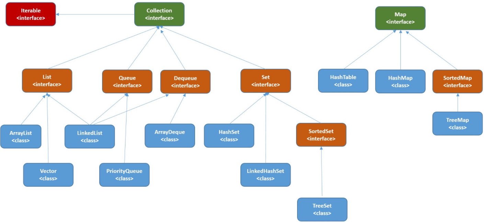

​	类集合框架封装了数据结构以及操作这些数据结构的高效方法。

​	在整个类集框架中提供有如下几个核心接口：Collection、List、Set、Map、Iterator、Enumeration、Queue、ListIterator。

​	`Java.util.Collection` 是单值集合操作的最大的父接口，在该接口中定义有所有的单值数据的处理操作，这个接口中定义有如下的操作方法：

| No.  | 方法名称                                         | 说明                                               |
| ---- | ------------------------------------------------ | -------------------------------------------------- |
| 1    | ==public boolean add(E e)==                      | 向集合保存单个数据                                 |
| 2    | public boolean addAll(Collection<? extends E> c) | 向集合中追加一组数据                               |
| 3    | public void clear()                              | 清空集合，让根节点为空，同时执行GC处理             |
| 4    | public boolean contains(Object o)                | 查询数据是否存在，需要equals()方法支持             |
| 5    | public boolean remove(Object o)                  | 数据删除，需要equals()方法支持                     |
| 6    | public boolean removeAll(Collection<?> c)        | 数据删除，删除两个集合的交集，需要equals()方法支持 |
| 7    | public int size()                                | 获取集合长度                                       |
| 8    | public Object[ ] toArray                         | 将集合变为对象数组返回                             |
| 9    | ==public Iterator<E> iterator==                  | 将集合变为Iterator接口返回                         |

​	在进行集合操作是有两个方法最为常用：【增加】`add()`、【输出】`iterator()`，在JDK1.5之前，`Collection`只是一个独立的接口，但是从JDK1.5开始，提供了`Iterable`父接口，并且在JDK1.8之后针对Iterable接口也得到了一些扩充。

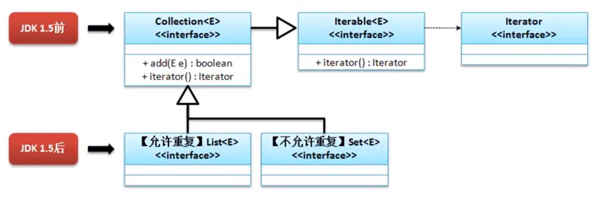


## 6.2 List 集合

​	`List` 是 `Collection` 子接口，其最大的特点是有序、可重复，该接口的定义如下：

```java
public interface List<E> extends Collection<E>
```

​	List 子接口对 Collection 接口进行了方法扩充。

| No.  | 方法                                  | 描述                 |
| ---- | ------------------------------------- | -------------------- |
| 1    | public E get(int index)               | 获取指定索引上的数据 |
| 2    | public E set(int index, E element)    | 修改指定索引数据     |
| 3    | public ListIterator<E> listIterator() | 返回ListIterator接口 |

​	List 本身仍然是一个接口，那么对于接口要想使用则一定要使用子类来完成定义，在List子接口中有三个常用子类：ArrayList、LinkedList、Vector。

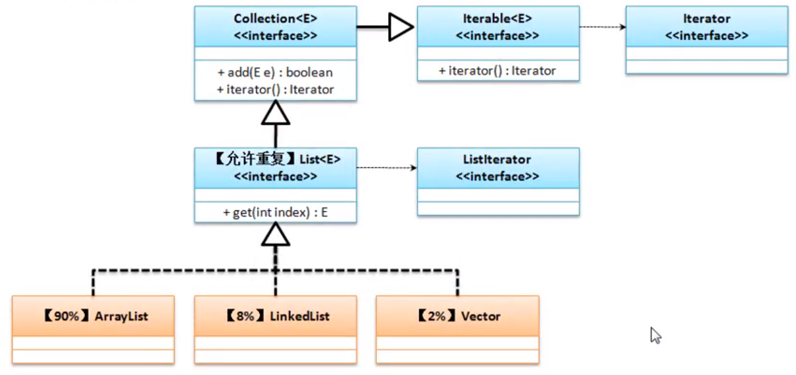


### 6.2.1 ArrayList

​	Java中`ArrayList`类的定义如下：

```java
public class ArrayList<E> extends AbstractList<E> implements List<E>, RandomAccess, Cloneable, Serializable
```

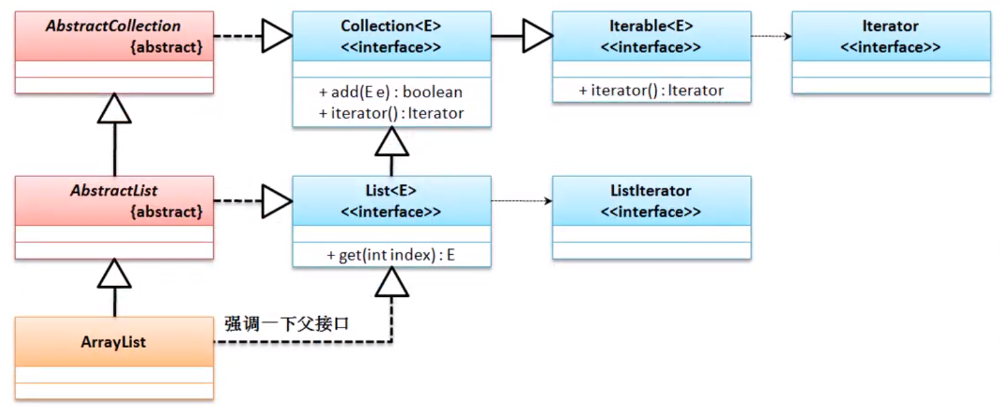

​	[ArrayList详解:   G:\各种学习资料\Java3y资源（更多干货关注公众号「Java3y」\Java集合 电子书](File:///G:/各种学习资料/Java3y资源（更多干货关注公众号「Java3y」/Java集合电子书)

​	在使用`ArrayList`时，最好估算出数据量会有多少，如果超过了10个，那么使用有参构造方法进行创建，以避免扩容时的数组拷贝和垃圾数据的空间产生。


### 6.2.2 LinkedList

```java
public class LinkedList<E> extends AbstractSequentialList<E> implements List<E>, Deque<E>, Cloneable, Serializable
```


​	[LinkedList详解：G:/各种学习资料/Java3y资源（更多干货关注公众号「Java3y」/Java集合电子书](File:///G:/各种学习资料/Java3y资源（更多干货关注公众号「Java3y」/Java集合电子书)


## 6.3 Set 集合

### 6.3.1 Set 集合简介

```java
public interface Set<E> extends Collection<E>
```

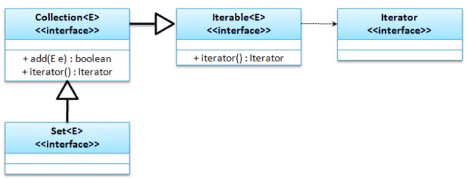


### 6.3.2 HashSet 子类

```java
public class HashSet<E> extends AbstractSet<E> implements Set<E>, Cloneable, Serializable
```

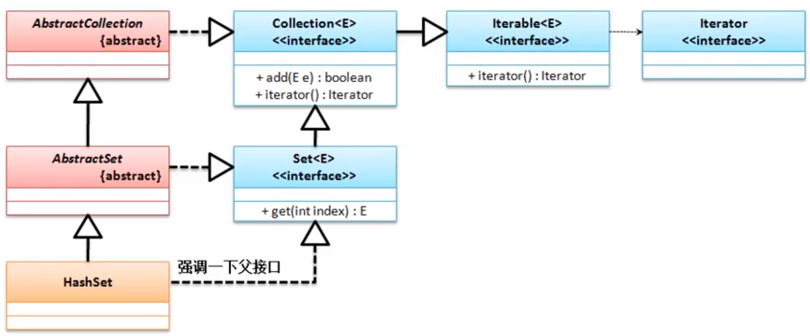


### 6.3.3 TreeSet 子类

​	`TreeSet` 与 `HashSet` 最大的区别就是`TreeSet` 中保存的数据是有序的，但是需要排序的类，必须实现 `Comparable` 接口，只有实现此接口，才能确认对象的大小关系。`TreeSet` 的定义如下：

```java
public class TreeSet<E> extends AbstractSet<E> implements NavigableSet<E>, Cloneable, Serializable
```

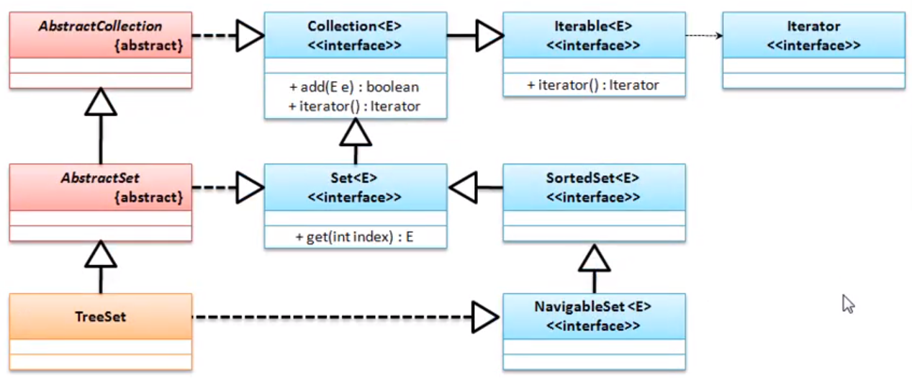

* **TreeSet 排序说明**

  ​	`TreeSet` 本质是利用 `TreeMap` 实现的集合数据的存储，而 `TreeMap` 就需要根据 `Comparable` 接口来确定大小关系

  ​	`TreeSet` 中保存的数据是允许排序的，下面使用一个自定义的类来实现排序的处理操作：

  ```java
  package study.pcr;
  
  import java.util.*;
  
  class Person implements Comparable<Person>{
      private String name;
      private int age;
      public Person(String name, int age){
          this.name = name;
          this.age = age;
      }
  
      @Override
      public String toString() {
          return "姓名：" + this.name + "、年龄：" + this.age;
      }
  
      @Override
      public int compareTo(Person per) {      // 在使用自定义类进行比较处理时，一定要将该类之中的所有属性都依次进行大小关系的比较，否则如果某个属性相同时，TreeSet也会认为是重复的数据，所以TreeSet是利用了Comparable接口来确认重复数据的。
          if(this.age < per.age){
              return -1;
          } else if(this.age > per.age){
              return 1;
          } else {
              return this.name.compareTo(per.name);
          }
      }
  }
  
  public class Demo {
      public static void main(String[] args) throws Exception {
          Set<Person> set = new TreeSet<>();
          set.add(new Person("小明", 10));
          set.add(new Person("大强", 30));
          set.add(new Person("张三", 10));
          set.add(new Person("张三", 10));
          set.add(new Person("李四", 9));
          set.forEach(System.out::println);
      }
  }
  ```

* **分析重复元素的消除**

  ​	`TreeSet` 子类是利用 `Comparable` 接口来实现重复元素的判断，但是 `Set` 集合的整体特征是不允许保存重复元素。`HashSet` 判断重复元素的方式并不是利用 `Comparable` 接口完成的，它利用的是 `Object` 类中提供的方法实现的：

  > * 对象编码：`public int hashCode()`
  > * 对象比较：`public boolean equals(Object obj)`

  ​	在进行重复元素判断的时候首先利用 `hashCode()` 进行编码的匹配，如果该编码不存在，则表示数据不存在，证明没有重复；如果该编码存在了，则进一步进行对象比较处理，如果发现重复了，则此数据是不允许保存的。

  ​	使用 `HashSet` 保存自定义类时，如果不覆写 `Object`中的 `equals()` 和 `hashCode()` 方法，则无法去除重复数据，如下：

  ```java
  package study.pcr;
  
  import java.util.*;
  
  class Person {
      private String name;
      private int age;
      public Person(String name, int age){
          this.name = name;
          this.age = age;
      }
  
      @Override
      public String toString() {
          return "姓名：" + this.name + "、年龄：" + this.age;
      }
  }
  
  
  public class Demo {
      public static void main(String[] args) throws Exception {
          Set<Person> set = new HashSet<>();
          set.add(new Person("小明", 10));
          set.add(new Person("大强", 30));
          set.add(new Person("张三", 10));
          set.add(new Person("张三", 10));
          set.add(new Person("李四", 9));
          set.forEach(System.out::println);
      }
  }
  // 运行结果
  姓名：张三、年龄：10
  姓名：李四、年龄：9
  姓名：大强、年龄：30
  姓名：小明、年龄：10
  姓名：张三、年龄：10
  ```

  ​	可以使用 IDEA 中的工具，自动为 Person 类生成 `equals()` 和 `hashCode()` 方法：ALT + Insert

  ```java
  class Person {
      private String name;
      private int age;
      public Person(String name, int age){
          this.name = name;
          this.age = age;
      }
  
      @Override
      public boolean equals(Object o) {
          if (this == o) return true;
          if (o == null || getClass() != o.getClass()) return false;
  
          Person person = (Person) o;
  
          if (age != person.age) return false;
          return name != null ? name.equals(person.name) : person.name == null;
      }
  
      @Override
      public int hashCode() {
          int result = name != null ? name.hashCode() : 0;
          result = 31 * result + age;
          return result;
      }
  
      @Override
      public String toString() {
          return "姓名：" + this.name + "、年龄：" + this.age;
      }
  }
  ```

  ​	在Java程序之中真正的重复元素的判断处理利用的就是 `hashCode()` 和 `equals()` 两个方法共同完成的，而只有在排序要求的情况下（`TreeSet`、`TreeMap`）才会利用 `Comparable` 接口来实现。


## 6.4 集合输出

### 6.4.1 Iterator 迭代输出

​	通过 `Collection` 接口的继承关系可以发现，从JDK1.5开始其多继承了一个Iterable父接口，并且在这个接口里面定义有 `iterator()` 操作方法，通过此方法可以获取 `Iterator` 接口对象（在JDK1.5之前，这一方法直接定义在 `Collection` 接口中）

*  `Iterator` 接口

  > * 获取 `Iterator`  接口对象：public Iterator<T> iterator()
  >
  > * 在  `Iterator` 接口中定义有如下的方法：
  >
  >   | 方法名称                     | 功能           |
  >   | ---------------------------- | -------------- |
  >   | pulic boolean hasNext()      | 判断是否有数据 |
  >   | public E next()              | 取出当前数据   |
  >   | public default void remove() | 删除           |

* **示例：使用 `Iterator` 输出** 

  ```java
  package study.pcr;
  
  import java.util.*;
  
  public class Demo {
      public static void main(String[] args) throws Exception {
          Set<String> set = new HashSet<String>(Arrays.asList("小强", "中强", "大强"));
          Iterator<String> iter = set.iterator();		// 示例化 Iterator 接口对象
          while (iter.hasNext()){
              String str = iter.next();
              System.out.println(str);
          }
      }
  }
  ```

​	但是对于 `Iterator` 接口中的 `remove()` 方法的使用需要特别注意一下。在 `Collection` 接口中定义有 `remove()` 方法，但是==在进行迭代输出的过程中，如果使用了 `Collection` 中的 `remove()` 方法会导致迭代失败。==

* **示例：Iterator 迭代过程中使用 Collection 的 remove() 方法导致程序出错**

  ```java
  package study.pcr;
  
  import java.util.*;
  
  public class Demo {
      public static void main(String[] args) throws Exception {
          Set<String> set = new HashSet<String>(Arrays.asList("小强", "中强", "大强"));
          Iterator<String> iter = set.iterator();
          while (iter.hasNext()){
              String str = iter.next();
              if ("中强".equals(str)){
                  set.remove("中强");   // 在Iterator迭代过程中使用Collection中的remove()方法进行删除
              } else {
                  System.out.println(str);
              }
          }
          System.out.println(set);
      }
  }
  // 程序报错
  // Exception in thread "main" java.util.ConcurrentModificationException
  ```

  ​	上面程序无法进行数据的删除处理操作，此时只能使用 `Iterator` 接口中的 `remove()` 方法进行删除：

  ```java
  public static void main(String[] args) throws Exception {
      Set<String> set = new HashSet<String>(Arrays.asList("小强", "中强", "大强"));
      Iterator<String> iter = set.iterator();
      while (iter.hasNext()){
          String str = iter.next();
          if ("中强".equals(str)){
              iter.remove();   // 使用 Iterator 接口中的 remove() 方法删除
          } else {
              System.out.println(str);
          }
      }
      System.out.println(set);
  }
  ```


### 6.4.2 ListIterator 双向迭代输出

​	`Collection` 接口中没有获取 `ListIterator` 接口对象的方法，在子接口 `List` 中才有，也就是说 `ListIterator` 接口是专门为 `List` 准备的。

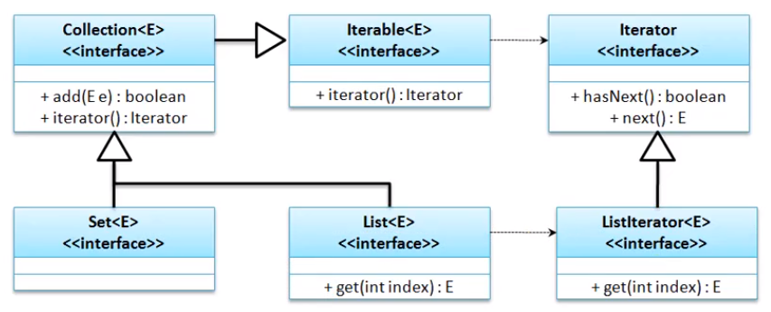

​	在 ListIterator 接口中定义有如下的操作方法：

> * 判断是否有前或后一个元素：
>
>   public boolean hasPrevious()			public boolean hasNext()
>
> * 获取<u>当前元素</u>或后一个元素：
>
>   public E previous()							 public E next()
>
> * 添加、修改元素：
>
>   public void add()								public void set()

* **示例：实现双向迭代**

  ```java
  package study.pcr;
  
  import java.util.*;
  
  public class Demo {
      public static void main(String[] args) throws Exception {
          List<String> list = new ArrayList<>(Arrays.asList("中国", "浙江", "杭州"));
          ListIterator listIter = list.listIterator();
          System.out.println("由前向后输出：");
          while(listIter.hasNext()){
              System.out.print(listIter.next() + "、");
          }
          System.out.println("\n由后向前输出：");
          while (listIter.hasPrevious()){
              System.out.print(listIter.previous() + "、");
          }
      }
  }
  ```

  ​	如果要想实现由后向前的遍历，首先需要实现由前向后的遍历处理。


### 6.4.3 Enumeration 枚举输出

​	`Enumeration` 是在JDK1.0的时候就使用的输出接口，这个输出接口主要是为了 `Vector` 提供服务的，一直到后续的JDK发展，`Enumeration` 依然只为 `Vector`  一个类服务，如果要想获取 `Enumeration` 接口对象，就必须依靠 `Vector` 类提供的方法。


### 6.4.4 foreach 输出

​	除了使用迭代接口实现输出之外，从JDK1.5开始加强型 for 循环也可以实现集合的输出了。

```java
import java.util.*;

public class Demo {
    public static void main(String[] args) throws Exception {
        List<String> list = new ArrayList<>(Arrays.asList("中国", "浙江", "杭州"));
        for (String str: list){
            System.out.print(str + "、");
        }
    }
}
```


## 6.5 Map 集合

### 6.5.1 Map 接口简介

```JAVA
public interface Map<K, V>
```

​	该接口为一个独立的父接口，并且在对象实例化的时候需要设置 Key 与 Value 的类型。在 `Map` 接口中定义有许多的操作方法，核心方法如下：

| No.  | 方法名称                                  | 功能                                                     |
| ---- | ----------------------------------------- | -------------------------------------------------------- |
| 1    | ==public V put(K key, V value)==          | 保存数据，若key不存在，则返回null；若存在则返回旧的value |
| 2    | ==public V get(Object key)==              | 根据key查询数据                                          |
| 3    | ==public Set<Map.Entry<K,V>> entrySet()== | 将 Map 集合转为 Set 集合                                 |
| 4    | public boolean containsKey(Object key)    | 查询指定的key是否存在                                    |
| 5    | public Set<K> keySet                      | 将 Map 中的key转为 Set 集合                              |
| 6    | public V remove(Object key)               | 根据key删除指定的数据                                    |

​	Map中常用的方法如下：

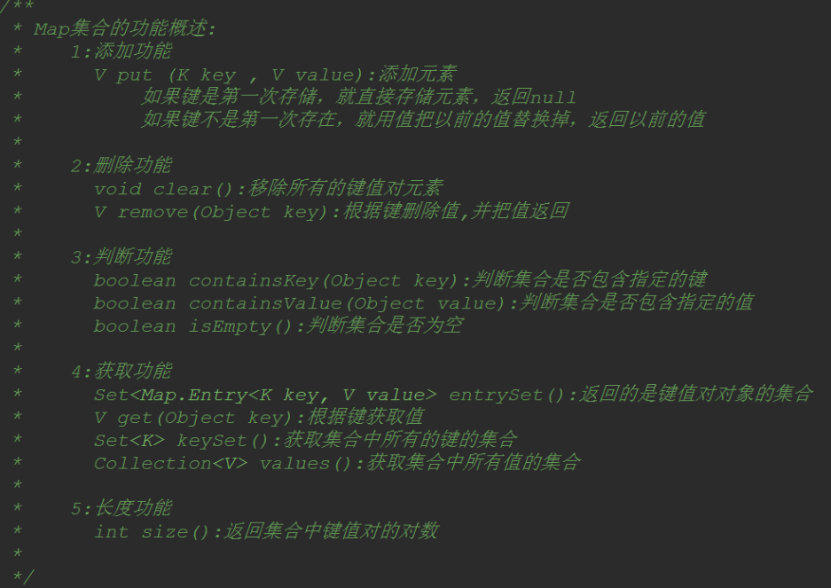


### 6.5.2 HashMap 子类

```java
public class HashMap<K,V> extends AbstractMap<K,V> implements Map<K,V>, Cloneable, Serializable
```

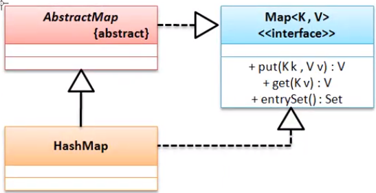

​	[HashMap详细讲解： G:\各种学习资料\Java3y资源（更多干货关注公众号「Java3y」\Java集合 电子书](File:G:\各种学习资料\Java3y资源（更多干货关注公众号「Java3y」\Java集合 电子书)


### 6.5.3 LinkedHashMap 子类

​	如果希望 `Map` 集合中保存的数据的顺序为其增加顺序，则可以更换子类为 `LinkedHashMap` (链表+数组/红黑树)

```java
public class LinkedHashMap<K,V> extends HashMap<K,V> implements Map<K,V>
```

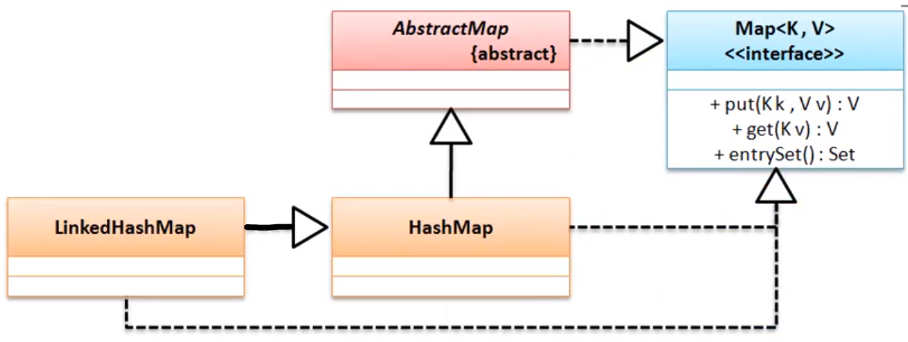

​	[LinkedHashMap详细讲解： G:\各种学习资料\Java3y资源（更多干货关注公众号「Java3y」\Java集合 电子书](File:G:\各种学习资料\Java3y资源（更多干货关注公众号「Java3y」\Java集合 电子书)


### 6.5.4 HashTable 子类

* **HashTable 与 HashMap 的区别**

  HashMap 中的方法都是非线程安全的，HashMap 允许保存一条记录的键为null，多条记录的值为null

  HashTable 中的方法都是线程安全的，HashTable 不允许记录的键或值为null


### 6.5.5 Map.Entry 内部接口

​	`Map` 集合是如何进行数据存储的？对于List（LinkedList子类）而言，依靠的是链表的形式实现数据存储，它将数据保存在Node节点中，虽然在 `HashMap` 中，可以见到Node类型定义，通过源代码定义可以发现， `HashMap`类中的Node内部类本身实现了 `Map.Entry` 接口。

```java
static class Node<K,V> implements Map.Entry<K,V>
```

​	所以可以得出结论，所有的 key 和 value 的数据都被封装在了 `Map.Entry` 接口之中，而此接口定义如下：

```java
public static interface Map.Entry<K, V>
```

​	并且在这个内部类中提供有两个重要的操作方法：

> * 获取 key: public K getKey()
> * 获取 value: piblic V getValue()

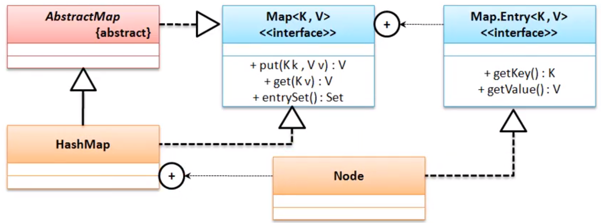

​	总结：在整个的 `Map` 集合中，`Map.Entry` 的主要作用就是作为一个 key 和 value 的包装类型使用，发部分情况下，在进行数据存储时，都会将 key 和 value 包装为一个 `Map.Entry` 对象进行使用


### 6.5.6 利用 Iteretor 输出 Map 集合

​	对于集合的输出而言，最标准的输出是利用 `Iterator` 接口来完成，但是在 `Map` 集合中，并没有一个方法可以直接返回 `Iterator` 的接口对象，所以这种情况下就必须分析不直接提供 `Iterator` 接口实例化的方法的原因，下面对 `Collection` 与 `Map` 集合的存储结构进行一个比较：

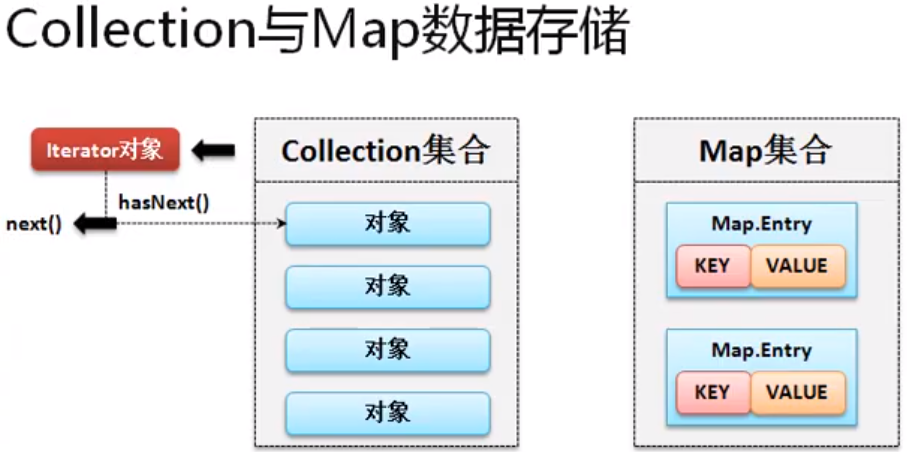

​	可以发现在 `Map` 集合中保存的实际上是一组 `Map.Entry` 接口对象（里面包装的是key与value），所以整个来说，`Map`依然实现的是单值的保存，这样在 `Map` 集合中提供有一个方法，用来将全部的 `Map` 集合转换为 `Set` 集合：

```java
public Set<Map.Entry<K, V>> entrySet()
```

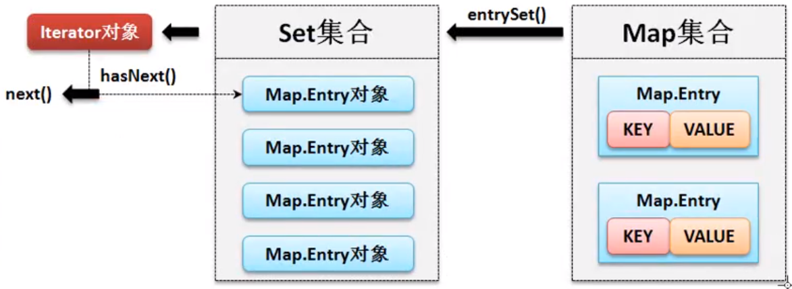

​	经过分析可以发现如果想要使用 `Iterator` 实现 `Map` 集合的输出，则必须按照如下步骤处理：

> * 利用 `Map` 接口中提供的 `entrySet()` 方法将 Map 集合转为 Set 集合
> * 利用 `Set` 接口中的 `iterator()` 方法将 `Set` 集合转为 `Iterator` 接口实例对象
> * 利用 `Iterator` 进行迭代输出，获取每一组的 `Map.Entry` 对象，随后通过 `getKey()` 与 `getValue()` 获取数据

* **示例：利用 `Iterator` 输出 `Map` 集合**

  ```java
  package study.pcr;
  
  import java.util.*;
  
  public class Demo {
      public static void main(String[] args) throws Exception {
          Map<String, Integer> map = new HashMap<>();
          map.put("one", 1);
          map.put("two", 2);
          Set<Map.Entry<String, Integer>> set = map.entrySet();   // 将 Map 转换为 Set 集合
          Iterator<Map.Entry<String, Integer>> iter = set.iterator();
          while(iter.hasNext()){
              Map.Entry temp = iter.next();
              System.out.print(temp.getKey() + ":");
              System.out.print(temp.getValue() + "\n");
          }
      }
  }
  ```

  ​	也可以使用foreach进行输出：

  ```java
  package study.pcr;
  
  import java.util.*;
  
  public class Demo {
      public static void main(String[] args) throws Exception {
          Map<String, Integer> map = new HashMap<>();
          map.put("one", 1);
          map.put("two", 2);
          Set<Map.Entry<String, Integer>> set = map.entrySet();   // 将 Map 转换为 Set 集合
          for(Map.Entry temp: set){
              System.out.print(temp.getKey() + ":");
              System.out.println(temp.getValue());
          }
          // 或者将上述10-13行简写为
          for(Map.Entry temp: map.entrySet()){
              System.out.print(temp.getKey() + ":");
              System.out.println(temp.getValue());
          }
      }
  }
  ```

  ​	不管使用什么方式，`Map` 的迭代遍历都需要先获取到 `Map.Entry` 对象。

# Stream 数据流

​	从JDK1.8开始，由于已经进入了大数据时代，所以在类集中也支持数据的流式分析处理操作，为此专门提供有 `Stream` 的接口，同时在 `Collection` 接口中也提供有为此接口实例化的方法：

> * 获取 `Stream` 接口对象：public default Stream<E> stream()

```java
package study.pcr;

import java.util.*;
import java.util.stream.Collectors;
import java.util.stream.Stream;

public class Demo {
    public static void main(String[] args) throws Exception {
        List<String> list = new ArrayList<>();
        Collections.addAll(list, "Java", "Spring", "Spring Boot","Spring Cloud", "MyBatis", "Redis", "RocketMQ");
        Stream<String> stream = list.stream();
        // 将流中每个String变为小写，判断每个String中是否存在字母"s"，之后跳过1个包含"s"的字符串，取出后面两个包含"s"的字符串，最后将满足条件的数据收集起来转为List集合
        List<String> res = stream.filter((ele)-> ele.toLowerCase().contains("s")).skip(1).limit(2).collect(Collectors.toList());
        System.out.println(res);
    }
}
```

​	从以上示例可以了解到，`Stream` 可以方便的进行数据的收集、分页处理。