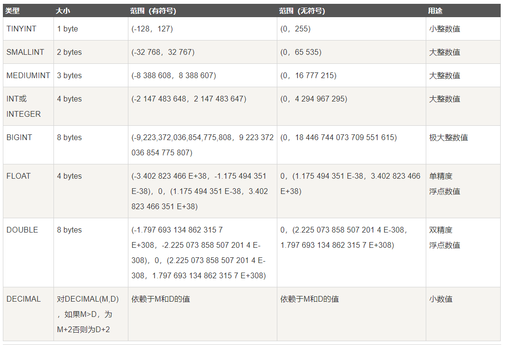
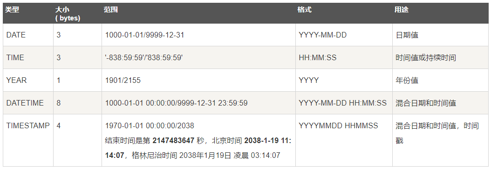
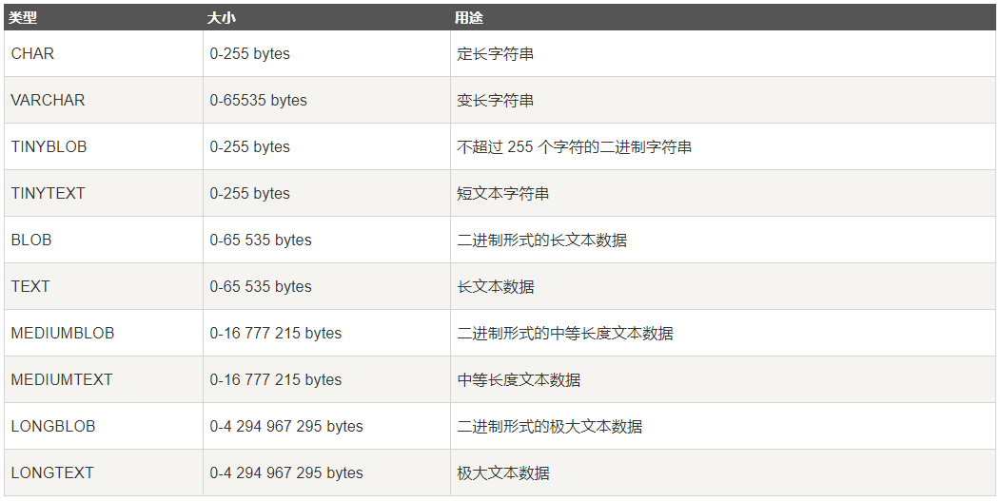
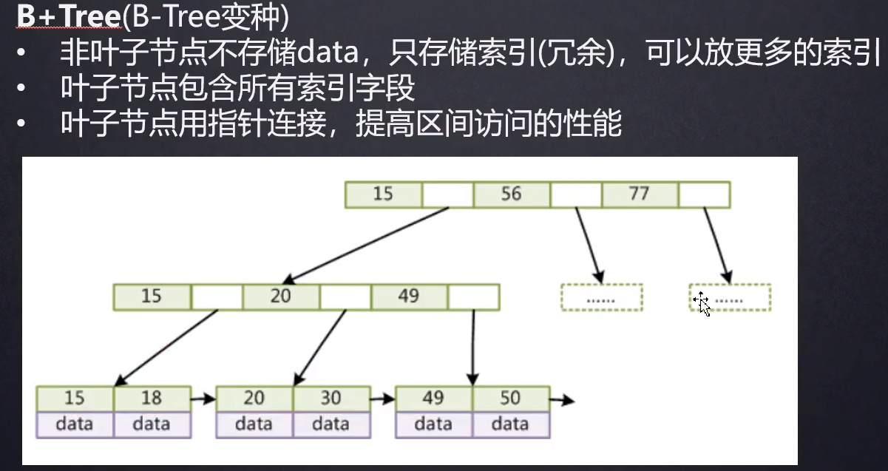
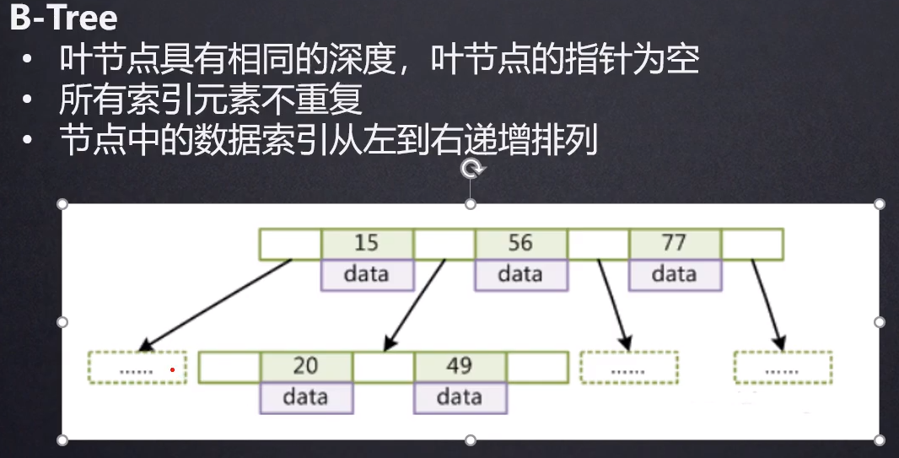
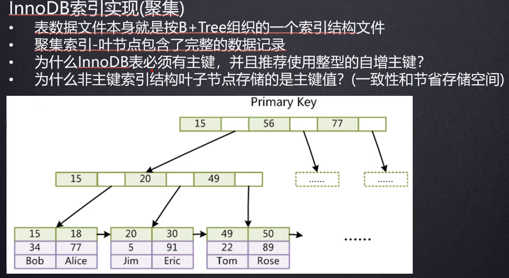
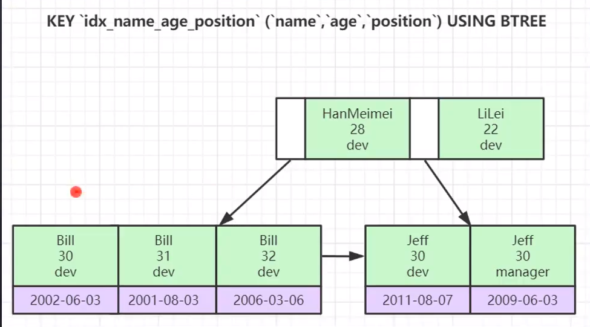

[toc]

---

ACID 各种隔离级别的实现原理

数据类型，长度，占几个字节

索引结构，b+树结构，特点（跟其他树比起来有什么优点，其他树比如平衡二叉树、红黑树，b树）

索引原理（二分法）

sql查询优化，查询优化就是从索引去考虑，如何让sql走索引；最左匹配，覆盖索引，三星索引

数据库锁，可以和mvcc结合起来看

再深入就是隔离性，隔离性的实现原理 mvcc

# 一、数据类型

* **数字类型**

  

* **日期和时间类型**

  

* **字符串类型**

  

# 二、索引

​	索引是帮助数据库高效获取数据的<u>==排好序==</u>的<u>数据结构</u>

## 1.1 索引的数据结构

* **索引常用的数据结构：**

  > B+ Tree：
  >
  > 
  >
  > Hash(不支持范围查找，例如 select * from table where id>20)
  >
  > 全文索引

* **B 数和 B+ 数的区别：**

  > ​	B 树：
  >
  > 
  >
  > ​	B 树的非叶子节点同样存储数据，每层节点可以放得索引个数减少；叶子节点间不存在双向指针，对范围查找的场景不友好

## 1.2 关于InnoDB索引的几个注意点

1. <u>InnoDB 存储引擎的表必须有主键</u>，因为这样可以按照B+ Tree 组织整张表。如果开发者建立表时没有设定主键，InnoDB 会从第一列开始，直到找到某一列中的所有记录不存在重复，将该列作为主键；如果没有这样的一列数据，InnoDB 也会帮我们维护一个隐藏的主键列。
2. <u>推荐主键为整型自增</u>，推荐主键为整型是因为在查找时，需要进行主键索引间的大小比较，整型相对字符串等类型比较效率更高；自增是因为使得每次插入的索引都是在最后一个叶子节点后面进行插入，避免 B+ 树的频繁分裂
3. 非主键索引的叶子节点并不存储完整的一行数据，仅仅存储主键值，拿到主键后再到 B+ Tree 中去取出完整的数据记录。

## 1.3 联合索引

​	联合索引就是将2个及以上的字段联合组合为索引。联合索引间比较大小是从左到右一个个字段进行，若第一个字段能比较出两条数据间的大小，则停止比较，否则继续比较后面的字段。

* **索引最左前缀原理**

  

  ​	联合索引的最左匹配是因为，如果不从第一个字段逐个向后比较，单纯看后面的字段，其实是没有排好序的。例如上面的场景，如果划掉叶子节点的第一行“name”的索引，"age"索引、"position"索引压根是没有排序的

# 二、explain详解

## 2.1 explain 字段

| 列名          | 描述                                                   |
| ------------- | ------------------------------------------------------ |
| id            | 在一个大的查询语句中，每个select关键字对应一个唯一的id |
| select_type   | select关键字对应的那个查询的类型                       |
| table         | 表名                                                   |
| partions      | 匹配的分区信息                                         |
| type          | 针对单表的访问方法                                     |
| possible_keys | 可能用到的索引                                         |
| key           | 实际上使用的索引                                       |
| key_len       | 实际使用的索引长度                                     |
| ref           | 当使用索引列等值查询时，与索引列进行等值匹配的对象信息 |
| rows          | 预估的需要读取的记录数                                 |
| filtered      | 某个表经过搜索条件过滤后剩余条数的百分比               |
| Extra         | 一些额外的信息                                         |

* **type字段**（以下查询方法，查询性能从上到下依次递减）

  1. **system**：当表中只有一条记录并且该表使用的存储引擎的统计数据是精确的，比如MylSAM、Memory

  2. **const**：单表中最多有一个匹配行，例如primary key或者unique index

  3. **eq_ref**：在连接查询中，对于前面的每一行，在此表中只查询一条记录，简单来说，就是多表连接中使用primary key或者unique index

  4. **ref**：与eq_ref类似， 区别在于不是使用primary key 或者 unique index，而是使用普通的索引

  5. **ref_or_null**：与 ref 类似，区别在于条件中包含对 NULL 的查询
  6. **index_merge**(索引合并优化)
  7. **unique_subquery**（in的后面是一个查询主键字段的子查询）
  8.  **index_subquery** （与 unique_subquery 类似，区别在于 in 的后面是查询非唯一索引字段的子查询）
  9.  **range** （单表中的范围查询）
  10. **index** （对于前面的每一行， 都通过查询索引来得到数据）
  11.  **all** （对于前面的每一行，都通过全表扫描来得到数据）

  