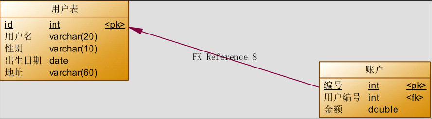

[toc]

---

本文参考教程为b站视频：https://www.bilibili.com/video/BV1tf4y1U7pi，主要利用课程笔记的pdf自主学习，本地笔记目录：G:\各种学习资料\Java\56.mybatis\mybatis

本文使用的MyBatis版本为3.4.5

# 一、MyBatis 简介

​	 MyBatis 是一款优秀的持久层框架，它支持自定义 SQL、存储过程以及高级映射。MyBatis 免除了几乎所有的 JDBC 代码以及设置参数和获取结果集的工作。MyBatis 可以通过简单的 XML 或注解来配置和映射原始类型、接口和 Java POJO（Plain Old Java Objects，普通老式 Java 对象）为数据库中的记录。 

# 二、入门示例

## 2.1 添加 MyBatis 相关坐标

​	创建 Maven 工程，在 pom.xml 文件中添加相关依赖

```xml
  <dependencies> 
   <dependency> 
     <groupId>org.mybatis</groupId> 
     <artifactId>mybatis</artifactId> 
     <version>3.4.5</version> 
   </dependency> 
   <dependency> 
     <groupId>junit</groupId> 
     <artifactId>junit</artifactId> 
     <version>4.10</version> 
     <scope>test</scope> 
   </dependency> 
   <dependency> 
     <groupId>mysql</groupId> 
     <artifactId>mysql-connector-java</artifactId> 
     <version>5.1.6</version> 
     <scope>runtime</scope> 
   </dependency> 
   <dependency> 
     <groupId>log4j</groupId> 
     <artifactId>log4j</artifactId> 
     <version>1.2.12</version> 
   </dependency> 
  </dependencies>
```


## 2.2 项目整体结构


​	domain下的 `User` 为实体类；dao下的 `IUserDao` 是操作数据库的接口；mapping下的 `IUserDao.xml` 是MyBatis<u>映射文件</u>，该文件指定了Dao接口和方法，以及该方法下的sql执行语句和结果集的封装的实体；resources下的  `SqlMapConfig.xml` 是<u>配置文件</u>，配置了数据库的连接信息，并和映射文件相关联。


## 2.3 具体代码

* **编写 User 实体类**

  ```java
  package study.pcr.demo1.domain;
  
  import lombok.Getter;
  import lombok.Setter;
  import lombok.ToString;
  
  import java.io.Serializable;
  import java.util.Date;
  
  @Getter
  @Setter
  @ToString
  public class User implements Serializable {
      private Integer id;
      private String username;
      private Date birthday;
      private String sex;
      private String address;
  }
  ```

* **编写持久层接口 IUserDao**

  ```java 
  package study.pcr.demo1.dao;
  
  import study.pcr.demo1.domain.User;
  
  import java.util.List;
  
  public interface IUserDao {
      List<User> findAll();
  }
  ```

* **编写持久层接口的映射文件 IUserDao.xml**

  ```xml
  <?xml version="1.0" encoding="UTF-8"?>
  <!DOCTYPE mapper
          PUBLIC "-//mybatis.org//DTD Mapper 3.0//EN"
          "http://mybatis.org/dtd/mybatis-3-mapper.dtd">
  
  
  <mapper namespace="study.pcr.demo1.dao.IUserDao"> <!--该namespace属性值必须是持久层接口的全限定类名-->
      <!-- 配置查询所有操作 -->
      <select id="findAll" resultType="study.pcr.demo1.domain.User">	<!--该标签的id值必须和持久层接口的方法名相同-->
     select * from user
    </select>
  </mapper>
  ```

* **编写 SqlMapConfig.xml 配置文件**

  ```xml
  <?xml version="1.0" encoding="UTF-8"?>
  <!DOCTYPE configuration
          PUBLIC "-//mybatis.org//DTD Config 3.0//EN"
          "http://mybatis.org/dtd/mybatis-3-config.dtd">
  <configuration>
      <!-- 配置 mybatis 的环境 -->
      <environments default="mysql">
          <!-- 配置 mysql 的环境 -->
          <environment id="mysql">
              <!-- 配置事务的类型 -->
              <transactionManager type="JDBC"></transactionManager>
              <!-- 配置连接数据库的信息：用的是数据源(连接池) -->
              <dataSource type="POOLED">
                  <property name="driver" value="com.mysql.jdbc.Driver"/>
                  <property name="url" value="jdbc:mysql://localhost:3306/study?characterEncoding=utf-8"/>
                  <property name="username" value="root"/>
                  <property name="password" value="1234"/>
              </dataSource>
          </environment>
      </environments>
  
      <!-- 告知 mybatis 映射配置的位置 -->
      <mappers>
          <mapper resource="mapping/IUserDao.xml"/>
      </mappers>
  </configuration>
  ```

* **编写测试类**

  ```java
  import org.apache.ibatis.io.Resources;
  import org.apache.ibatis.session.SqlSession;
  import org.apache.ibatis.session.SqlSessionFactory;
  import org.apache.ibatis.session.SqlSessionFactoryBuilder;
  import study.pcr.demo1.dao.IUserDao;
  import study.pcr.demo1.domain.User;
  
  import java.io.InputStream;
  import java.util.List;
  
  public class Demo1Test {
      public static void main(String[] args) throws Exception {
          //1.读取配置文件
          InputStream in = Resources.getResourceAsStream("SqlMapConfig.xml");
          //2.创建 SqlSessionFactory 的构建者对象
          SqlSessionFactoryBuilder builder = new SqlSessionFactoryBuilder();
          //3.使用构建者创建工厂对象 SqlSessionFactory
          SqlSessionFactory factory = builder.build(in);
          //4.使用 SqlSessionFactory 生产 SqlSession 对象
          SqlSession session = factory.openSession();
          //5.使用 SqlSession 创建 dao 接口的代理对象
          IUserDao userDao = session.getMapper(IUserDao.class);
          //6.使用代理对象执行查询所有方法
          List<User> users = userDao.findAll();
          for(User user: users){
              System.out.println(user);
          }
          //7.释放资源
          session.close();
          in.close();
      }
  }
  ```

# 三、CRUD 的简单操作

## 3.1 代码实现

### 3.1.1 实体类 User

```java 
package study.pcr.demo1.domain;

import lombok.Getter;
import lombok.Setter;
import lombok.ToString;

import java.io.Serializable;
import java.util.Date;

@Getter
@Setter
@ToString
public class User implements Serializable {
    private Integer id;
    private String username;
    private Date birthday;
    private String sex;
    private String address;
}
```

### 3.1.2 持久层接口 IUserDao

```java
package study.pcr.demo1.dao;

import study.pcr.demo1.domain.User;

import java.util.List;

public interface IUserDao {
    // 查询所有的User
    List<User> findAll();

    // 通过id查询相应的User
    User findById(Integer userId);

    // 保存用户
    int saveUser(User user);

    // 更新用户
    int updateUser(User user);

    // 删除用户
    int deleteUser(Integer userId);

    // 用户模糊查询
    List<User> findByName(String userName);
}
```

### 3.1.3 持久层接口映射文件 IUserDao.xml

```xml
<?xml version="1.0" encoding="utf-8"?>
<!DOCTYPE mapper
        PUBLIC "-//mybatis.org//DTD Mapper 3.0//EN"
        "http://mybatis.org/dtd/mybatis-3-mapper.dtd">


<mapper namespace="study.pcr.demo1.dao.IUserDao">
    <!--    保存用户-->
    <insert id="saveUser" parameterType="study.pcr.demo1.domain.User">
        insert into user (username, birthday, sex, address)
            values (#{username}, #{birthday}, #{sex}, #{address})
    </insert>

    <!--    更新用户-->
    <update id="updateUser" parameterType="study.pcr.demo1.domain.User">
        update user set username=#{username}, birthday=#{birthday}, sex=#{sex}, address=#{address} where id=#{id}
    </update>

    <!--    删除用户-->
    <delete id="deleteUser">
        delete from user where id = #{参数只有一个的时候，好像随便怎么写}
    </delete>

    <!--    配置查询所有操作 -->
    <select id="findAll" resultType="study.pcr.demo1.domain.User">
       select * from user
    </select>

    <!--    根据 id 查询-->
    <select id="findById" resultType="study.pcr.demo1.domain.User">
        select * from user where id = #{参数只有一个的时候，好像随便怎么写}
    </select>

    <!--    模糊查询-->
    <!--    ${} 表示拼接 sql 串
            通过${}可以将 parameterType 传入的内容拼接在 sql中且不进行 jdbc 类型转换， ${}可以接收简
            单类型值或 pojo 属性值，如果 parameterType 传输单个简单类型值，${}括号中只能是 value-->
    <select id="findByName" resultType="study.pcr.demo1.domain.User" parameterType="String">
        select * from user where username like '%${value}%'
    </select>
</mapper>
```

* **相关说明**

  1. 持久层映射配置中 mapper 标签的 namespace 属性取值必须是持久层接口的全限定类名

  2. SQL 语句的配置标签<select>,<insert>,<delete>,<update>的 id 属性必须和持久层接口的方法名相同

  3. 属性和符号说明

     | 属性          | 描述                                                         |
     | ------------- | ------------------------------------------------------------ |
     | resultType    | 用于指定结果集的类型                                         |
     | parameterType | 用于指定传入参数的类型                                       |
     | #{}           | 它代表占位符，相当于原来 jdbc 的?，都是用于执行语句时替换实际的数据。该符号可以有效防止sql注入。==如果parameterType传输一个基本类型，#{} 括号中可以是任意的内容== |
     | ${value}      | 表示拼接sql串，不进行java类型和jdbc类型的转换，==如果parameterType传输一个基本类型的参数，那么 ${} 括号中只能写“value”== |

  4. 下面的语句：

     ```xml
     <update id="updateUser" parameterType="study.pcr.demo1.domain.User">
         update user set username=#{username}, birthday=#{birthday}, sex=#{sex}, address=#{address} where id=#{id}
     </update>
     ```

     ​	#{} 括号中的单词代表User类中的属性字段，需要和实体类的属性字段严格对应上

     ​	而MyBatis将查询结果封装到实体类中时，在==windows系统==下是可以区分大小写的：

     ```xml
     <select id="findAll" resultType="study.pcr.demo1.domain.User">
     	select * from user
     </select>
     ```

     ​	上面将查询结果封装到User实体类中，数据库表中的字段和实体类中的属性字段可以有大小写的区别，但是不能有除大小写之外的区别（例如：数据库中单词之间用“_”分割，而实体类使用驼峰命名，则MyBatis不能实现结果集的自动封装），这时，可以通过在映射文件的<mapper>标签下配置 ==`resultMap`== 标签，实现查询到的列名和实体类属性名称不一致时的封装：

     ```xml
     <resultMap type="com.itheima.domain.User" id="userMap"> 
       <id column="id" property="userId"/> 
       <result column="username" property="userName"/> 
       <result column="sex" property="userSex"/> 
       <result column="address" property="userAddress"/> 
       <result column="birthday" property="userBirthday"/> 
     </resultMap>
     ```

     > id 标签：用于指定主键字段 
     > result 标签：用于指定非主键字段 
     > column 属性：用于指定数据库列名 
     > property 属性：用于指定实体类属性名称

     ​	定义好 `<resultMap>`后，就可以像 `<select id="", resultMap="userMap">`  进行使用了

### 3.1.4 SqlMapConfig.xml 配置文件

```xml
<?xml version="1.0" encoding="UTF-8"?>
<!DOCTYPE configuration
        PUBLIC "-//mybatis.org//DTD Config 3.0//EN"
        "http://mybatis.org/dtd/mybatis-3-config.dtd">
<configuration>
    <!-- 配置 mybatis 的环境 -->
    <environments default="mysql">
        <!-- 配置 mysql 的环境 -->
        <environment id="mysql">
            <!-- 配置事务的类型 -->
            <transactionManager type="JDBC"></transactionManager>
            <!-- 配置连接数据库的信息：用的是数据源(连接池) -->
            <dataSource type="POOLED">
                <property name="driver" value="com.mysql.jdbc.Driver"/>
                <property name="url" value="jdbc:mysql://localhost:3306/study?characterEncoding=utf-8"/>
                <property name="username" value="root"/>
                <property name="password" value="1234"/>
            </dataSource>
        </environment>
    </environments>


    <!-- 告知 mybatis 映射配置的位置 -->
    <mappers>
        <mapper resource="mapping/IUserDao.xml"/>
    </mappers>
</configuration>
```

### 3.1.5 测试类

```java
import org.apache.ibatis.io.Resources;
import org.apache.ibatis.session.SqlSession;
import org.apache.ibatis.session.SqlSessionFactory;
import org.apache.ibatis.session.SqlSessionFactoryBuilder;
import org.junit.After;
import org.junit.Before;
import org.junit.Test;
import study.pcr.demo1.dao.IUserDao;
import study.pcr.demo1.domain.User;

import java.io.InputStream;
import java.util.Date;
import java.util.List;

public class Demo2Test {
    private InputStream in;
    private SqlSessionFactory factory;
    private SqlSession session;
    private IUserDao userDao;

    @Test
    public void testFindOne(){
//6.执行操作
        
        // 按id查询
        User user = userDao.findById(1);
        System.out.println(user);

        // 插入
        User user2 = new User();
        user2.setUsername("蜻蜓队长");
        user2.setAddress("北京市顺义区");
        user2.setSex("男");
        user2.setBirthday(new Date());
        System.out.println("保存操作之前："+user2);
        //执行保存方法
        userDao.saveUser(user2);
        System.out.println("保存操作之后："+user2);

        // 更新
        User user3 = userDao.findById(4);
        user3.setSex("male");
        user3.setAddress("稻城");
        int res = userDao.updateUser(user3);
        System.out.println(res);

        // 删除
        int res2 = userDao.deleteUser(4);
        System.out.println(res2);

        // 模糊查询
        List<User> users = userDao.findByName("卡");
        for(User temp: users){
            System.out.println(temp);
        }
    }

    @Before//在测试方法执行之前执行
    public void init()throws Exception {
        //1.读取配置文件
        in = Resources.getResourceAsStream("SqlMapConfig.xml");
        //2.创建构建者对象
        SqlSessionFactoryBuilder builder = new SqlSessionFactoryBuilder();
        //3.创建 SqlSession 工厂对象
        factory = builder.build(in);
        //4.创建 SqlSession 对象
        session = factory.openSession();     // 该方法的参数为autoCommit，表示是否开启事务的自动提交，默认为false
        //5.创建 Dao 的代理对象
        userDao = session.getMapper(IUserDao.class);
    }

    @After//在测试方法执行完成之后执行
    public void destroy() throws Exception{
        // 提交事务，否则在autoCommit为false时增删改的操作不生效
        session.commit();
        //7.释放资源
        session.close();
        in.close();
    }
}
```


## 3.2 MyBatis 动态标签

### 3.2.1 \<if> 标签

```xml
<select id="findByUser" resultType="study.pcr.demo2.domain.User" parameterType="study.pcr.demo2.domain.User">
        select * from user where 1=1
        <if test="username!=null and username!=''">
            and username like #{username}
        </if>
        <if test="address!=null">
            and address like #{address}
        </if>
</select>
```

​	注意：\<if>标签的 test 属性中写的是对象的属性名

### 3.2.2 \<where> 标签

​	为了简化上面 where 1=1 的条件拼装，我们可以采用\<where>标签来简化开发。 

```xml
 <!-- 根据用户信息查询 --> 
  <select id="findByUser" resultType="study.pcr.demo2.domain.User" parameterType="study.pcr.demo2.domain.User"> 
   select * from user
   <where> 
    <if test="username!=null and username != '' "> 
     	and username like #{username} 
    </if> 
    <if test="address != null"> 
     	and address like #{address} 
    </if> 
   </where> 
  </select> 
```

### 3.2.3 \<foreach> 标签

​	要执行的 sql 语句：select 字段 from user where id in(?)

```xml
	<select id="findInIds" resultType="study.pcr.demo2.domain.User" parameterType="study.pcr.demo2.VO.QueryVo">
        select * from user
        <where>
            <if test="ids!=null and ids.size()>0">
                <foreach collection="ids" open="id in(" close=")" item="随便起啥" separator=",">
                    #{随便起啥}
                </foreach>
            </if>
        </where>
    </select>

<!--说明
  <foreach>标签用于遍历集合，它的属性： 
  collection:代表要遍历的集合元素，在这里是QueryVo中的一个包装了id的List属性ids，注意编写时不要写#{} 
  open:代表语句的开始部分 
  close:代表结束部分
  item:代表遍历集合的每个元素，生成的变量名 
  sperator:代表分隔符
-->
```

* **简化重复的 sql 语句的编写** 

  ```xml
  <sql id="defaultSql"> 
     select * from user 
  </sql>
  ```

* **引用代码片段**

  ```xml 
  <!-- 配置查询所有操作 --> 
  <select id="findAll" resultType="user"> 
    <include refid="defaultSql"></include> 
  </select> 
  ```

# 四、多表查询之 一对一 & 一对多  查询

​	本次使用的多表查询案例场景为用户和账户模型。用户为 User 表，账户为 UserAccount 表。一个用户可以有多个账户，一个账户对应一个用户。



​	创建的 `user` 表和 `user_account` 表如下：


## 4.1 一对一/多对一查询

​	现在的需求是查询所有的账户信息，关联查询每个账户的用户信息，sql 语句和查询结果如下：


​	这是一种一对一（或者说多对一）的关系，一个账户对应一个用户

### 4.1.1 定义账户的实体类

```java
package study.pcr.demo3.domain;

import lombok.Getter;
import lombok.Setter;
import lombok.ToString;

import java.io.Serializable;

@Setter
@Getter
@ToString
// 账户实体类
public class UserAccount implements Serializable {
    private Integer id;
    private Integer userId;
    private Double money;

    // 关联用户信息表
    private User user;
}
```

### 4.1.2 定义用户实体类

```java
package study.pcr.demo3.domain;

import lombok.Getter;
import lombok.Setter;
import lombok.ToString;

import java.io.Serializable;
import java.util.Date;
import java.util.List;

@Getter
@Setter
@ToString
// 用户实体类
public class User implements Serializable {
    private Integer id;
    private String username;
    private Date birthday;
    private String sex;
    private String address;
}
```

### 4.1.3 定义账户的持久层Dao接口

```java
package study.pcr.demo3.dao;

import study.pcr.demo3.domain.User;
import study.pcr.demo3.domain.UserAccount;

import java.util.List;

public interface IUserAccountDao {

    /** 一对一查询
     * 查询所有账户，同时获取该账户的所属用户的名称和他的地址信息
     */
    List<UserAccount> findAll();
}
```

### 4.1.4 定义 UserAccountDao.xml 文件

```xml
<?xml version="1.0" encoding="utf-8"?>
<!DOCTYPE mapper
        PUBLIC "-//mybatis.org//DTD Mapper 3.0//EN"
        "http://mybatis.org/dtd/mybatis-3-mapper.dtd">

<mapper namespace="study.pcr.demo3.dao.IUserAccountDao">
    
<!--    一对一/多对一查询   -->
    <!-- 建立对应关系 -->
    <resultMap id="userAccountMap" type="study.pcr.demo3.domain.UserAccount">
        <id column="uaid" property="id"></id>  <!--这里user_account表和user表都有id字段，这里将column指定为另一个名称，然后在下面的select语句中指定查询的别名，这样才能实现查询结果集字段到实体类属性的一一映射，实现准确装配-->
        <result column="userid" property="userId"></result>	
        <result column="money" property="money"></result>
        <!-- association用于指定从表方的引用实体属性的 -->
        <association property="user" javaType="study.pcr.demo3.domain.User">
            <id column="id" property="id"></id>
            <result column="username" property="username"></result>
            <result column="birthday" property="birthday"></result>
            <result column="sex" property="sex"></result>
            <result column="address" property="address"></result>
        </association>
    </resultMap>
    <select id="findAll" resultMap="userAccountMap">    <!--注意这里查询结果的封装类型要写上面定义的resultMap-->
        select ua.id as uaid, ua.userid, ua.money, u.*  <!--这里指定user_account表中的id字段为别名uaid，与上面resultMap中的一致，这样才能实现查询结果集的正确封装-->
        from user_account ua, user u where ua.userid=u.id
    </select>
    
</mapper>
```

​	注意事项：

> 1. 在上面定义 result 时，如果两个连接的表中有相同的字段，在用 column 指定数据库表字段时，最好为相同的字段指定不同的名称，并在下面的 select 语句中使用 as 指定为上面修改的别名
> 2. select 标签中需要指定返回类型为上面定义的 resultMap


## 4.2 一对多查询

​	现在的需求是查询所有的用户，并关联账户表，查询到每个用户下的所有账户信息，sql 语句和查询结果如下：


​	这是一种一对多的关系，一个用户有多个账户

### 4.2.1 用户实体类 

```java
package study.pcr.demo3.domain;

import lombok.Getter;
import lombok.Setter;
import lombok.ToString;

import java.io.Serializable;
import java.util.Date;
import java.util.List;

@Getter
@Setter
@ToString
// 用户实体类
public class User implements Serializable {
    private Integer id;
    private String username;
    private Date birthday;
    private String sex;
    private String address;

    // 关联账户信息
    private List<UserAccount> accounts;
}
```

### 4.2.2 持久层接口 Dao 中加入查询方法

```java
List<User> findAll();
```

### 4.2.3 xml 文件

```xml
<?xml version="1.0" encoding="utf-8"?>
<!DOCTYPE mapper
        PUBLIC "-//mybatis.org//DTD Mapper 3.0//EN"
        "http://mybatis.org/dtd/mybatis-3-mapper.dtd">

<mapper namespace="study.pcr.demo3.dao.IUserAccountDao">

<!--一对多查询-->
    <resultMap id="userAccountMap" type="study.pcr.demo3.domain.User">
        <id column="id" property="id"></id>
        <result column="id" property="id"></result>
        <result column="username" property="username"></result>
        <result column="birthday" property="birthday"></result>
        <result column="sex" property="sex"></result>
        <!-- collection 是用于建立一对多中集合属性的对应关系 -->
            <!--property：关联查询的结果集存储在User对象的哪个属性上-->
            <!--ofType：指定关联查询的结果集中的对象类型-->
        <collection property="accounts" ofType="study.pcr.demo3.domain.UserAccount">
            <id column="aid" property="id"></id>
            <id column="userid" property="userId"></id>
            <id column="money" property="money"></id>
        </collection>
    </resultMap>
    <select id="findAll" resultMap="userAccountMap">
        select u.*, ua.id as aid, ua.userid, ua.money
        from user u
        left join user_account ua on u.id = ua.userid
    </select>
</mapper>
```

