[toc]

---


本文使用的 `Spring` 版本为 5.2.6

# 一、Spring概念

​	Spring 是轻量级的开源的JavaEE框架，其目的在于解决企业应用开发的复杂性。

* **Spring 的特点**
  1. 方便解耦，简化开发
  2. Aop编程支持
  3. 方便程序测试
  4. 方便和其他框架进行整合
  5. 方便进行事务操作
  6. 降低API开发难度

# 二、IOC 容器

​	IOC 即控制反转，简单地说就是把对象的创建和对象之间的调用过程，交给Spring进行管理。

​	IOC思想核心以及它的作用：

> ​		ioc的思想最核⼼的地⽅在于，资源不由使⽤资源的双⽅管理，⽽由不使⽤资源的第三⽅管理，这
> 可以带来很多好处。第⼀，资源集中管理，实现资源的可配置和易管理。第⼆，降低了使⽤资源
> 双⽅的依赖程度，也就是我们说的低耦合度。

## 2.1 IOC 底层原理

​	原理：工厂模式、xml解析、反射

​	即在工厂类中，通过xml文件解析class，之后通过反射机制获取到类的实例化对象

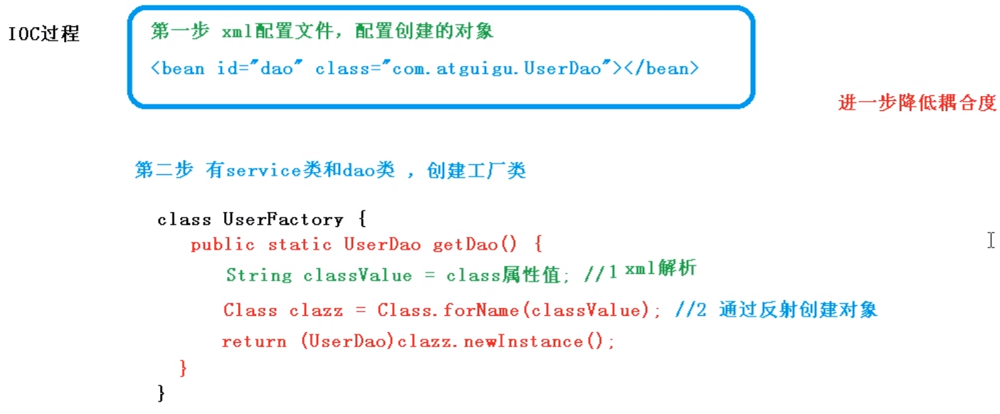

​	IOC 思想基于 IOC容器完成， IOC容器底层就是对象工厂。

​	Spirng 提供 IOC 容器实现的两种方法（两个接口）：

> * BeanFactory
> * ApplicationContext


## 2.2 IOC 接口

* **BeanFactory**

  ​	BeanFactory：IOC 容器基本实现，是 Spring 内部的使用接口
  
  * 特点：加载配置文件时不会创建对象，在尝试获取对象时才会创建对象

* **ApplicationContext**

  ​	ApplicationContext：BeanFactory接口的子接口，提供了更多更强大的功能，一般由开发人员进行使用

  * 特点：加载配置文件时就会创建配置文件中的对象。相比于BeanFactory，ApplicationContext可将耗时耗资源的操作放在启动时进行。

  * ApplicationContext 有两个主要的实现类：

  

  ​	FileSystemXmlApplicationContext 是电脑硬盘中的xml配置文件路径

  ​	ClassPathXmlApplicationContext 是项目中配置文件的路径

  

## 2.3 IOC 操作 Bean 管理

​	进行 IOC 操作之前，需要引入以下五个jar包：

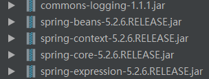

* **什么是 Bean 管理**

  ​	Bean 管理指的是两个操作：

> 1. Spring 创建对象
> 2. Spring 注入属性

* **Bean 管理操作**

  ​	Bean 管理操作有两种方式：

> 1. 基于 xml 配置文件方式实现
> 2. 基于注解方式实现


### 2.3.1 基于 xml 方式

* **概览**

  1.基于 xml 方式创建对象

  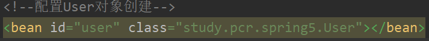

  （1）在 Spring 配置文件中，使用 bean 标签，标签里面添加对应属性，就可以实现对象的创建

  （2）在 bean 标签中有很多属性，下面介绍一些常用的属性：

  > id：唯一标识
  >
  > class：类的全路径（包.类名）

  （3）创建对象时，默认执行类的无参构造方法完成对象的创建

  2.基于 xml 方式注入属性

  ​	注入属性可以通过两种方法：set方法注入，和有参构造实现属性注入

  ​	方法一：Spring 通过 set 方法注入属性

  > step1：在需要注入属性的类中定义属性和对应的 set 方法
>
  > step2：注入属性：
  >
  > ```xml
  > <bean id="user" class="study.pcr.spring5.User">
  >     <property name="name" value="卡布达"></property>
  >     <property name="age" value="7"></property>
  > </bean>
  > ```

  ​	方法二：Spring 通过有参构造注入属性

  > step1：在需要注入属性的类中定义有参构造方法
>
  > step2：注入属性：
  >
  > ```xml
  > <bean id="user" class="study.pcr.spring5.User">
  >     <constructor-arg name="name" value="呱呱蛙"></constructor-arg>
  >     <constructor-arg name="age" value="6"></constructor-arg>
  >     <!--也可以使用下面的索引值来进行有参构造的属性注入-->
  >     <constructor-arg index="0" value="呱呱蛙"></constructor-arg>
  >     <constructor-arg index="1" value="6"></constructor-arg>
  > </bean>
  > ```
  >
  > 

  ​	如果需要注入的属性为 null ，则在标签中加入 <null></null>：

  ```xml
<!-- property 标签，使用 set 方法注入null-->
  <property name="city">
      <null></null>
  </property>
  <!-- constructor-arg 标签，使用有参构造注入null-->
  <constructor-arg name="city">
      <null/>
  </constructor-arg>
  ```

  ​	如果需要注入的属性包含特殊符号，可以使用如下方法：

  ```xml
<constructor-arg index="2">
      <value><![CDATA[<南京>]]></value>
  </constructor-arg>
  ```

* **注入属性（外部 bean 、内部 bean 、级联赋值、 注入集合属性）**

  * 注入外部 bean

    ​	现在有两个类，UserService 和 UserDao，需要在 UserService 调用 UserDao 中的方法，UserService 的定义如下：

    ```java
    package study.pcr.spring5;
    
    public class UserService {
        private UserDAO userDAO;
    
        public void setUserDAO(UserDAO userDAO) {
            this.userDAO = userDAO;
        }
        public void add(){
            System.out.println("service add.......");
            userDAO.update();
        }
    }
    ```

    ​	xml 配置文件如下：

    ```xml
    <!--    1 service 和 dao 对象创建-->
    <bean id="userService" class="study.pcr.spring5.UserService">
        <!--注入 userDao 对象：
          	name 属性：类里面的属性名称
            ref 属性：创建 userDao 对象 bean 的 id标签的值-->
        <property name="userDAO" ref="userDaoImpl"></property>
    </bean>
    <bean id="userDaoImpl" class="study.pcr.spring5.UserDAO"></bean>
    ```

  * 注入内部 bean

    ​	一对多关系：部门和员工。

    ​	一个部门有多个员工，一个员工属于一个部门。

    ```java
  // 部门类
    public class Dept {
        private String dname;
    
        public void setDname(String dname) {
            this.dname = dname;
        }
    }
    
    // 员工类
    public class Emp {
        private String ename;
        private String gender;
        private Dept dept;
    
        public void setDept(Dept dept) {
            this.dept = dept;
        }
    
        public void setEname(String ename) {
            this.ename = ename;
        }
    
        public void setGender(String gender) {
            this.gender = gender;
        }
    }
    ```
  
    ​		Spring 配置文件：

    ```xml
      <bean id="emp" class="study.pcr.spring5.Emp">
    		<!--设置两个普通属性-->
            <property name="ename" value="鲨鱼辣椒"></property>
            <property name="gender" value="鲨鱼"></property>
    		<!--设置对象类型属性-->
            <property name="dept">
                <bean id="dept" class="study.pcr.spring5.Dept">
                    <property name="dname" value="铁甲小宝部"></property>
                </bean>
            </property>
        </bean>
    ```
  
  * 级联赋值

    ```xml
      <bean id="emp" class="study.pcr.spring5.Emp">
    		<!--设置两个普通属性-->
          <property name="ename" value="鲨鱼辣椒"></property>
            <property name="gender" value="鲨鱼"></property>
    		<!--级联赋值-->
            <property name="dept" ref="dept"></property>
        </bean>
        <bean id = "dept" class="study.pcr.spring5.Dept">
            <property name="dname" value="铁甲小宝部"></property>
        </bean>
    ```
  
  * 注入集合属性
  
    ​	创建类，在该类中定义数组、list、set、map类型属性，并生成对应的 set() 方法

    ```java
  public class Stu {
        private String[] arrays;
      private List<String> lists;
        private Set<String> sets;
      private Map<String, String> maps;
    
        public void setArrays(String[] arrays) {
            this.arrays = arrays;
        }
    
        public void setLists(List<String> lists) {
            this.lists = lists;
        }
    
        public void setSets(Set<String> sets) {
            this.sets = sets;
        }
    
        public void setMaps(Map<String, String> maps) {
            this.maps = maps;
        }
    }
    ```
  
    ​	xml 文件进行集合属性的注入：
  
    ```xml
    	<bean id="stu" class="study.pcr.spring5.Stu">
    <!--        数组类型属性注入-->
          <property name="arrays">
                <array>
                  <value>Java基础</value>
                    <value>Spring框架</value>
                </array>
            </property>
    <!--        list类型属性注入-->
            <property name="lists">
                <list>
                    <value>Java基础</value>
                    <value>Spring框架</value>
                </list>
            </property>
    <!--        set类型属性注入-->
            <property name="sets">
                <set>
                    <value>Java基础</value>
                    <value>Spring框架</value>
                </set>
            </property>
    <!--        map类型属性注入-->
            <property name="maps">
                <map>
                    <entry key="No.1" value="Java基础"></entry>
                    <entry key="No.2" value="Spring框架"></entry>
                </map>
            </property>
        </bean>
    ```
  
    ​	如果集合中的元素类型为对象，则 xml 文件内容如下：
  
    ```xml
    <bean  id= "course1"  class= "com.atguigu.spring5.collectiontype.Course"> 
        <property  name="cname"  value="Spring5框架"></property> 
  </bean> 
    <bean  id= "course2"  class= "com.atguigu.spring5.collectiontype.Course"> 
      <property  name= "cname"  value= "MyBatis框架"></ property> 
    </bean> 
    <!--注入 list 集合类型，值是对象--> 
    <property  name= "courseList"> 
        <list> 
            <ref  bean= "course1"></ref> 
            <ref  bean= "course2"></ref> 
        </list> 
    </property>
    ```
  
    

### 2.3.2 基于注解方式

* **什么是注解**

  （1）注解是代码特殊标记，格式：@注解名称(属性名称=属性值, 属性名称=属性值..) 
  （2）使用注解，注解作用在类上面，方法上面，属性上面 
  （3）使用注解目的：简化 xml 配置

* **使用注解步骤**

  1.先引入 context 名称空间，并开启注解扫描器：

  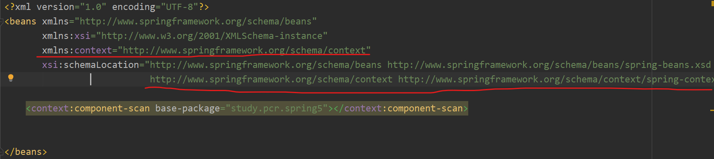

  ​	完整xml配置文件如下：

  ```xml
  <?xml version="1.0" encoding="UTF-8"?>
  <beans xmlns="http://www.springframework.org/schema/beans"
         xmlns:xsi="http://www.w3.org/2001/XMLSchema-instance"
         xmlns:context="http://www.springframework.org/schema/context"
         xsi:schemaLocation="http://www.springframework.org/schema/beans http://www.springframework.org/schema/beans/spring-beans.xsd
                             http://www.springframework.org/schema/context http://www.springframework.org/schema/context/spring-context.xsd">
  
  <!--    开启注解扫描器，base-package:配置需要扫描的包-->
      <context:component-scan base-package="study.pcr.spring5"></context:component-scan>
  
  </beans>
  ```

  2.将注解添加到类、方法或属性上

  ​	创建对象以及处理对象依赖关系，相关的注解：

  > ​	@ComponentScan		   扫描器
  > ​	@Configuration				表明该类是配置类
  > ​	@Component   				指定把⼀个对象加⼊IOC容器--->@Name也可以实现相同的效果【⼀般少⽤】
  > ​	@Repository   				 作⽤同@Component； 在持久层使⽤
  > ​	@Service      					作⽤同@Component； 在业务逻辑层使⽤
  > ​	@Controller    				   作⽤同@Component； 在控制层使⽤ 
  > ​	
  >
  > 依赖关系注解（使用注解方式进行属性注入，都不需要添加set方法）：
  >     	@Autowired 
  >
  > ​			根据属性类型进行自动装配
  >
  > ​	@Qualifier(value="")
  >
  > ​			根据名称进行注入，该注解需要和@Autowired一起使用（该注解使用很少）
  >
  > ​	@Resource
  >
  > ​			可以根据类型注入，也可以根据名称注入  					 
  > ​			如果@Resource不指定值，那么就根据类型来找，相同的类型在IOC容器中不能有两个
  > ​			如果@Resource指定了值，那么就根据名字来找

* **示例：编写一个三层（Dao、Service、Controller）的程序，使用注解方式获取对象**

  ```java
  package study.pcr.spring5;
  
  import org.springframework.stereotype.Repository;
  
  //把对象添加到容器中,⾸字⺟会⼩写
  @Repository
  public class UserDao {
      public void save(){
          System.out.println("DB:保存用户");
      }
  }
  ```

  ```java
  package study.pcr.spring5;
  
  import org.springframework.stereotype.Service;
  
  import javax.annotation.Resource;
  
  //把UserService对象添加到IOC容器中,⾸字⺟会⼩写
  @Service
  public class UserService {
      //如果@Resource不指定值，那么就根据类型来找--->UserDao....当然了，IOC容器不能有两个UserDao类型的对象
      //@Resource
      //如果指定了值，那么Spring就在IOC容器找有没有id为userDao的对象。
      @Resource(name = "userDao")
      private UserDao userDao;
  
      public void save(){
          userDao.save();
      }
  }
  ```

  ```java
  package study.pcr.spring5;
  
  import org.springframework.stereotype.Controller;
  
  import javax.annotation.Resource;
  
  //把对象添加到IOC容器中,⾸字⺟会⼩写
  @Controller
  public class UserController {
      @Resource(name = "userService")
      private UserService userService;
  
      public String excute(){
          userService.save();
          return null;
      }
  }
  
  ```

  ​	测试类如下：

  ```java
  package test;
  
  import org.junit.Test;
  import org.springframework.context.ApplicationContext;
  import org.springframework.context.support.ClassPathXmlApplicationContext;
  import study.pcr.spring5.UserController;
  
  public class TestSpring5 {
      @Test
      public void testAdd(){
          ApplicationContext context = new ClassPathXmlApplicationContext("bean.xml");
  
          UserController userController = (UserController) context.getBean("userController");
  
          userController.excute();
      }
  }
  // 程序运行结果
  DB:保存用户
  ```

  

## 2.4  Bean 生命周期

​	Bean 的生命周期指从对象创建到对象销毁的过程，没有实现后置处理器接口 `BeanPostProcessor` 的 Bean ，生命周期分以下五个过程：
（1）通过构造器创建 bean 实例（无参构造） 
（2）为 bean 的属性设置值和对其他 bean 引用（调用 set 方法） 
（3）调用 bean 的初始化的方法（需要进行配置初始化的方法） 
（4）bean 可以使用了（对象获取到了） 
（5）当容器关闭时候，调用 bean 的销毁的方法（需要进行配置销毁的方法）

* **示例：演示 bean 生命周期**

  ```java
  package study.pcr.spring5;
  
  // 新建一个类，该类中包含无参构造，属性的 set 方法，再加入初始化的方法和销毁的方法
  public class Orders {
      // 无参数构造
      public Orders(){
          System.out.println("第一步 执行无参数构造创建 bean 实例");
      }
  
      private String oname;
  
      public void setOname(String oname) {
          this.oname = oname;
          System.out.println("第二步 调用 set 方法设置属性值");
      }
  
      // 创建执行的初始化的方法
      public void initMethod(){
          System.out.println("第三步 执行初始化的方法");
      }
  
      // 创建执行的销毁的方法
      public void destoryMethod(){
          System.out.println("第五步 执行销毁的方法");
      }
  }
  ```

  ​	xml 配置 bean：

  ```xml
      <bean id="orders" class="study.pcr.spring5.Orders" init-method="initMethod"
            destroy-method="destoryMethod">
          <property name="oname" value="电脑"></property>
      </bean>
  ```

  ​	测试类如下：

  ```java
  package test;
  
  import org.junit.Test;
  import org.springframework.context.support.ClassPathXmlApplicationContext;
  import study.pcr.spring5.Orders;
  
  public class TestSpring5 {
      @Test
      public void testAdd(){
          ClassPathXmlApplicationContext context = new ClassPathXmlApplicationContext("bean.xml");
          Orders orders = context.getBean("orders", Orders.class);
          System.out.println("第四步 获取创建 bean 实例对象");
          System.out.println(orders);
          // 手动让 bean 实例销毁
          context.close();
      }
  }
  // 程序执行结果
  第一步 执行无参数构造创建 bean 实例
  第二步 调用 set 方法设置属性值
  第三步 执行初始化的方法
  第四步 获取创建的 bean 实例对象
  study.pcr.spring5.Orders@612fc6eb
  第五步 执行销毁的方法
  ```

​	如果添加了 bean 的后置处理器 `BeanPostProcessor` ，bean 的生命周期则有七个状态：

> （1）通过构造器创建 bean 实例（无参数构造） 
> （2）为 bean 的属性设置值和对其他 bean 引用（调用 set 方法） 
> （3）把  bean  实例传递  bean  后置处理器的方法 postProcessBeforeInitialization 
> （4）调用 bean 的初始化的方法（需要进行配置初始化的方法） 
>
> （5）把 bean  实例传递 bean  后置处理器的方法 postProcessAfterInitialization 
> （6）bean 可以使用了（对象获取到了） 
> （7）当容器关闭时候，调用 bean 的销毁的方法（需要进行配置销毁的方法）

* **示例：演示添加后置处理器的 bean 生命周期**

  ​	新增一个类，实现 `BeanPostProcessor` ：

  ```java
  package study.pcr.spring5;
  
  import org.springframework.beans.BeansException;
  import org.springframework.beans.factory.config.BeanPostProcessor;
  
  public class MyBeanPostProcessor implements BeanPostProcessor {
      @Override
      public Object postProcessBeforeInitialization(Object bean, String beanName) throws BeansException {
          System.out.println("在初始化之前执行的方法");
          return bean;
      }
  
      @Override
      public Object postProcessAfterInitialization(Object bean, String beanName) throws BeansException {
          System.out.println("在初始化之后执行的方法");
          return bean;
      }
  }
  
  ```

  ​	xml 文件配置如下：

  ```xml
      <bean id="orders" class="study.pcr.spring5.Orders" init-method="initMethod"
            destroy-method="destoryMethod">
          <property name="oname" value="电脑"></property>
      </bean>
  
  	<bean id="myBeanPostProcessor" class="study.pcr.spring5.MyBeanPostProcessor"></bean>
  ```

  ​	将实现了 `BeanPostProcessor` 的类作为 bean 配置在 xml 配置文件中，Spring 会为配置文件中所有的 bean 创建后置处理器。

  ​	最后程序运行结果如下：

  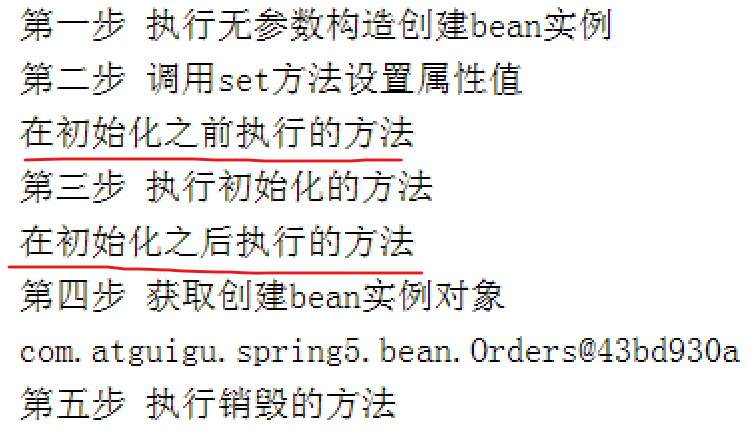


## 2.5 自动装配

​	自动装配指，根据指定装配规则（属性名称或者属性类型），Spring 自动将一个 bean 作为属性注入到 另一个 bean 中。

* **byName**

  ```xml
      <bean id="emp" class="study.pcr.spring5.Emp" autowire="byName"></bean>
  		<!--<property name="dept" ref="dept"></property>-->
  	<!--
          1.通过名字来⾃动装配
          2.发现 study.pcr.spring5.Emp 类中有个叫 dept 的属性
          3.看看IOC容器中没有叫 dept 的对象
          4.如果有，就装配进去
      -->
      <bean id="dept" class="study.pcr.spring5.Dept"></bean>
  ```

* **byType**

  ​	值得注意的是：如果使⽤了根据类型来⾃动装配，那么在IOC容器中只能有⼀个这样的类型，否则就会
  报错！

  ```xml
  	<bean id="userDao" class="UserDao"/>
      <!--
          1.通过名字来⾃动装配
          2.发现userService中有个叫userDao的属性
          3.看看IOC容器UserDao类型的对象
          4.如果有，就装配进去
      -->
      <bean id="userService" class="UserService" autowire="byType"/>
  ```

   除了上述利用 xml 实现的自动装配，更常用的是使用注解进行自动装配

# 三、AOP

## 3.1 AOP 概述

​	AOP：Aspect Object Programming 面向切面编程。

> 功能：让关注点代码与业务代码分离（这里的关注点指重复代码）
>
> 面向切面编程就是指：对很多功能都有的重复的代码进行抽取，再在运行的时候往业务方法上动态植入“切面类代码”

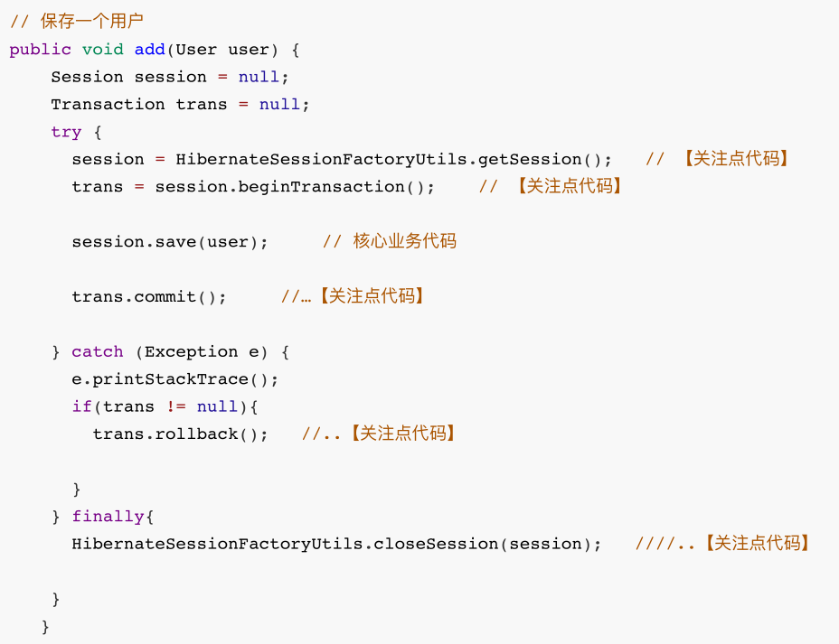

​	利用 AOP 可以对业务逻辑的各个部分进行隔离，从而使得业务逻辑各部分之间的耦合度降低，提高程序的可重用性，同时提高了开发的效率。

​	AOP 功能的通俗描述：可以做到不通过修改源代码方式，在主干功能中添加新功能。

* **AOP 相关概念**

  **连接点(Join point)：**
  	能够被拦截的地⽅：Spring AOP是基于动态代理的，所以是⽅法拦截的。每个成员⽅法都可以称
  之为连接点~
  **切点(Poincut)：**
  	具体定位的连接点：上⾯也说了，每个⽅法都可以称之为连接点，我们具体定位到某⼀个⽅法就成
  为切点。
  **增强/通知(Advice)：**
  	表示添加到切点的⼀段逻辑代码，并定位连接点的⽅位信息。
  	简单来说就定义了是⼲什么的，具体是在哪⼲
  	Spring AOP提供了5种Advice类型给我们：前置、后置、返回、异常、环绕给我们使⽤！
  **织⼊(Weaving)：**
  	将 增强/通知 添加到⽬标类的具体连接点上的过程。
  **引⼊/引介(Introduction)：**
  	引⼊/引介 允许我们向现有的类添加新⽅法或属性。是⼀种特殊的增强！
  **切⾯(Aspect)：**
  	切⾯由切点和 增强/通知 组成，它既包括了横切逻辑的定义、也包括了连接点的定义。
  在《Spring 实战 (第4版)》给出的总结是这样⼦的：
  	通知/增强包含了需要⽤于多个应⽤对象的横切⾏为；连接点是程序执⾏过程中能够应⽤通知的所
  有点；切点定义了通知/增强被应⽤的具体位置。其中关键的是切点定义了哪些连接点会得到通知/
  增强。


## 3.2 AOP 原理

​	AOP 的底层原理实际上就是动态代理，使用<u>动态代理实质上就是调用时拦截对象方法，对方法进行改造、增强</u>！

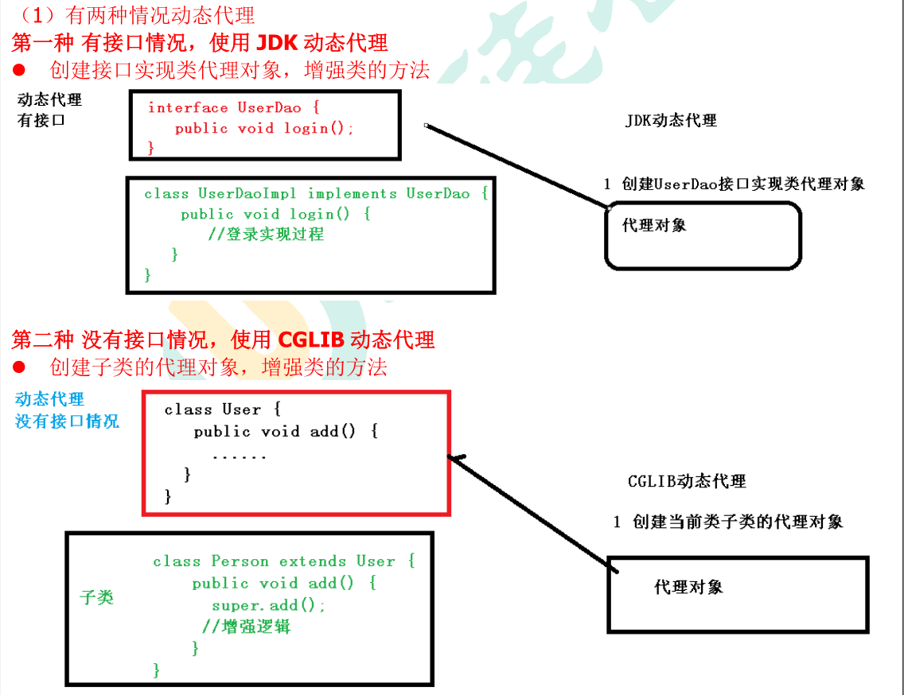

* **下面通过一个示例来展示使用动态代理如何来增强原始类中的方法：**

  ```java
  package study.pcr.spring5.aop1;
  
  // 创建接口，定义方法
  public interface UserDao {
      public int add(int a, int b);
      public String update(String id);
  }
  ```

  ```java
  package study.pcr.spring5.aop1;
  
  // 创建接口实现类，实现方法
  public class UserDaoImpl implements UserDao {
      @Override
      public int add(int a, int b) {
          System.out.println("原始add方法执行了");
          return a+b;
      }
  
      @Override
      public String update(String id) {
          System.out.println("原始update方法执行了");
          return id;
      }
  }
  ```

  ```java
  package study.pcr.spring5.aop1;
  
  import java.lang.reflect.InvocationHandler;
  import java.lang.reflect.Method;
  import java.lang.reflect.Proxy;
  
  // 创建代理
  public class UserDaoProxy implements InvocationHandler {
      private Object target;      // 保存需要代理的真实业务对象
  
      /**
       * 进行真实业务对象与代理业务对象的绑定处理
       * @param target    真实业务对象
       * @return          Proxy生成的代理业务对象
       */
      public Object bind(Object target){
          this.target = target;
          return Proxy.newProxyInstance(target.getClass().getClassLoader(), target.getClass().getInterfaces(), this);
      }
  
      // 增强的逻辑
      @Override
      public Object invoke(Object proxy, Method method, Object[] args) throws Throwable {
          System.out.println("原始" + method.getName() + "方法执行之前");
          // 对原始的add()方法进行增强
          if("add".equals(method.getName())){
              System.out.println("将原始参数各增加1");
              for(int x=0; x<args.length; x++){
                  args[x] = Integer.parseInt(String.valueOf(args[x])) + 1;
              }
          } else if("update".equals(method.getName())){
              // 对原始的update()方法进行增强
              System.out.println("将原始字符串改为“铁甲小宝”");
              args[0] = "铁甲小宝";
          }
          System.out.println("执行原始的方法");
          // 原始的方法执行
          Object res = method.invoke(this.target, args);
          System.out.println("原始方法执行之后" + this.target);
          System.out.print("result: ");
          return res;
      }
  }
  ```

  ```java
  package study.pcr.spring5.aop1;
  
  // 测试类
  public class JDKProxy {
      public static void main(String[] args) {
          UserDao userDao = (UserDao) new UserDaoProxy().bind(new UserDaoImpl());
          int res1 = userDao.add(1,2);
          System.out.println(res1 + "\n");
          String res2 = userDao.update("蜻蜓队长");
          System.out.println(res2);
      }
  }
  // 执行结果
  原始add方法执行之前
  将原始参数各增加1
  执行原始的方法
  原始add方法执行了
  原始方法执行之后study.pcr.spring5.aop1.UserDaoImpl@3cd1a2f1
  result: 5
  
  原始update方法执行之前
  将原始字符串改为“铁甲小宝”
  执行原始的方法
  原始update方法执行了
  原始方法执行之后study.pcr.spring5.aop1.UserDaoImpl@3cd1a2f1
  result: 铁甲小宝
  ```

  

## 3.3 Spring 基于 AspectJ 、cglib 实现 AOP

​	AspectJ 不是 Spring 组成部分，它是独立 AOP 框架，一般把 AspectJ 和 Spirng 框架一起使用，进行 AOP 操作

​	简单说一下 AspectJ：

> ​	AspectJ是语⾔级别的AOP实现，扩展了Java语⾔，定义了AOP语法，能够在编译期提供横切代码
> 的织⼊，所以它有专⻔的编译器⽤来⽣成遵守Java字节码规范的Class⽂件。
>
> ​	⽽Spring借鉴了AspectJ很多⾮常有⽤的做法，融合了AspectJ实现AOP的功能。但Spring AOP本质上
> 底层还是动态代理，所以Spring AOP是不需要有专⻔的编辑器的。

* **基于 AspectJ 实现 AOP 操作的两种方式**
  1. 基于 xml 配置文件
  2. 基于注解方式

* **AOP 操作需要引入的 jar 包：**

  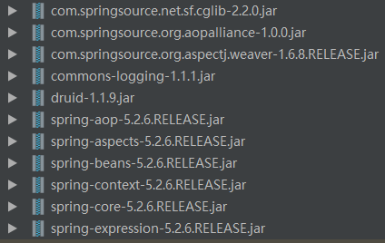

* **AOP 注解 API**

  | 注解                                                         | 说明                                         |
  | ------------------------------------------------------------ | -------------------------------------------- |
  | @Aspect                                                      | 指定一个类为切面类                           |
  | @Pointcut("execution(* study.pcr.spring5.aop2.User.add(..))") | 指定切入点表达式                             |
  | @Before("pointCut_()")                                       | 前置通知：目标方法之前执行                   |
  | @After("pointCut_()")                                        | 后置通知：目标方法之后执行（始终执行）       |
  | @AfterReturning("pointCut_()")                               | 返回后通知：执行方法结束前执行（异常不执行） |
  | @AfterThrowing("pointCut_()")                                | 异常通知：出现异常的时候执行                 |
  | @Around("pointCut_()")                                       | 环绕通知：环绕目标方法执行                   |

* **切入点表达式**

  ​	切入点表达式作用：拦截某些类的某些方法

  ​	语法结构：`execution([权限修饰符][返回类型][类全路径][方法名称]([参数列表]))`

  示例：

   1. 对 study.pcr.spring5.aop2.User 类中的 add 方法进行增强

      `execution(* study.pcr.spring5.aop2.User.add(..))`

  2. 对 study.pcr.spring5.aop2.User 类中的所有方法进行增强

     `execution(* study.pcr.spring5.aop2.User.*(..))`

  3. 对 study.pcr.spring5.aop2 包中的所有类，类中的所有方法进行增强

     `execution(* study.pcr.spring5.aop2.*.*(..))`

   4. 对 study.pcr.spring5.aop2.User 类中所有以 batch 开头的方法

      `execution(* study.pcr.spring5.aop2.User.*batch*(..))`

* **示例：AspectJ 注解实现 AOP**

  1. 创建类，在类中定义方法

     ```java
     package study.pcr.spring5.aop2;
     
     import org.springframework.stereotype.Component;
     
     // 被增强的类
     @Component
     public class User {
         public void add(){
             System.out.println("原始的add()方法执行");
         }
     
         public void batchAdd(){
           System.out.println("原始的batchAdd()方法执行");
         }
   
         public void batchUpdate(){
             System.out.println("原始的batchUpdate()方法执行");
         }
     }
     ```
  
  2. 创建增强类（编写增强逻辑）
  
     ```java
     package study.pcr.spring5.aop2;
     
     import org.aspectj.lang.ProceedingJoinPoint;
     import org.aspectj.lang.annotation.*;
     import org.springframework.stereotype.Component;
     
     // 增强的类
     @Component
     @Aspect		// 定义为切面(类)
     public class UserProxy {
     
         // 使用@Pointcut这个注解，来指定切⼊点表达式，在⽤到的地⽅中，直接引⽤就⾏了
         @Pointcut("execution(* study.pcr.spring5.aop2.User.add(..))")
         public void pt(){}
     
         // 前置通知：在执⾏⽬标⽅法之前执⾏
         @Before(value = "execution(* study.pcr.spring5.aop2.User.add(..))")
         public void before(){
             System.out.println("【通知】前置通知——Before......");
         }
     
         // 后置/最终通知：在执⾏⽬标⽅法之后执⾏  【⽆论是否出现异常最终都会执⾏】
         @After("pt()")
         public void after(){
             System.out.println("【通知】最终通知——After......");
         }
     
         // 返回后通知：在调⽤⽬标⽅法结束后执⾏ 【出现异常不执⾏】
         @AfterReturning("pt()")
         public void afterReturning(){
             System.out.println("【通知】后置通知（返回通知）——AfterReturning......");
         }
     
         // 异常通知：当⽬标⽅法执⾏异常时执⾏此关注点代码
         @AfterThrowing("pt()")
         public void afterThrowing(){
             System.out.println("【通知】异常通知——AfterThrowing......");
         }
     
         // 环绕通知：环绕⽬标⽅式执⾏
       @Around("pt()")
         public void around(ProceedingJoinPoint proceedingJoinPoint) throws Throwable{
           System.out.println("【通知】环绕前......");
             proceedingJoinPoint.proceed();		// 执行目标方法
             System.out.println("【通知】环绕后......");
         }
     
         // 定义User类中所有以batch开头的方法为切点
         @Pointcut("execution(* study.pcr.spring5.aop2.User.*batch*(..))")
         public void batchpt(){}
     
         @Before("batchpt()")
         public void beforeBatch(){
             System.out.println("【通知】前置通知——Before......");
         }
     
     }
     ```
  
  3. 在 Spring 配置文件中开启注解扫描和 Aspect 生成代理对象
  
   ```xml
     <?xml version="1.0" encoding="UTF-8"?>
   <beans xmlns="http://www.springframework.org/schema/beans"
            xmlns:xsi="http://www.w3.org/2001/XMLSchema-instance"
            xmlns:context="http://www.springframework.org/schema/context"
            xmlns:aop="http://www.springframework.org/schema/aop"
            xsi:schemaLocation="http://www.springframework.org/schema/beans http://www.springframework.org/schema/beans/spring-beans.xsd
                                http://www.springframework.org/schema/context http://www.springframework.org/schema/context/spring-context.xsd
                                 http://www.springframework.org/schema/aop http://www.springframework.org/schema/aop/spring-aop.xsd">
     
     <!--    开启注解扫描器-->
         <context:component-scan base-package="study.pcr.spring5.aop2"></context:component-scan>
     
     <!--    开启Aspect生成代理对象-->
         <aop:aspectj-autoproxy></aop:aspectj-autoproxy>
     
     </beans>
     ```
  
  4. 测试类
  
     ```java
     package study.pcr.spring5.aop2;
     
     import org.junit.Test;
     import org.springframework.context.ApplicationContext;
     import org.springframework.context.support.ClassPathXmlApplicationContext;
     
     public class AOPTest {
     
         @Test
         public void testAop(){
             ApplicationContext context = new ClassPathXmlApplicationContext("bean.xml");
             User user = context.getBean("user", User.class);	// 获取到被增强的对象
             user.add();
         }
     }
     // 执行结果
     【通知】环绕前......
     【通知】前置通知——Before......
     原始的add()方法执行
     【通知】环绕后......
     【通知】最终通知——After......
     【通知】后置通知（返回通知）——AfterReturning......
     ```

# 四、JdbcTemplate

​	JdbcTemplate 是 Spring 对 JDBC 进行的封装，使用 JdbcTemplate 方便实现对数据库的操作

## 4.1 依赖 jar 包和 xml 配置

* **依赖 jar 包**

  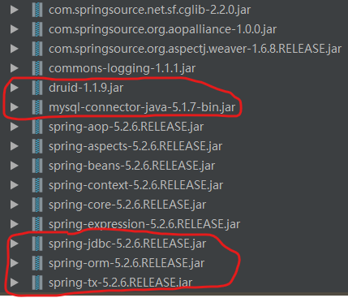

* **xml 文件配置**

  ```xml
  <?xml version="1.0" encoding="UTF-8"?>
  <beans xmlns="http://www.springframework.org/schema/beans"
         xmlns:xsi="http://www.w3.org/2001/XMLSchema-instance"
         xmlns:context="http://www.springframework.org/schema/context"
         xsi:schemaLocation="http://www.springframework.org/schema/beans http://www.springframework.org/schema/beans/spring-beans.xsd
                             http://www.springframework.org/schema/context http://www.springframework.org/schema/context/spring-context.xsd">
  
  <!--   1. 配置数据库连接池-->
      <bean id="dataSource" class="com.alibaba.druid.pool.DruidDataSource" destroy-method="close">
          <!-- 需要注意，一定要在数据库url后面加上 "?characterEncoding=" 指定编码-->
          <property name="url" value="jdbc:mysql://localhost:3306?characterEncoding=utf-8"></property>
          <property name="username" value="root"></property>
          <property name="password" value="1234"></property>
          <property name="driverClassName" value="com.mysql.jdbc.Driver"></property>
      </bean>
  
  <!--  2.  配置 JdbcTemplate 对象，注入 DataSource-->
      <!--JdbcTemplate 对象-->
      <bean id="jdbcTemplate" class="org.springframework.jdbc.core.JdbcTemplate">
          <!--注入 DataSource-->
          <property name="dataSource" ref="dataSource"></property>
      </bean>
  
  <!--  3.  开启组件扫描-->
      <context:component-scan base-package="study.pcr.spring5.jdbctemplate"></context:component-scan>
  
  </beans>
  ```


## 4.2 完整示例

​	本地的数据库表如下：

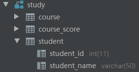

​	现通过示例 study.student 表：

* **实体类**

  ```java
  package study.pcr.spring5.jdbctemplate;
  
  public class Student {
      private Integer studentId;
      private String studentName;
  
      public void setStudentId(Integer studentId) {
          this.studentId = studentId;
      }
  
      public void setStudentName(String studentName) {
          this.studentName = studentName;
      }
  
      public Integer getStudentId() {
          return studentId;
      }
  
      public String getStudentName() {
          return studentName;
      }
  }
  ```

* **Dao 接口(该接口中定义操作数据库的相关方法)**

  ```java
  package study.pcr.spring5.jdbctemplate;
  
  import java.util.List;
  
  interface StudentDao {
      // 增删改
      void add(Student student);
      void update(Student student);
      void delete(String id);
  
      // 查询
      int queryCount();
      Student queryStudent(String id);
      List<Student> queryStudentList();
  
      // 批量操作
      void batchAddStudent(List<Object[]> batchArgs);
      void batchUpdateStudent(List<Object[]> batchArgs);
      void batchDeleteStudent(List<Object[]> batchArgs);
  }
  ```

* **Dao 具体实现类**

  ```java
  package study.pcr.spring5.jdbctemplate;
  
  import org.springframework.beans.factory.annotation.Autowired;
  import org.springframework.jdbc.core.BeanPropertyRowMapper;
  import org.springframework.jdbc.core.JdbcTemplate;
  import org.springframework.stereotype.Repository;
  
  import java.util.Arrays;
  import java.util.List;
  
  @Repository
  public class StudentDaoImpl implements StudentDao {
      // 注入 JdbcTemplate
      @Autowired
      private JdbcTemplate jdbcTemplate;
  
  // 增删改
      @Override
      public void add(Student student) {
          String sql = "insert into study.student (student_id, student_name) values (?,?)";
          Object[] args = {student.getStudentId(), student.getStudentName()};
          jdbcTemplate.update(sql, args);
      }
  
      @Override
      public void update(Student student) {
          String sql = "update study.student set student_id=?, student_name=? where student_id=?";
          Object[] args = {student.getStudentId(), student.getStudentName(), student.getStudentId()};
          jdbcTemplate.update(sql, args);
      }
  
      @Override
      public void delete(String id) {
          String sql = "delete from study.student where student_id=?";
          jdbcTemplate.update(sql, id);
      }
  
      
  // 查询
      // 查询表中有多少条记录
      // queryForObject(String sql, Class<T> requiredType)
      @Override
      public int queryCount() {
          String sql = "select count(*) from study.student";
          Integer count = jdbcTemplate.queryForObject(sql, Integer.class);
          return count;
      }
  
      // 查询返回对象
      // queryForObject(String sql, RowMapper<T> rowMapper, Object... args)
      @Override
      public Student queryStudent(String id) {
          String sql = "select * from study.student where student_id=?";
          Student student = jdbcTemplate.queryForObject(sql, new BeanPropertyRowMapper<Student>(Student.class), id);
          return student;
      }
  
      // 查询返回对象的集合
      // query(String sql, RowMapper<T> rowMapper, Object... args)
      @Override
      public List<Student> queryStudentList() {
          String sql = "select * from study.student";
          List<Student> students = jdbcTemplate.query(sql, new BeanPropertyRowMapper<Student>(Student.class));
          return students;
      }
  
      
  // 批量操作
      @Override
      public void batchAddStudent(List<Object[]> batchArgs) {
          String sql = "insert into study.student values (?, ?)";
          int[] ints = jdbcTemplate.batchUpdate(sql, batchArgs);
          System.out.println(Arrays.toString(ints));
      }
  
      @Override
      public void batchUpdateStudent(List<Object[]> batchArgs) {
          String sql = "update study.student set student_name=? where student_id=?";
          int[] ints = jdbcTemplate.batchUpdate(sql, batchArgs);
          System.out.println(Arrays.toString(ints));
      }
  
      @Override
      public void batchDeleteStudent(List<Object[]> batchArgs) {
          String sql = "delete from study.student where student_id=?";
          int[] ints = jdbcTemplate.batchUpdate(sql, batchArgs);
          System.out.println(Arrays.toString(ints));
      }
  }
  ```

* **Service 层**

  ```java
  package study.pcr.spring5.jdbctemplate;
  
  import org.springframework.beans.factory.annotation.Autowired;
  import org.springframework.stereotype.Service;
  
  import java.util.List;
  
  @Service
  public class StudentService {
      @Autowired
      private StudentDao studentDao;
  
      public void addStudent(Student stu){
          studentDao.add(stu);
      }
  
      public void updateStudent(Student stu){
          studentDao.update(stu);
      }
  
      public void deleteStudent(String id){
          studentDao.delete(id);
      }
  
      public Integer queryCount(){
          return studentDao.queryCount();
      }
  
      public Student queryStudent(String id){
          return studentDao.queryStudent(id);
      }
      
      public void queryStudentList(){
          List<Student> students = studentDao.queryStudentList();
          for(Student stu: students){
              System.out.print(stu.getStudentId() + ": " + stu.getStudentName() + "\n");
          }
      }
  
      public void batchAddStudent(List<Object[]> batchArgs){
          studentDao.batchAddStudent(batchArgs);
      }
  
      public void batchUpdateStudent(List<Object[]> batchArgs){
          studentDao.batchUpdateStudent(batchArgs);
      }
  
      public void batchDeleteStudent(List<Object[]> batchArgs){
          studentDao.batchDeleteStudent(batchArgs);
      }
  }
  ```

* **测试类**

  ```java
  package study.pcr.spring5.jdbctemplate;
  
  import org.junit.Test;
  import org.springframework.context.ApplicationContext;
  import org.springframework.context.support.ClassPathXmlApplicationContext;
  
  import java.util.ArrayList;
  import java.util.Arrays;
  import java.util.List;
  
  
  public class JdbcTemplateTest {
  
      @Test
      public void testJdbcTemplate(){
          ApplicationContext context = new ClassPathXmlApplicationContext("bean.xml");
          StudentService studentService = context.getBean("studentService", StudentService.class);
          Student stu = new Student();
          stu.setStudentId(1);
          stu.setStudentName("卡布达");
          // 添加记录
          studentService.addStudent(stu);
          stu.setStudentName("呱呱蛙");
          // 修改记录
          studentService.updateStudent(stu);
          // 删除记录
          studentService.deleteStudent("1");
  
  // 查询
          // 查询返回某个值
          System.out.println(studentService.queryCount());
          // 查询返回对象
          Student queryStudent = studentService.queryStudent("1");
          System.out.println(queryStudent.getStudentId() + ": " + queryStudent.getStudentName());
          // 查询返回集合
          studentService.queryStudentList();
  
  // 批量操作
          // 批量增加
          List<Object[]> batchArgs1 = new ArrayList<>(Arrays.asList(new Object[]{3, "金龟次郎"}, new Object[]{4, "鲨鱼辣椒"}));
          studentService.batchAddStudent(batchArgs1);
          // 批量修改
          List<Object[]> batchArgs2 = new ArrayList<>(Arrays.asList(new Object[]{"飞翔机器人", 3}, new Object[]{"蝎子莱莱", 4}));
          studentService.batchUpdateStudent(batchArgs2);
          // 批量删除
          List<Object[]> batchArgs3 = new ArrayList<>(Arrays.asList(new Object[]{3}, new Object[]{4}));
          studentService.batchDeleteStudent(batchArgs3);
      }
  }
  ```

# 五、事务

## 5.1 基本概念

​	事务是数据库操作最基本单元，逻辑上一组操作，要么都成功，如果有一个失败所有操作都将失败

* **典型场景**

  ​	银行转账：Lucy转账100元给Mary

  ​					  Lucy少100元，Mary多100元

* **事务四个特性（ACID）**

  （1）原子性

  （2）一致性

  （3）隔离性

  （4）持久性

* **Spring 中实现事务管理的两种方式**

  （1）编程式事务管理

  （2）声明式事务管理

  ​	声明式事务管理中也有两中具体的实现方式：基于注解和基于xml配置文件的方式

  ​	下一节就声明式事务管理中的注解实现方式给出简单示例

  

## 5.2 简单示例

​	沿用上面的转账的场景，Lucy转账100元给Mary，Lucy的账户中减少100元，Mary的账户中增加100元，如果这两个步骤之间的代码出现了异常，应该能够保证Lucy的账户中钱没有减少，否则就凭空消失了100元。

* **数据库表结构：**

  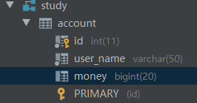

* **创建实体类**

  ```java
  package study.pcr.spring5.transaction;
  
  public class Account {
      private Integer id;
      private String userName;
      private Long money;
  }
  ```

* **创建 Dao 接口**

  ```java
  package study.pcr.spring5.transaction;
  
  interface AccountDao {
      void reduceMoney();
      void addMoney();
  }
  ```

* **创建 Dao 具体实现类**

  ```java
  package study.pcr.spring5.transaction;
  
  import org.springframework.beans.factory.annotation.Autowired;
  import org.springframework.jdbc.core.JdbcTemplate;
  import org.springframework.stereotype.Repository;
  
  // 在 dao 创建两个方法，多钱和少钱的方法
  @Repository
  public class AccountDaoImpl implements AccountDao{
      // 注入 JdbcTemplate 对象
      @Autowired
      private JdbcTemplate jdbcTemplate;
  
      @Override
      public void reduceMoney() {
          String sql = "update study.account set money=money-? where user_name=?";
          jdbcTemplate.update(sql, 100, "Lucy");
      }
  
      @Override
      public void addMoney() {
          String sql = "update study.account set money=money+? where user_name=?";
          jdbcTemplate.update(sql, 100, "Mary");
      }
  }
  ```

* **创建 Service**

  ```java
  package study.pcr.spring5.transaction;
  
  import org.springframework.beans.factory.annotation.Autowired;
  import org.springframework.stereotype.Service;
  import org.springframework.transaction.annotation.Transactional;
  
  // 开启事务,@Transactional注解如果加到类上面，则这个类中的所有方法都添加了事务，如果加到某个方法上，则是为该方法添加事务
  @Service
  @Transactional
  public class AccountService {
      // 注入 Dao
      @Autowired
      private AccountDao accountDao;
  
      // 转账的方法
      public void transferMoney(){
          // Lucy少100
          accountDao.reduceMoney();
          // 模拟异常
          int i = 10/0;
          // Mary多100
          accountDao.addMoney();
      }
  }
  ```

* **配置文件**

  ```xml
  <?xml version="1.0" encoding="UTF-8"?>
  <beans xmlns="http://www.springframework.org/schema/beans"
         xmlns:xsi="http://www.w3.org/2001/XMLSchema-instance"
         xmlns:context="http://www.springframework.org/schema/context"
         xmlns:tx="http://www.springframework.org/schema/tx"
         xsi:schemaLocation="http://www.springframework.org/schema/beans http://www.springframework.org/schema/beans/spring-beans.xsd
                             http://www.springframework.org/schema/context http://www.springframework.org/schema/context/spring-context.xsd
                              http://www.springframework.org/schema/tx http://www.springframework.org/schema/tx/spring-tx.xsd">
  
      <!--    开启组件扫描-->
      <context:component-scan base-package="study.pcr.spring5.transaction"></context:component-scan>
  
      <!--    配置数据库连接池-->
      <bean id="dataSource" class="com.alibaba.druid.pool.DruidDataSource" destroy-method="close">
          <property name="url" value="jdbc:mysql://localhost:3306?characterEncoding=utf-8"></property>
          <property name="username" value="root"></property>
          <property name="password" value="1234"></property>
          <property name="driverClassName" value="com.mysql.jdbc.Driver"></property>
      </bean>
  
      <!--    配置 JdbcTemplate 对象，注入 DataSource-->
      <!--JdbcTemplate 对象-->
      <bean id="jdbcTemplate" class="org.springframework.jdbc.core.JdbcTemplate">
          <!--注入 DataSource-->
          <property name="dataSource" ref="dataSource"></property>
      </bean>
  
  
      <!--    创建事务管理器-->
      <bean id="transactionManager" class="org.springframework.jdbc.datasource.DataSourceTransactionManager">
          <!--        注入数据源-->
          <property name="dataSource" ref="dataSource"></property>
      </bean>
  
      <!--    开启事务注解-->
      <tx:annotation-driven transaction-manager="transactionManager"></tx:annotation-driven>
      
  </beans>
  ```

* **测试类**

  ```java
  package study.pcr.spring5.transaction;
  
  import org.junit.Test;
  import org.springframework.context.ApplicationContext;
  import org.springframework.context.support.ClassPathXmlApplicationContext;
  
  public class TransactionTest {
      @Test
      public void testTransaction(){
          ApplicationContext context = new ClassPathXmlApplicationContext("study/pcr/spring5/transaction/transcation.xml");
          AccountService accountService = context.getBean("accountService", AccountService.class);
          accountService.transferMoney();
      }
  }
  // 运行结果
  transferMoney()方法要么整体执行成功，要么整体执行失败
  Lucy和Mary的金额总和不会发生变化
  ```


## 5.3 声明式事务管理参数配置

​	事务注解 @Transacational ，可以向该注解中配置事务相关参数

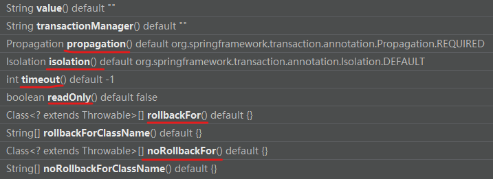

​	下面就图中标注的六个相关参数做出讲解：

* **propagation：事务传播行为**

  ​	事务传播行为指的是，多事务方法之间进行调用（事务方法调用非事务方法，或非事务方法调用事务方法，或两个都是事务方法），这个过程中事务是如何进行管理的

  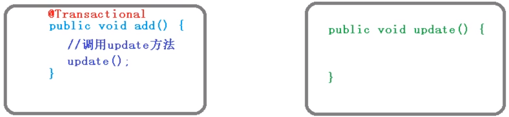

  ​	Spring 框架有7中事务传播行为：

  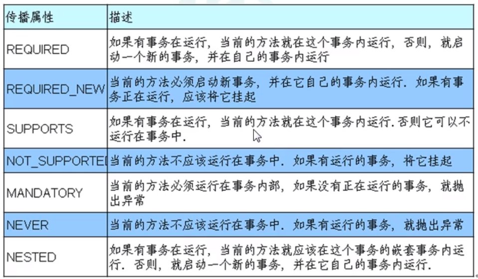

  ​		使用示例：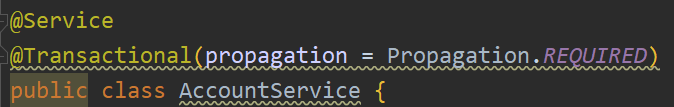

  

* **isolation：事务隔离级别**

  ​	事务具有隔离性，理论上来说，事务之间的执行不应该相互产生影响，其对数据库的影响应该和它们串行执行一样

  ​	然而完全的隔离性会导致系统并发性能很低，降低对资源的利用率，因而实际上对隔离性的要求会有所放宽，这也会一定程度造成对数据库一致性要求降低

  SQL标准为事务定义了不同的隔离级别，从低到高一次是：

  > 1. 读未提交（READ UNCOMMITTED) : 对事务处理的读取没有任何限制，不推荐
  >
  >   2. 读已提交（READ COMMITTED)
  >   3. 可重复读（REPEATABLE READ)
  >   4. 串行化（SERIALIZABLE)

  ​	事务的每个隔离级别会引发什么问题：

  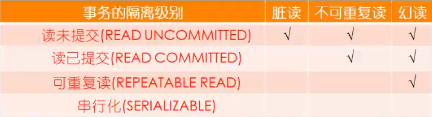

  ​	==脏读==：一个未提交事务读取到另一个未提交事务修改后的数据

  ​	指事务B正在访问数据，并且对数据进行了修改，而这种修改还没有提交到数据库中，这时，事务A访问这个数据，然后使用了这个数据。

  

  ​	==不可重复读==：一个未提交事务读取到另一个已提交事务修改后的数据

  ​	（即在同一个事务中不能读到相同的数据）是指在一个事务内，多次读同一数据，在这个事务还没有结束时，另一个事务也访问同一数据，那么，在第一个事务中的两次读数据之间，由于第二个事务的修改，那么第一个事务两次读到的数据可能是不一样的。这样就发生了在一个事务内两次读到的数据是不一样的。

  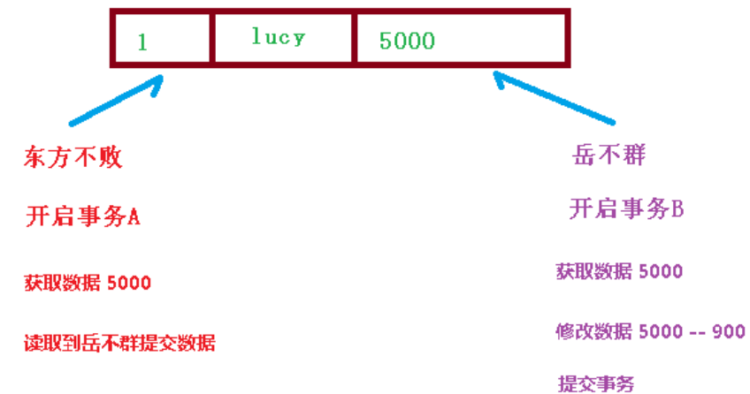

  ​	==幻读==：一个未提交事务读取到另一提交事务添加数据

  ​	是指当事务不是独立执行时发生的一种现象，例如第一个事务对一个表中的数据进行了修改，这种修改涉及到表中的全部数据行，同时，第二个事务也修改这个表中的数据，这种修改是向表中插入一行新数据。那么，以后就会发生操作第一个事务的用户发现表中还有没有修改的数据行，就好像发生了幻觉一样。

  ​	使用示例：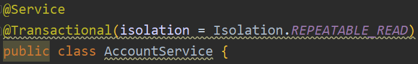

  

* **timeout：超时时间**

  ​	事务需要在一定时间内进行提交，如果不提交则进行回滚

  ​	默认值是-1，设置时间以秒为单位


* **readOnly：是否只读**

  ​	读：查询操作；	写：添加、修改、删除

  ​	默认值是flase，表示可以增删改查 


* **rollbackFor：回滚**

  ​	设置出现哪些异常进行事务回滚


* **noRollbackFor：不回滚**

  ​	设置出现哪些异常不进行事务回滚