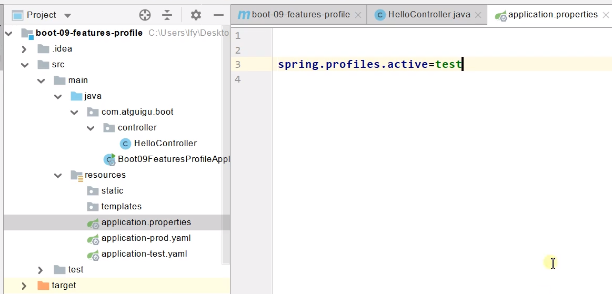
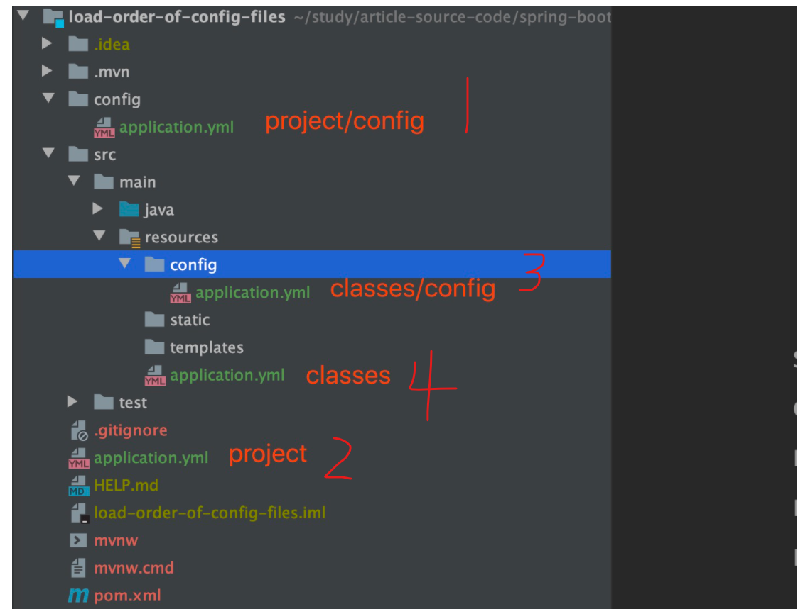
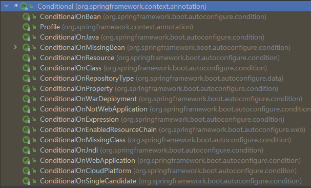
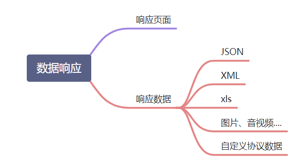

# 一、配置文件 & 场景启动器 & 组件添加 & 使用工具

## 1. Spring boot 配置文件

application.properties 配置文件中可配置的内容：https://docs.spring.io/spring-boot/docs/current/reference/html/appendix-application-properties.html#common-application-properties-server

* **配置文件的多环境适配**

  1. **可以使用 springboot 的 profile 功能**

     

  > - 默认配置文件  application.properties/.yaml；任何时候都会加载
  > - 指定环境配置文件  application-{env}.properties/.yaml
  > - 激活指定环境
  >
  > - - 配置文件激活
  >   - 命令行激活：java -jar xxx.jar --**spring.profiles.active=env**
  >
  > - - - **修改配置文件的任意值，命令行优先**（即使打包时，在默认配置文件中激活的是test环境，也可以在项目部署启动时，使用命令行更改激活环境）
  >
  > - 默认配置与环境配置同时生效
  > - 同名配置项，profile配置优先

  2. **配置文件的覆盖**

     

  > :one:当前项目根目录下config子目录的配置文件
  >
  > :two:当前项目根目录下的配置文件 
  >
  > :three:类路径内config子目录的配置文件
  >
  > :four:类路径下的配置文件

  ​	以上位置的优先级1>2>3>4，优先级高的配置文件会将低的配置文件中相同的配置项覆盖掉，不同的配置项则形成互补，非常方便！

  

## 2. Spring Boot 所有自带的 starter 场景启动器

https://docs.spring.io/spring-boot/docs/current/reference/html/using-spring-boot.html#using-boot-starter


以上1-2节代码：G:\Javaproject\SpringBoot01\src\main\java\study\pcr\springboot\day01


## 3. @Configuration、@Bean、@Import、@Conditional

* @Configuration         声明是一个配置类

* @Import                    向容器中自动创建指定类型的组件、默认组件的名字就是全限定类名

* Conditional                条件装配：满足Conditional指定的条件，则进行组件注入，可以在配置类的类上或者方法上加上@ConditionalOnBean(name = "tom")注解，意为该组件的创建，依赖于tom，如果容器中不存在tom组件，则当前组件也不进行创建

  Conditional注解下的子类注解：

  


## 4. 热更新

​	在项目的pom文件中加入以下依赖，每次修改代码后（无论前端代码还是后端代码），使用快捷键ctrl+F9重新build项目，就可以使代码生效，而不用每次手动将项目重启

```pom
        <dependency>
            <groupId>org.springframework.boot</groupId>
            <artifactId>spring-boot-devtools</artifactId>
            <optional>true</optional>
        </dependency>
```


## 5. 配置文件-自定义类绑定的配置提示 & maven打包时排除指定的组件

```pom
		<dependency>
            <groupId>org.springframework.boot</groupId>
            <artifactId>spring-boot-configuration-processor</artifactId>
            <optional>true</optional>
        </dependency>
        
        
<build>
        <plugins>
            <plugin>
                <groupId>org.springframework.boot</groupId>
                <artifactId>spring-boot-maven-plugin</artifactId>
                <configuration>
                    <excludes>
                        <exclude>
                            <groupId>org.springframework.boot</groupId>
                            <artifactId>spring-boot-configuration-processor</artifactId>
                        </exclude>
                    </excludes>
                </configuration>
            </plugin>
        </plugins>
</build>
```


以上3-5节代码：G:\Javaproject\SpringBoot01\src\main\java\study\pcr\springboot\day02

# 二、Web开发

## 2.1 请求参数处理

### 2.1.1 基本注解

* @PathVariable（路径变量）
* @RequestHeader（获取请求头）
* @RequestParam（获取请求参数）
* @CookieValue（获取cookie值）
* @RequestBody（获取请求体[POST]，接收客户端在post请求中放入的信息）
* @MatrixVariable（矩阵变量）

具体用法参见：G:\Javaproject\SpringBoot02\src\main\java\study\pcr\springboot\springboot\controller.ParemeterTestController


### 2.1.2 自定义对象参数

* **实例**

  ​	Controller某个方法的参数可以直接写为自定义对象（级联对象也可以）

  ```java
  /**
       * 数据绑定：页面提交的请求数据（GET、POST）都可以和对象属性进行绑定（包括级联属性的赋值）
       * @param person
       * @return
       */
      @PostMapping("/saveuser")
      public Person savePerson(Person person) {
          return person;
      }
  ```

  ​	Person 和 Pet 定义如下：

  ```java
  @Data
  public class Person {
      private String userName;
      private Integer age;
      private Date birth;
      private Pet pet;
  }
  
  @Data
  public class Pet {
      private String name;
      private Integer age;
  }
  ```

  ​	前端书写格式如下：

  ```html
  测试封装POJO；
  <form action="/saveuser" method="post">
      姓名： <input name="userName" value="DragonOwner"/> <br/>
      年龄： <input name="age" value="18"/> <br/>
      生日： <input name="birth" value="2019/12/10"/> <br/>
      宠物姓名：<input name="pet.name" value="英短"/><br/>
  	宠物年龄：<input name="pet.age" value="3"/>
      <input type="submit" value="保存"/>
  </form>
  ```

* **原理**

  WebDataBinder binder = binderFactory.createBinder(webRequest, attribute, name);

  WebDataBinder :web数据绑定器，将请求参数的值绑定到指定的JavaBean里面

  WebDataBinder 利用它里面的 Converters 将请求数据转成指定的数据类型。再次封装到JavaBean中

* **未来我们可以给WebDataBinder里面放自己的Converter**

  ```java
  private static final class StringToNumber<T extends Number> implements Converter<String, T>
  ```


### 2.1.3 自定义 Converter

```java 
package study.pcr.springboot.springboot.config;

import org.springframework.context.annotation.Bean;
import org.springframework.context.annotation.Configuration;
import org.springframework.core.convert.converter.Converter;
import org.springframework.format.FormatterRegistry;
import org.springframework.util.StringUtils;
import org.springframework.web.servlet.config.annotation.PathMatchConfigurer;
import org.springframework.web.servlet.config.annotation.WebMvcConfigurer;
import org.springframework.web.util.UrlPathHelper;
import study.pcr.springboot.springboot.bean.Pet;

@Configuration
public class WebConfig {
    // WebMvcConfigurer定制化SpringMVC的功能
    @Bean
    public WebMvcConfigurer webMvcConfigurer() {
        return new WebMvcConfigurer() {
            @Override
            public void configurePathMatch(PathMatchConfigurer configurer) {
                UrlPathHelper urlPathHelper = new UrlPathHelper();
                // 不移除 ; 后面的内容。矩阵变量功能就可以生效
                urlPathHelper.setRemoveSemicolonContent(false);
                configurer.setUrlPathHelper(urlPathHelper);
            }

            @Override
            public void addFormatters(FormatterRegistry registry) {
                registry.addConverter(new Converter<String, Pet>() {
                    @Override
                    public Pet convert(String source) {
                        if (!StringUtils.isEmpty(source)) {
                            Pet pet = new Pet();
                            String[] split = source.split(",");
                            pet.setName(split[0]);
                            pet.setAge(Integer.parseInt(split[1]));
                            return pet;
                        }
                        return null;
                    }
                });
            }
        };
    }
}
```


## 2.2 数据响应和内容协商



### 2.2.1 数据响应

​	将结果写回到浏览器，需要在Controller的方法上加上@ResponseBoby注解，之后会经过`RequestResponseBodyMethodProcessor` 将结果转换为浏览器能够接收的类型


### 2.2.2 内容协商

​	根据客户端接受能力的不同，返回不同媒体类型的数据（spring-boot-starter-web 默认已经自带了将结果写成json的组件，下面引入写成 xml 的依赖）

* **引入 xml 依赖**

  ```pom
  <dependency>
      <groupId>com.fasterxml.jackson.dataformat</groupId>
      <artifactId>jackson-dataformat-xml</artifactId>
  </dependency>
  ```

* **开启内容协商**

  ```yaml
  #开启内容协商:根据客户端可以接收数据类型的不同，返回不同媒体类型的数据
  spring:
    mvc:
      contentnegotiation:
        favor-parameter: true
  ```


### 2.2.3 自定义 ResponseBody 转换到指定自定义数据格式的 Converter

​	目标：将 Person 对象的各属性值拼接在一起，中间用分号隔开：Name:属性值;Age:属性值;Birth:属性值

​	新建一个自定义的 Converter:

```java 
package study.pcr.springboot.springboot.converter;

import org.springframework.http.HttpInputMessage;
import org.springframework.http.HttpOutputMessage;
import org.springframework.http.MediaType;
import org.springframework.http.converter.HttpMessageConverter;
import org.springframework.http.converter.HttpMessageNotReadableException;
import org.springframework.http.converter.HttpMessageNotWritableException;
import study.pcr.springboot.springboot.bean.Person;

import java.io.IOException;
import java.io.OutputStream;
import java.lang.reflect.Field;
import java.util.List;

public class MyMessageConverter implements HttpMessageConverter<Person> {

    @Override
    public boolean canRead(Class<?> clazz, MediaType mediaType) {
        return false;
    }

    @Override
    public boolean canWrite(Class<?> clazz, MediaType mediaType) {
        return clazz.isAssignableFrom(Person.class);
    }

    /** 服务器要统计所有 MessageConverter 都能写出哪些内容类型
     application/pcr
     */
    @Override
    public List<MediaType> getSupportedMediaTypes() {
        return MediaType.parseMediaTypes("application/pcr");
    }


    @Override
    public Person read(Class<? extends Person> clazz, HttpInputMessage inputMessage) throws HttpMessageNotReadableException {
        return null;
    }

    @Override
    public void write(Person person, MediaType contentType, HttpOutputMessage outputMessage) throws IOException, HttpMessageNotWritableException {
        // 自定义协议数据的写出
        String data = "Name:" + person.getUserName() + ";Age:" + person.getAge() + ";Birth:" + person.getBirth();

        // 将数据写出去
        OutputStream body = outputMessage.getBody();
        body.write(data.getBytes());
    }
}
```

​	在自定义的 WebMvcConfigurer 配置类中重写 `extendMessageConverters()` 方法：

```java
package study.pcr.springboot.springboot.config;

import org.springframework.context.annotation.Bean;
import org.springframework.context.annotation.Configuration;
import org.springframework.core.convert.converter.Converter;
import org.springframework.format.FormatterRegistry;
import org.springframework.http.converter.HttpMessageConverter;
import org.springframework.util.StringUtils;
import org.springframework.web.servlet.config.annotation.PathMatchConfigurer;
import org.springframework.web.servlet.config.annotation.WebMvcConfigurer;
import org.springframework.web.util.UrlPathHelper;
import study.pcr.springboot.springboot.bean.Pet;
import study.pcr.springboot.springboot.converter.MyMessageConverter;

import java.util.List;

@Configuration
public class WebConfig {

    // WebMvcConfigurer定制化SpringMVC的功能
    @Bean
    public WebMvcConfigurer webMvcConfigurer() {
        return new WebMvcConfigurer() {
         
            // 定制功能：响应结果responsebody的自定义转换器
            @Override
            public void extendMessageConverters(List<HttpMessageConverter<?>> converters) {
                converters.add(new MyMessageConverter());
            }
        };
    }
}
```


