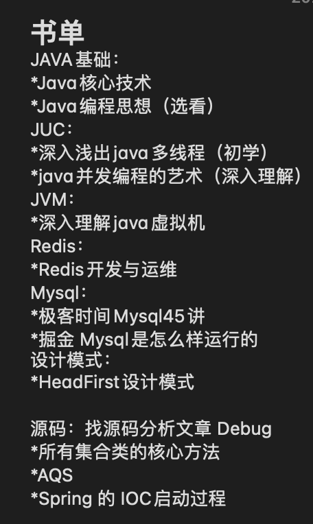

面试可以看这个 https://snailclimb.gitee.io/javaguide/#/

学习源码可以看 https://www.javadoop.com/

## String和StringBuffer的区别（主要是添加元素时的性能差异）

## 如何实现一个栈的数据结构

## 原子类

## sleep 和 wait 的区别

sleep是Thread类中的方法，wait是object类中的方法，两个方法都会暂停当前线程，让出CPU资源

在调用sleep方法的过程中，线程不会释放对象锁，当指定时间到达后会自动恢复运行状态；调用wait方法时，线程会放弃对象锁，只有调用notify后才能够重新获得CPU执行时间

## 在浏览器中输⼊url地址 ->> 显示主⻚的过程

1.DNS解析

2.TCP连接

3.发送HTTP请求

4.服务器处理请求并返回HTTP报文

5.浏览器解析渲染页面

6.连接结束

具体过程可参考：https://segmentfault.com/a/1190000006879700

## Http状态码

| 状态码 | 类别                           | 说明                                    |
| ------ | ------------------------------ | --------------------------------------- |
| 1xx    | Informational(信息性状态码)    | 指示信息–表示请求已接收，继续处理       |
| 2xx    | Success(成功状态码)            | 成功–表示请求已被成功接收、理解、接受   |
| 3xx    | Redirection(重定向状态码)      | 重定向–要完成请求必须进行更进一步的操作 |
| 4xx    | Client Error(客户端错误状态码) | 客户端错误–请求有语法错误或请求无法实现 |
| 5xx    | Server Error(服务器错误状态码) | 服务器端错误–服务器未能实现合法的请求   |

**常见状态码**

| 状态码 |                    | 说明                                                         |
| ------ | ------------------ | ------------------------------------------------------------ |
| 200    | OK                 | 表示从客户端发送给服务器的请求被正常处理并返回               |
| 204    | No Content         | 表示客户端发送给客户端的请求得到了成功处理，但在返回的响应报文中不含实体的主体部分（没有资源可以返回） |
| 301    | Moved Permanently  | 永久性重定向，表示请求的资源被分配了新的URL，之后应使用更改的URL |
| 302    | Found              | 临时性重定向，表示请求的资源被分配了新的URL，希望本次访问使用新的URL |
| 304    | Not Modified       | 表示客户端发送附带条件（是指采用GET方法的请求报文中包含if-Match、If-Modified-Since、If-None-Match、If-Range、If-Unmodified-Since中任一首部）的请求时，服务器端允许访问资源，但是请求为满足条件的情况下返回该状态码 |
| 400    | Bad Request        | 表示请求报文中存在语法错误                                   |
| 401    | Unauthorized       | 未经许可，需要通过HTTP认证                                   |
| 403    | Forbidden          | 服务器拒绝该次访问（访问权限出现问题）                       |
| 404    | Not Found          | 表示服务器上无法找到请求的资源                               |
| 422    |                    |                                                              |
| 500    | Inter Server Error | 表示服务器在执行请求时发生了错误，也有可能是web应用存在的bug或某些临时的错误时 |

# 税友：

## 一面：

spring循环依赖如何解决的

spring用到了哪些设计模式，分别在什么场景下用到了哪种设计模式

spring事务的原理，以及在哪些情况下事务会失效

mysql索引优化方案

mybatis的自定义插件是否有了解

消息中间件选取kafka而没有选择rocketmq的理由，如何保证消息的准确送达

Excel数据解析时，前三个表执行完以后才能执行第四个表，在多线程中如何设计实现

