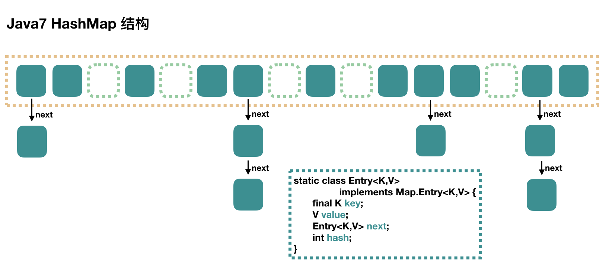

## 一、HashMap

### 1、java7

数组+链表



#### 1.1 put过程


```java
public V put(K key, V value) {
    // 当插入第一个元素的时候，需要先初始化数组大小
    if (table == EMPTY_TABLE) {
        inflateTable(threshold);
    }
    // 如果 key 为 null，感兴趣的可以往里看，最终会将这个 entry 放到 table[0] 中
    if (key == null)
        return putForNullKey(value);
    // 1. 求 key 的 hash 值
    int hash = hash(key);
    // 2. 找到对应的数组下标
    int i = indexFor(hash, table.length);
    // 3. 遍历一下对应下标处的链表，看是否有重复的 key 已经存在，
    //    如果有，直接覆盖，put 方法返回旧值就结束了
    for (Entry<K,V> e = table[i]; e != null; e = e.next) {
        Object k;
        if (e.hash == hash && ((k = e.key) == key || key.equals(k))) {
            V oldValue = e.value;
            e.value = value;
            e.recordAccess(this);
            return oldValue;
        }
    }

    modCount++;
    // 4. 不存在重复的 key，将此 entry 添加到链表中，细节后面说
    addEntry(hash, key, value, i);
    return null;
}
```

#### 2.1 get过程


### 2、java8

数组+链表+红黑树


#### 2.1 put过程


```java
public V put(K key, V value) {
    return putVal(hash(key), key, value, false, true);
}

// 第四个参数 onlyIfAbsent 如果是 true，那么只有在不存在该 key 时才会进行 put 操作
// 第五个参数 evict 我们这里不关心
final V putVal(int hash, K key, V value, boolean onlyIfAbsent,
               boolean evict) {
    Node<K,V>[] tab; Node<K,V> p; int n, i;
    // 第一次 put 值的时候，会触发下面的 resize()，类似 java7 的第一次 put 也要初始化数组长度
    // 第一次 resize 和后续的扩容有些不一样，因为这次是数组从 null 初始化到默认的 16 或自定义的初始容量
    if ((tab = table) == null || (n = tab.length) == 0)
        n = (tab = resize()).length;
    // 找到具体的数组下标，如果此位置没有值，那么直接初始化一下 Node 并放置在这个位置就可以了
    if ((p = tab[i = (n - 1) & hash]) == null)
        tab[i] = newNode(hash, key, value, null);

    else {// 数组该位置有数据
        Node<K,V> e; K k;
        // 首先，判断该位置的第一个数据和我们要插入的数据，key 是不是"相等"，如果是，取出这个节点
        if (p.hash == hash &&
            ((k = p.key) == key || (key != null && key.equals(k))))
            e = p;
        // 如果该节点是代表红黑树的节点，调用红黑树的插值方法，本文不展开说红黑树
        else if (p instanceof TreeNode)
            e = ((TreeNode<K,V>)p).putTreeVal(this, tab, hash, key, value);
        else {
            // 到这里，说明数组该位置上是一个链表
            for (int binCount = 0; ; ++binCount) {
                // 插入到链表的最后面(Java7 是插入到链表的最前面)
                if ((e = p.next) == null) {
                    p.next = newNode(hash, key, value, null);
                    // TREEIFY_THRESHOLD 为 8，所以，如果新插入的值是链表中的第 8 个
                    // 会触发下面的 treeifyBin，也就是将链表转换为红黑树
                    if (binCount >= TREEIFY_THRESHOLD - 1) // -1 for 1st
                        treeifyBin(tab, hash);
                    break;
                }
                // 如果在该链表中找到了"相等"的 key(== 或 equals)
                if (e.hash == hash &&
                    ((k = e.key) == key || (key != null && key.equals(k))))
                    // 此时 break，那么 e 为链表中[与要插入的新值的 key "相等"]的 node
                    break;
                p = e;
            }
        }
        // e!=null 说明存在旧值的key与要插入的key"相等"
        // 对于我们分析的put操作，下面这个 if 其实就是进行 "值覆盖"，然后返回旧值
        if (e != null) {
            V oldValue = e.value;
            if (!onlyIfAbsent || oldValue == null)
                e.value = value;
            afterNodeAccess(e);
            return oldValue;
        }
    }
    ++modCount;
    // 如果 HashMap 由于新插入这个值导致 size 已经超过了阈值，需要进行扩容
    if (++size > threshold)
        resize();
    afterNodeInsertion(evict);
    return null;
}
```

#### 2.2 get过程


## 二、ConcurrentHashMap

### 1、java7

#### 1.1 数据结构

​	ConcurrentHashMap是由Segment数组构成的，Segment通过继承ReentrantLock来进行加锁。

​	Segment数组长度可以表示该ConcurrentHashMap的并行级别，默认有16个Segment，所以只要操作分布在不同的Segment上，ConcurrentHashMap最多可以同时支持16个线程并发写。

​	concurrencyLevel：这个值就表示该ConcurrentHashMap的Segemnt数量，默认为16，也可以在初始化ConcurrentHashMap时设置为其他值，但是**一旦初始化以后，它是不可以扩容的**。


### 2、java8

#### `sizeCtl`含义解释

> **注意：`sizeCtl`，这个变量是一个非常重要的变量，而且具有非常丰富的含义，它的值不同，对应的含义也不一样，这里我们先对这个变量不同的值的含义做一下说明，后续源码分析过程中，进一步解释**
>
> `sizeCtl`为0，代表数组未初始化， 且数组的初始容量为16
>
> `sizeCtl`为正数，如果数组未初始化，那么其记录的是数组的初始容量，如果数组已经初始化，那么其记录的是数组的扩容阈值
>
> `sizeCtl`为-1，表示数组正在进行初始化
>
> `sizeCtl`小于0，并且不是-1，表示数组正在扩容， -(1+n)，表示此时有n个线程正在共同完成数组的扩容操作

#### 2.1 数据结构

​	Java8 的ConcurrentHashMap在数据结构上与HashMap基本一样，即数组+链表+红黑树，并没有和Java7一样去继承ReentrantLock来加锁，而是用较多的cas操作和缩小加锁范围，进一步提升了ConcurrnetHashMap的性能。


#### 2.2 put过程

```java
public V put(K key, V value) {
    return putVal(key, value, false);
}

final V putVal(K key, V value, boolean onlyIfAbsent) {
    if (key == null || value == null) throw new NullPointerException();
    // 得到 hash 值
    int hash = spread(key.hashCode());
    // 用于记录相应链表的长度
    int binCount = 0;
    for (Node<K,V>[] tab = table;;) {
        Node<K,V> f; int n, i, fh;
        // 如果数组"空"，进行数组初始化
        if (tab == null || (n = tab.length) == 0)
            // 初始化数组，后面会详细介绍
            tab = initTable();

        // 找该 hash 值对应的数组下标，得到第一个节点 f
        else if ((f = tabAt(tab, i = (n - 1) & hash)) == null) {
            // 如果数组该位置为空，
            //    用一次 CAS 操作将这个新值放入其中即可，这个 put 操作差不多就结束了，可以拉到最后面了
            //          如果 CAS 失败，那就是有并发操作，进到下一个循环就好了
            if (casTabAt(tab, i, null,
                         new Node<K,V>(hash, key, value, null)))
                break;                   // no lock when adding to empty bin
        }
        // hash 居然可以等于 MOVED，这个需要到后面才能看明白，不过从名字上也能猜到，肯定是因为在扩容
        else if ((fh = f.hash) == MOVED)
            // 帮助数据迁移，这个等到看完数据迁移部分的介绍后，再理解这个就很简单了
            tab = helpTransfer(tab, f);

        else { // 到这里就是说，f 是该位置的头结点，而且不为空

            V oldVal = null;
            // 获取数组该位置的头结点的监视器锁
            synchronized (f) {
                if (tabAt(tab, i) == f) {
                    if (fh >= 0) { // 头结点的 hash 值大于 0，说明是链表
                        // 用于累加，记录链表的长度
                        binCount = 1;
                        // 遍历链表
                        for (Node<K,V> e = f;; ++binCount) {
                            K ek;
                            // 如果发现了"相等"的 key，判断是否要进行值覆盖，然后也就可以 break 了
                            if (e.hash == hash &&
                                ((ek = e.key) == key ||
                                 (ek != null && key.equals(ek)))) {
                                oldVal = e.val;
                                if (!onlyIfAbsent)
                                    e.val = value;
                                break;
                            }
                            // 到了链表的最末端，将这个新值放到链表的最后面
                            Node<K,V> pred = e;
                            if ((e = e.next) == null) {
                                pred.next = new Node<K,V>(hash, key,
                                                          value, null);
                                break;
                            }
                        }
                    }
                    else if (f instanceof TreeBin) { // 红黑树
                        Node<K,V> p;
                        binCount = 2;
                        // 调用红黑树的插值方法插入新节点
                        if ((p = ((TreeBin<K,V>)f).putTreeVal(hash, key,
                                                       value)) != null) {
                            oldVal = p.val;
                            if (!onlyIfAbsent)
                                p.val = value;
                        }
                    }
                }
            }

            if (binCount != 0) {
                // 判断是否要将链表转换为红黑树，临界值和 HashMap 一样，也是 8
                if (binCount >= TREEIFY_THRESHOLD)
                    // 这个方法和 HashMap 中稍微有一点点不同，那就是它不是一定会进行红黑树转换，
                    // 如果当前数组的长度小于 64，那么会选择进行数组扩容，而不是转换为红黑树
                    //    具体源码我们就不看了，扩容部分后面说
                    treeifyBin(tab, i);
                if (oldVal != null)
                    return oldVal;
                break;
            }
        }
    }
    addCount(1L, binCount);
    return null;
}
```

* **扩容：tryPresize**

  ```java
  // 首先要说明的是，方法参数 size 传进来的时候就已经翻了倍了
  private final void tryPresize(int size) {
      // c：size 的 1.5 倍，再加 1，再往上取最近的 2 的 n 次方。
      int c = (size >= (MAXIMUM_CAPACITY >>> 1)) ? MAXIMUM_CAPACITY :
          tableSizeFor(size + (size >>> 1) + 1);
      int sc;
      while ((sc = sizeCtl) >= 0) {
          Node<K,V>[] tab = table; int n;
  
          // 这个 if 分支和之前说的初始化数组的代码基本上是一样的，在这里，我们可以不用管这块代码
          if (tab == null || (n = tab.length) == 0) {
              n = (sc > c) ? sc : c;
              if (U.compareAndSwapInt(this, SIZECTL, sc, -1)) {
                  try {
                      if (table == tab) {
                          @SuppressWarnings("unchecked")
                          Node<K,V>[] nt = (Node<K,V>[])new Node<?,?>[n];
                          table = nt;
                          sc = n - (n >>> 2); // 0.75 * n
                      }
                  } finally {
                      sizeCtl = sc;
                  }
              }
          }
          else if (c <= sc || n >= MAXIMUM_CAPACITY)
              break;
          else if (tab == table) {
              // 我没看懂 rs 的真正含义是什么，不过也关系不大
              int rs = resizeStamp(n);
  
              if (sc < 0) {
                  Node<K,V>[] nt;
                  if ((sc >>> RESIZE_STAMP_SHIFT) != rs || sc == rs + 1 ||
                      sc == rs + MAX_RESIZERS || (nt = nextTable) == null ||
                      transferIndex <= 0)
                      break;
                  // 2. 用 CAS 将 sizeCtl 加 1，然后执行 transfer 方法
                  //    此时 nextTab 不为 null
                  if (U.compareAndSwapInt(this, SIZECTL, sc, sc + 1))
                      transfer(tab, nt);
              }
              // 1. 将 sizeCtl 设置为 (rs << RESIZE_STAMP_SHIFT) + 2)
              //     我是没看懂这个值真正的意义是什么？不过可以计算出来的是，结果是一个比较大的负数
              //  调用 transfer 方法，此时 nextTab 参数为 null
              else if (U.compareAndSwapInt(this, SIZECTL, sc,
                                           (rs << RESIZE_STAMP_SHIFT) + 2))
                  transfer(tab, null);
          }
      }
  }
  ```

* **数据迁移：transfer**

  ```java
  private final void transfer(Node<K,V>[] tab, Node<K,V>[] nextTab) {
      int n = tab.length, stride;
      //如果是多cpu，那么每个线程划分任务，最小任务量是16个桶位的迁移
      if ((stride = (NCPU > 1) ? (n >>> 3) / NCPU : n) < MIN_TRANSFER_STRIDE)
          stride = MIN_TRANSFER_STRIDE; // subdivide range
      //如果是扩容线程，此时新数组为null
      if (nextTab == null) {            // initiating
          try {
              @SuppressWarnings("unchecked")
              //两倍扩容创建新数组
              Node<K,V>[] nt = (Node<K,V>[])new Node<?,?>[n << 1];
              nextTab = nt;
          } catch (Throwable ex) {      // try to cope with OOME
              sizeCtl = Integer.MAX_VALUE;
              return;
          }
          nextTable = nextTab;
          //记录线程开始迁移的桶位，从后往前迁移
          transferIndex = n;
      }
      //记录新数组的末尾
      int nextn = nextTab.length;
      //已经迁移的桶位，会用这个节点占位（这个节点的hash值为-1--MOVED）
      ForwardingNode<K,V> fwd = new ForwardingNode<K,V>(nextTab);
      boolean advance = true;
      boolean finishing = false; // to ensure sweep before committing nextTab
      for (int i = 0, bound = 0;;) {
          Node<K,V> f; int fh;
          while (advance) {
              int nextIndex, nextBound;
              //i记录当前正在迁移桶位的索引值
              //bound记录下一次任务迁移的开始桶位
              
              //--i >= bound 成立表示当前线程分配的迁移任务还没有完成
              if (--i >= bound || finishing)
                  advance = false;
              //没有元素需要迁移 -- 后续会去将扩容线程数减1，并判断扩容是否完成
              else if ((nextIndex = transferIndex) <= 0) {
                  i = -1;
                  advance = false;
              }
              //计算下一次任务迁移的开始桶位，并将这个值赋值给transferIndex
              else if (U.compareAndSwapInt
                       (this, TRANSFERINDEX, nextIndex,
                        nextBound = (nextIndex > stride ?
                                     nextIndex - stride : 0))) {
                  bound = nextBound;
                  i = nextIndex - 1;
                  advance = false;
              }
          }
          //如果没有更多的需要迁移的桶位，就进入该if
          if (i < 0 || i >= n || i + n >= nextn) {
              int sc;
              //扩容结束后，保存新数组，并重新计算扩容阈值，赋值给sizeCtl
              if (finishing) {
                  nextTable = null;
                  table = nextTab;
                  sizeCtl = (n << 1) - (n >>> 1);
                  return;
              }
  		   //扩容任务线程数减1
              if (U.compareAndSwapInt(this, SIZECTL, sc = sizeCtl, sc - 1)) {
                  //判断当前所有扩容任务线程是否都执行完成
                  if ((sc - 2) != resizeStamp(n) << RESIZE_STAMP_SHIFT)
                      return;
                  //所有扩容线程都执行完，标识结束
                  finishing = advance = true;
                  i = n; // recheck before commit
              }
          }
          //当前迁移的桶位没有元素，直接在该位置添加一个fwd节点
          else if ((f = tabAt(tab, i)) == null)
              advance = casTabAt(tab, i, null, fwd);
          //当前节点已经被迁移
          else if ((fh = f.hash) == MOVED)
              advance = true; // already processed
          else {
              //当前节点需要迁移，加锁迁移，保证多线程安全
              //此处迁移逻辑和jdk7的ConcurrentHashMap相同，不再赘述
              synchronized (f) {
                  if (tabAt(tab, i) == f) {
                      Node<K,V> ln, hn;
                      if (fh >= 0) {
                          int runBit = fh & n;
                          Node<K,V> lastRun = f;
                          for (Node<K,V> p = f.next; p != null; p = p.next) {
                              int b = p.hash & n;
                              if (b != runBit) {
                                  runBit = b;
                                  lastRun = p;
                              }
                          }
                          if (runBit == 0) {
                              ln = lastRun;
                              hn = null;
                          }
                          else {
                              hn = lastRun;
                              ln = null;
                          }
                          for (Node<K,V> p = f; p != lastRun; p = p.next) {
                              int ph = p.hash; K pk = p.key; V pv = p.val;
                              if ((ph & n) == 0)
                                  ln = new Node<K,V>(ph, pk, pv, ln);
                              else
                                  hn = new Node<K,V>(ph, pk, pv, hn);
                          }
                          setTabAt(nextTab, i, ln);
                          setTabAt(nextTab, i + n, hn);
                          setTabAt(tab, i, fwd);
                          advance = true;
                      }
                      else if (f instanceof TreeBin) {
                          TreeBin<K,V> t = (TreeBin<K,V>)f;
                          TreeNode<K,V> lo = null, loTail = null;
                          TreeNode<K,V> hi = null, hiTail = null;
                          int lc = 0, hc = 0;
                          for (Node<K,V> e = t.first; e != null; e = e.next) {
                              int h = e.hash;
                              TreeNode<K,V> p = new TreeNode<K,V>
                                  (h, e.key, e.val, null, null);
                              if ((h & n) == 0) {
                                  if ((p.prev = loTail) == null)
                                      lo = p;
                                  else
                                      loTail.next = p;
                                  loTail = p;
                                  ++lc;
                              }
                              else {
                                  if ((p.prev = hiTail) == null)
                                      hi = p;
                                  else
                                      hiTail.next = p;
                                  hiTail = p;
                                  ++hc;
                              }
                          }
                          ln = (lc <= UNTREEIFY_THRESHOLD) ? untreeify(lo) :
                              (hc != 0) ? new TreeBin<K,V>(lo) : t;
                          hn = (hc <= UNTREEIFY_THRESHOLD) ? untreeify(hi) :
                              (lc != 0) ? new TreeBin<K,V>(hi) : t;
                          setTabAt(nextTab, i, ln);
                          setTabAt(nextTab, i + n, hn);
                          setTabAt(tab, i, fwd);
                          advance = true;
                      }
                  }
              }
          }
      }
  }
  ```

#### 2.3 get过程

1. 计算 hash 值
2. 根据 hash 值找到数组对应位置: (n - 1) & h
3. 根据该位置处结点性质进行相应查找
   - 如果该位置为 null，那么直接返回 null 就可以了
   - 如果该位置处的节点刚好就是我们需要的，返回该节点的值即可
   - 如果该位置节点的 hash 值小于 0，说明正在扩容，或者是红黑树，后面我们再介绍 find 方法
   - 如果以上 3 条都不满足，那就是链表，进行遍历比对即可


## HashMap长度为什么需要是2的次幂

​	数组下标的计算公式是 index=HashCode(key) % length，即hash对数组长度取模，该公式在length为2的次幂时，有一个等价的公式 index=HashCode(key) & (length-1)。而位运算效率比算数运算高，所以length选择了2的次幂。

​	注：网上说的选择length为2的次幂还有一个原因是因为这样（length-1）的二进制是全1，这样HashCode(key) & 全为1的一串二进制，等价于HashCode的低n位，这样，只要HashCode本身能够分布均匀，那么Hash算法的结果就是均匀的。但我认为这个理由弄反了因果关系，应该是希望hash算法能够均匀分布，因此选择对数组长度进行取模，此时，无论数组长度是否是2的次幂，都是可以保证结果是均匀分布的，只不过为了提升运算效率，可以将其转换为位与操作，但两个公式等价的前提是长度需要为2的次幂，所以才导致了该结果。


List
