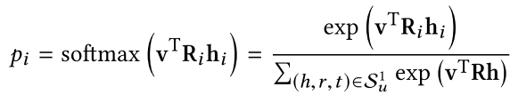
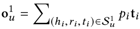

[toc]

---

---

# 基于知识图谱的模型总览

> 以MovieLens1M为数据集的模型有：1.CKE	2.entity2rec	3.KSR	4.KTUP	5.MKR	||	6.RKGE	7.KPRN	8.Ekar	||	9.RippleNet	10.AKUPM	11.KNI	12.RCoLM	13.AKGE

---

# 一、Embedding-based methods

**根本思想：**利用知识图谱中直接与用户或项目连接的实体来丰富用户或项目的表示

> 为了使用知识图谱的信息，需要利用知识图谱嵌入算法（KGE）将知识图谱编码到低维空间向量。KGE方法可分为两类：**平移距离模型**（translational distance models），例如：TransE、TransH、TransR、TransD；和**语义匹配模型**（semantic matching models），例如：DistMult

## 1.1CKE（Collabrative Knowledge Base Embedding）

使用多种项目辅

* 融合**项目**的各种辅助信息，包括结构化信息——知识图谱，和非结构化信息——文本信息和图像信息。

* 知识图谱信息是通过==TransR==编码，非结构化文本和图像信息分别通过：去噪的自动编码器，和基于卷积的自动编码器获取。

​	 CKE实验表明，引入结构知识可以提高推荐准确性。 

## 1.2CFKG（Collaborative Filtering on Knowledge Graphs）

构建**用户-项目知识图谱**，在该图中，用户行为被视为知识图谱中的一种关系（如，购买、评论），同时项目的各种辅助信息也被引入。通过将用户引入知识图，直接对用户偏好进行建模。

* 为了学习图中实体和关系的嵌入，CFKG定义了一个度量函数 d(.) 来衡量给定关系上的两个实体之间的距离。 将每个关系视为一个转换函数，用来将一个实体转换为另一个实体:

$$
e_t = trans(e_h,r) = e_h + r\ \ \ \ \ \ \ \ \ \ \ \ \ \ （1）\\
{\rm 由于不能为上式中的每个实体生成一个嵌入，使得对于固定嵌入的}\ e_h\ 和\ r，映射到不同的尾结点，所以文章放宽了上式约束。\\
具体如下：\\
对于翻译函数\ trans(e_h,r),使其约等于e_t,对于真实三元组中的尾实体，使其更接近于trans(\cdot)的结果。
$$

​	以上被称为基于嵌入的生成框架（embedding-based generative framwork），最早出现在《Distributed representations of words and phrases and their compositionality》中

* 基于嵌入的生成框架的优化目标：
  $$
  对于真实三元组（e_h,e_t,r）\in S,通过优化给定trans(e_h, r)的e_t的生成概率来学习翻译模型trans(e_h, r),定义如下：\\
  P\big(e_t|trans(e_h,r)\big)=\frac{exp\big(e_t\cdot trans(e_h,r)\big)}{\sum_{e'_t\in E_t}exp\big(e'_t\cdot trans(e_h,r)\big)\\}\\ 
  其中E_t是与真实e_t具有相同类型的所有实体的集合，包括虚假的尾实体\\
  因为上式是e_t在E_t上的softmax函数，所以结果会显式的增加trans(e_h,r)和真实尾实体e_t的相似度，\\
  而减小和虚假尾实体的相似度
  $$

## 1.3KTUP（Knowledge-enhanced  Translation-based User Preference model）

认为在将知识图谱引入推荐系统时，应该考虑知识图谱的不完整性。**提出将推荐和知识图谱补全两个任务统一到一个联合模型中**，以实现相互增强。其基本思想体现在以下两方面：

1. 利用KG中的事实作为辅助数据，增强用户-项目交互的建模
2. 在增强的用户-项目建模的基础上，填补KG中缺失的实体间的连接关系

**两个模块如下：**

* **推荐模块：**

受知识图谱的翻译模型的启发，该模型在用户和项目之间引入超平面，以显式地建模用户的偏好，使得
$$
  u + p\approx i
$$
考虑到用户偏好的隐含性和多样性，在TUP（Translation-based User Preference model）中设计了两个主要组件来捕获用户偏好：

  >* 偏好归纳
  >
  >* 基于超平面的翻译

  

  损失函数如下：
$$
\mathcal L_{rec}=\sum_{(u,v,v')\in R}-{\rm log\sigma}\Big[f(u,v',p')-f(u,v,p)\Big]\\
  其中，(u,v)是正样本，(u,v')是负样本；p表示用户对给定商品的偏好的潜在向量，f(\cdot)是基于翻译的\\
  模型{\rm \ Translation-based\ User\ Preference\ model \ (TUP)}
$$
  该模块用于对用户-项目对的真实性进行建模

* **知识图谱补全模块损失：**
  $$
  \mathcal L_{KG}=\sum_{(e_h,e_t,r)\in G}\ \sum_{(e'_h,e'_t,r')\in G^-}\Big[g(e_h,e_t,r)+\gamma-g(e'_h,e'_t,r')\Big]_+\\
  其中，g(\cdot)是{\rm \ TransH\ }模型，\gamma\ 是用来控制正确和错误三元组间的{\rm \ margin}
  $$

* **总结：**

  将两个任务融合在一个训练框架中，主要创新是在推荐模块引入了超平面 P ，显式地对用户偏好进行建模。另外，知识图谱补全任务，采用的是TransH来学习实体和关系的嵌入，并且在论文中似乎证明了在1-to-1   1-to-N   N-to-1    N-to-N   上，TransR的性能表现最差，而TransH的表现最好。

## 1.4MKR（Multi-task feature learning approach for Knowledge graph enhanced Recommendation）

同样联合推荐任务和知识图谱嵌入任务，利用知识图嵌入任务来辅助推荐任务。两个任务间通过交叉压缩单元相关联，该交叉压缩单元显式地对项目和实体间的高阶交互进行建模。

**模型框架**

**总结：**这里融合的知识图谱的信息，仍然是项目的一阶邻居的信息，我认为有两个显而易见的缺点：

1. 对每个item，随机抽取一个直接相连的邻居，没有获取它所有周边邻居的信息
2. 仅获取了一阶邻居的信息，没有将基于项目的高阶连通性注入表示中

# 二、Path-based methods

一般来说，基于路径的方法利用用户 and/or 项目间连通的相似性来增强推荐。

传统的方法，如PER、HeteCF和SemRec，基于原路径的相似性来刻画用户-项目的连通性；还有一些方法是基于原路径的随机游走（Random walk）来生成推荐，例如：HERec、HIN2Vec、HINE和Metapath2vec。以上的方法需要很大的人力去定义元路径，并且需要领域知识，而且人为定义元路径经常难以覆盖所有的实体关系。

RKGE和KPRN则自动提取固定长度的路径，然后利用RNN建模这些路径。

<u>总而言之，基于路径的方法将复杂的用户-项目连接分解为单独的线性路径将不可避免地导致信息的丢失。</u>

# 三、Propagation based methods

## 3.1RippleNet

* **概述：**

  第一次将以上两种KG-based方法融合到一起：

  RippleNet通过偏好传播过程，将KGE方法融合到推荐系统中；RippleNet可以自动的挖掘用户历史到候选项的路径，而无需手工设计元路径的过程。RippleNet由内向外的传播用户偏好

​	

​	对于每一个传播步骤，获取一个固定大小的sample neighbors，以减少计算开销；k-hop中k的取值也有限制，以避免传播路径太长带来的噪声影响。

* **偏好传播：**

  对于候选项v，在ripple set中衡量v与头结点h在关系r上的相似性（跟注意力机制很相似），之后按此相似性分数将尾结点t的embedding加权求和

  
  
  
  $$
  通过将上式中的v替换为o^1_u，我们可以重复该偏好传播过程来获取用户u对候选项v的2阶、3阶.....响应
  $$

## 3.2KGCN

* **概述：**

  对于项目v，首先采样项目v的h-hop的邻居集合，每一层hop上采样的节点数固定，然后从最外层的hop由外向内的聚合信息。

* **KGCN和RippleNet的区别**：

  RippleNet从用户的历史交互项向外地传播用户偏好，最终获取的是用户的表示；KGCN则从最远的邻居由外向内的学习候选项的表示，最终获取的是项目的表示。

## 3.3GAT

​	**方法：**

​	

​	W是可学习的二维矩阵，用来对节点嵌入做线性变换，

​	**优点：**

> 1. 计算高效
> 2. 与GCN不同的是，GAT模型允许为同一个邻居的节点分配不同的权重，从而实现了模型容量的飞跃。此外，习得的注意力权重可能会带来可解释方面的好处

