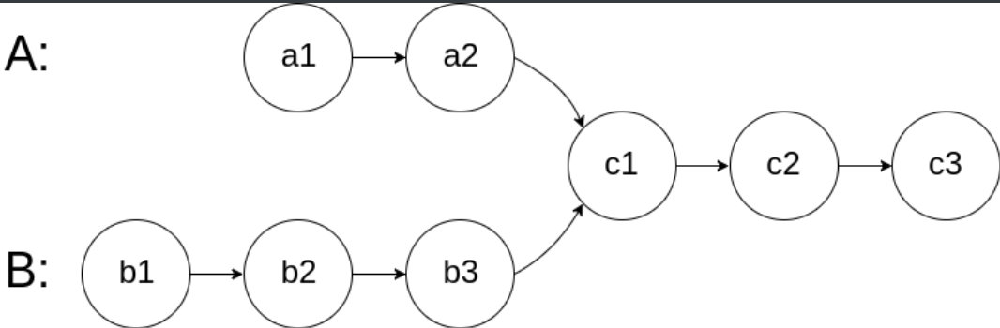
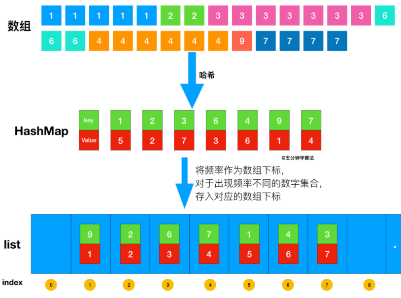
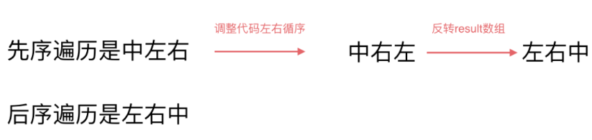

[toc]

---

常用的类和方法：

1. 字符串

```java
String s
char[] sArray = s.toCharArray();	//将字符串转换为字符数组
s.substring(start, end);		    //截取 start——end 的元素(不包括end)
```


2. 字符 Character

```java
Character.isDigit(char);			// 判断一个字符是否为数字
Character.isLetter(char);			// 判断一个字符是否为字母
Character.isLetterOrDigit(char);	// 判断一个字符是否是数字或字母
Character.isLowerCase(char);		// 判断一个字符是否是小写字母
Character.isUpperCase(char);		// 判断一个字符是否是大写字母
Character.toLowerCase(char);		// 将一个字母转换为小写，需要用一个char接收， char a = Character.toLowerCase(char);
Character.toUpperCase(char);		// 将一个字母转换为大写
```


# 1 数组

### [旋转数组](https://leetcode-cn.com/problems/rotate-array/)

>  给定一个数组，将数组中的元素向右移动 *k* 个位置，其中 *k* 是非负数。 

```java
class Solution {
    public void rotate(int[] nums, int k) {
        int n = nums.length;
        k %= n;
        reverse(nums, 0, n-1);
        reverse(nums, 0, k-1);
        reverse(nums, k, n-1);
    }
    
    private void reverse(int[] nums, int start, int end){
        while(start<end){
            int temp = nums[start];
            nums[start++] = nums[end];
            nums[end--] = temp;
        }
    }
}
```


### [两数之和](https://leetcode-cn.com/problems/two-sum/)

> 给定一个整数数组 `nums` 和一个目标值 `target`，请你在该数组中找出和为目标值的那 **两个** 整数，并返回他们的数组下标。

```java
class Solution {
    public int[] twoSum(int[] nums, int target) {
        Map<Integer, Integer> map = new HashMap<>();
        for(int i =0; i<nums.length; i++){
            int complement = target - nums[i];
            if(map.containsKey(complement)){
                int[] result = new int[] {map.get(complement), i};
                return result;
            }
            map.put(nums[i],i);
        }
        throw new IllegalArgumentException("No two sum solution");
    }
}
```


### [两个数组的交集 II](https://leetcode-cn.com/problems/intersection-of-two-arrays-ii/)

>  给定两个数组，编写一个函数来计算它们的交集。 

```java
class Solution {
    public int[] intersect(int[] nums1, int[] nums2) {
        //遍历数组长度较小的那个
        if(nums1.length > nums2.length) return intersect(nums2, nums1);
        
        Map<Integer, Integer> map = new HashMap<Integer, Integer>();
        for(int num : nums1){
            int count = map.getOrDefault(num,0) + 1;	//在JDK8之后，对map新增了getOrDefault()方法,	//getOrDefault(key,默认值)   如果Map中存在key，则返回key所对应的的value；如果Map中不存在key，则返回默认值。
            map.put(num, count);
        }
        int[] intersection = new int[nums1.length];
        int index = 0;
        for(int num : nums2){
            int count = map.getOrDefault(num, 0);
            if(count > 0){
                intersection[index++] = num;
                count--;
                if(count>0){
                    map.put(num, count);
                } else{
                    map.remove(num);
                }
                
            }
        }
        return Arrays.copyOfRange(intersection, 0, index);
    }
}
```


### [合并区间](https://leetcode-cn.com/problems/merge-intervals/)

```java
class Solution {
    public int[][] merge(int[][] intervals) {
        // 先按照区间起始位置排序
        Arrays.sort(intervals, (v1, v2) -> v1[0] - v2[0]);
        int[][] res = new int[intervals.length][2];
        int idx = -1;
        for(int[] interval: intervals){
            // 如果结果数组是空的，或者当前区间的起始位置 > 结果数组中最后区间的终止位置，
            // 则不合并，直接将当前区间加入结果数组。
            if(idx == -1 || interval[0] > res[idx][1]){
                res[++idx] = interval;
            }else{
                // 反之将当前区间合并至结果数组的最后区间
                res[idx][1] = Math.max(res[idx][1], interval[1]);
            }
        }
        return Arrays.copyOfRange(res, 0, idx+1);
    }
}
```


### [旋转矩阵](https://leetcode-cn.com/problems/rotate-matrix-lcci/)

>  给一幅由 `N × N` 矩阵表示的图像。设计一种算法，将图像旋转 90 度 

```java
class Solution {
    public void rotate(int[][] matrix) {
        int N = matrix[0].length;
        //先以对角线（左上-右下）为轴进行翻转
        for(int row=0; row<N-1; row++)
        {
            for(int col=row+1; col<N; col++){
                int temp = matrix[row][col];
                matrix[row][col] = matrix[col][row];
                matrix[col][row] = temp;
            }
        }
        
        //再对每一行以中点进行翻转
        int mid = N>>1;
        for(int row=0; row<N; row++){
            for(int col=0; col<mid; col++){
                int temp = matrix[row][col];
                matrix[row][col] = matrix[row][N-1-col];
                matrix[row][N-1-col] = temp;
            }
        }
    }
}
```


### [零矩阵](https://leetcode-cn.com/problems/zero-matrix-lcci/)

>  编写一种算法，若M × N矩阵中某个元素为0，则将其所在的行与列清零。 

```java
class Solution {
    public void setZeroes(int[][] matrix) {
        //获取二维数组行数
        int m = matrix.length;
        //获取二维数组列数
        int n = matrix[0].length;
        //使用for中的迭代器这里需要指定Set<>中元素的类型
        Set<Integer> rows = new HashSet();
        Set<Integer> cols = new HashSet();
        for(int i=0; i<m; i++){
            for(int j=0; j<n; j++){
                if(matrix[i][j]==0){
                    rows.add(i);
                    cols.add(j);
                }
            }
        }
        
        for(Integer row: rows){			//或者 for(int row: rows) 
            for(int j=0; j<n; j++){
                matrix[row][j] = 0;
            }
        }
        
        for(Integer col: cols){
            for(int i=0; i<m; i++){
                matrix[i][col] = 0;
            }
        }
        
    }
}
```


### 字节真题：获取一个数组的所有子序列

```java
/**
     * 获取一个数组的所有子序列，元素个数为n的数组的所有子序列的个数为2的n次方
     * 例如{1,2,3,4}的所有子序列为{},{1},{2},{3},{4},{1,2},{1,3},{1,4},{2,3},{2,4},{3,4},{1,2,3},{1,2,4},{1,3,4},{2,3,4},{1,2,3,4}
     * @param arr   int[]
     * @return      ArrayList<ArrayList<Integer>>
     */
    private ArrayList<ArrayList<Integer>> getSubList(int[] arr) {
        ArrayList<ArrayList<Integer>> allList = new  ArrayList<>();
        // 将1逻辑左移 arr.length 位
        int size = 1 << arr.length;
        for (int mark = 0; mark < size; mark++) {
            ArrayList<Integer> aList = new ArrayList<>();
            for (int i = 0; i < arr.length; i++){
                if((mark & (1 << i)) != 0) {
                    aList.add(arr[i]);
                }
            }
            allList.add(aList);
        }
        return allList;
    }
```


### [合并两个有序数组](https://leetcode-cn.com/problems/merge-sorted-array/)

> 给你两个有序整数数组 nums1 和 nums2，请你将 nums2 合并到 nums1 中，使 nums1 成为一个有序数组。
>
> 说明:
>
> 初始化 nums1 和 nums2 的元素数量分别为 m 和 n 。
> 你可以假设 nums1 有足够的空间（空间大小大于或等于 m + n）来保存 nums2 中的元素。

```java
class Solution {
    public void merge(int[] nums1, int m, int[] nums2, int n) {
        // two get pointers for nums1 and nums2
        int p1 = m - 1;
        int p2 = n - 1;
        // set pointer for nums1
        int p = m + n - 1;

        // while there are still elements to compare
        while ((p1 >= 0) && (p2 >= 0))
          // compare two elements from nums1 and nums2 
          // and add the largest one in nums1 
          nums1[p--] = (nums1[p1] < nums2[p2]) ? nums2[p2--] : nums1[p1--];

        // add missing elements from nums2
        System.arraycopy(nums2, 0, nums1, 0, p2 + 1);
    }
}
// PS: System.arraycopy(src, srcPos, destination, destPos, length)
// 拷贝一个数组到另一个数组，五个参数分别为 源数组、源数组位置、目标数组、目标数组起始位置、从源数组拷贝的元素个数
```


# 2 字符串

### [最长公共前缀](https://leetcode-cn.com/problems/longest-common-prefix/)

> 编写一个函数来查找字符串数组中的最长公共前缀。
>
> 如果不存在公共前缀，返回空字符串 `""`

```java
class Solution {
    public String longestCommonPrefix(String[] strs) {
        if(strs.length == 0)
            return "";
        String ans = strs[0];
        for(int i=1; i<strs.length;i++){
            int j =0;
            for( ; j<ans.length() && j<strs[i].length(); j++){
                if(ans.charAt(j)!=strs[i].charAt(j))
                    break;
            }
            ans = ans.substring(0, j);
            if(ans.equals(""))
                return ans;
        }
        return ans;
    }
}
```


# 3 双指针

### [移除元素](https://leetcode-cn.com/problems/remove-element/)

> 给你一个数组 nums 和一个值 val，你需要 原地 移除所有数值等于 val 的元素，并返回移除后数组的新长度。
>
> 不要使用额外的数组空间，你必须仅使用 O(1) 额外空间并 原地 修改输入数组。
>

```java
class Solution {
    public int removeElement(int[] nums, int val) {
        if(nums.length==0){
            return 0;
        }
        //慢指针
        int slow = 0;
        //快指针
        for(int fast=0; fast<nums.length; fast++){
            if(nums[fast] != val){
                nums[slow] = nums[fast];
                slow++;
            }
        }
        return slow;
    }
}
```

[快慢指针讲解](https://leetcode-cn.com/leetbook/read/array-and-string/cv3bv/)


### [长度最小的子数组](https://leetcode-cn.com/problems/minimum-size-subarray-sum/)

> 给定一个含有 n 个正整数的数组和一个正整数 s ，找出该数组中满足其和 ≥ s 的长度最小的 连续 子数组，并返回其长度。如果不存在符合条件的子数组，返回 0。
>

```java
class Solution {
    public int minSubArrayLen(int s, int[] nums) {
        int index = 0;
        int sum = 0;
        int len = 0;
        //滑动窗口
        for(int k=0; k<nums.length; k++){
            sum += nums[k];
            while(sum >= s){
                len = len==0? k-index+1: Math.min(len, k-index+1);
                sum -= nums[index++];
            }
        }
        return len;
    }
}
```


### [相交链表](https://leetcode-cn.com/problems/intersection-of-two-linked-lists/)

>编写一个程序，找到两个单链表相交的起始节点。
>
>如下面的两个链表**：**
>
>
>
>在节点 c1 开始相交。

```java
public class Solution {
    public ListNode getIntersectionNode(ListNode headA, ListNode headB) {
        if(headA == null || headB == null) return null;
        ListNode pA = headA, pB = headB;
        // 如果不存在相交的节点，则PA 和 PB 会在第二次循环中同时到达 null，循环会退出
        while (pA != pB){
            pA = pA == null? headB : pA.next;
            pB = pB == null? headA : pB.next;
        }
        return pA;
    }
}
```

[该题的双指针技巧讲解](https://leetcode-cn.com/problems/intersection-of-two-linked-lists/solution/xiang-jiao-lian-biao-by-leetcode/)


### [删除链表的倒数第N个节点](https://leetcode-cn.com/problems/remove-nth-node-from-end-of-list/)

> 给定一个链表，删除链表的倒数第 n 个节点，并且返回链表的头结点。
>
> 示例：给定一个链表: 1->2->3->4->5, 和 n = 2. 当删除了倒数第二个节点后，链表变为 1->2->3->5.
>
> 说明：给定的 n 保证是有效的。

```java
class Solution {
    public ListNode removeNthFromEnd(ListNode head, int n) {
        //虚拟节点，令其指向 head
        ListNode dummy = new ListNode(0);
        dummy.next = head;
        ListNode fast = dummy;
        ListNode slow = dummy;
        //令前面的指针先移动，使fast和slow中间相差n个元素
        for (int i=0; i<=n; i++){
            fast = fast.next;
        }
        //一直fast遍历到空为止，这时slow指向的下一个元素就是要被删除的元素
        while (fast != null){
            fast = fast.next;
            slow = slow.next;
        }
        slow.next = slow.next.next;
        return dummy.next;
    }
}
```


### [回文链表](https://leetcode-cn.com/problems/palindrome-linked-list/)

> 请判断一个链表是否为回文链表。
>
> **示例 1:**
>
> ```
> 输入: 1->2
> 输出: false
> ```
>
> **示例 2:**
>
> ```
> 输入: 1->2->2->1
> 输出: true
> ```

```java
/**
 * Definition for singly-linked list.
 * public class ListNode {
 *     int val;
 *     ListNode next;
 *     ListNode(int x) { val = x; }
 * }
 */
class Solution {
    public boolean isPalindrome(ListNode head) {
        if(head == null) return true;
        
        //找到链表前一半的尾结点和后一半反转后的头结点
        ListNode firstHalfEnd = endOfFirstHalf(head);
        ListNode secondHalfStart = reverseList(firstHalfEnd.next); 

        //判断是否为回文链表
        boolean result = true;
        ListNode firstHalfNode = head;
        ListNode secondHalfNode = secondHalfStart;
        while(result && secondHalfNode != null){
            if(firstHalfNode.val != secondHalfNode.val){
                result = false;
            }
            firstHalfNode = firstHalfNode.next;
            secondHalfNode = secondHalfNode.next;
        }

        //将反转后的后一半的链表再次反转，使其复原，并返回结果
        ListNode secondHalfOriginalStart = reverseList(secondHalfStart);
        firstHalfEnd.next = secondHalfOriginalStart;
        return result;
    }

    //获取列表的中间节点
    public ListNode endOfFirstHalf(ListNode head){
        ListNode slow = head;
        ListNode fast = head;
        while(fast.next != null && fast.next.next != null){
            slow = slow.next;
            fast = fast.next.next;
        }
        return slow;
    }
    
    // 反转列表
    public ListNode reverseList(ListNode head){
        ListNode pre = null;
        ListNode cur = head;
        while(cur != null){
            ListNode temp = cur.next;
            cur.next = pre;
            pre = cur;
            cur = temp;
        }
        return pre;
    }

}
```


### [旋转链表](https://leetcode-cn.com/problems/rotate-list/)

```java
/**
 * Definition for singly-linked list.
 * public class ListNode {
 *     int val;
 *     ListNode next;
 *     ListNode(int x) { val = x; }
 * }
 */
class Solution {
    public ListNode rotateRight(ListNode head, int k) {
        if(head == null) return head;
        int length = 0;
        ListNode tempNode = head;
        while(tempNode != null){
            tempNode = tempNode.next;
            length++;
        }
        k = k % length;
        if(k == 0) return head;

		//找到倒数第k个节点的上一个节点
        ListNode slow = head, fast = head;
        while(k>0){
            fast = fast.next;
            k--;
        }
        while(fast.next != null){
            slow = slow.next;
            fast = fast.next;
        }
        ListNode lastKHead = slow.next;
        //将最后k个节点与前面的链表断开
        slow.next = null;
        //反转前面的链表
        ListNode beforeReverseHead = reverse(head);
        //反转后面的链表
        ListNode lastKReverseHead = reverse(lastKHead);
        //找到前面反转后的链表的尾结点，与后面反转后的k个节点的链表的头结点连接
        ListNode beforeReverseEnd = beforeReverseHead;
        while(beforeReverseEnd.next != null){
            beforeReverseEnd = beforeReverseEnd.next;
        }
        beforeReverseEnd.next = lastKReverseHead;
        //将链表整体再进行一次反转
        ListNode resultHead = reverse(beforeReverseHead);
        return resultHead;
    }

    // 反转链表
    public ListNode reverse(ListNode head){
        ListNode pre = null;
        ListNode cur = head;
        while(cur != null){
            ListNode temp = cur.next;
            cur.next = pre;
            pre = cur;
            cur = temp;
        }
        return pre;
    }
}
```


# 4 哈希表

### HashMap用法

```java
// 1. initialize a hash map
Map<Integer, Integer> hashmap = new HashMap<>();
// 2. insert a new (key, value) pair
hashmap.putIfAbsent(0, 0);
hashmap.putIfAbsent(2, 3);
// 3. insert a new (key, value) pair or update the value of existed key
hashmap.put(1, 1);
hashmap.put(1, 2);
// 4. get the value of specific key
System.out.println("The value of key 1 is: " + hashmap.get(1));
// 5. delete a key
hashmap.remove(2);
// 6. check if a key is in the hash map
if (!hashmap.containsKey(2)) {
    System.out.println("Key 2 is not in the hash map.");
}
// 7. get the size of the hash map
System.out.println("The size of hash map is: " + hashmap.size()); 
// 8. iterate the hash map
for (Map.Entry<Integer, Integer> entry : hashmap.entrySet()) {
    System.out.print("(" + entry.getKey() + "," + entry.getValue() + ") ");
}
System.out.println("are in the hash map.");
// 9. clear the hash map
hashmap.clear();
// 10. check if the hash map is empty
if (hashmap.isEmpty()) {
    System.out.println("hash map is empty now!");
}
//如果存在某键，则返回相应的值，若不存在，则返回默认的值
hashmap.getOrDefault(key, deaultValue);
```


### [快乐数](https://leetcode-cn.com/problems/happy-number/)

>编写一个算法来判断一个数 n 是不是快乐数。
>
>「快乐数」定义为：对于一个正整数，每一次将该数替换为它每个位置上的数字的平方和，然后重复这个过程直到这个数变为 1，也可能是 无限循环 但始终变不到 1。如果 可以变为  1，那么这个数就是快乐数。
>
>如果 n 是快乐数就返回 True ；不是，则返回 False 。
>

```java
class Solution {
    public boolean isHappy(int n) {
        Set<Integer> seen = new HashSet<Integer>();
        seen.add(n);
        while(n != 1){
            n = bitSquare(n);
            // 如果该数在集合中出现过，则进入了死循环，则该数不是快乐数，直接返回false
            if(!seen.add(n)){
                return false;
            }
        }
        return true;
    }

    // 计算一个数各个数位上的平方和
    public int bitSquare(int x){
        int sum=0, cur;
        while(x>0){
            cur = x%10;
            sum += cur*cur;
            x = x/10;
        }
        return sum;
    }

}
```


### [两个列表的最小索引总和](https://leetcode-cn.com/problems/minimum-index-sum-of-two-lists/)

> 假设Andy和Doris想在晚餐时选择一家餐厅，并且他们都有一个表示最喜爱餐厅的列表，每个餐厅的名字用字符串表示。
>
> 你需要帮助他们用最少的索引和找出他们共同喜爱的餐厅。 如果答案不止一个，则输出所有答案并且不考虑顺序。 你可以假设总是存在一个答案。
>

```java
class Solution {
    public String[] findRestaurant(String[] list1, String[] list2) {
        // if(list1.length < list2.length) findRestaurant(list2, list1);
        Map<String, Integer> map = new HashMap<String, Integer>();
        // String[] result = new String[list2.length];
        //这里将数组String[] 改为 动态数组 ArrayList 可降低空间复杂度
        List<String> result = new ArrayList<>();
        int minIndexSum = Integer.MAX_VALUE;
        // int comMinNum = 0;
        for(int i=0; i<list1.length; i++){
            map.put(list1[i], i);
        }
        // 这里加上 i<=minIndexSum 的条件可降低时间复杂度
        for(int i=0; i<list2.length && i<=minIndexSum; i++){
            if(map.containsKey(list2[i])){
                int indexSum = map.get(list2[i]) + i;
                if(indexSum < minIndexSum){
                    // comMinNum = 0;
                    minIndexSum = indexSum;
                    // result[comMinNum] = list2[i];
                    result.clear();
                    result.add(list2[i]);
                    // comMinNum++;
                }
                else if(indexSum == minIndexSum){
                    // result[comMinNum] = list2[i];
                    // comMinNum++;
                    result.add(list2[i]);
                }
            }
        }
        // return Arrays.copyOfRange(result, 0, comMinNum);
        return result.toArray(new String[result.size()]);
    }
}
```


### [存在重复元素 II](https://leetcode-cn.com/problems/contains-duplicate-ii/)

> 给定一个整数数组和一个整数 k，判断数组中是否存在两个不同的索引 i 和 j，使得 nums [i] = nums [j]，并且 i 和 j 的差的 绝对值 至多为 k。
>
> 示例 1:输入: nums = [1,2,3,1], k = 3
> 输出: true

 ```java
class Solution {
    public boolean containsNearbyDuplicate(int[] nums, int k) {
        Map<Integer, Integer> map = new HashMap<>();
            for (int i = 0; i < nums.length; i++) {
                if (map.containsKey(nums[i]) && (i - map.get(nums[i]) <= k)) {
                    return true;
                }else{
                    //本题关键在于仅仅需要保存最近数字的索引，不需要保留所有数字的索引
                    map.put(nums[i],i);
                }
            }
        return false;
    }
}
 ```


### 设计键

[字母异位词分组](https://leetcode-cn.com/problems/group-anagrams/)

> 给定一个字符串数组，将字母异位词组合在一起。字母异位词指字母相同，但排列不同的字符串。
>
> 示例:
>
> 输入: ["eat", "tea", "tan", "ate", "nat", "bat"]
> 输出:
> [
>   ["ate","eat","tea"],
>   ["nat","tan"],
>   ["bat"]
> ]
>
> 说明：所有输入均为小写字母。
> 不考虑答案输出的顺序。

```java
class Solution {
    public List<List<String>> groupAnagrams(String[] strs) {
        if(strs.length == 0) return new ArrayList();
        Map<String, List> ans = new HashMap<String, List>();
        for(String s: strs){
            // 将 String 转换为 char[]
            char[] ca = s.toCharArray();
            // 对 字符数组 按字母顺序进行排序
            Arrays.sort(ca);
            // String.valueOf(char[])  接收字符数组，返回String
            String key = String.valueOf(ca);
            if(!ans.containsKey(key)){
                ans.put(key, new ArrayList());
            }
            // 对哈希表的value——List 进行追加
            ans.get(key).add(s);
        }
        return new ArrayList(ans.values());
    }
}
```


```java
// "static void main" must be defined in a public class.

class MyQueue {
    // store elements
    private List<Integer> data;         
    // a pointer to indicate the start position
    private int p_start;            
    public MyQueue() {
        data = new ArrayList<Integer>();
        p_start = 0;
    }
    /** Insert an element into the queue. Return true if the operation is successful. */
    public boolean enQueue(int x) {
        data.add(x);
        return true;
    };    
    /** Delete an element from the queue. Return true if the operation is successful. */
    public boolean deQueue() {
        if (isEmpty() == true) {
            return false;
        }
        p_start++;
        return true;
    }
    /** Get the front item from the queue. */
    public int Front() {
        return data.get(p_start);
    }
    /** Checks whether the queue is empty or not. */
    public boolean isEmpty() {
        return p_start >= data.size();
    }     
};

public class Main {
    public static void main(String[] args) {
        MyQueue q = new MyQueue();
        q.enQueue(5);
        q.enQueue(3);
        if (q.isEmpty() == false) {
            System.out.println(q.Front());
        }
        q.deQueue();
        if (q.isEmpty() == false) {
            System.out.println(q.Front());
        }
        q.deQueue();
        if (q.isEmpty() == false) {
            System.out.println(q.Front());
        }
    }
}
```


# 5 队列和栈

## 5.1 队列和广度优先搜索BFS

查找一个目标节点的BFS模板

```java
// 计算从起点 start 到终点 target 的最近距离
int BFS(Node start, Node target) {
    Queue<Node> q; // 核心数据结构
    Set<Node> visited; // 避免走回头路

    q.offer(start); // 将起点加入队列
    visited.add(start);
    int step = 0; // 记录扩散的步数

    while (q not empty) {
        int sz = q.size();
        /* 将当前队列中的所有节点向四周扩散 */
        for (int i = 0; i < sz; i++) {
            Node cur = q.poll();
            /* 划重点：这里判断是否到达终点 */
            if (cur is target)
                return step;
            /* 将 cur 的相邻节点加入队列 */
            for (Node x : cur.adj())
                if (x not in visited) {
                    q.offer(x);
                    visited.add(x);
                }
        }
        /* 划重点：更新步数在这里 */
        step++;
    }
}
```

 队列 `q` 就不说了，BFS 的核心数据结构；`cur.adj()` 泛指 `cur` 相邻的节点，比如说二维数组中，`cur` 上下左右四面的位置就是相邻节点；`visited` 的主要作用是防止走回头路，大部分时候都是必须的，但是像一般的二叉树结构，没有子节点到父节点的指针，不会走回头路就不需要 `visited`。 


### [岛屿数量](https://leetcode-cn.com/problems/number-of-islands/)

> 给你一个由 '1'（陆地）和 '0'（水）组成的的二维网格，请你计算网格中岛屿的数量。
>
> 岛屿总是被水包围，并且每座岛屿只能由水平方向或竖直方向上相邻的陆地连接形成。
>
> 此外，你可以假设该网格的四条边均被水包围。
>
> 示例 1:
>
> 输入:
> [
> ['1','1','1','1','0'],
> ['1','1','0','1','0'],
> ['1','1','0','0','0'],
> ['0','0','0','0','0']
> ]
> 输出: 1

```java
class Solution {
    public int numIslands(char[][] grid) {
        if(grid == null || grid.length == 0){
            return 0;
        }

        int nr = grid.length;
        int nc = grid[0].length;
        int num_islands = 0;

        for(int r=0; r<nr; ++r){
            for(int c=0; c<nc; ++c){
                if(grid[r][c] == '1'){
                    ++num_islands;
                    grid[r][c] = '0';
                    Queue<Integer> neighbors = new LinkedList<>();
                    neighbors.add(r*nc + c);
                    while(!neighbors.isEmpty()){
                        int id = neighbors.remove();
                        int row = id / nc;
                        int col = id % nc;
                        if(row-1>=0 && grid[row-1][col]=='1'){
                            neighbors.add((row-1)*nc + col);
                            grid[row-1][col] = '0';
                        }
                        if(row+1<nr && grid[row+1][col]=='1'){
                            neighbors.add((row+1)*nc + col);
                            grid[row+1][col] = '0';
                        }
                        if(col-1>=0 && grid[row][col-1]=='1'){
                            neighbors.add(row*nc + col-1);
                            grid[row][col-1] = '0';
                        }
                        if(col+1<nc && grid[row][col+1]=='1'){
                            neighbors.add(row*nc + col+1);
                            grid[row][col+1] = '0';
                        }
                    }
                }
            }
        }
        return num_islands;
    }
}
```


### [打开转盘锁](https://leetcode-cn.com/problems/open-the-lock/)

> 你有一个带有四个圆形拨轮的转盘锁。每个拨轮都有10个数字： '0', '1', '2', '3', '4', '5', '6', '7', '8', '9' 。每个拨轮可以自由旋转：例如把 '9' 变为  '0'，'0' 变为 '9' 。每次旋转都只能旋转一个拨轮的一位数字。
>
> 锁的初始数字为 '0000' ，一个代表四个拨轮的数字的字符串。
>
> 列表 deadends 包含了一组死亡数字，一旦拨轮的数字和列表里的任何一个元素相同，这个锁将会被永久锁定，无法再被旋转。
>
> 字符串 target 代表可以解锁的数字，你需要给出最小的旋转次数，如果无论如何不能解锁，返回 -1。
>
> 示例 1:
>
> 输入：deadends = ["0201","0101","0102","1212","2002"], target = "0202"
> 输出：6
> 解释：
> 可能的移动序列为 "0000" -> "1000" -> "1100" -> "1200" -> "1201" -> "1202" -> "0202"。
> 注意 "0000" -> "0001" -> "0002" -> "0102" -> "0202" 这样的序列是不能解锁的，
> 因为当拨动到 "0102" 时这个锁就会被锁定。

```java
class Solution {
    public int openLock(String[] deadends, String target) {
        // 记录需要跳过的死亡密码
        Set<String> dead = new HashSet();
        for(String d: deadends) dead.add(d);

        // 记录已经穷举过的密码，防止走回头路
        Set<String> seen = new HashSet();
        seen.add("0000");

        // 从起点开始启动广度优先搜索
        Queue<String> queue = new LinkedList();
        queue.offer("0000");
        int step = 0;

        while(!queue.isEmpty()){
            int sz = queue.size();
            // 将当前队列中的所有节点向周围扩散
            for(int i=0; i<sz; i++){
               String cur = queue.poll();

               // 判断是否到达终点
               if(dead.contains(cur)){
                   continue;
               } 
               if(cur.equals(target)){
                   return step;
               }

               // 将一个节点的未遍历的相邻节点加入队列
               for(int j=0; j<4; j++){
                   for(int d=-1; d<=1; d+=2){
                       int y = ((cur.charAt(j)-'0') + d + 10) % 10;
                       String temp = cur.substring(0, j) + ("" + y) + cur.substring(j+1);
                       if(!seen.contains(temp)){
                           seen.add(temp);
                           queue.offer(temp);
                       }
                   }
               }
            }
               // 在这里增加步数
               step++;
        }
        return -1;
    }
}
```


## 5.2 栈和深度优先搜索DFS

### [有效的括号](https://leetcode-cn.com/problems/valid-parentheses/)

>给定一个只包括 '('，')'，'{'，'}'，'['，']' 的字符串，判断字符串是否有效。
>
>有效字符串需满足：
>
>左括号必须用相同类型的右括号闭合。
>左括号必须以正确的顺序闭合。
>注意空字符串可被认为是有效字符串。
>
>示例 1:
>
>输入: "()"
>输出: true

```java
class Solution {
    public boolean isValid(String s) {
        int n = s.length();
        if(n%2 == 1){
            return false;
        }

        Map<Character, Character> pairs = new HashMap<>(){
            {put(')', '(');
            put(']', '[');
            put('}', '{');}
        };
        // 双端队列
        Deque<Character> stack = new LinkedList<Character>();
        for(int i=0; i<n; i++){
            char ch = s.charAt(i);
            if(pairs.containsKey(ch)){
                // Stack.peak() 等价于 Deque.peakFirst()
                if(stack.isEmpty() || stack.peek()!=pairs.get(ch)){
                    return false;
                }
                // Stack.pop() 等价于 Deque.removeFirst()
                stack.pop();
            }
            else{
                // Stack.push() 等价于 Deque.addFirst()
                stack.push(ch);
            }
        }
        return stack.isEmpty();
    }
}
```


### [每日温度](https://leetcode-cn.com/problems/daily-temperatures/)

> 请根据每日 气温 列表，重新生成一个列表。对应位置的输出为：要想观测到更高的气温，至少需要等待的天数。如果气温在这之后都不会升高，请在该位置用 0 来代替。
>
> 例如，给定一个列表 temperatures = [73, 74, 75, 71, 69, 72, 76, 73]，你的输出应该是 [1, 1, 4, 2, 1, 1, 0, 0]。
>

```java
class Solution {
    public int[] dailyTemperatures(int[] T) {
        Deque<Integer> stack = new ArrayDeque<>();
        
        int[] res = new int[T.length];
        for(int i=0; i<T.length; i++){
            while(!stack.isEmpty() && T[stack.peekFirst()]<T[i]){
                int idx = stack.pop();
                res[idx] = i - idx;
            }
            // 注意，本题栈中存的应该是下标，而不是温度
            stack.push(i);
        }
        return res;
    }
}
```


## 5.3 堆

### [前 K 个高频元素](https://leetcode-cn.com/problems/top-k-frequent-elements/)

> 给定一个非空的整数数组，返回其中出现频率前 k 高的元素。
>
> 示例 1:
>
> 输入: nums = [1,1,1,2,2,3], k = 2
> 输出: [1,2]

```java
// 自己的解法，主要是应用了 TreeMap 按元素的出现次数进行排序
class Solution {
    public int[] topKFrequent(int[] nums, int k) {
        int[] res = new int[nums.length];
        Map<Integer, Integer> treeMap = new TreeMap<>();
        for(Integer num: nums){
            treeMap.put(num, treeMap.getOrDefault(num, 0)+1);
        }
        // 将 TreeMap 按照 value 排序
        List<Map.Entry<Integer, Integer>> list = new ArrayList<>(treeMap.entrySet());
        Collections.sort(list, new Comparator<Map.Entry<Integer, Integer>>(){
            @Override
            public int compare(Map.Entry<Integer, Integer> o1, Map.Entry<Integer,Integer> o2){
                // 降序，o2在前是降序，o1在前是升序
                return o2.getValue().compareTo(o1.getValue());
            }
        });

        int k_index = 0;
        int kth_value = Integer.MIN_VALUE;
        int key;
        int count = list.get(k_index).getValue();
        while(k_index<list.size() && count>=kth_value){
            key = list.get(k_index).getKey();
            res[k_index] = key;
            if(k_index == k-1){
                kth_value = count;
            }
            k_index++;
            if(k_index >= list.size()){
                break;
            }
            count = list.get(k_index).getValue();
        }
        return Arrays.copyOfRange(res, 0, k_index);
    }
}
//时间复杂度：O(nlogn)，n 表示数组长度。首先，遍历一遍数组统计元素的频率，这一系列操作的时间复杂度是 O(n)；接着，排序算法时间复杂度为 O(nlogn)；因此整体时间复杂度为 O(nlogn)。
```


```java
// 用 PriorityQueue 维护一个最小堆
class Solution {
    public int[] topKFrequent(int[] nums, int k) {
        HashMap<Integer, Integer> map = new HashMap<>();
        for(int num: nums){
            map.put(num, map.getOrDefault(num, 0)+1);
        }
        // 遍历map,用最小堆保存频率最大的k个元素
        PriorityQueue<Integer> pq = new PriorityQueue<>(new Comparator<Integer>() {
            @Override
            public int compare(Integer o1, Integer o2) {
                // 升序，让 pq 中的元素按照升序排列
                return map.get(o1) - map.get(o2);
            }
        });

        for(Integer key: map.keySet()){
            if(pq.size()<k){
                pq.add(key);
            }
            else if(map.get(key)>map.get(pq.peek())){
                pq.remove();
                pq.add(key);
            }
        }
        // 取出最小堆中的元素
        int[] res = new int[k];
        int i = 0;
        while(!pq.isEmpty()){
            res[i++] = pq.remove();
        }
        return res;
    }
}
//"时间复杂度：O(nlogk)，n 表示数组的长度。首先，遍历一遍数组统计元素的频率，这一系列操作的时间复杂度是 O(n)；接着，遍历用于存储元素频率的 map，如果元素的频率大于最小堆中顶部的元素，则将顶部的元素删除并将该元素加入堆中，这里维护堆的数目是 k，所以这一系列操作的时间复杂度是 O(nlogk) 的；因此，总的时间复杂度是 O(nlog⁡k)。
```


```java
//基于桶排序求解「前 K 个高频元素」
//首先依旧使用哈希表统计频率，统计完成后，创建一个数组，将频率作为数组下标，对于出现频率不同的数字集合，存入对应的数组下标即可。
class Solution {
    public List<Integer> topKFrequent(int[] nums, int k) {
        List<Integer> res = new ArrayList();
        // 使用字典，统计每个元素出现的次数，元素为键，元素出现的次数为值
        HashMap<Integer,Integer> map = new HashMap();
        for(int num : nums){
            if (map.containsKey(num)) {
               map.put(num, map.get(num) + 1);
             } else {
                map.put(num, 1);
             }
        }
        
        //桶排序
        //将频率作为数组下标，对于出现频率不同的数字集合，存入对应的数组下标
        List<Integer>[] list = new List[nums.length+1];
        for(int key : map.keySet()){
            // 获取出现的次数作为下标
            int i = map.get(key);
            if(list[i] == null){
               list[i] = new ArrayList();
            } 
            list[i].add(key);
        }
        
        // 倒序遍历数组获取出现顺序从大到小的排列
        for(int i = list.length - 1;i >= 0 && res.size() < k;i--){
            if(list[i] == null) continue;
            res.addAll(list[i]);
        }
        return res;
    }
}
//时间复杂度：O(n)，n 表示数组的长度。首先，遍历一遍数组统计元素的频率，这一系列操作的时间复杂度是 O(n)；桶的数量为 n + 1，所以桶排序的时间复杂度为O(n)；因此，总的时间复杂度是 O(n)。
```

 

# 6 动态规划


# 7 二叉树

### [二叉树的前序遍历](https://leetcode-cn.com/problems/binary-tree-preorder-traversal/)

**递归解法**

```java
/**
 * Definition for a binary tree node.
 * public class TreeNode {
 *     int val;
 *     TreeNode left;
 *     TreeNode right;
 *     TreeNode(int x) { val = x; }
 * }
 */
class Solution {
    public List<Integer> preorderTraversal(TreeNode root) {
        List<Integer> res = new ArrayList<>();
        helper(root, res);
        return res;
    }


    public void helper(TreeNode root, List<Integer> res){
        if(root != null){
            // 二叉树的 前、中、后 序遍历的递归解法只需要调整下面 一句语句的位置
            res.add(root.val);
            if(root.left != null){
                helper(root.left, res);
            }
            // 中序遍历
            // res.add(root.val);
            if(root.right != null){
                helper(root.right, res);
            }
            // 后序遍历
            // res.add(root.val);
        }
    }
}
```

**迭代解法**

```java
/**
 * Definition for a binary tree node.
 * public class TreeNode {
 *     int val;
 *     TreeNode left;
 *     TreeNode right;
 *     TreeNode(int x) { val = x; }
 * }
 */
class Solution {
    public List<Integer> preorderTraversal(TreeNode root) {
        LinkedList<TreeNode> stack = new LinkedList<>();
        List<Integer> res = new ArrayList<>();

        stack.push(root);
        while(!stack.isEmpty()){
            TreeNode node = stack.pop();
            if(node != null){
                res.add(node.val);
            }
            else{
                continue;
            }
            // 注意前序遍历的顺序是 中左右，因为是栈，需要将右子树先入栈，左子树后入栈
            stack.push(node.right);
            stack.push(node.left);
        }
        return res;
    }
}
```


### [二叉树的中序遍历](https://leetcode-cn.com/problems/binary-tree-inorder-traversal/)

> 给定一个二叉树，返回它的中序 遍历。
>
> 示例:
>
> 输入: [1,null,2,3]
>    1
>     \
>      2
>     /
>    3
>
> 输出: [1,3,2]
>

**递归解法**

```java
/**
 * Definition for a binary tree node.
 * public class TreeNode {
 *     int val;
 *     TreeNode left;
 *     TreeNode right;
 *     TreeNode(int x) { val = x; }
 * }
 */
class Solution {
    public List<Integer> inorderTraversal(TreeNode root) {
        List<Integer> res = new ArrayList<>();
        helper(root, res);
        return res;
    }

    public void helper(TreeNode root, List<Integer> res){
        if(root != null){
            if(root.left != null){
                helper(root.left, res);
            }
            res.add(root.val);
            if(root.right != null){
                helper(root.right, res);
            }
        }
    }
}
```

**迭代解法**

```java
public class Solution {
    public List<Integer> inorderTraversal(TreeNode root) {
        LinkedList<TreeNode> stack = new LinkedList<>();
        List<Integer> res = new ArrayList<>();
        
        TreeNode node = root;
        while (node != null || !stack.isEmpty()) {
            while (node != null) {
                stack.push(node);
                node = node.left;
            }
            node = stack.pop();
            res.add(node.val);
            node = node.right;
        }
        return res;
    }
}
```


### [二叉树的后序遍历](https://leetcode-cn.com/problems/binary-tree-postorder-traversal/)

递归法省略，以下是迭代法

二叉树的后序遍历在前序遍历的基础上修改即可



```java
/**
 * Definition for a binary tree node.
 * public class TreeNode {
 *     int val;
 *     TreeNode left;
 *     TreeNode right;
 *     TreeNode(int x) { val = x; }
 * }
 */
class Solution {
    public List<Integer> postorderTraversal(TreeNode root) {
        LinkedList<TreeNode> stack = new LinkedList<>();
        List<Integer> res = new ArrayList<>();

        stack.push(root);
        while(!stack.isEmpty()){
            TreeNode node = stack.pop();
            if(node != null){
                res.add(node.val);
            }
            else{
                continue;
            }
            // 相对于前序遍历，更改了以下两行的前后顺序，
            stack.push(node.left);
            stack.push(node.right);
        }
        // 将 res 由 “中右左” 反转成 “左右中”
        Collections.reverse(res);
        return res;
    }
}
```


### [二叉树的层序遍历](https://leetcode-cn.com/problems/binary-tree-level-order-traversal/)

> 给你一个二叉树，请你返回其按 层序遍历 得到的节点值。 （即逐层地，从左到右访问所有节点）。
>
> 示例：
> 二叉树：[3,9,20,null,null,15,7]
>
> ```
>                         3
>                        / \
>                       9  20
>                         /  \
>                        15   7
> ```
>
> 返回其层次遍历结果：
>
> [
>   [3],
>   [9,20],
>   [15,7]
> ]

```java
/**
 * Definition for a binary tree node.
 * public class TreeNode {
 *     int val;
 *     TreeNode left;
 *     TreeNode right;
 *     TreeNode(int x) { val = x; }
 * }
 */
class Solution {
    public List<List<Integer>> levelOrder(TreeNode root) {
        if(root == null) return new ArrayList<>();
        
        Queue<TreeNode> q = new LinkedList<>();
        // 二维的动态数组的声明如下，注意将第二个 ArrayList 改为 List
        // 虽然 ArrayList 是 List 的子类，但是 ArrayList<Integer> 并不是 List<Integer> 的子类
        List<List<Integer>> res = new ArrayList<List<Integer>>();

        q.offer(root);

        while(!q.isEmpty()){
            int sz = q.size();
            // 二维数组添加元素的方法是用多个一维数组填充
            List<Integer> layerNodeVal = new ArrayList<>();
            for(int i=0; i<sz; i++){
                TreeNode cur = q.poll();
                // 填充一维数组
                layerNodeVal.add(cur.val);
                if(cur.left != null){
                    q.offer(cur.left);
                }
                if(cur.right != null){
                    q.offer(cur.right);
                }
            }
            // 填充二维数组
            res.add(layerNodeVal);
        }
        return res;
    }
}
```


### 递归求二叉树的最大深度

```java
// 自顶向下
class Solution {
    private int depth=0;	// don't forget to initialize answer before call maximum_depth

    public int maxDepth(TreeNode root) {
        if(root == null){
            return 0;
        }
        else{
            maximum_depth(root, 1);
            return depth;
        }
        
    }

    private void maximum_depth(TreeNode root, int curDepth){
        if(root == null){
            return;
        }
        if(root.left == null && root.right == null){
            depth = Math.max(depth, curDepth);
        }
        maximum_depth(root.left, curDepth+1);
        maximum_depth(root.right, curDepth+1);
    }
}
```

```java
// 自底向上
public int maximum_depth(TreeNode root) {
	if (root == null) {
		return 0;                                   // return 0 for null node
	}
	int left_depth = maximum_depth(root.left);
	int right_depth = maximum_depth(root.right);
	return Math.max(left_depth, right_depth) + 1;	// return depth of the subtree rooted at root
}
```


### [对称二叉树](https://leetcode-cn.com/problems/symmetric-tree/)

> 给定一个二叉树，检查它是否是镜像对称的。
>
> 例如，二叉树 [1,2,2,3,4,4,3] 是对称的。
>
> ```
>             1
>            / \
>           2   2
>          / \ / \
>         3  4 4  3
> ```

```java
// 递归解法
// 我们可以实现这样一个递归函数，通过「同步移动」两个指针的方法来遍历这棵树，p 指针和 q 指针一开始都指向这棵树的根，随后 p 右移时，q 左移，p 左移时，q 右移。每次检查当前 p 和 q 节点的值是否相等，如果相等再判断左右子树是否对称。
class Solution {
    public boolean isSymmetric(TreeNode root) {
        if(root == null) return true;
        return check(root.left, root.right);
    }

    public boolean check(TreeNode p, TreeNode q){
        if(p==null && q==null){
            return true;
        }
        if(p==null || q==null){
            return false;
        }
        return p.val==q.val && check(p.left, q.right) && check(p.right, q.left);
    }
}
```


```java
// 迭代解法
// 首先我们引入一个队列，这是把递归程序改写成迭代程序的常用方法。初始化时我们把根节点入队两次。每次提取两个结点并比较它们的值（队列中每两个连续的结点应该是相等的，而且它们的子树互为镜像），然后将两个结点的左右子结点按相反的顺序插入队列中。当队列为空时，或者我们检测到树不对称（即从队列中取出两个不相等的连续结点）时，该算法结束。
class Solution {
    public boolean isSymmetric(TreeNode root) {
        if(root == null) return true;
        Queue<TreeNode> q = new LinkedList<>();
        q.offer(root);
        q.offer(root);
        while(!q.isEmpty()){
            TreeNode oneNode = q.poll();
            TreeNode twoNode = q.poll();
            if(oneNode == null && twoNode == null){
                continue;
            }
            if((oneNode==null||twoNode==null) || (oneNode.val!=twoNode.val)){
                return false;
            }
            q.offer(oneNode.left);
            q.offer(twoNode.right);
            q.offer(oneNode.right);
            q.offer(twoNode.left);
        }
        return true;
    }
}
```


### [路径总和](https://leetcode-cn.com/problems/path-sum/)

> 给定一个二叉树和一个目标和，判断该树中是否存在根节点到叶子节点的路径，这条路径上所有节点值相加等于目标和。
>
> 说明: 叶子节点是指没有子节点的节点。
>
> 示例: 
> 给定如下二叉树，以及目标和 sum = 22，
>
>               5
>              / \
>             4   8
>            /   / \
>           11  13  4
>          /  \      \
>         7    2      1
> 返回 true, 因为存在目标和为 22 的根节点到叶子节点的路径 5->4->11->2。
>

```java
// 递归解法
class Solution {
    public boolean hasPathSum(TreeNode root, int sum) {
        if(root == null){
            return false;
        }
        if(root.left==null && root.right==null){
            return sum==root.val;
        }
        return hasPathSum(root.left, sum-root.val) || hasPathSum(root.right, sum-root.val);
    }
}
```


### [从中序与后序遍历序列构造二叉树](https://leetcode-cn.com/problems/construct-binary-tree-from-inorder-and-postorder-traversal/)

> 根据一棵树的中序遍历与后序遍历构造二叉树。
>
> 注意:
> 你可以假设树中没有重复的元素。
>
> 例如，给出
>
> 中序遍历 inorder = [9,3,15,20,7]
> 后序遍历 postorder = [9,15,7,20,3]
> 返回如下的二叉树：
>
> ```java
>     3
>    / \
>   9  20
>     /  \
>    15   7
> ```

```java

class Solution {
    int post_idx;
    // 后序遍历
    int[] postorder;
    // 中序遍历
    int[] inorder;
    // 用来存储中序序列
    HashMap<Integer, Integer> idx_map = new HashMap<Integer, Integer>();

    
    public TreeNode helper(int in_left, int in_right){
        if(in_left > in_right){
            return null;
        }

        int root_val = postorder[post_idx];
        TreeNode root = new TreeNode(root_val);

        // root 将中序列表分为左右子树
        int index = idx_map.get(root_val);

        // 递归
        post_idx--;
        root.right = helper(index + 1, in_right);
        root.left = helper(in_left, index-1);
        return root;
    }

    public TreeNode buildTree(int[] inorder, int[] postorder) {
        this.postorder = postorder;
        this.inorder = inorder;
        // 从后序遍历的最后一个元素开始
        post_idx = postorder.length - 1;

        int idx = 0;
        for(Integer val: inorder){
            idx_map.put(val, idx++);
        }
        return helper(0, inorder.length-1);
    }
}
```


### [从前序与中序遍历序列构造二叉树](https://leetcode-cn.com/problems/construct-binary-tree-from-preorder-and-inorder-traversal/)

```java
class Solution {
    int pre_idx;
    int[] preorder;
    int[] inorder;
    HashMap<Integer, Integer> inorderMap = new HashMap<>();

    public TreeNode buildTree(int[] preorder, int[] inorder) {
        this.preorder = preorder;
        this.inorder = inorder;
        //从先序遍历的第一个元素开始
        pre_idx = 0;

        int idx = 0;
        for(Integer val: inorder){
            inorderMap.put(val, idx++);
        }
        return helper(0, inorder.length-1);
    }

    public TreeNode helper(int left, int right){
        if(left > right){
            return null;
        }

        int root_val = preorder[pre_idx];
        TreeNode root = new TreeNode(root_val);

        //root 将中序列表分为左右子树
        int index = inorderMap.get(root_val);

        // 递归
        pre_idx++;
        root.left = helper(left, index-1);
        root.right = helper(index+1, right);
        return root;
    }
}
```


### [二叉树的最近公共祖先](https://leetcode-cn.com/problems/lowest-common-ancestor-of-a-binary-tree/)

> 给定一个二叉树, 找到该树中两个指定节点的最近公共祖先。
>
> 百度百科中最近公共祖先的定义为：“对于有根树 T 的两个结点 p、q，最近公共祖先表示为一个结点 x，满足 x 是 p、q 的祖先且 x 的深度尽可能大（一个节点也可以是它自己的祖先）。”
>

```java 

class Solution {
    private TreeNode ans;

    public Solution(){
        this.ans = null;
    }

    public TreeNode lowestCommonAncestor(TreeNode root, TreeNode p, TreeNode q) {
        this.dfs(root, p, q);
        return this.ans;
    }

    private boolean dfs(TreeNode root, TreeNode p, TreeNode q){
        if(root == null){
            return false;
        }
        boolean lson = dfs(root.left, p, q);
        boolean rson = dfs(root.right, p, q);
        if((lson && rson) || ((root.val==p.val || root.val==q.val) && (lson || rson))){
            ans = root;
        }
        boolean res = lson || rson || (root.val==p.val || root.val==q.val);
        return res;
    }
}
```


```java
public class Solution {

    private boolean[][] marked;

    //        x-1,y
    // x,y-1  x,y    x,y+1
    //        x+1,y
    private int[][] direction = {{-1, 0}, {0, -1}, {0, 1}, {1, 0}};
    // 盘面上有多少行
    private int m;
    // 盘面上有多少列
    private int n;
    private String word;
    private char[][] board;

    public boolean exist(char[][] board, String word) {
        m = board.length;
        if (m == 0) {
            return false;
        }
        n = board[0].length;
        marked = new boolean[m][n];
        this.word = word;
        this.board = board;

        for (int i = 0; i < m; i++) {
            for (int j = 0; j < n; j++) {
                if (dfs(i, j, 0)) {
                    return true;
                }
            }
        }
        return false;
    }

    private boolean dfs(int i, int j, int start) {
        if (start == word.length() - 1) {
            return board[i][j] == word.charAt(start);
        }
        if (board[i][j] == word.charAt(start)) {
            marked[i][j] = true;
            for (int k = 0; k < 4; k++) {
                int newX = i + direction[k][0];
                int newY = j + direction[k][1];
                if (inArea(newX, newY) && !marked[newX][newY]) {
                    if (dfs(newX, newY, start + 1)) {
                        return true;
                    }
                }
            }
            marked[i][j] = false;
        }
        return false;
    }

    private boolean inArea(int x, int y) {
        return x >= 0 && x < m && y >= 0 && y < n;
    }

    public static void main(String[] args) {

//        char[][] board =
//                {
//                        {'A', 'B', 'C', 'E'},
//                        {'S', 'F', 'C', 'S'},
//                        {'A', 'D', 'E', 'E'}
//                };
//
//        String word = "ABCCED";


        char[][] board = {{'a', 'b'}};
        String word = "ba";
        Solution solution = new Solution();
        boolean exist = solution.exist(board, word);
        System.out.println(exist);
    }
}
```

