### 1.拓展包：

```R
# 安装拓展包
install.packages("xxx")

# check, update and install R packages
installed.packages()			# 已安装的扩展包
old.packages()
update.packages()
remove.packages("xxx")			# 移除

# load R packages
library("xxx")

# unload R packages
detach("package:dplyr", unload=TRUE)

# 帮助文档
??xxx
```


### 2.R的函数

```R
c()				# 创建向量
list()			# 创建列表
matrix()		# 创建矩阵
data.frame()	# 创建数据框
```


### 3.数据的读入和保存

```R
# 查看工作路径
getwd()

# 更改工作路径
setwd()

# Excel文件的读取
1、安装xlsx包
install.packages("xlsx")
2、加载包
library("xlsx")
3、导入数据
example_data <- read.xlsx(file = "xxx.xlsx", sheetIndex = n)
4、展示数据
View(example_data)

# 保存为RDS文件
saveRDS(file, file="filename.fileformat")					# 保存在当前工作路径下
saveRDS(file, file="subfolder/filename.fileformat")			# 保存在当前工作路径的某个子文件夹下
saveRDS(file, file="C:/folder/folder/filename.fileformat")	# 保存在完全不同的路径下
```


### 4.常见统计方法和描述统计

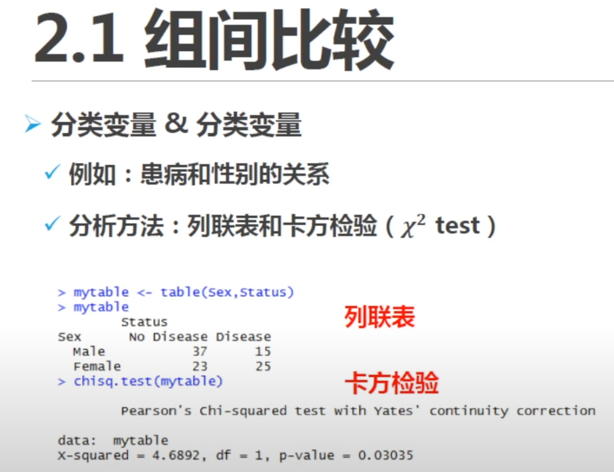

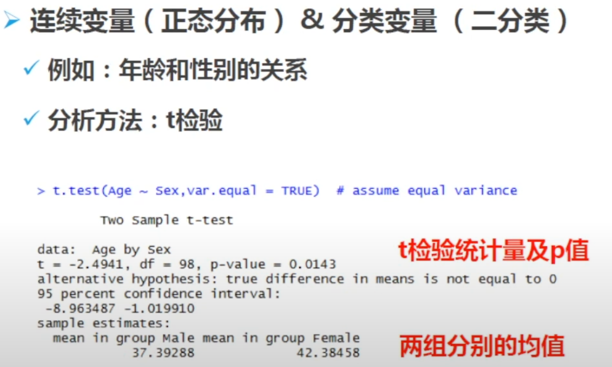

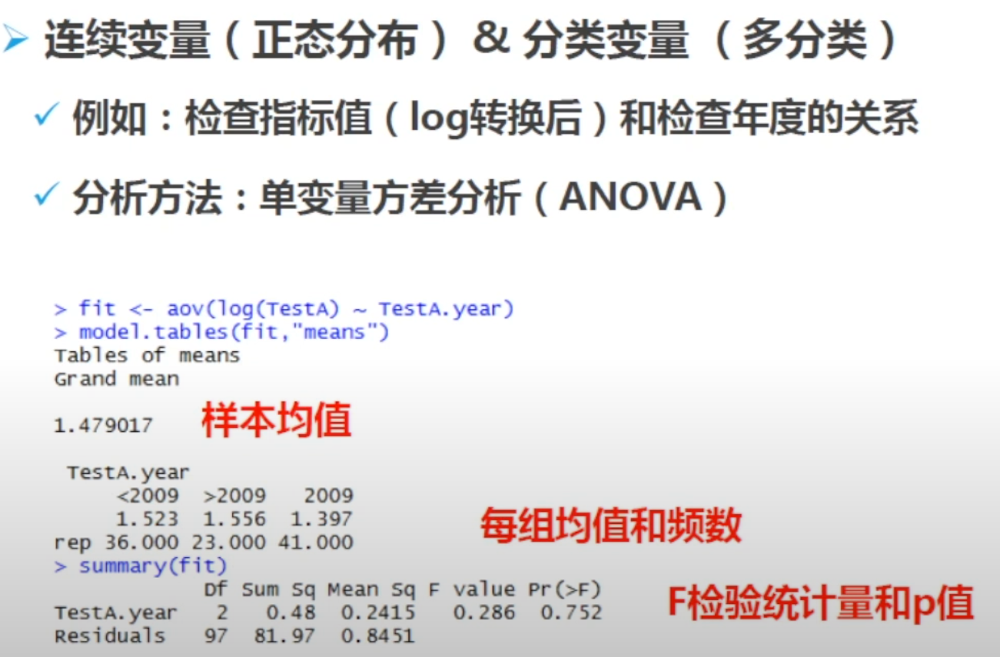

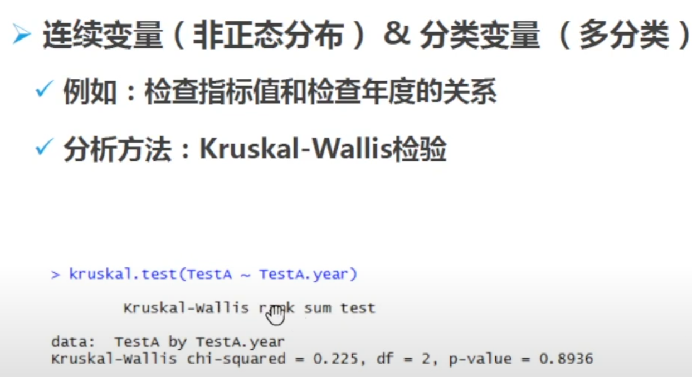

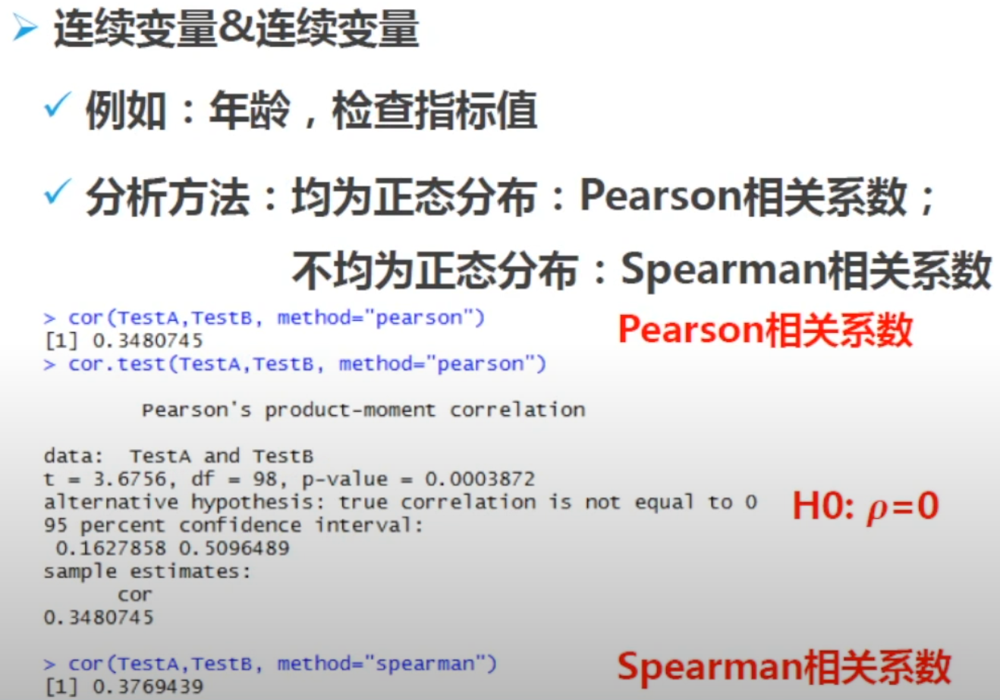

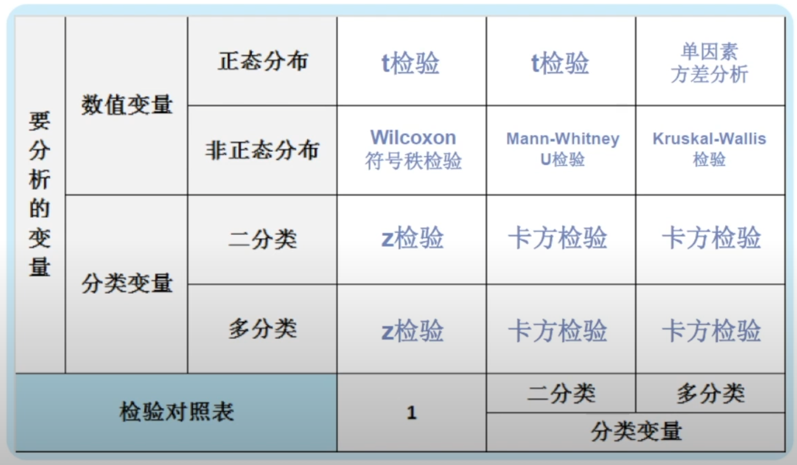


### 5.常见统计图绘制

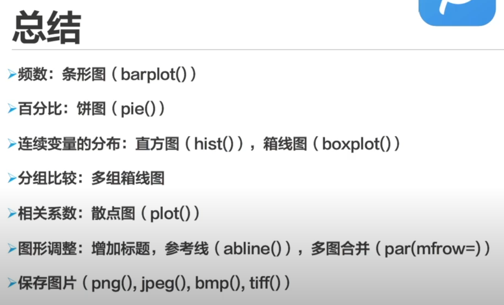


### 6.线性回归模型

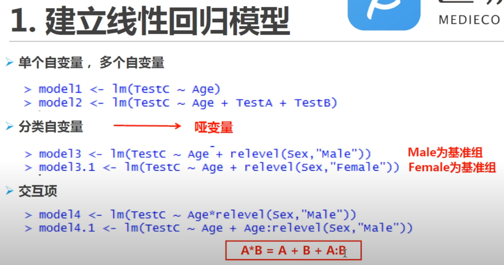

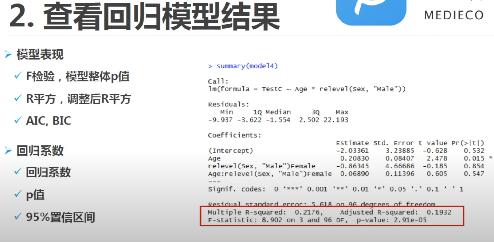

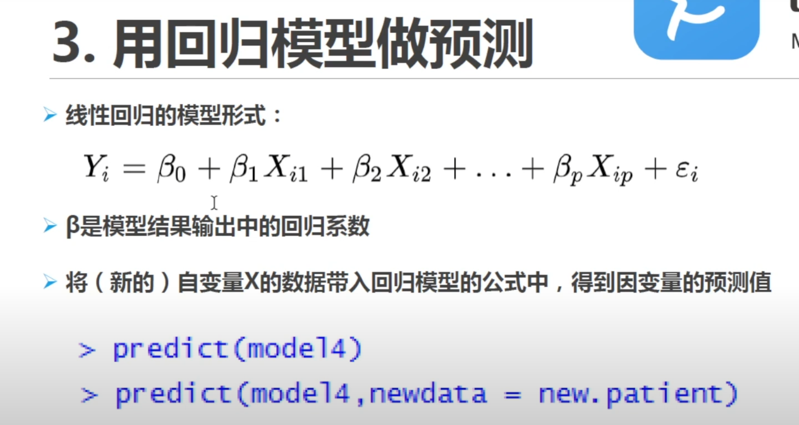


### 7.变量筛选

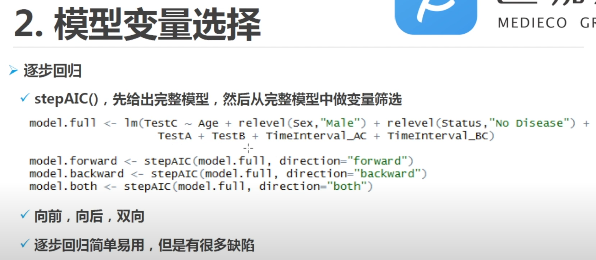


### 8.Logistic回归

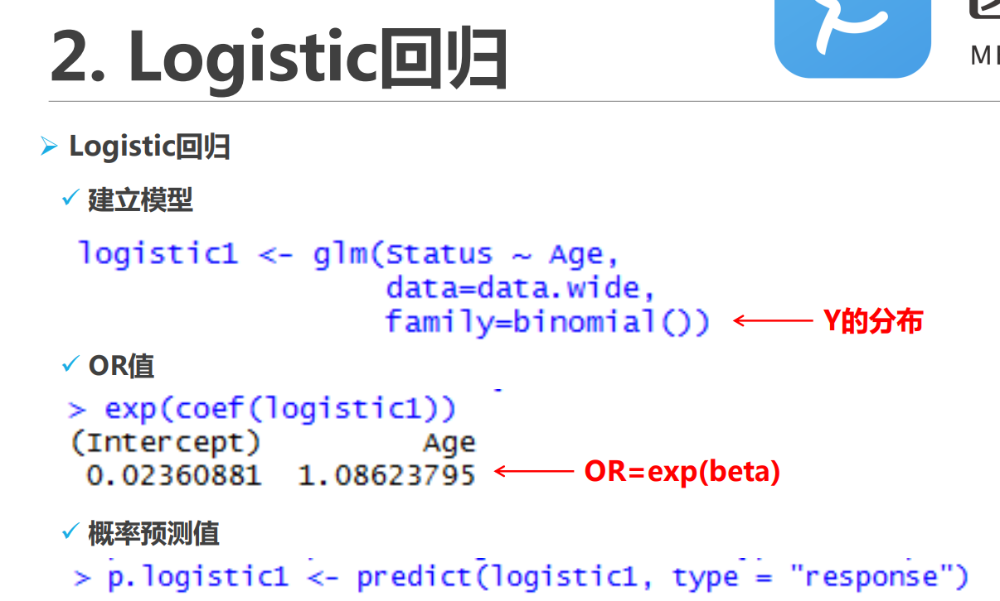

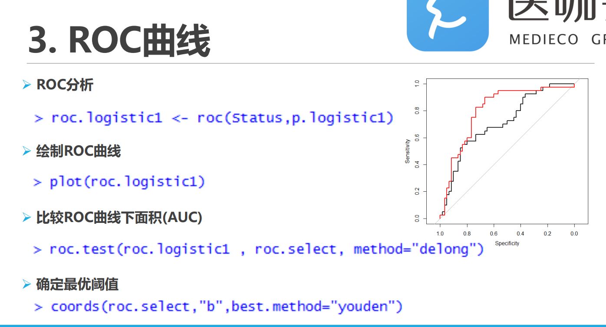

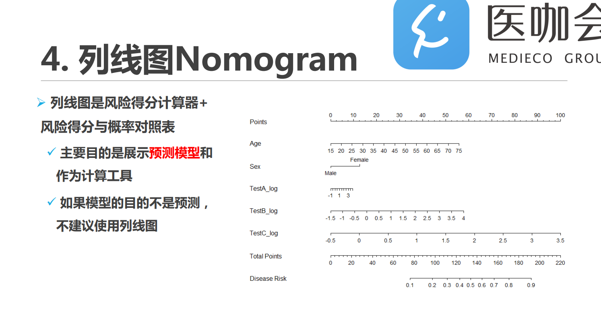
