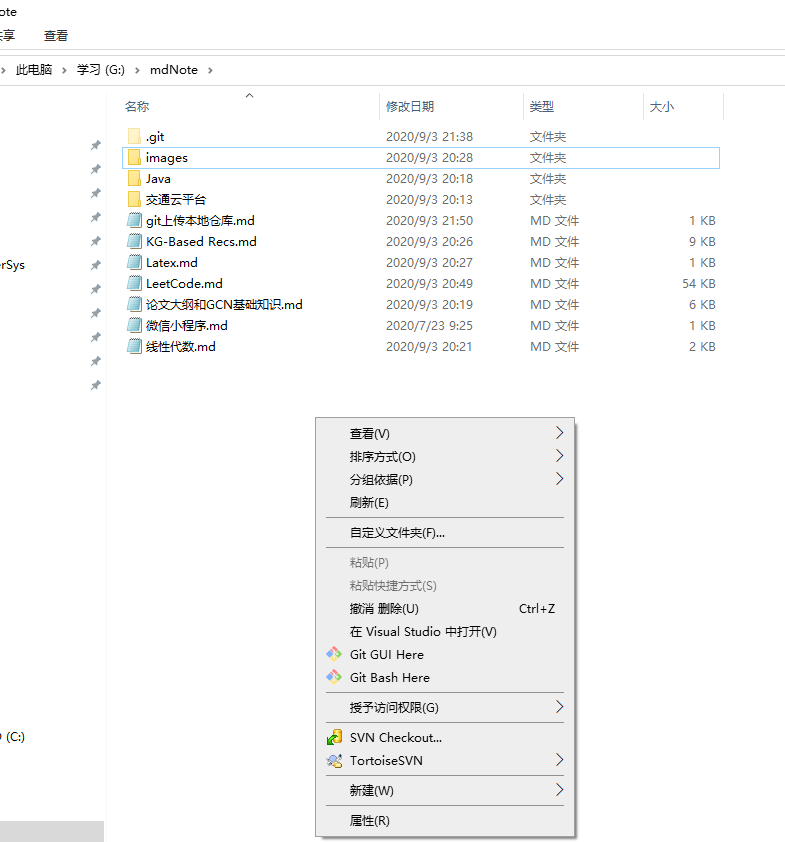
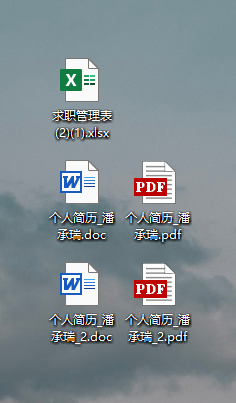

## 第一次上传git：

1. 创建本地仓库

先进入要上传的文件夹，然后右键选择Git Bash，例如第一次上传本地的 G:\mdNote 文件夹

> step1	执行初始化
>
> ​		`git init`
>
> step2	将文件添加到本地仓库
>
> ​		`git add .`				//添加当前文件夹下的所有文件
>
> ​		`git add **.cpp`		//添加当前文件夹下的**.cpp这个文件	
>
> step3	输入提交说明
>
> ​		`git commit -m "说明内容"`          //引号中的内容为对该文件的描述
>
> step4	本地仓库关联github远程仓库
>
> ​		`git remote add origin git@github.com:panchengrui/NoteBook.git`
>
> step5	提交文件
>
> ​		`git push origin master`

## 更新一个已经存在的本地仓库（上传本地仓库到远程仓库）

`git add .`

`git commit -m "说明内容"`

`git push origin master`

直接远程仓库上修改的话，在上传之前需要先将 远程仓库更新到本地

`git pull origin master `

再上传	`git push origin master`

如果有错误，可以强制 push , 不过会导致远程修改的内容被覆盖

 `git push -u origin master -f `

---

## IDEA+git

1. git安装完成后双击安装目录的git-bash.exe创建身份

	git config --global user.name 你的名字
	git config --global user.email 你的邮箱
	
	通过输入命令，看返回值是否是你设置的值来验证配置是否成功
	git config --global user.name
	git config --global user.email

2. 生成密钥
	
	输入 ssh-keygen -t rsa -C 你的邮箱
	一路点击回车，按照默认路径去生成密钥的，默认的密钥位置为：C:\Users\16090\.ssh\id_rsa.pub
	打开上述 id_rsa.pub 文件可查看密钥

以上两步可参考链接：https://blog.csdn.net/madmk/article/details/97150077

3. IDEA整合git设置并创建本地仓库

	参考链接：https://blog.csdn.net/madmk/article/details/97280587

	
	
4. 创建GitHub远程仓库并添加本地密匙（该密钥应该是首次使用时添加，目的将本地git与远程服务器建立连接，后面新建的项目应该就不用再添加该密钥了）

	参考链接：https://blog.csdn.net/madmk/article/details/97389027
	
	

5. IDEA添加GitHub账户并连接远端仓库并提交代码

	参考链接：https://blog.csdn.net/madmk/article/details/97391105
	
	
	

关于IDEA中使用Git进行版本控制和创建分支、合并分支、解决主干和分支冲突可以参考b站视频：
https://www.bilibili.com/video/BV1Te411W7N6?p=29

