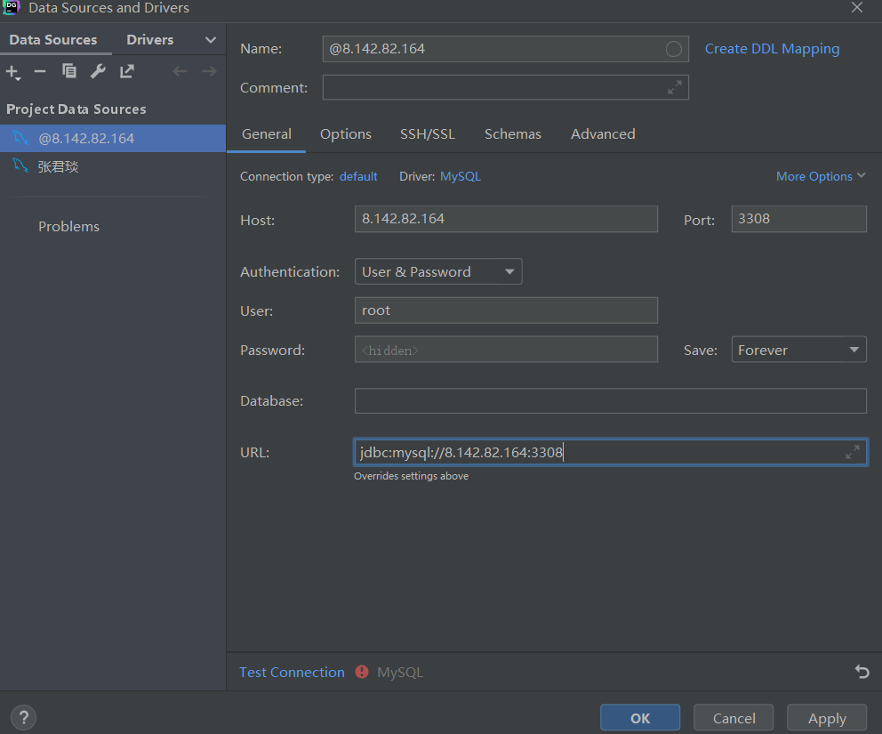

```shell
# 运行容器
docker run --name mysql-pcr -p 3308:3306 -e MYSQL_ROOT_PASSWORD=Pcr20220222! -d mysql:8.0.25

# 进入容器
docker exec -it mysql-pcr bash

# 登录MySQL
mysql -u root -p

# 设置允许远程用户访问
use mysql;													 # 切换数据库

update user set host='%' where user='root' and host='localhost';  # 更新 root-localhost 为 root-%

GRANT ALL ON *.* TO 'root'@'%';                                   # 设置允许远程用户访问

flush privileges;											  # 刷新权限

# 修改加密方式
ALTER USER 'root'@'%' IDENTIFIED WITH mysql_native_password BY 'Pcr20220222!';
```


DataGrip登录：




> 参考资料：
>
> https://www.jianshu.com/p/c5bc91868d07/