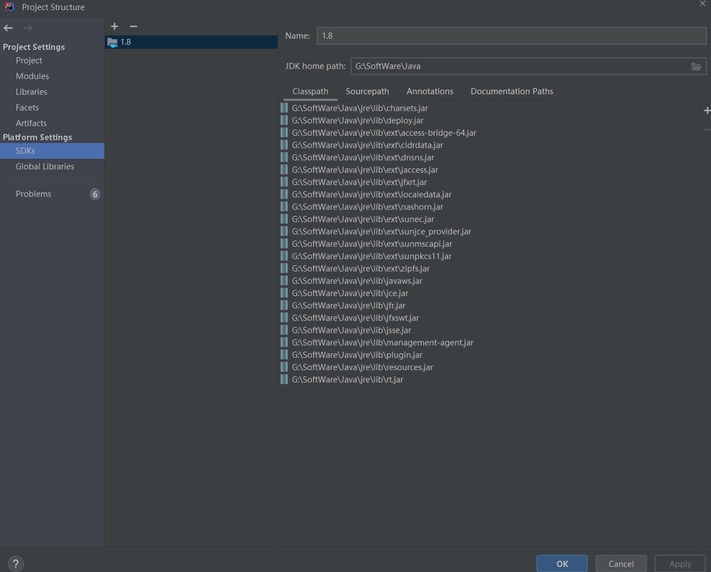
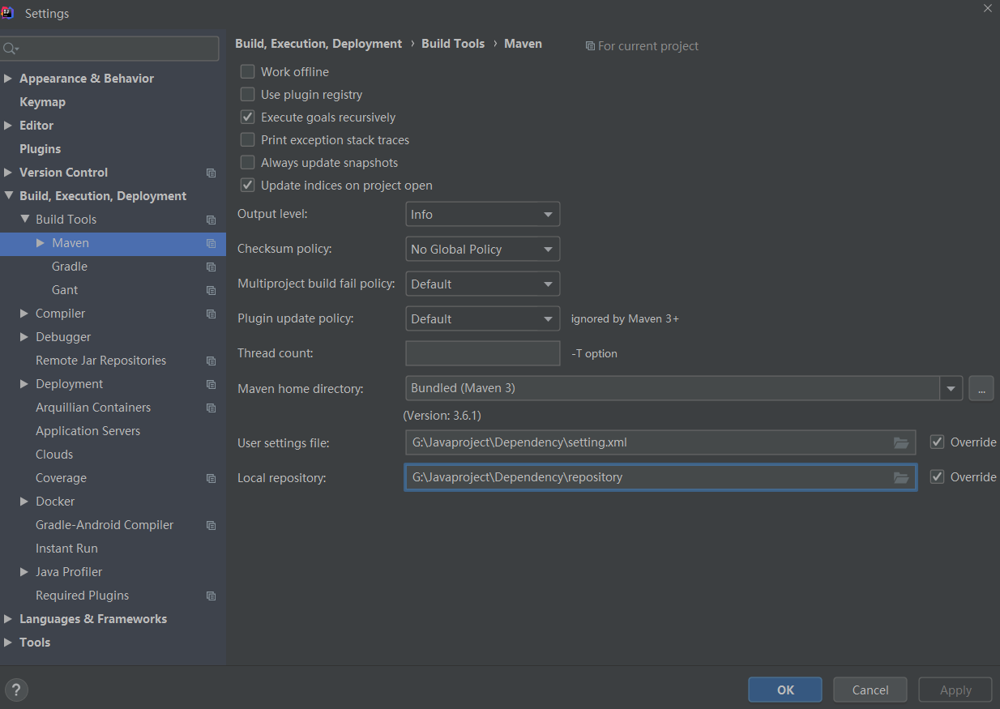
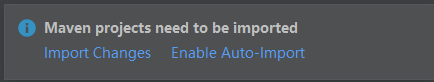
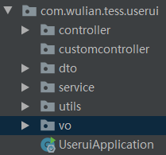
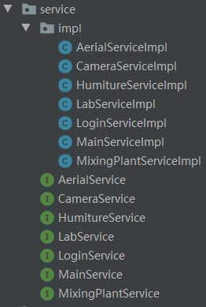
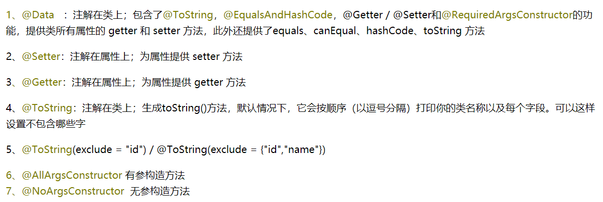

[toc]

---

# 1 运行项目

* File->Project Structure，**设置JDK home path**

* File->Settings，设置User settings file 和 Local repository（不同的项目可以设置为相同的路径，这样可以取两个项目依赖的并集）

* 上述步骤完成后，IDEA右下方出现该图标，点击Import Changes

> 如果上述import changes 选项框不出来，打开项目中的pom.xml文件随意修改一点内容，再改回来，就可以弹出上述选项

# 2 项目结构及重命名

**整体结构：**

> service——业务逻辑层，下面包含接口和具体实现类（impl）

# 3 mybatis 逆向工程

generatorConfig.xml 配置文件

> PO生成模型的包名和位置：com.wulian.tess.lab.entity
>
> 生成**映射文件**的包名和位置：main.resources.mapping
>
> 生成**DAO**的报包名和位置：com.wulian.tess.lab.mapper

# 4.lombok使用

