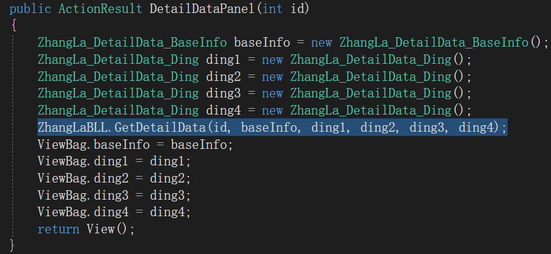
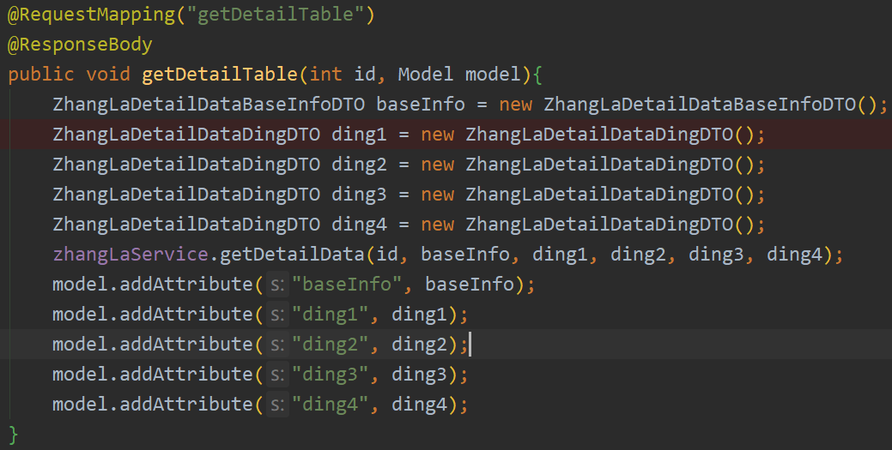
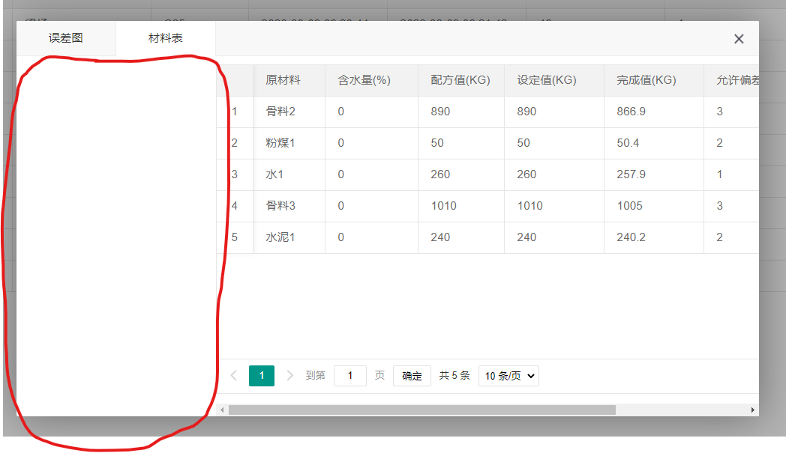

[toc]

---


## 1.张拉详情

张拉的详情数据，因为前端要显示baseInfo和A1-A4项，所以在.net里胥是在控制器里面 new 相应的对象，把对象传到BLL里进行填充



但是在java项目中，仿照上面的方法，在ui项目的控制器中 new 相应的对象



对象传递到微服务中可以填充相应的字段，<u>但是返回到ui项目中时，对象的所有字段变为null</u>。因为微服务和ui项目是两个应用程序，两者的内存区域是分开的。**微服务传递对象的原理是 把对象序列化进行传递，接收者接收以后进行反序列化，进行使用**

解决方法是在 微服务 程序中 建一个返回对象，该对象包含`ZhangLaDetailDataBaseInfoDTO` 和 4个 `ZhangLaDetailDataDingDTO` ，然后将这个对象返回到 ui 项目中


## 2.使用 thymeleaf 向前台传递包含多个对象的某个对象

在控制器导入相关库	`import org.springframework.ui.Model;`

在控制器的对应视图中的代码如下：

```java 
@RequestMapping("detail_table")
    public String detailTable(int id, Model model) {
        ZhangLaDetailDataDTO zhanglaDetailData = zhangLaService.getDetailData(id);
        model.addAttribute("zhanglaDataDetail", zhanglaDetailData);
        return "zhangla/detail_table";
    }
```

在对应的 html 视图文件开头加上	`<html xmlns:th="http://www.springframework.org/schema/mvc">`

> 显示某个对象的某个字段就可以这样写：

```html
<div th:text="${zhanglaDataDetail.zhangLaDetailDataBaseInfoDTO.zlDate}"></div>
```

> 判断某个字段可以这样写

```html
<span th:if="${zhanglaDataDetail.zhangLaDetailDataBaseInfoDTO.projectId} == 4">
```


## 3.张拉详情弹出tab的显示问题



layui的layer.tab弹出框中的内容在layer中不顶格显示，左侧有tab按钮宽度的空白


解决方法：在index.html的<html>标签后，在<head>标签前添加如下css代码

```css
<style>
    .layui-layer-content {
        position: absolute !important;
        left: 0px !important;
    }
    .layui-layer-tabmain {
        padding: 0px;
    }
</style>
```

