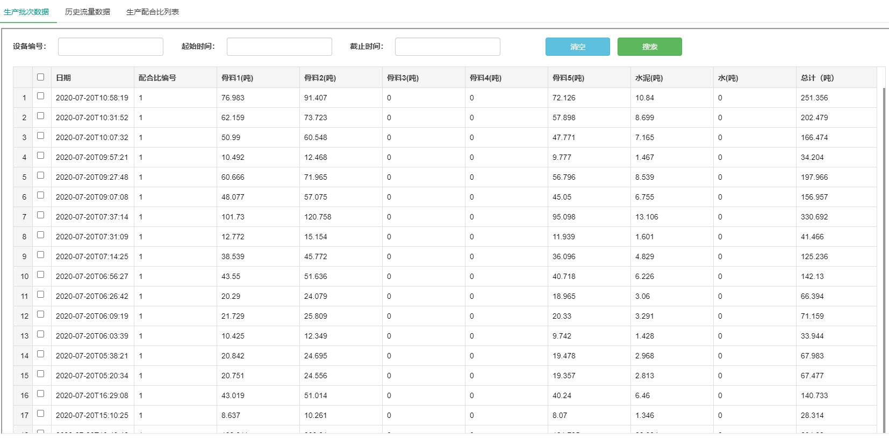
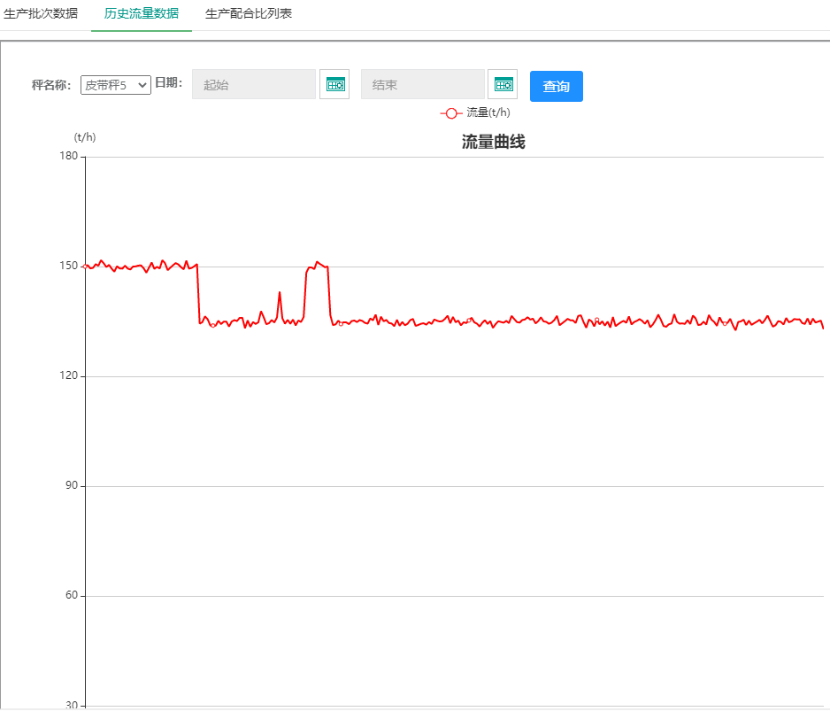
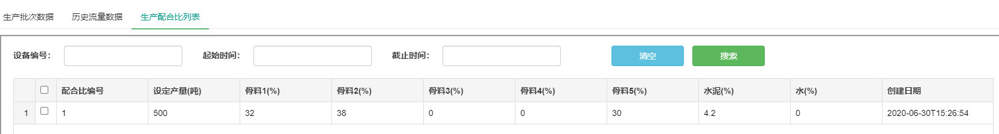
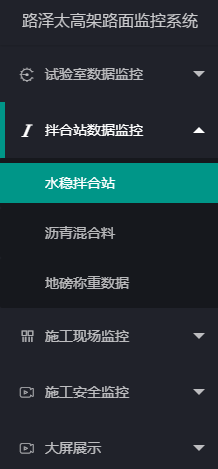
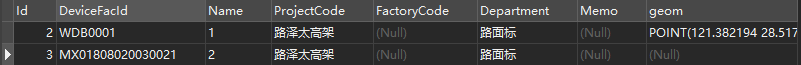

[TOC]


---


# 一、功能效果

数据展示分为三部分：生产批次数据，历史流量数据、生产配合比列表








# 二、数据来源

数据库：tess_banhezhan_ms

## 2.1 生产批次数据     模块

点击左侧的主菜单栏时，默认显示某个 **项目-分部** 的数据，每个 分部 下有多台设备，可以按设备编号进行查询



### 2.1.1	根据url中传递的 ==ProjectCode== 和 ==Department==	先从表	==shuiwenbhz_decice==	中获取 该项目-分部的所有设备编号	==DeviceFacId==



初次进入界面时，默认查询所有设备编号的数据记录

在js中动态获取下拉框内容：

```js
//动态添加下拉框的内容
$.ajax({
    type: "POST",
    url: "getDevices?projectCode=" + projectCode + "&department=" + department,
    dataType: "json",
    contentType: "application/x-www-form-urlencoded; charset=UTF-8",
    async: false,
    cache: false,
    success: function (data) {
        // console.log(data);
        $("#deviceId").append("<option value='all'>全部</option>");
        $.each(data, function (index, item) {
            $("#deviceId").append(new Option(item.deviceFacId, item.deviceFacId));//往下拉菜单里添加元素
        })
        form.render();//layui菜单渲染 把内容加载进去
    }
});
```

layui监听查询条件并重新渲染表格

```javascript
//监听搜索
form.on('submit(search)', function (data) {
	var field = data.field;
	//执行重载
	table.reload('swtable', {
        //重写url，不然初始化时的deviceId=all会被保留
        url:"getSWTableData?deviceId=" + field.deviceId + "&startTime=" + field.startTime + "&endTime=" + field.endTime,
        //form表单内以外的参数，用下面的语句传递
        where: {projectCode: ProjectCode, department:Department}
    });
});
```


### 2.1.2	MyBatis 动态查询

**.class**

```java
List<ProduceDO> selectShuiWenTableRow(@Param("deviceId") List deviceId,
                                          @Param("startTime") Date startTime, @Param("endTime") Date endTime);
```

**.xml**

```mysql
<select id="selectShuiWenTableRow" resultMap="BaseResultMap">
    select * from shuiwenbanhezhan_produce_record
    <where>
        <if test="deviceId != null">
            and DeviceId in
          <foreach  item="deviceId" collection="deviceId" index="index"  open="(" separator="," close=")">
            #{deviceId}
          </foreach>
        </if>
        <if test="startTime != null">
            and StartTime  <![CDATA[ >= ]]>   #{startTime}
        </if>
        <if test="endTime != null">
            and EndTime  <![CDATA[ <= ]]>   #{endTime}
        </if>
    </where>
 </select>
```

<where> 标签可以省去开头 where 1=1 的初始语句

**<foreach> 标签中的 collection 的属性值一定要填 .class 中填写的 @Param("x") 中的 x 值**，item="y" 和 #{y} 中的值保持一致，可以随意填写，不用和前面的 x 值相同


### 2.1.3	


