[toc]

---

## 泰隆银行简介

 核心价值观：德润其身 泰和共隆 

## 自我介绍

​		各位主管、领导你们好，我叫潘承瑞，本科就读于浙江理工大学，目前是中国计量大学研三在读生。研究生期间，我主要参与了两个算法项目和一个开发项目，两个算法项目的方向分别是推荐系统和语义分割。    推荐系统主要融合了知识图谱和图神经网络来生成推荐，该项目主要应用递归的传播算法，在信息传播过程中加入节点交互信息和注意力机制，使得模型相较于其它主流模型有了明显提升。另一个算法项目是遥感图像的语义分割，该项目主要是在模型解码层中加入空洞空间金字塔池化结构，实现对不同尺寸物体的精细分割。另外，本人参与了导师Java网站项目的开发，网站的主要功能是对多个施工部门的施工数据进行存储和展示。

## 职业规化

​		未来两年，我希望熟练掌握各种机器学习算法和它们在金融领域中各自适用场景下的开发流程，把基础知识和业务流程弄熟弄透，期间同时提高自己的算法和Java编程能力；3-5年希望进一步提高算法和工程能力，成为数据挖掘工程师，能够应对更多的金融应用场景给出自己的解决方案，期间了解并掌握大数据分布式框架；5-10年希望成为大数据开发或架构师，能够应用大数据技术为金融领域创造更多价值。

## 岗位理解

​		了解应用场景，理解业务需求，在此基础上完成**数据**的采集、**预处理**，**模型**的**开发**（建立各类风险评级模型、客户行为模型、业务模型等，与相关团队对接、完成模型的实施和维护）、**监测**（监控模型运行期间的出入参变化、及时发现异常）、**跟踪**（检验跟踪模型的表现，根据市场、客户等环境变化及时调整）和**文档的撰写**（模型开发文档、模型监测报告、模型表现报告）工作。

## 为什么选择金融数据行业？

1. 为什么选择数据行业：海量数据几乎能够为所有行业带来巨大价值，成功的应用行业包括金融、医疗、制造业等等等等，并且每年的全球数据总量还在以非常快的速度增长，从海量数据中可以发掘出很多有用的信息，进入数据行业工作学习，未来有潜力创造非常大的价值，所以我选择进入数据行业。
2. 为什么选择金融数据行业：一、金融和大家的生活息息相关，金融业的繁荣发展可以活跃经济，帮扶企业，创造更多的就业机会，推动社会发展；二、去年出现的“金融科技”概念中，对金融和科技融合的发展规划令我非常向往，这是一个非常有前景的发展方向，我非常希望能加入金融行业的信息建设，创造价值，提高人民群众对金融产品的满意度。
3. 为什么选择泰隆：一、泰隆是一家非常有潜力和前景的金融企业，短短十几年时间，能做到拥有万名员工规模和百强银行的业绩，证明泰隆走得发展道路非常光明、领导和员工团队非常优秀；二、泰隆宣讲会中，我对前辈说的“家文化”和“帮带制度”印象比较深刻，整个直播过程的氛围非常融洽，给人的感觉非常亲切，并且进入公司以后，会有针对性的集中培训或者有前辈的带领，我觉得在这样的企业工作一定会很舒心同时个人进步会很快；最后一点，同实验室的师姐也在泰隆，所以对泰隆的感觉就更加亲切一些。

## 入职时薪酬期望/3年后/6年后/10年后 

​	入职时：16-20W

​	3年后：22-26W

​	6年后：30-35W

​	10年后：45-55W

## 自我评价

​	1、有上进心，对技术有所追求，对自我有较清晰的规划

​	2、工作态度严谨，具有强烈的交付意识，并热衷于在某项工作完成后做技术积累和总结

​	3、具有良好的沟通协作能力，善于听取他人建议

​	4、抗压能力强，敢于接受新挑战！

## 项目细节

​	**空洞空间金字塔池化**

​		空洞卷积（膨胀卷积），得到不同的感受野

​		空间金字塔池化，主要是对不同的图像尺寸进行池化，得到相同大小的特征图

​	**挤压激活**

​		挤压激活是一种注意力机制，加入残差结构会强化基于像素点的分类能力。

## 机器学习基础

## NumPy、Pandas、SciPy

* **简单区别**

  ​	Numpy是以矩阵为基础的数学计算模块，纯数学。

  ​	Pandas提供了一套名为DataFrame的数据结构，比较契合统计分析中的表结构，并且提供了计算接口，可用Numpy或其它方式进行计算。

  ​	Scipy基于Numpy，科学计算库，有一些高阶抽象和物理模型。比方说做个傅立叶变换，这是纯数学的，用Numpy；做个滤波器，这属于信号处理模型了，在Scipy里找。

* **NumPy简介**

  ​	NumPy(Numerical Python) 是Python语言的一个扩展程序库，支持大量的维度数组与矩阵运算，此外也针对数组运算提供大量的数学函数库。

  ​	NumPy是一个运行速度非常快的数学库，主要用于数组计算，包含：

  > * 一个强大的N维数组对象 ndarray
  > * 广播功能函数
  > * 整合C/C++/Foratran代码的工具
  > * 线性代数、傅里叶变换、随机数生成等功能

  

## 损失函数

* **嵌入层损失函数**

  ​	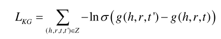

  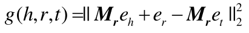

  ​																在g()中，得分越低的三元组，表示越有可能是在知识图谱中真实存在的

  ​	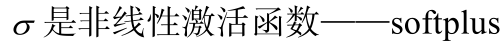

  > softplus激活函数：
  >
  > 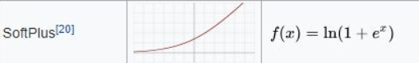
  >
  > ​	该激活函数是平滑版的Relu函数，Relu激活函数相比于sigmod激活函数的好处是计算速度快，可以更快地收敛；但是在x<0时，Relu的梯度永远为0，造成一部分神经元永久失效。

*  **嵌入传播层损失函数**

  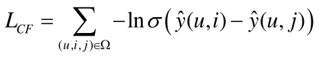

  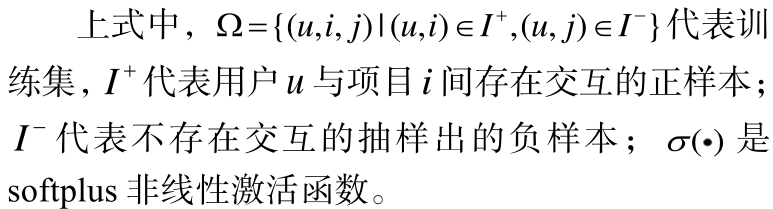

  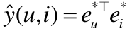

  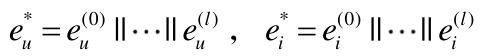

  

  

  > 下面是用户和项目多层嵌入向量的递归计算过程：
  >
  > 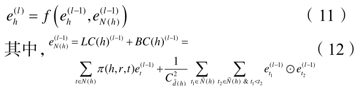

  

  > eN(h)计算过程（该计算结果获取中心节点的高阶邻居信息和邻居节点间的节点交互信息）：
  >
  > 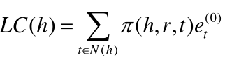
  >
  > 
  >
  > 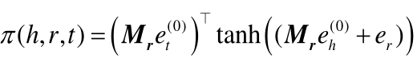
  >
  > 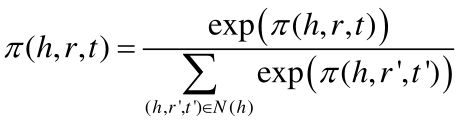

  

  > 信息聚合：
  >
  > 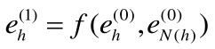
  >
  > 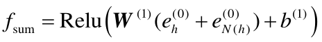
  >
  > 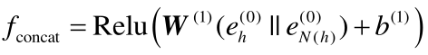

## 