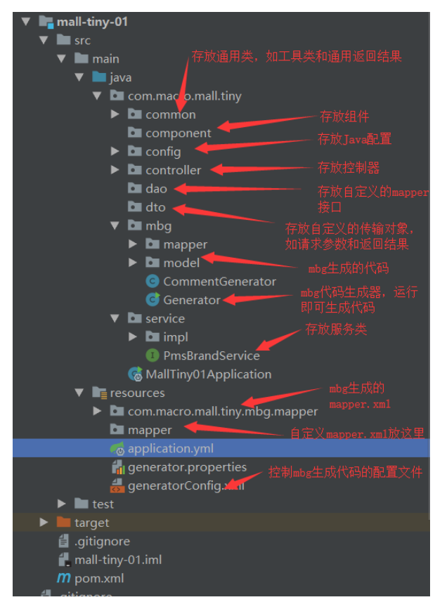
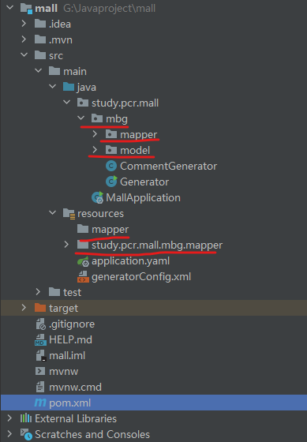
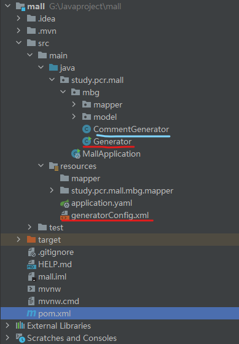
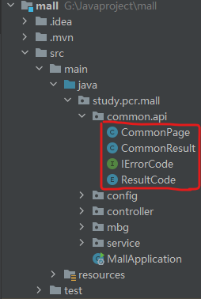

# 项目整体结构




# 一、mall整合SpringBoot+MyBatis搭建基本骨架

> 本文主要讲解mall整合SpringBoot+MyBatis搭建基本骨架，以商品品牌为例实现基本的CRUD操作及通过PageHelper实现分页查询。

## 1.1 添加项目依赖

​	pom.xml文件

```xml
<?xml version="1.0" encoding="UTF-8"?>
<project xmlns="http://maven.apache.org/POM/4.0.0" xmlns:xsi="http://www.w3.org/2001/XMLSchema-instance"
         xsi:schemaLocation="http://maven.apache.org/POM/4.0.0 https://maven.apache.org/xsd/maven-4.0.0.xsd">
    <modelVersion>4.0.0</modelVersion>
    <parent>
        <groupId>org.springframework.boot</groupId>
        <artifactId>spring-boot-starter-parent</artifactId>
        <version>2.4.0</version>
        <relativePath/> <!-- lookup parent from repository -->
    </parent>
    <groupId>study.pcr</groupId>
    <artifactId>mall</artifactId>
    <version>0.0.1-SNAPSHOT</version>
    <name>mall</name>
    <description>Demo project for Spring Boot</description>
    <properties>
        <java.version>1.8</java.version>
    </properties>

    <dependencies>
        <!--SpringBoot通用依赖模块-->
        <dependency>
            <groupId>org.springframework.boot</groupId>
            <artifactId>spring-boot-starter-web</artifactId>
        </dependency>
        <dependency>
            <groupId>org.springframework.boot</groupId>
            <artifactId>spring-boot-starter-actuator</artifactId>
        </dependency>
        <dependency>
            <groupId>org.springframework.boot</groupId>
            <artifactId>spring-boot-starter-aop</artifactId>
        </dependency>
        <dependency>
            <groupId>org.springframework.boot</groupId>
            <artifactId>spring-boot-starter-test</artifactId>
            <scope>test</scope>
        </dependency>
        <!--MyBatis分页插件-->
        <dependency>
            <groupId>com.github.pagehelper</groupId>
            <artifactId>pagehelper-spring-boot-starter</artifactId>
            <version>1.2.10</version>
        </dependency>
        <!--集成druid连接池-->
        <dependency>
            <groupId>com.alibaba</groupId>
            <artifactId>druid-spring-boot-starter</artifactId>
            <version>1.1.22</version>
        </dependency>
        <!-- MyBatis 生成器 -->
        <dependency>
            <groupId>org.mybatis.generator</groupId>
            <artifactId>mybatis-generator-core</artifactId>
            <version>1.3.3</version>
        </dependency>
        <!--Mysql数据库驱动-->
        <dependency>
            <groupId>mysql</groupId>
            <artifactId>mysql-connector-java</artifactId>
            <version>8.0.17</version>
        </dependency>
        <!-- swagger -->
        <dependency>
            <groupId>io.springfox</groupId>
            <artifactId>springfox-swagger2</artifactId>
            <version>2.9.2</version>
        </dependency>
        <dependency>
            <groupId>io.springfox</groupId>
            <artifactId>springfox-swagger-ui</artifactId>
            <version>2.9.2</version>
        </dependency>
    </dependencies>

    <build>
        <plugins>
            <plugin>
                <groupId>org.springframework.boot</groupId>
                <artifactId>spring-boot-maven-plugin</artifactId>
                <version>2.3.4.RELEASE</version>
            </plugin>
        </plugins>
    </build>

</project>
```


## 1.2 修改SpringBoot配置文件

```yaml
server:
  port: 8080

spring:
  datasource:
    url: jdbc:mysql://localhost:3306/mall?characterEncoding=UTF-8&serverTimezone=Asia/Shanghai  # mysql8.0以后可能需要注意显式设置时区的问题
    username: root          # 注意这里的写法，IDEA自动提示的可能不对
    password: 1234          # 注意这里的写法，IDEA自动提示的可能不对
	 
	
mybatis:
  mapper-locations:
    #自定义mapper.xml路径
    - classpath:mapper/*.xml
    #mybatis generator生成的mapper.xml路径
    - classpath*:study/**/mapper/*.xml
```


## 1.3 完善项目结构

> ​	mgb文件夹下是使用mybatis generator生成的 model （对应数据库中的表）和 mapper （供项目中的其它类操作使用）接口
>
> ​	classpath 路径下的 【mapper】文件夹是自定义的mapper.xml文件，【study.pcr.mall.mgb.mapper 】文件夹是mybatis generator自动生成的mapper.xml文件




## 1.4 使用 Mybatis Generator 自动生成 model、mapper接口及mapper.xml

> ​	generatorConfig.xml是自动生成代码的配置文件，需要在里面配置数据库连接、指定文件生成路径和数据库表
>
> ​	Generator是自动生成代码的主程序
>
> ​	CommentGenerator是一个自定义的用于生成model代码注释的类



### 1.4.1 Mybatis generator配置文件 —— generatorConfig.xml

> 主要配置内容：
>
> 	1. 数据库连接
> 	2. 指定各文件的生成路径
> 	3. 列举需要自动生成数据库中哪些表的表名——tableName，如果需要生成全部表，则tableName设为%

```xml
<?xml version="1.0" encoding="UTF-8"?>
<!DOCTYPE generatorConfiguration
        PUBLIC "-//mybatis.org//DTD MyBatis Generator Configuration 1.0//EN"
        "http://mybatis.org/dtd/mybatis-generator-config_1_0.dtd">

<generatorConfiguration>
<!--    <properties resource="generator.properties"/>-->
    <context id="MySqlContext" targetRuntime="MyBatis3" defaultModelType="flat">
        <property name="beginningDelimiter" value="`"/>
        <property name="endingDelimiter" value="`"/>
        <property name="javaFileEncoding" value="UTF-8"/>
        <!-- 为模型生成序列化方法-->
        <plugin type="org.mybatis.generator.plugins.SerializablePlugin"/>
        <!-- 为生成的Java模型创建一个toString方法 -->
        <plugin type="org.mybatis.generator.plugins.ToStringPlugin"/>
        <!--可以自定义生成model的代码注释-->
        <commentGenerator type="study.pcr.mall.mbg.CommentGenerator">
            <!-- 是否去除自动生成的注释 true：是 ： false:否 -->
            <property name="suppressAllComments" value="true"/>
            <property name="suppressDate" value="true"/>
            <property name="addRemarkComments" value="true"/>
        </commentGenerator>
        <!--配置数据库连接-->
        <jdbcConnection driverClass="com.mysql.cj.jdbc.Driver"
                        connectionURL="jdbc:mysql://localhost:3306/mall?characterEncoding=UTF-8&amp;serverTimezone=Asia/Shanghai"
                        userId="root"
                        password="1234">
            <!--解决mysql驱动升级到8.0后不生成指定数据库代码的问题-->
            <property name="nullCatalogMeansCurrent" value="true" />
        </jdbcConnection>
        <!--指定生成model的路径-->
        <javaModelGenerator targetPackage="study.pcr.mall.mbg.model" targetProject="src/main/java"/>
        <!--指定生成mapper.xml的路径-->
        <sqlMapGenerator targetPackage="study.pcr.mall.mbg.mapper" targetProject="src/main/resources"/>
        <!--指定生成mapper接口的的路径-->
        <javaClientGenerator type="XMLMAPPER" targetPackage="study.pcr.mall.mbg.mapper"
                             targetProject="src/main/java"/>
        <!--生成全部表tableName设为%-->
        <table tableName="%">
            <generatedKey column="id" sqlStatement="MySql" identity="true"/>
        </table>
    </context>
</generatorConfiguration>
```

### 1.4.2 运行Generator的main函数生成代码

> ​	主要指定Mybatis generator配置文件路径

```java
package study.pcr.mall.mbg;

import org.mybatis.generator.api.MyBatisGenerator;
import org.mybatis.generator.config.Configuration;
import org.mybatis.generator.config.xml.ConfigurationParser;
import org.mybatis.generator.internal.DefaultShellCallback;

import java.io.InputStream;
import java.util.ArrayList;
import java.util.List;

/**
 * 用于生产MBG的代码
 * Created by macro on 2018/4/26.
 */
public class Generator {
    public static void main(String[] args) throws Exception {
        //MBG 执行过程中的警告信息
        List<String> warnings = new ArrayList<String>();
        //当生成的代码重复时，覆盖原代码
        boolean overwrite = true;
        //读取我们的 MBG 配置文件
        InputStream is = Generator.class.getResourceAsStream("/generatorConfig.xml");
        ConfigurationParser cp = new ConfigurationParser(warnings);
        Configuration config = cp.parseConfiguration(is);
        is.close();

        DefaultShellCallback callback = new DefaultShellCallback(overwrite);
        //创建 MBG
        MyBatisGenerator myBatisGenerator = new MyBatisGenerator(config, callback, warnings);
        //执行生成代码
        myBatisGenerator.generate(null);
        //输出警告信息
        for (String warning : warnings) {
            System.out.println(warning);
        }
        System.out.println("完成自动生成");
    }
}
```

### 1.4.3 自动注释生成器

```java
package study.pcr.mall.mbg;

import org.mybatis.generator.api.IntrospectedTable;
import org.mybatis.generator.api.IntrospectedColumn;
import org.mybatis.generator.api.dom.java.CompilationUnit;
import org.mybatis.generator.api.dom.java.Field;
import org.mybatis.generator.api.dom.java.FullyQualifiedJavaType;
import org.mybatis.generator.internal.DefaultCommentGenerator;
import org.mybatis.generator.internal.util.StringUtility;

import java.util.Properties;

/**
 * 自定义注释生成器
 * Created by macro on 2018/4/26.
 */
public class CommentGenerator extends DefaultCommentGenerator {
    private boolean addRemarkComments = false;
    private static final String EXAMPLE_SUFFIX="Example";
    private static final String MAPPER_SUFFIX="Mapper";
    private static final String API_MODEL_PROPERTY_FULL_CLASS_NAME="io.swagger.annotations.ApiModelProperty";

    /**
     * 设置用户配置的参数
     */
    @Override
    public void addConfigurationProperties(Properties properties) {
        super.addConfigurationProperties(properties);
        this.addRemarkComments = StringUtility.isTrue(properties.getProperty("addRemarkComments"));
    }

    /**
     * 给字段添加注释
     */
    @Override
    public void addFieldComment(Field field, IntrospectedTable introspectedTable,
                                IntrospectedColumn introspectedColumn) {
        String remarks = introspectedColumn.getRemarks();
        //根据参数和备注信息判断是否添加备注信息
        if(addRemarkComments&&StringUtility.stringHasValue(remarks)){
//            addFieldJavaDoc(field, remarks);
            //数据库中特殊字符需要转义
            if(remarks.contains("\"")){
                remarks = remarks.replace("\"","'");
            }
            //给model的字段添加swagger注解
            field.addJavaDocLine("@ApiModelProperty(value = \""+remarks+"\")");
        }
    }

    /**
     * 给model的字段添加注释
     */
    private void addFieldJavaDoc(Field field, String remarks) {
        //文档注释开始
        field.addJavaDocLine("/**");
        //获取数据库字段的备注信息
        String[] remarkLines = remarks.split(System.getProperty("line.separator"));
        for(String remarkLine:remarkLines){
            field.addJavaDocLine(" * "+remarkLine);
        }
        addJavadocTag(field, false);
        field.addJavaDocLine(" */");
    }

    @Override
    public void addJavaFileComment(CompilationUnit compilationUnit) {
        super.addJavaFileComment(compilationUnit);
        //只在model中添加swagger注解类的导入
        if(!compilationUnit.getType().getFullyQualifiedName().contains(MAPPER_SUFFIX)&&!compilationUnit.getType().getFullyQualifiedName().contains(EXAMPLE_SUFFIX)){
            compilationUnit.addImportedType(new FullyQualifiedJavaType(API_MODEL_PROPERTY_FULL_CLASS_NAME));
        }
    }
}
```


## 1.5 添加MyBatis的Java配置

> 用于配置需要动态生成的mapper接口的路径

```java
package study.pcr.mall.config;

import org.mybatis.spring.annotation.MapperScan;
import org.springframework.context.annotation.Configuration;

/**
 * MyBatis配置类
 */
@Configuration
@MapperScan("study/pcr/mall/mbg/mapper")
public class MyBatisConfig {
}
```


## 1.6 封装返回结果

> IErrorCode：封装API的错误码
>
> ResultCode：错误码枚举类
>
> CommonResult：基本返回结果
>
> CommonPage：分页返回结果（可以直接使用PageInfo<T>返回，为了返回必要信息，做了一层封装，将PageInfo中不需要的信息过滤掉）



### 1.6.1 IErrorCode.java

> 封装API的错误码

```java
package study.pcr.mall.common.api;

/**
 * 封装API的错误码
 */
public interface IErrorCode {
    long getCode();

    String getMessage();
}
```

### 1.6.2 ResultCode.java

> 错误码枚举类

```java
package study.pcr.mall.common.api;

public enum ResultCode implements IErrorCode{
    SUCCESS(200, "操作成功"),
    FAILED(500, "操作失败"),
    VALIDATE_FAILED(404, "参数检验失败"),
    UNAUTHORIZED(401, "暂未登录或token已经过期"),
    FORBIDDEN(403, "没有相关权限");

    private long code;
    private String message;

    // 枚举类的默认构造方法只能是private，这里的访问修饰符可以省略
    private ResultCode(long code, String message) {
        this.code = code;
        this.message = message;
    }

    @Override
    public long getCode() {
        return code;
    }
    @Override
    public String getMessage() {
        return message;
    }
}
```

### 1.6.3 CommonResult.java

> 基本返回结果

```java
package study.pcr.mall.common.api;

public class CommonResult<T> {
    private long code;
    private String message;
    private T data;

    protected CommonResult(){
    }

    protected CommonResult(long code, String message, T data) {
        this.code = code;
        this.message = message;
        this.data = data;
    }

    /**
     * 成功返回结果
     * @param data  获取的数据
     * @param <T>
     * @return
     */
    public static <T> CommonResult<T> success(T data){
        return new CommonResult<T>(ResultCode.SUCCESS.getCode(), ResultCode.SUCCESS.getMessage(), data);
    }

    /**
     * 成功返回结果
     * @param data      获取的数据
     * @param message   提示信息
     * @param <T>
     * @return
     */
    public static <T> CommonResult<T> success(T data, String message){
        return new CommonResult<T>(ResultCode.SUCCESS.getCode(), message, data);
    }

    /**
     * 失败返回结果
     * @param errorCode 错误码
     * @param <T>
     * @return
     */
    public static <T> CommonResult<T> failed(IErrorCode errorCode){
        return new CommonResult<T>(errorCode.getCode(), errorCode.getMessage(), null);
    }

    /**
     * 失败返回结果
     * @param message   提示信息
     * @param <T>
     * @return
     */
    public static <T> CommonResult<T> failed(String message){
        return new CommonResult<T>(ResultCode.FAILED.getCode(), message, null);
    }

    /**
     * 失败返回结果
     * @param <T>
     * @return
     */
    public static <T> CommonResult<T> failed(){
        return failed(ResultCode.FAILED);       // 交给44行的 failed(IerrorCode)方法完成
    }

    /**
     * 参数验证失败返回结果
     * @param <T>
     * @return
     */
    public static <T> CommonResult<T> validateFailed(){
        return failed(ResultCode.VALIDATE_FAILED);		// 交给44行的 failed(IerrorCode)方法完成
    }


    /**
     * 参数验证失败返回结果
     * @param message   提示信息
     * @param <T>
     * @return
     */
    public static <T> CommonResult<T> validateFailed(String message){
        return new CommonResult<T>(ResultCode.VALIDATE_FAILED.getCode(), ResultCode.VALIDATE_FAILED.getMessage(), null);
    }

    /**
     * 未登录返回结果
     * @param data
     * @param <T>
     * @return
     */
    public static <T> CommonResult<T> unauthorized(T data){
        return new CommonResult<T>(ResultCode.UNAUTHORIZED.getCode(), ResultCode.UNAUTHORIZED.getMessage(), null);
    }

    /**
     * 未授权返回结果
     * @param data
     * @param <T>
     * @return
     */
    public static <T> CommonResult<T> forbidden(T data){
        return new CommonResult<T>(ResultCode.FORBIDDEN.getCode(), ResultCode.FORBIDDEN.getMessage(), null);
    }

    public long getCode() {
        return code;
    }

    public void setCode(long code) {
        this.code = code;
    }

    public String getMessage() {
        return message;
    }

    public void setMessage(String message) {
        this.message = message;
    }

    public T getData() {
        return data;
    }

    public void setData(T data) {
        this.data = data;
    }
}
```

### 1.6.4 CommonPage.java

> 该类的作用仅仅是将PageInfo中不必要的信息排除，只封装需要显示的分页信息

```java
package study.pcr.mall.common.api;

import com.github.pagehelper.PageInfo;

import java.util.List;

/**
 * 分页数据封装类
 */
public class CommonPage<T> {
    private Integer pageNum;
    private Integer pageSize;
    private Integer totalPage;
    private Long total;
    private List<T> list;

    /**
     * 将PageHelper分页后的list转为分页信息
     * @param list
     * @param <T>
     * @return
     */
    public static <T> CommonPage<T> restPage(List<T> list){
        CommonPage<T> result = new CommonPage<T>();
        PageInfo<T> pageInfo = new PageInfo<>(list);
        result.setTotalPage(pageInfo.getPages());
        result.setPageNum(pageInfo.getPageNum());
        result.setPageSize(pageInfo.getPageSize());
        result.setTotal(pageInfo.getTotal());
        result.setList(pageInfo.getList());
        return result;
    }

    public Integer getPageNum() {
        return pageNum;
    }

    public void setPageNum(Integer pageNum) {
        this.pageNum = pageNum;
    }

    public Integer getPageSize() {
        return pageSize;
    }

    public void setPageSize(Integer pageSize) {
        this.pageSize = pageSize;
    }

    public Integer getTotalPage() {
        return totalPage;
    }

    public void setTotalPage(Integer totalPage) {
        this.totalPage = totalPage;
    }

    public Long getTotal() {
        return total;
    }

    public void setTotal(Long total) {
        this.total = total;
    }

    public List<T> getList() {
        return list;
    }

    public void setList(List<T> list) {
        this.list = list;
    }
}
```


## 1.7 添加 Service 接口

```java
package study.pcr.mall.service;

import study.pcr.mall.mbg.model.PmsBrand;

import java.util.List;

public interface PmsBrandService {
    List<PmsBrand> listAllBrand();

    int createBrand(PmsBrand brand);

    int updateBrand(Long id, PmsBrand brand);

    int deleteBrand(Long id);

    List<PmsBrand> listBrand(int pageNum, int pageSize);

    PmsBrand getBrand(Long id);
}
```


## 1.8 实现 Service 接口

```java
package study.pcr.mall.service.impl;

import com.github.pagehelper.PageHelper;
import org.springframework.beans.factory.annotation.Autowired;
import org.springframework.stereotype.Service;
import study.pcr.mall.mbg.mapper.PmsBrandMapper;
import study.pcr.mall.mbg.model.PmsBrand;
import study.pcr.mall.mbg.model.PmsBrandExample;
import study.pcr.mall.service.PmsBrandService;

import java.util.List;

@Service
public class PmsBrandServiceImpl implements PmsBrandService {
    @Autowired
    private PmsBrandMapper brandMapper;     // 这里可能会报红显示 Could not Autowired，实际可以使用。可以在file->Editor->Spring右侧的Severity改为Warning。

    @Override
    public List<PmsBrand> listAllBrand() {
        return brandMapper.selectByExample(new PmsBrandExample());
    }

    @Override
    public int createBrand(PmsBrand brand) {
        return brandMapper.insertSelective(brand);
    }

    @Override
    public int updateBrand(Long id, PmsBrand brand) {
        brand.setId(id);
        return brandMapper.updateByPrimaryKeySelective(brand);
    }

    @Override
    public int deleteBrand(Long id) {
        return brandMapper.deleteByPrimaryKey(id);
    }

    @Override
    public List<PmsBrand> listBrand(int pageNum, int pageSize) {
        PageHelper.startPage(pageNum, pageSize);
        return brandMapper.selectByExample(new PmsBrandExample());
    }

    @Override
    public PmsBrand getBrand(Long id) {
        return brandMapper.selectByPrimaryKey(id);
    }
}
```


## 1.9 添加 Controller

```java
package study.pcr.mall.controller;

import org.slf4j.Logger;
import org.slf4j.LoggerFactory;
import org.springframework.beans.factory.annotation.Autowired;
import org.springframework.validation.BindingResult;
import org.springframework.web.bind.annotation.*;
import study.pcr.mall.common.api.CommonPage;
import study.pcr.mall.common.api.CommonResult;
import study.pcr.mall.mbg.model.PmsBrand;
import study.pcr.mall.service.PmsBrandService;

import java.util.List;

@RestController
@RequestMapping("/brand")
public class PmsBrandController {
    @Autowired
    private PmsBrandService pmsBrandService;

    // static 保证对于该类，只有一个 Logger;  final保证该引用不会指向其它对象
    private static final Logger LOGGER = LoggerFactory.getLogger(PmsBrandController.class);

    @RequestMapping(value = "listAll", method = RequestMethod.GET)
    public CommonResult<List<PmsBrand>> getBrandList(){
        return CommonResult.success(pmsBrandService.listAllBrand());
    }

    // @RequestBody的用法
    @RequestMapping(value = "/create", method = RequestMethod.POST)
    public CommonResult createBrand(@RequestBody PmsBrand pmsBrand){
        CommonResult commonResult;
        int count = pmsBrandService.createBrand(pmsBrand);
        if(count == 1){
            commonResult = CommonResult.success(pmsBrand);
            LOGGER.debug("createBrand success:{}", pmsBrand);
        } else {
            commonResult = CommonResult.failed("操作失败");
            LOGGER.debug("createBrand failed:{}", pmsBrand);
        }
        return commonResult;
    }

    // @PathVariable的用法
    @RequestMapping(value = "/update/{id}", method = RequestMethod.POST)
    public CommonResult updateBrand(@PathVariable("id") Long id, @RequestBody PmsBrand pmsBrand, BindingResult result){
        CommonResult commonResult;
        int count = pmsBrandService.updateBrand(id,pmsBrand);
        if(count == 1){
            commonResult = CommonResult.success(pmsBrand);
            LOGGER.debug("updateBrand success:{}", pmsBrand);
        } else {
            commonResult = CommonResult.failed("操作失败");
            LOGGER.debug("updateBrand failed:{}", pmsBrand);
        }
        return commonResult;
    }

    @RequestMapping(value = "/delete/{id}", method = RequestMethod.GET)
    public CommonResult deleteBrand(@PathVariable("id") Long id){
        int count = pmsBrandService.deleteBrand(id);
        if(count == 1){
            LOGGER.debug("deleteBrand success :id={}", id);
            return CommonResult.success(null);
        } else {
            LOGGER.debug("deleteBrand failed :id={}", id);
            return CommonResult.failed("操作失败");
        }
    }

    // @RequestParam的用法
    @RequestMapping(value = "/list", method = RequestMethod.GET)
    public CommonResult<CommonPage<PmsBrand>> listBrand(@RequestParam(value = "pageNum", defaultValue = "1") Integer pageNum,
                                                        @RequestParam(value = "pageSize", defaultValue = "3") Integer pageSize){
        List<PmsBrand> brandList = pmsBrandService.listBrand(pageNum, pageSize);
        return CommonResult.success(CommonPage.restPage(brandList));
    }

//    // 上面的接口也可以使用PageInfo直接返回，这样不用在项目中定义CommonPage，但是这样返回结果中可能有很多不需要的内容
//    @RequestMapping(value = "/list", method = RequestMethod.GET)
//    public CommonResult<PageInfo<PmsBrand>> listBrand(@RequestParam(value = "pageNum", defaultValue = "1") Integer pageNum,
//                                                      @RequestParam(value = "pageSize", defaultValue = "3") Integer pageSize){
//        List<PmsBrand> brandList = pmsBrandService.listBrand(pageNum, pageSize);
//        PageInfo<PmsBrand> pageInfo = new PageInfo<>(brandList);
//        return CommonResult.success(pageInfo);
//    }

    @RequestMapping(value = "/{id}", method = RequestMethod.GET)
    public CommonResult<PmsBrand> brand(@PathVariable("id") Long id){
        return CommonResult.success(pmsBrandService.getBrand(id));
    }
}
```

# 二、mall整合Redis实现缓存功能

> ​	本节Redis安装使用出乎意料的简单，主要参考mall官方文档就可以了：http://www.macrozheng.com/#/architect/mall_arch_03?id=%e6%95%b4%e5%90%88redis
>
> ​	这一部分的主要内容是使用 Redis 实现获取手机验证码并登陆的功能
>
> ​	Redis 的安装和启动就参考上面的链接即可，非常简单

## 2.1 添加项目依赖

> 在pom.xml中新增Redis相关依赖

```xml
<!--redis依赖配置-->
<dependency>
  <groupId>org.springframework.boot</groupId>
  <artifactId>spring-boot-starter-data-redis</artifactId>
</dependency>
```


## 2.2 修改SpringBoot配置文件

> 在application.yml中添加Redis的配置及Redis中自定义key的配置。

```yaml
spring:
  datasource:
    url: jdbc:mysql://localhost:3306/mall?characterEncoding=UTF-8&serverTimezone=Asia/Shanghai
    username: root
    password: 1234
  # 添加的redis 配置
  redis:
    host: localhost # Redis服务器地址
    database: 0 # Redis数据库索引（默认为0）
    port: 6379 # Redis服务器连接端口
    password: # Redis服务器连接密码（默认为空）
    jedis:
      pool:
        max-active: 8 # 连接池最大连接数（使用负值表示没有限制）
        max-wait: -1ms # 连接池最大阻塞等待时间（使用负值表示没有限制）
        max-idle: 8 # 连接池中的最大空闲连接
        min-idle: 0 # 连接池中的最小空闲连接
    timeout: 3000ms # 连接超时时间（毫秒）
```

> 并在根节点下添加Redis自定义key的配置

```yaml
# 自定义redis key
redis:
  key:
    prefix:
      authCode: "portal:authCode:"		# 用处就是在手机号前面加上一串自定义的前缀
    expire:
      authCode: 120 # 验证码超期时间
```


## 2.3 添加RedisService 接口用于定义一些常用的Redis操作

```java
package study.pcr.mall.service;

public interface RedisService {
    /*存储数据*/
    void set(String key, String value);

    /*获取数据*/
    String get(String key);

    /*设置超期时间*/
    boolean expire(String key, long expire);

    /*删除数据*/
    void remove(String key);

    /**
     * 自增操作
     * @param key
     * @param delta  自增步长
     * @return
     */
    Long increament(String key, long delta);
}
```


## 2.4 注入StringRedisTemplate，实现RedisService接口

```java
package study.pcr.mall.service.impl;

import org.springframework.beans.factory.annotation.Autowired;
import org.springframework.data.redis.core.StringRedisTemplate;
import org.springframework.stereotype.Service;
import study.pcr.mall.service.RedisService;

import java.util.concurrent.TimeUnit;

/**
 * redis操作Service的实现类
 */
@Service
public class RedisServiceImpl implements RedisService {
    @Autowired
    private StringRedisTemplate stringRedisTemplate;

    @Override
    public void set(String key, String value) {
        stringRedisTemplate.opsForValue().set(key, value);
    }

    @Override
    public String get(String key) {
        return stringRedisTemplate.opsForValue().get(key);
    }

    @Override
    public boolean expire(String key, long expire) {
        return stringRedisTemplate.expire(key, expire, TimeUnit.SECONDS);
    }

    @Override
    public void remove(String key) {
        stringRedisTemplate.delete(key);
    }

    @Override
    public Long increament(String key, long delta) {
        return stringRedisTemplate.opsForValue().increment(key, delta);
    }
}
```


## 2.5 添加UmsMemberService接口

```java
package study.pcr.mall.service;

import study.pcr.mall.common.api.CommonResult;

/**
 * 会员管理Service
 */
public interface UmsMemberService {

    /*生成验证码*/
    CommonResult generateAuthCode(String telephone);

    /*判断验证码和手机号码是否匹配*/
    CommonResult verifyAuthCode(String telephone, String authCode);
}
```


## 2.5 添加UmsMemberService接口的实现类UmsMenberServiceImpl

> ​	生成验证码时，将自定义的Redis键值加上手机号生成一个Redis的key,以验证码为value存入到Redis中，并设置过期时间为自己配置的时间（这里为120s）。校验验证码时根据手机号码来获取Redis里面存储的验证码，并与传入的验证码进行比对。

```java
package study.pcr.mall.service.impl;

import org.springframework.beans.factory.annotation.Autowired;
import org.springframework.beans.factory.annotation.Value;
import org.springframework.stereotype.Service;
import study.pcr.mall.common.api.CommonResult;
import study.pcr.mall.service.RedisService;
import study.pcr.mall.service.UmsMemberService;
import org.springframework.util.StringUtils;

import java.util.Random;

/**
 * 会员管理Service实现类
 */
@Service
public class UmsMemberServiceImpl implements UmsMemberService {
    @Autowired
    private RedisService redisService;
    @Value("${redis.key.prefix.authCode}")		// 这里就是在application.yaml文件中配置的
    private String REDIS_KEY_PREFIX_AUTH_CODE;
    @Value("${redis.key.expire.authCode}")		// 这里就是在application.yaml文件中配置的
    private Long AUTH_CODE_EXPIRE_SECONDS;

    /*生成验证码*/
    @Override
    public CommonResult generateAuthCode(String telephone) {
        StringBuilder sb = new StringBuilder();
        Random random = new Random();
        for (int i = 0; i < 6; i++) {
            sb.append(random.nextInt(10));
        }
        redisService.set(REDIS_KEY_PREFIX_AUTH_CODE + telephone, sb.toString());
        redisService.expire(REDIS_KEY_PREFIX_AUTH_CODE + telephone, AUTH_CODE_EXPIRE_SECONDS);	// 设置超时时间
        return CommonResult.success(sb.toString(), "获取验证码成功");
    }

    /*判断验证码和手机号码是否匹配*/
    @Override
    public CommonResult verifyAuthCode(String telephone, String authCode) {
        if(StringUtils.isEmpty(authCode)){
            return CommonResult.failed("请输入验证码");
        }
        String realAuthCode = redisService.get(REDIS_KEY_PREFIX_AUTH_CODE + telephone);
        boolean result = authCode.equals(realAuthCode);
        if(result){
            return CommonResult.success(null, "验证码验证成功");
        } else {
            return CommonResult.failed("验证码不正确");
        }
    }
}
```


## 2.6 添加UmsMemberController

```java
package study.pcr.mall.controller;

import org.springframework.beans.factory.annotation.Autowired;
import org.springframework.web.bind.annotation.RequestMapping;
import org.springframework.web.bind.annotation.RequestMethod;
import org.springframework.web.bind.annotation.RequestParam;
import org.springframework.web.bind.annotation.RestController;
import study.pcr.mall.common.api.CommonResult;
import study.pcr.mall.service.UmsMemberService;

/**
 * 会员登录注册管理Controller
 */
@RestController
@RequestMapping("/sso")
public class UmsMemberController {
    @Autowired
    private UmsMemberService memberService;

    @RequestMapping(value = "/getAuthCode", method = RequestMethod.GET)
    public CommonResult getAuthCode(@RequestParam String telephone){
        return memberService.generateAuthCode(telephone);
    }

    @RequestMapping(value = "/verifyAuthCode", method = RequestMethod.POST)
    public CommonResult updatePassword(@RequestParam String telephone,
                                       @RequestParam String authCode){
        return memberService.verifyAuthCode(telephone, authCode);
    }
}
```

# 三、mall 整合SpringSecurity 和 JWT 实现认证和授权

> ​	本节主要讲解mall通过整合SpringSecurity和JWT实现后台用户的登录和授权功能，同时改造Swagger-UI的配置使其可以自动记住登录令牌进行发送。

## 3.1 在 pom.xml中添加项目依赖

```xml
<!--SpringSecurity依赖配置-->
<dependency>
    <groupId>org.springframework.boot</groupId>
    <artifactId>spring-boot-starter-security</artifactId>
</dependency>
<!--Hutool Java工具包
        Hutool是一个丰富的Java开源工具包,它帮助我们简化每一行代码，减少每一个方法-->
<dependency>
    <groupId>cn.hutool</groupId>
    <artifactId>hutool-all</artifactId>
    <version>4.5.7</version>
</dependency>
<!--JWT(Json Web Token)登录支持-->
<dependency>
    <groupId>io.jsonwebtoken</groupId>
    <artifactId>jjwt</artifactId>
    <version>0.9.0</version>
</dependency>
```


## 3.2 添加 JWT token 的工具类

> ​	用于生成和解析 JWT token 的工具类

相关方法说明：

- generateToken(UserDetails userDetails) :用于根据登录用户信息生成token
- getUserNameFromToken(String token)：从token中获取登录用户的信息
- validateToken(String token, UserDetails userDetails)：判断token是否还有效

```java
package study.pcr.mall.common.utils;

import io.jsonwebtoken.Claims;
import io.jsonwebtoken.Jwts;
import io.jsonwebtoken.SignatureAlgorithm;
import org.slf4j.Logger;
import org.slf4j.LoggerFactory;
import org.springframework.beans.factory.annotation.Value;
import org.springframework.security.core.userdetails.UserDetails;
import org.springframework.stereotype.Component;

import java.util.Date;
import java.util.HashMap;
import java.util.Map;

/**
 * JwtToken生成的工具类
 */
@Component
public class JwtTokenUtil {
    private static final Logger LOGGER = LoggerFactory.getLogger(JwtTokenUtil.class);
    private static final String CLAIM_KEY_USERNAME = "sub";
    private static final String CLAIM_KEY_CREATED = "created";
    @Value("${jwt.secret}")
    private String secret;
    @Value("${jwt.expiration}")
    private Long expiration;

    /**
     * 根据负载生成JWT的token
     */
    private String generateToken(Map<String, Object> claims) {
        return Jwts.builder()
                .setClaims(claims)
                .setExpiration(generateExpirationDate())
                .signWith(SignatureAlgorithm.HS512, secret)
                .compact();
    }

    /**
     * 从token中获取JWT中的负载
     */
    private Claims getClaimsFromToken(String token) {
        Claims claims = null;
        try {
            claims = Jwts.parser()
                    .setSigningKey(secret)
                    .parseClaimsJws(token)
                    .getBody();
        } catch (Exception e) {
            LOGGER.info("JWT格式验证失败:{}",token);
        }
        return claims;
    }

    /**
     * 生成token的过期时间
     */
    private Date generateExpirationDate() {
        return new Date(System.currentTimeMillis() + expiration * 1000);
    }

    /**
     * 从token中获取登录用户名
     */
    public String getUserNameFromToken(String token) {
        String username;
        try {
            Claims claims = getClaimsFromToken(token);
            username =  claims.getSubject();
        } catch (Exception e) {
            username = null;
        }
        return username;
    }

    /**
     * 验证token是否还有效
     *
     * @param token       客户端传入的token
     * @param userDetails 从数据库中查询出来的用户信息
     */
    public boolean validateToken(String token, UserDetails userDetails) {
        String username = getUserNameFromToken(token);
        return username.equals(userDetails.getUsername()) && !isTokenExpired(token);
    }

    /**
     * 判断token是否已经失效
     */
    private boolean isTokenExpired(String token) {
        Date expiredDate = getExpiredDateFromToken(token);
        return expiredDate.before(new Date());
    }

    /**
     * 从token中获取过期时间
     */
    private Date getExpiredDateFromToken(String token) {
        Claims claims = getClaimsFromToken(token);
        return claims.getExpiration();
    }

    /**
     * 根据用户信息生成token
     */
    public String generateToken(UserDetails userDetails) {
        Map<String, Object> claims = new HashMap<>();
        claims.put(CLAIM_KEY_USERNAME, userDetails.getUsername());
        claims.put(CLAIM_KEY_CREATED, new Date());
        return generateToken(claims);
    }

    /**
     * 判断token是否可以被刷新
     */
    public boolean canRefresh(String token) {
        return !isTokenExpired(token);
    }

    /**
     * 刷新token
     */
    public String refreshToken(String token) {
        Claims claims = getClaimsFromToken(token);
        claims.put(CLAIM_KEY_CREATED, new Date());
        return generateToken(claims);
    }
}
```


## ==3.3 添加 SpringSecurity 的配置类==

**相关依赖及方法说明：**

> - configure(HttpSecurity httpSecurity)：用于配置需要拦截的url路径、jwt过滤器及出异常后的处理器；
> - configure(AuthenticationManagerBuilder auth)：用于配置UserDetailsService及PasswordEncoder；
> - RestfulAccessDeniedHandler：当用户没有访问权限时的处理器，用于返回JSON格式的处理结果；
> - RestAuthenticationEntryPoint：当未登录或token失效时，返回JSON格式的结果；
> - UserDetailsService:SpringSecurity定义的核心接口，用于根据用户名获取用户信息，需要自行实现；
> - UserDetails：SpringSecurity定义用于封装用户信息的类（主要是用户信息和权限），需要自行实现——见3.7节AdminUserDetails
> - PasswordEncoder：SpringSecurity定义的用于对密码进行编码及比对的接口，目前使用的是BCryptPasswordEncoder；
> - JwtAuthenticationTokenFilter：在用户名和密码校验前添加的过滤器，如果有jwt的token，会自行根据token信息进行登录。

```java
package study.pcr.mall.config;

import org.springframework.beans.factory.annotation.Autowired;
import org.springframework.context.annotation.Bean;
import org.springframework.context.annotation.Configuration;
import org.springframework.http.HttpMethod;
import org.springframework.security.authentication.AuthenticationManager;
import org.springframework.security.config.annotation.authentication.builders.AuthenticationManagerBuilder;
import org.springframework.security.config.annotation.method.configuration.EnableGlobalMethodSecurity;
import org.springframework.security.config.annotation.web.builders.HttpSecurity;
import org.springframework.security.config.annotation.web.configuration.EnableWebSecurity;
import org.springframework.security.config.annotation.web.configuration.WebSecurityConfigurerAdapter;
import org.springframework.security.config.http.SessionCreationPolicy;
import org.springframework.security.core.userdetails.UserDetailsService;
import org.springframework.security.core.userdetails.UsernameNotFoundException;
import org.springframework.security.crypto.bcrypt.BCryptPasswordEncoder;
import org.springframework.security.crypto.password.PasswordEncoder;
import org.springframework.security.web.authentication.UsernamePasswordAuthenticationFilter;
import study.pcr.mall.component.JwtAuthenticationTokenFilter;
import study.pcr.mall.component.RestAuthenticationEntryPoint;
import study.pcr.mall.component.RestfulAccessDeniedHandler;
import study.pcr.mall.dto.AdminUserDetails;
import study.pcr.mall.mbg.model.UmsAdmin;
import study.pcr.mall.mbg.model.UmsPermission;
import study.pcr.mall.service.UmsAdminService;

import java.util.List;

/**
 * SpringSecurity的配置
 */
@Configuration
@EnableWebSecurity
@EnableGlobalMethodSecurity(prePostEnabled = true)
public class SecurityConfig extends WebSecurityConfigurerAdapter {
    @Autowired
    private UmsAdminService adminService;
    @Autowired
    private RestfulAccessDeniedHandler restfulAccessDeniedHandler;  // 自定义的未授权(无权限)时返回的结果
    @Autowired
    private RestAuthenticationEntryPoint restAuthenticationEntryPoint;  // 自定义的未登录或token失效时返回的结果

    /**
     * 用于配置需要拦截的url路径、jwt过滤器及出异常后的处理器
     */
    @Override
    protected void configure(HttpSecurity httpSecurity) throws Exception {
        httpSecurity.csrf()  // 由于使用的是JWT，我们这里不需要csrf
                .disable()
                .sessionManagement()    // 基于token，所以不需要session
                .sessionCreationPolicy(SessionCreationPolicy.STATELESS)
                .and()
                .authorizeRequests()
                .antMatchers(HttpMethod.GET,	// 允许对于网站静态资源的无授权访问
                        "/",
                        "/*.html",
                        "/favicon.ico",
                        "/**/*.html",
                        "/**/*.css",
                        "/**/*.js",
                        "/swagger-resources/**",
                        "/v2/api-docs/**"
                )
                .permitAll()
                .antMatchers("/admin/login", "/admin/register") // 对登录注册要允许匿名访问
                .permitAll()
                .antMatchers(HttpMethod.OPTIONS)    //跨域请求会先进行一次options请求
                .permitAll()
//                .antMatchers("/**") //测试时全部运行访问
//                .permitAll()
                .anyRequest()   // 除上面外的所有请求全部需要鉴权认证
                .authenticated();
        // 禁用缓存
        httpSecurity.headers().cacheControl();
        // 添加JWT filter，在用户名和密码校验前添加的过滤器
        httpSecurity.addFilterBefore(jwtAuthenticationTokenFilter(), UsernamePasswordAuthenticationFilter.class);
        // 添加自定义未授权和未登录结果返回
        httpSecurity.exceptionHandling()
                .accessDeniedHandler(restfulAccessDeniedHandler)
                .authenticationEntryPoint(restAuthenticationEntryPoint);
    }


    /**
     * 用于配置UserDetailsService及PasswordEncoder
     */
    @Override
    protected void configure(AuthenticationManagerBuilder auth) throws Exception {
        auth.userDetailsService(userDetailsService())
                .passwordEncoder(passwordEncoder());
    }

    @Bean
    public UserDetailsService userDetailsService(){
        //获取登录用户信息
        return new UserDetailsService() {
            @Override
            public UserDetails loadUserByUsername(String username) throws UsernameNotFoundException {
                // 根据从token中解析出的username获取该用户信息
                UmsAdmin admin = adminService.getAdminByUsername(username);
                if (admin != null) {
                    // 获取该用户的权限列表
                    List<UmsPermission> permissionList = adminService.getPermissionList(admin.getId());
                    return new AdminUserDetails(admin, permissionList);
                }
                throw new UsernameNotFoundException("用户名或密码错误");
            }
        };
    }

    @Bean
    public JwtAuthenticationTokenFilter jwtAuthenticationTokenFilter(){
        // JwtAuthenticationTokenFilter是一个自定义的过滤器，用于在用户名和密码校验前进行过滤，如果有jwt的token，会自行根据token信息进行登录
        return new JwtAuthenticationTokenFilter();
    }

    @Bean
    public PasswordEncoder passwordEncoder() {
        return new BCryptPasswordEncoder();
    }

    @Bean
    @Override
    public AuthenticationManager authenticationManagerBean() throws Exception {
        return super.authenticationManagerBean();
    }
}
```


## 3.4 添加 RestfulAccessDeniedHandler

> 当用户没有访问权限时的处理器，用于返回JSON格式的处理结果

```java
package study.pcr.mall.component;

import cn.hutool.json.JSONUtil;
import org.springframework.security.access.AccessDeniedException;
import org.springframework.security.web.access.AccessDeniedHandler;
import org.springframework.stereotype.Component;
import study.pcr.mall.common.api.CommonResult;

import javax.servlet.ServletException;
import javax.servlet.http.HttpServletRequest;
import javax.servlet.http.HttpServletResponse;
import java.io.IOException;

/**
 * 当用户没有访问权限时的处理器，用于返回JSON格式的处理结果
 */
@Component
public class RestfulAccessDeniedHandler implements AccessDeniedHandler {
    @Override
    public void handle(HttpServletRequest httpServletRequest,
                       HttpServletResponse httpServletResponse,
                       AccessDeniedException e) throws IOException, ServletException {
        httpServletResponse.setCharacterEncoding("UTF-8");
        httpServletResponse.setContentType("application/json");
        httpServletResponse.getWriter().println(JSONUtil.parse(CommonResult.forbidden(e.getMessage())));
        httpServletResponse.getWriter().flush();
    }
}
```


## 3.5 添加 RestAuthenticationEntryPoint

> 当未登录或token失效时，返回JSON格式的结果

```java
package study.pcr.mall.component;

import cn.hutool.json.JSONUtil;
import org.springframework.security.core.AuthenticationException;
import org.springframework.security.web.AuthenticationEntryPoint;
import org.springframework.stereotype.Component;
import study.pcr.mall.common.api.CommonResult;

import javax.servlet.ServletException;
import javax.servlet.http.HttpServletRequest;
import javax.servlet.http.HttpServletResponse;
import java.io.IOException;

/**
 * 当未登录或token失效时，返回JSON格式的结果；
 */
@Component
public class RestAuthenticationEntryPoint implements AuthenticationEntryPoint {
    @Override
    public void commence(HttpServletRequest request, HttpServletResponse response, AuthenticationException e) throws IOException, ServletException {
        response.setCharacterEncoding("UTF-8");
        response.setContentType("application/json");
        response.getWriter().println(JSONUtil.parse(CommonResult.unauthorized(e.getMessage())));
        response.getWriter().flush();
    }
}
```


## 3.6 添加 JwtAuthenticationTokenFilter

> ​	在用户名和密码校验前添加的过滤器，如果请求中有jwt的token且有效，会取出token中的用户名，然后调用SpringSecurity的API进行登录操作。

```java
package study.pcr.mall.component;

import org.slf4j.Logger;
import org.slf4j.LoggerFactory;
import org.springframework.beans.factory.annotation.Autowired;
import org.springframework.beans.factory.annotation.Value;
import org.springframework.security.authentication.UsernamePasswordAuthenticationToken;
import org.springframework.security.core.context.SecurityContextHolder;
import org.springframework.security.core.userdetails.UserDetails;
import org.springframework.security.core.userdetails.UserDetailsService;
import org.springframework.security.web.authentication.WebAuthenticationDetailsSource;
import org.springframework.web.filter.OncePerRequestFilter;
import study.pcr.mall.common.utils.JwtTokenUtil;

import javax.servlet.FilterChain;
import javax.servlet.ServletException;
import javax.servlet.http.HttpServletRequest;
import javax.servlet.http.HttpServletResponse;
import java.io.IOException;

/**
 * JWT登录授权过滤器
 * 在用户名和密码校验前添加的过滤器，如果有jwt的token，会自行根据token信息进行登录
 */
public class JwtAuthenticationTokenFilter extends OncePerRequestFilter {
    private static final Logger LOGGER = LoggerFactory.getLogger(JwtAuthenticationTokenFilter.class);
    @Autowired
    private UserDetailsService userDetailsService;
    @Autowired
    private JwtTokenUtil jwtTokenUtil;
    @Value("${jwt.tokenHeader}")
    private String tokenHeader;
    @Value("${jwt.tokenHead}")
    private String tokenHead;

    @Override
    protected void doFilterInternal(HttpServletRequest request,
                                    HttpServletResponse response,
                                    FilterChain chain) throws ServletException, IOException {
        String authHeader = request.getHeader(this.tokenHeader);
        if (authHeader != null && authHeader.startsWith(this.tokenHead)) {
            String authToken = authHeader.substring(this.tokenHead.length());// The part after "Bearer "
            String username = jwtTokenUtil.getUserNameFromToken(authToken);
            LOGGER.info("checking username:{}", username);
            if (username != null && SecurityContextHolder.getContext().getAuthentication() == null) {
                UserDetails userDetails = this.userDetailsService.loadUserByUsername(username);
                if (jwtTokenUtil.validateToken(authToken, userDetails)) {
                    UsernamePasswordAuthenticationToken authentication = new UsernamePasswordAuthenticationToken(userDetails, null, userDetails.getAuthorities());
                    authentication.setDetails(new WebAuthenticationDetailsSource().buildDetails(request));
                    LOGGER.info("authenticated user:{}", username);
                    SecurityContextHolder.getContext().setAuthentication(authentication);
                }
            }
        }
        chain.doFilter(request, response);
    }
}
```


## 3.7 添加 AdminUserDetails

```java
package study.pcr.mall.dto;

import org.springframework.security.core.GrantedAuthority;
import org.springframework.security.core.authority.SimpleGrantedAuthority;
import org.springframework.security.core.userdetails.UserDetails;
import study.pcr.mall.mbg.model.UmsAdmin;
import study.pcr.mall.mbg.model.UmsPermission;

import java.util.Collection;
import java.util.List;
import java.util.stream.Collectors;

/**
 * SpringSecurity需要的用户详情
 * 主要包含用户基本信息和权限列表
 */
public class AdminUserDetails implements UserDetails {
    private UmsAdmin umsAdmin;
    private List<UmsPermission> permissionList;
    public AdminUserDetails(UmsAdmin umsAdmin, List<UmsPermission> permissionList) {
        this.umsAdmin = umsAdmin;
        this.permissionList = permissionList;
    }

    @Override
    public Collection<? extends GrantedAuthority> getAuthorities() {
        //返回当前用户的权限
        return permissionList.stream()
                .filter(permission -> permission.getValue()!=null)
                .map(permission ->new SimpleGrantedAuthority(permission.getValue()))
                .collect(Collectors.toList());
    }

    @Override
    public String getPassword() {
        return umsAdmin.getPassword();
    }

    @Override
    public String getUsername() {
        return umsAdmin.getUsername();
    }

    @Override
    public boolean isAccountNonExpired() {
        return true;
    }

    @Override
    public boolean isAccountNonLocked() {
        return true;
    }

    @Override
    public boolean isCredentialsNonExpired() {
        return true;
    }

    @Override
    public boolean isEnabled() {
        return umsAdmin.getStatus().equals(1);
    }
}
```


## 3.8 登录注册功能实现

### 3.8.1 添加 UmsAdminController类

> 实现了后台用户登录、注册及获取权限的接口

```java
package study.pcr.mall.controller;

import io.swagger.annotations.Api;
import io.swagger.annotations.ApiOperation;
import org.springframework.beans.factory.annotation.Autowired;
import org.springframework.beans.factory.annotation.Value;
import org.springframework.stereotype.Controller;
import org.springframework.validation.BindingResult;
import org.springframework.web.bind.annotation.*;
import study.pcr.mall.common.api.CommonResult;
import study.pcr.mall.dto.UmsAdminLoginParam;
import study.pcr.mall.mbg.model.UmsAdmin;
import study.pcr.mall.mbg.model.UmsPermission;
import study.pcr.mall.service.UmsAdminService;

import java.util.HashMap;
import java.util.List;
import java.util.Map;

/**
 * 后台用户管理
 */
@Controller
@Api(tags = "UmsAdminController", description = "后台用户管理")
@RequestMapping("/admin")
public class UmsAdminController {
    @Autowired
    private UmsAdminService adminService;
    @Value("${jwt.tokenHeader}")
    private String tokenHeader;
    @Value("${jwt.tokenHead}")
    private String tokenHead;

    @ApiOperation(value = "用户注册")
    @RequestMapping(value = "/register", method = RequestMethod.POST)
    @ResponseBody
    public CommonResult<UmsAdmin> register(@RequestBody UmsAdmin umsAdminParam, BindingResult result){
        UmsAdmin umsAdmin = adminService.register(umsAdminParam);
        if(umsAdmin == null){
            CommonResult.failed();
        }
        return CommonResult.success(umsAdmin);
    }

    @ApiOperation(value = "登陆以后返回token")
    @RequestMapping(value = "/login", method = RequestMethod.POST)
    @ResponseBody
    public CommonResult login(@RequestBody UmsAdminLoginParam umsAdminLoginParam, BindingResult result){
        String token = adminService.login(umsAdminLoginParam.getUserName(), umsAdminLoginParam.getPassword());
        if(token == null){
            return CommonResult.validateFailed("用户名或密码错误");
        }
        Map<String, String> tokenMap = new HashMap<>();
        tokenMap.put("token", token);
        tokenMap.put("tokenHead", tokenHead);
        return CommonResult.success(tokenMap);
    }

    @ApiOperation("获取用户所有权限（包括+-权限）")
    @RequestMapping(value = "/permission/{adminId}", method = RequestMethod.GET)
    @ResponseBody
    public CommonResult<List<UmsPermission>> getPermissionList(@PathVariable Long adminId){
        List<UmsPermission> permissionList = adminService.getPermissionList(adminId);
        return CommonResult.success(permissionList);
    }
}
```


### 3.8.2 添加 UmsAdminService 接口

```java
package study.pcr.mall.service;

import study.pcr.mall.mbg.model.UmsAdmin;
import study.pcr.mall.mbg.model.UmsPermission;

import java.util.List;

/**
 * 后台管理员Service
 */
public interface UmsAdminService {

    /**
     * 根据用户名获取后台管理员
     */
    UmsAdmin getAdminByUsername(String userName);


    /**
     *  注册功能
     */
    UmsAdmin register(UmsAdmin umsAdminParam);

    /**
     * 登录功能
     * @param userName 用户名
     * @param password 密码
     * @return 生成的JWT的token
     */
    String login(String userName, String password);

    /**
     * 获取用户所有权限（包括角色权限和+-权限）
     */
    List<UmsPermission> getPermissionList(Long adminId);
}
```


### 3.8.3 添加 UmsAdminServiceImpl 类

```java
package study.pcr.mall.service.impl;

import org.slf4j.Logger;
import org.slf4j.LoggerFactory;
import org.springframework.beans.BeanUtils;
import org.springframework.beans.factory.annotation.Autowired;
import org.springframework.beans.factory.annotation.Value;
import org.springframework.security.authentication.BadCredentialsException;
import org.springframework.security.authentication.UsernamePasswordAuthenticationToken;
import org.springframework.security.core.AuthenticationException;
import org.springframework.security.core.context.SecurityContextHolder;
import org.springframework.security.core.userdetails.UserDetails;
import org.springframework.security.core.userdetails.UserDetailsService;
import org.springframework.security.crypto.password.PasswordEncoder;
import org.springframework.stereotype.Service;
import study.pcr.mall.common.utils.JwtTokenUtil;
import study.pcr.mall.dao.UmsAdminRoleRelationDao;
import study.pcr.mall.mbg.mapper.UmsAdminMapper;
import study.pcr.mall.mbg.model.UmsAdmin;
import study.pcr.mall.mbg.model.UmsAdminExample;
import study.pcr.mall.mbg.model.UmsPermission;
import study.pcr.mall.service.UmsAdminService;

import java.util.Date;
import java.util.List;

/**
 * UmsAdminService实现类
 */
@Service
public class UmsAdminServiceImpl implements UmsAdminService {
    private static final Logger LOGGER = LoggerFactory.getLogger(UmsAdminServiceImpl.class);
    @Autowired
    private UserDetailsService userDetailsService;
    @Autowired
    private JwtTokenUtil jwtTokenUtil;
    @Autowired
    private PasswordEncoder passwordEncoder;
    @Value("${jwt.tokenHead}")
    private String tokenHead;
    @Autowired
    private UmsAdminMapper adminMapper;
    @Autowired
    private UmsAdminRoleRelationDao adminRoleRelationDao;

    /**
     * 根据用户名获取后台管理员对象
     */
    @Override
    public UmsAdmin getAdminByUsername(String username) {
        UmsAdminExample example = new UmsAdminExample();
        example.createCriteria().andUsernameEqualTo(username);
        List<UmsAdmin> adminList = adminMapper.selectByExample(example);
        if (adminList != null && adminList.size() > 0) {
            return adminList.get(0);
        }
        return null;
    }

    /**
     *  注册功能
     */
    @Override
    public UmsAdmin register(UmsAdmin umsAdminParam) {
        UmsAdmin umsAdmin = new UmsAdmin();
        BeanUtils.copyProperties(umsAdminParam, umsAdmin);
        umsAdmin.setCreateTime(new Date());
        umsAdmin.setStatus(1);
        //查询是否有相同用户名的用户
        UmsAdminExample example = new UmsAdminExample();
        example.createCriteria().andUsernameEqualTo(umsAdmin.getUsername());
        List<UmsAdmin> umsAdminList = adminMapper.selectByExample(example);
        if (umsAdminList.size() > 0) {
            return null;
        }
        //将密码进行加密操作
        String encodePassword = passwordEncoder.encode(umsAdmin.getPassword());
        umsAdmin.setPassword(encodePassword);
        adminMapper.insert(umsAdmin);
        return umsAdmin;
    }

    /**
     * 登录功能
     * @param username 用户名
     * @param password 密码
     * @return 生成的JWT的token
     */
    @Override
    public String login(String username, String password) {
        String token = null;
        try {
            UserDetails userDetails = userDetailsService.loadUserByUsername(username);
            if (!passwordEncoder.matches(password, userDetails.getPassword())) {
                throw new BadCredentialsException("密码不正确");
            }
            UsernamePasswordAuthenticationToken authentication = new UsernamePasswordAuthenticationToken(userDetails, null, userDetails.getAuthorities());
            SecurityContextHolder.getContext().setAuthentication(authentication);
            token = jwtTokenUtil.generateToken(userDetails);
        } catch (AuthenticationException e) {
            LOGGER.warn("登录异常:{}", e.getMessage());
        }
        return token;
    }

    /**
     * 获取用户所有权限（包括角色权限和+-权限）
     */
    @Override
    public List<UmsPermission> getPermissionList(Long adminId) {
        return adminRoleRelationDao.getPermissionList(adminId);
    }
}
```


## 3.9 修改 Swagger 的配置

> 通过修改配置实现调用接口自带Authorization头，这样就可以访问需要登录的接口了。

```java
package study.pcr.mall.config;


import org.springframework.context.annotation.Bean;
import org.springframework.context.annotation.Configuration;
import springfox.documentation.builders.ApiInfoBuilder;
import springfox.documentation.builders.PathSelectors;
import springfox.documentation.builders.RequestHandlerSelectors;
import springfox.documentation.service.*;
import springfox.documentation.spi.service.contexts.SecurityContext;
import springfox.documentation.spi.DocumentationType;
import springfox.documentation.spring.web.plugins.Docket;
import springfox.documentation.swagger2.annotations.EnableSwagger2;

import java.util.ArrayList;
import java.util.List;

/**
 * Swagger2API文档的配置
 * 程序运行后，接口文档访问地址：http://localhost:8080/swagger-ui.html
 *
 * 注意：Swagger对生成API文档的范围有三种不同的选择
 * 1.生成指定包下面的类的API文档
 * 2.生成有指定注解的类的API文档
 * 3.生成有指定注解的方法的API文档
 */
@Configuration
@EnableSwagger2
public class Swagger2Config {
    @Bean
    public Docket createRestApi(){
        return new Docket(DocumentationType.SWAGGER_2)
                .apiInfo(apiInfo())
                .select()
                //为当前包下controller生成API文档
                .apis(RequestHandlerSelectors.basePackage("study.pcr.mall.controller"))
                //为有@Api注解的Controller生成API文档
//                .apis(RequestHandlerSelectors.withClassAnnotation(Api.class))
                //为有@ApiOperation注解的方法生成API文档
//                .apis(RequestHandlerSelectors.withMethodAnnotation(ApiOperation.class))
                .paths(PathSelectors.any())
                .build()
                // 添加登录认证
                .securitySchemes(securitySchemes())
                .securityContexts(securityContexts());
    }

    private ApiInfo apiInfo() {
        return new ApiInfoBuilder()
                .title("SwaggerUI演示")
                .description("mall")
                .contact("macro")
                .version("1.0")
                .build();
    }


    private List<ApiKey> securitySchemes() {
        //设置请求头信息
        List<ApiKey> result = new ArrayList<>();
        ApiKey apiKey = new ApiKey("Authorization", "Authorization", "header");
        result.add(apiKey);
        return result;
    }

    private List<SecurityContext> securityContexts() {
        //设置需要登录认证的路径
        List<SecurityContext> result = new ArrayList<>();
        result.add(getContextByPath("/brand/.*"));
        return result;
    }

    private SecurityContext getContextByPath(String pathRegex){
        return SecurityContext.builder()
                .securityReferences(defaultAuth())
                .forPaths(PathSelectors.regex(pathRegex))
                .build();
    }

    private List<SecurityReference> defaultAuth() {
        List<SecurityReference> result = new ArrayList<>();
        AuthorizationScope authorizationScope = new AuthorizationScope("global", "accessEverything");
        AuthorizationScope[] authorizationScopes = new AuthorizationScope[1];
        authorizationScopes[0] = authorizationScope;
        result.add(new SecurityReference("Authorization", authorizationScopes));
        return result;
    }
}
```


## 3.10 给需要权限控制的 Controller 方法上添加访问权限

**例子：**

> 注解中的 ’pms:brand:read‘ 是数据库中指定的某一权限的标识，不是框架自带的

```java
@PreAuthorize("hasAuthority('pms:brand:read')")
public CommonResult<List<PmsBrand>> getBrandList() {
    return CommonResult.success(brandService.listAllBrand());
}
```


## 3.11 使用 Swagger ui 进行认证与授权的流程演示

​	详细参考：http://www.macrozheng.com/#/architect/mall_arch_05?id=%e8%ae%a4%e8%af%81%e4%b8%8e%e6%8e%88%e6%9d%83%e6%b5%81%e7%a8%8b%e6%bc%94%e7%a4%ba

| 角色       | 用户名 | 密码     |
| ---------- | ------ | -------- |
| 超级管理员 | admin  | macro123 |
| 游客       | test   | 123456   |

# 四、mall整合SpringTask实现定时任务

## 4.1 项目使用框架

### **SpringTask**

> SpringTask是Spring自主研发的轻量级定时任务工具，相比于Quartz更加简单方便，且不需要引入其他依赖即可使用。

### **Cron表达式**

> Cron表达式是一个字符串，包括6~7个时间元素，在SpringTask中可以用于指定任务的执行时间。

* **Cron的语法格式**

  Seconds Minutes Hours DayofMonth Month DayofWeek （Year可省略）

* **Cron格式中每个时间元素的说明**

  | 时间元素   | 可出现的字符  | 有效数值范围 |
  | ---------- | ------------- | ------------ |
  | Seconds    | , - * /       | 0-59         |
  | Minutes    | , - * /       | 0-59         |
  | Hours      | , - * /       | 0-23         |
  | DayofMonth | , - * / ? L W | 0-31         |
  | Month      | , - * /       | 1-12         |
  | DayofWeek  | , - * / ? L # | 1-7或SUN-SAT |

* **Cron格式中特殊字符说明**

  | 字符 | 作用                                      | 举例                                                         |
  | ---- | ----------------------------------------- | ------------------------------------------------------------ |
  | ,    | 列出枚举值                                | 在Minutes域使用5,10，表示在5分和10分各触发一次               |
  | -    | 表示触发范围                              | 在Minutes域使用5-10，表示从5分到10分钟每分钟触发一次         |
  | *    | 匹配任意值                                | 在Minutes域使用*, 表示每分钟都会触发一次                     |
  | /    | 起始时间开始触发，每隔固定时间触发一次    | 在Minutes域使用5/10,表示5分时触发一次，每10分钟再触发一次    |
  | ?    | 在DayofMonth和DayofWeek中，用于匹配任意值 | 在DayofMonth域使用?,表示每天都触发一次                       |
  | #    | 在DayofMonth中，确定第几个星期几          | 1#3表示第三个星期日                                          |
  | L    | 表示最后                                  | 在DayofWeek中使用5L,表示在最后一个星期四触发                 |
  | W    | 表示有效工作日(周一到周五)                | 在DayofMonth使用5W，如果5日是星期六，则将在最近的工作日4日触发一次 |


## 4.2 业务场景说明

- 用户对某商品进行下单操作；
- 系统需要根据用户购买的商品信息生成订单并锁定商品的库存；
- 系统设置了60分钟用户不付款就会取消订单；
- 开启一个定时任务，每隔10分钟检查下，如果有超时还未付款的订单，就取消订单并取消锁定的商品库存。


## 4.3 整合SpringTask

> 由于SpringTask已经存在于Spring框架中，所以无需添加依赖。

### 4.3.1 添加 SpringTask 的配置

```java
package study.pcr.mall.config;

import org.springframework.context.annotation.Configuration;
import org.springframework.scheduling.annotation.EnableScheduling;

/**
 * 定时任务配置
 */
@Configuration
@EnableScheduling
public class SpringTaskConfig {
}
```

### 4.3.2 添加 OrderTimeOutCancelTask 来执行定时任务

```java
package study.pcr.mall.component;

import org.slf4j.Logger;
import org.slf4j.LoggerFactory;
import org.springframework.scheduling.annotation.Scheduled;

/**
 * 订单超时取消并解锁库存的定时器
 */
public class OrderTimeOutCancelTask {
    private Logger LOGGER = LoggerFactory.getLogger(OrderTimeOutCancelTask.class);

    /**
     * cron表达式：Seconds Minutes Hours DayofMonth Month DayofWeek [Year]（Year可省略）
     * 每10分钟扫描一次，扫描设定超时时间之前下的订单，如果没支付则取消该订单
     */
    @Scheduled(cron = "0 0/10 * ? * ?")
    private void cancelTimeOutOrder(){
        // TODO: 2021/5/20 此处应调用取消订单的方法
        LOGGER.info("取消订单，并根据 sku 编号释放锁定库存");
    }
}
```

# 五、mall整合Elasticsearch实现商品搜索

​	项目演示运行时需要开启Elasticsearch服务，直接在 G:\SoftWare\Elasticsearch\elasticsearch-6.2.2\elasticsearch-6.2.2\bin 目录下双击 elasticsearch.bat 

​	该部分代码参考：http://www.macrozheng.com/#/architect/mall_arch_07?id=%e6%95%b4%e5%90%88elasticsearch%e5%ae%9e%e7%8e%b0%e5%95%86%e5%93%81%e6%90%9c%e7%b4%a2

# 六、mall整合Mongodb实现商品浏览记录查看

​	项目演示运行时需要开启MongoDB服务，用<u>管理员权限</u>打开cmd，而后输入`net start MongoDB`，启动服务

​	参考：http://www.macrozheng.com/#/architect/mall_arch_08

# 七、mall整合RabbitMQ实现延迟消息

**启动rabbitmq-server**

​	cmd进入G:\SoftWare\RibbitMQ\RibbitMQ\rabbitmq_server-3.8.16\sbin 目录

```
rabbitmq-plugins enable rabbitmq_management             安装插件
rabbitmq-server start                                   启动服务
```

**rabbitmq配置**

​	访问http://localhost:15672/

