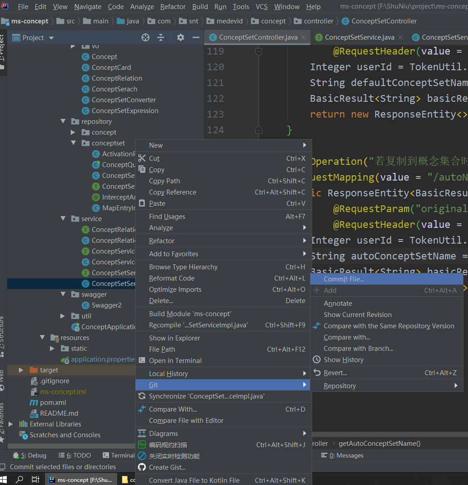
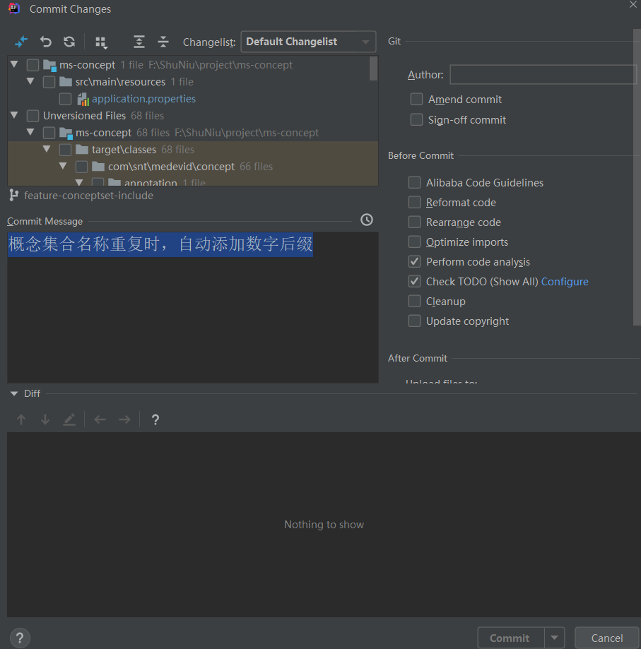
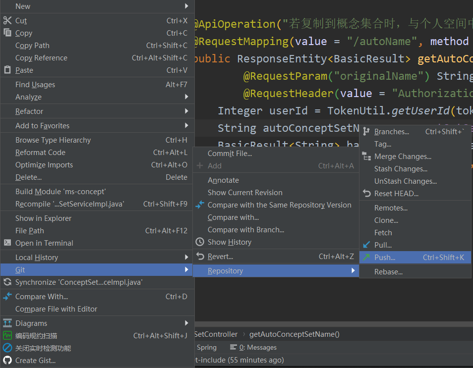
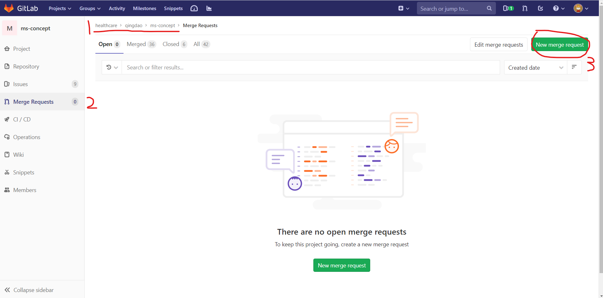
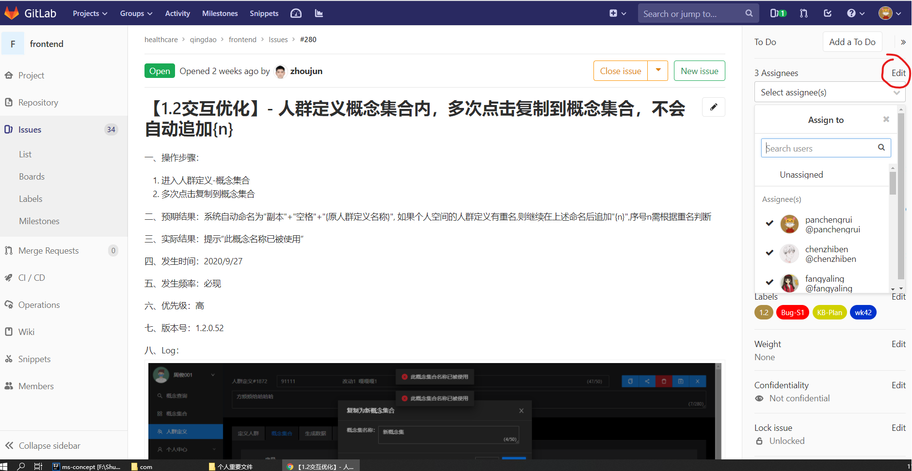

完成代码编写或修改后，需要进行代码的提交、合并，并将issue指派给对应的开发人员和陈之奔进行部署

* **代码提交**

  1. 选中修改的代码文件，使用git->commit files选项

  

  

  ​		在弹出框中添加修改的相关说明

  

  

  ​	之后点击git->Repository->push选项，填写用户名和密码，完成提交

  

  

* **代码合并**

  ​	在对应的项目中，选择Merge Requests，然后点击右上角的New merge request，向他人发送合并请求。等待他人通过合并申请

  

  ​	之后在CI/CD->Pipelines中运行并查看运行结果，看是否有错误或异常

  ​	

* **Issues指派**

  ​	最后在Issues-Boards中将该Issues指派给相应开发运维人员，并在Issues下方评论区简要写上完成工作和后续联调安排。最后将该网址发送给陈之奔。

  