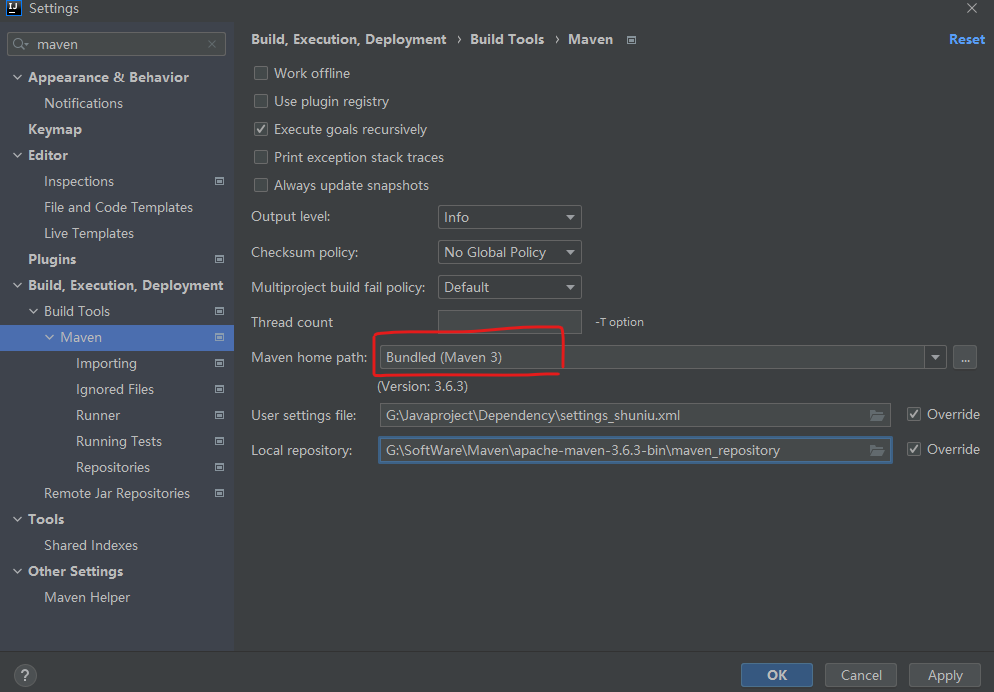

# Maven配置

### 数钮settings(包含了数钮平台和阿里云的仓库，默认是激活数钮仓库):

G:\Javaproject\Dependency\settings.xml

开发数钮项目时，在IDEA的【Settings】中，【Maven home path】选择如下，如果选择G:/SoftWare/Maven/apache-maven-3.6.3-bin/apache-maven-3.6.3，则会被该目录下的/conf/settings.xml中的配置覆盖下面的【User settings file】 和【 Local repository】选项

### 阿里云settings:

G:\SoftWare\Maven\apache-maven-3.6.3-bin\apache-maven-3.6.3\conf\settings.xml

### 本地仓库统一目录

G:\SoftWare\Maven\apache-maven-3.6.3-bin\maven_repository

