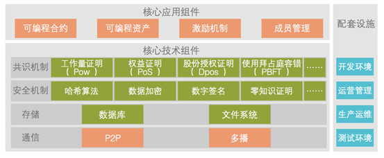
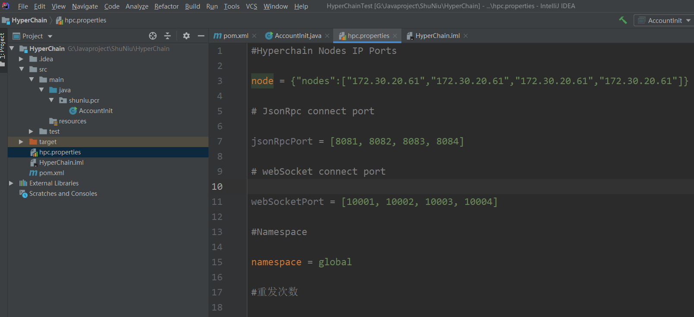
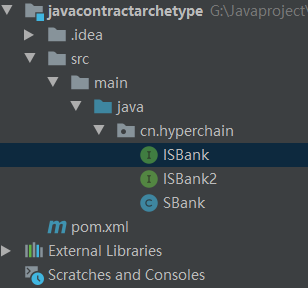
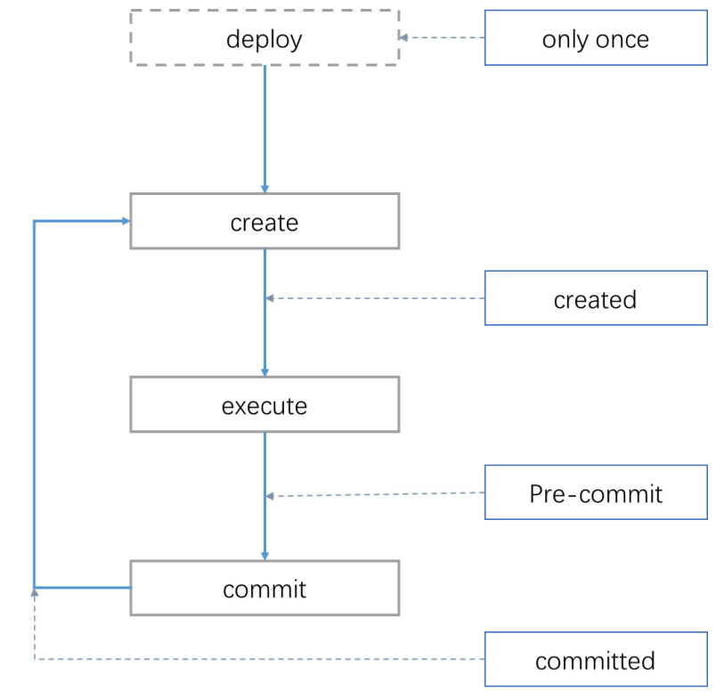
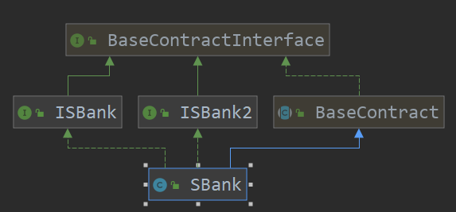

[toc]

---

# 一、区块链概述

## 1.1 什么是区块链技术

 	狭义来说：区块链是一种按照时间顺序将数据区块用类似链表的方式组成的数据结构，并以密码学方式保证不可篡改和不可伪造的分布式去中心化账本。

​	广义来说：区块链技术是利用**块链式数据结构**来<u>验证与存储</u>数据、利用分布式**节点共识算法**来<u>生成和更新</u>数据、利用**密码学**的方式保证<u>数据</u>传输和访问的<u>安全</u>、利用由自动化脚本代码组成的**智能合约**来<u>编程和操作</u>数据的一种全新的分布式基础架构与计算范式。  

​	本质：分布式、去中心化的数据库


## 1.2 区块链技术解决了哪些问题

​	区块链的出现解决了数字货币的两大问题：双重支付问题以及拜占庭将军问题

1. 双重支付问题

   ​	双重支付问题，就是同一笔钱被使用了超过一次，是在原有的以物理实体（纸币）为基础的传统金融体系中自然可 避免的问题。在区块链出现之前的数字货币，都是通过可信任的中心化第三方机构来保证，以前是银行，现在是支付宝、微信支付等。

   ​	区块链技术通过共识机制和分布式账本，不需要可信第三方就可以解决双重支付的问题是数字货币的一大突破。

2. 拜占庭将军问题

   ​	拜占庭将军问题（ Byzantine generals problem）是现实世界问题的模型化，适用于分布式网络的简单抽象为“<u>在缺少可信中心节点的情况下，分布式节点怎么达成共识建立互信的问题</u>”。区块链使用“**工作量证明**”（PoW，proof of work）及“**权益证明**”（proof of stake）或**其他的共识机制**，再加上<u>**加密技术**</u>，使一个不可信网络变成可信的网络，所有参与者可以在某些方面达成一致，而无需信任单个节点。 


## 1.3 区块链技术中的关键概念

1. 加密技术和授权技术

   ​	区块链技术很好的集成当前对称加密、非对称加密、哈希散列算法的许多优点，并使用了数字签名技术来保证交易的安全性。

2. 共识机制

   ​	共识机制是区块链系统中<u>各个节点达成一致的策略和方法</u>。区块链的共识机制替代了传统应用中保证信任和交易安全的第三方中心机构，能够降低由于各方不信任而产生的第三方信用、时间成本和资本耗用。常用的共识机制主要有PoW、PoS、DPoS、Paxos、PBFT等，<u>共识机制既是数据写入的方式，也是防止篡改的手段</u>。  

3. 智能合约

   ​	智能合约是可以运行在区块链上的模块化、可重用的自动执行脚本。<u>它能够实现价值的存储、传递、控制和管理</u>，为基于区块链的应用提供了创新性的解决方案。


# 二、区块链架构

​	区块链的技术架构可以分为核心技术组件、核心应用组件以及配套设施




# 三、智能合约

​	本质：智能合约是可以运行在区块链上的模块化、可重用的程序代码。

​	签署合约的各参与方就合约内容达成一致，以智能合约的形式部署在区块链上，即可不依赖任何中心机构，自动化地代表各签署方执行合约。		<u>智能合约</u>不仅赋予了区块链<u>底层数据可编程性</u>，还<u>封装</u>了区块链网络中各节点的<u>复杂行为</u>，为建立基于区块链技术的上层应用提供方便的接口。

智能合约的运行过程如下：

> ​	智能合约封装预定义的若干状态、转换规则、触发条件以及对应 操作等，经过各方签署后，以程序代码的形式附着在区块链数据上，经过区块链网络的传播和验证后被记入各个节点的分布式账本中，区块链可以实时监控整个智能合约的状态，在确认满足特定的触发条件后激活并执行合约。


## 3.1 区块链与智能合约的关系

​	区块链可以为智能合约提供可信的执行环境。


## 3.2 区块链上的智能合约具有的性质

1. 确定性

   ​	如果一个智能合约是非确定性的，那么不同节点运行的结果就可能不一致，从而导致共识无法达成，网络陷入停滞

2. 可终止性

   ​	如果智能合约是永不停止的，那么节点将耗费无穷多的时间和资源去运行合约，同样导致网络进入停滞状态


## 3.3 实现原理

### 3.3.1 执行环境

​	智能合约的执行环境决定了合约执行的效率。目前主流的区块链架构对智能合约执行环境的设计主要分为两种：<u>虚拟机</u>和<u>容器</u>（Docker）。  	

* **虚拟机**

  ​	在目前的区块链智能合约系统设计中，大多数都采用轻量级的虚拟机架构，来支持智能合约的运行，例如以太坊开发的EVM，趣链科技开发的HyperVM等。

* **容器**

  ​	Docker是一种轻量级的虚拟化技术，通过Linux内核的namespace做环境隔离，通过cgroup进行资源划分。

* **两者比较**

  |          | 虚拟机                | 容器Docker                         |
  | -------- | --------------------- | ---------------------------------- |
  | 启动速度 | 迅速                  | 慢                                 |
  | 隔离性   | 极高                  | 不如虚拟机彻底，安全性可能存在隐患 |
  | 占用资源 | 少                    | 很多                               |
  | 运行效率 | 较低（可通过JIT改善） | 很高                               |


### 3.3.2 确定性

​	区块链上的智能合约一般被要求它的行为必须是确定性的，因为非确定性的合约可能会破坏系统的一致性。<u>区块链开发者必须在设计智能合约系统阶段时，就得设计具体方案把合约非确定性因素排除在外</u>。

​	以太坊和Hyperchain都提供了一个图灵完备的智能合约平台，它们所支持的智能合约都没有提供任何非确定性的系统函数，所有可以访问的数据仅限于链内数据，外部数据需要通过交易来发送到合约，所有的函数调用都是确定性的。


### 3.3.2 可终止性

​	区块链上的智能合约必须具有可终止这个特性，否则整个系统将会因为无止尽的运行而陷入瘫痪。我们无法在不运行一个程序的情况下，提前判定该程序是否会在有限时间内结束运行。因此，区块链的设计者不得不假设所有的智能合约都可能会进入死循环，并对于可能已经进入死循环的合约采用异常终止的方式来结束它。通常会有以下几种策略：

* 非图灵完备

* **手续费**

  ​	以太坊采用了手续费来作为合约可终止性的保障依据：在执行过程中，没解释一个合约字节码，就需要缴纳一定量的手续费。当用户在发起交易时指定的手续费全部耗尽时，那么就认为合约的执行时间已经超出了用户的预计范围，可以引申为合约的执行已经陷入了死循环。一旦手续费耗尽，以太坊就会终止合约的执行，从而实现了合约的可终止性。

* **计数器**

  ​	Hyperchain借鉴了以太坊对于智能合约终止性的设计理念，与以太坊需要付出一定的经济代价作为合约运行的手续费不同，Hyperchain采用计数器的设计方案来控制合约的运行时间。HyperVM在执行合约的过程中，根据所解释的字节码类型，每解释一个字节码，就需要为一个全局的计数器加上一定的计数数额，以表示合约当前运行“时长”  。

* 定时器


### 3.3.3 HVM智能合约注意事项

​	http://docs.hyperchain.cn/docs/hvm/2.4-hvm-additional


### 3.3.4 Hyperchain Java SDK文档

​	http://docs.hyperchain.cn/docs/hyperchain/5.2-hyperchain-sdk-javasdk#%E7%AC%AC%E4%B8%80%E7%AB%A0-%E5%89%8D%E8%A8%80

# 四、HyperChainAPI

​	**主要参考链接**：http://docs.hyperchain.cn/docs/hyperchain/5.2-hyperchain-sdk-javasdk#%E7%AC%AC%E4%B8%80%E7%AB%A0-%E5%89%8D%E8%A8%80

## 4.1 创建账户

1. 在项目中新建配置文件 `hpc.properties` ，将公司部署在服务器平台上的节点IP `172.30.20.61` 和 端口 `8081-8084` 配置在文件中

   

2. 创建账户

   ```java
   HyperchainAPI hyperchain = new HyperchainAPI("G:\\Javaproject\\ShuNiu\\HyperChain\\hpc.properties");
   String accountJson = HyperchainAPI.newAccountRawSM2();
   Account account = new Account(accountJson);
   ```

   

## 4.2 编写合约

* **Demo**

  

  ​	合约的编写主要为<u>合约主体类</u>和<u>合约可见接口</u>（交付接口）

  ​	调用合约的类被称为<u>合约调用类</u>——invoke bean，需要注意的是，invoke bean 需要一个**空参空体**的构造函数

* **合约生命周期**

  ​	合约的生命周期如下：

  > * deploy ：合约部署阶段，该阶段只会在合约部署时出现一次。 
  > * create ：构建合约对象阶段，无论部署还是调用均有该阶段。
  > * execute ：执行invoke bean阶段，该阶段仅仅在调用合约时出现。
  > * commit ：持久化阶段会自动扫描合约对象所有的持久化变量并做持久化操作（即数据真正上链），该阶段仅仅在调用合约时出现。

  ​	开发者可以通过按需重写`BaseContract`中的四个钩子方法 `onInit()、onCreated()、onPreCommit()、onCommitted()`，以在合约生命周期的不同阶段加入自定义代码

  > 注：上面提到的四个钩子函数除了 onInit() 外，无论是在合约部署还是合约调用的时候均会被调用。

  

* **合约主体类**

  ​	合约主体类指继承了`BaseContract`并实现了一系列`BaseContractInterface`的子接口（合约可见接口）的类

  

  ​	合约主体类中**必须提供无参构造方法**，且**不建议在构造函数中写合约逻辑**

* **合约调用类**

  ​	合约调用类需要实现`BaseInvoke`接口，该接口的定义如下：

  ```java
  // 泛型T表示返回的类型，V表示合约类
  public interface BaseInvoke<T, V extends BaseContractInterface>  
  {
      T invoke(V obj);
  }
  // invoke 中编写执行合约的具体逻辑，obj 为合约对象
  ```

  ​	合约调用类中必须提供空参空体的构造函数，这种约定有如下几个优点：

  > 1. 能够使得在不更新合约的情况下更新合约业务逻辑（通过更新invoke方法内的逻辑，或者实现多个用于不同业务场景的invoke bean），以此适应不断变化的业务需求。
  > 2. 能够保证整个业务逻辑为一个事务，即整个方法要么全部执行要么全部不执行。
  > 3. 能够在编译阶段就进行参数类型检查，而非运行时检查（与HyperJVM相比），提升了安全性。
  > 4. 能够在编译阶段就进行参数类型检查，而非运行时检查（与HyperJVM相比），提升了安全性。

* **合约功能bean**

  ​	在合约调用过程当中可能需要传输一些用户自定义的数据类型,我们称为是功能Bean，该类数据类型需要在链上和用户应用均有定义，可以认为是一种DTO。

  ​	注意：编写合约功能bean时，需要提供空参构造函数，并且重写`hashCode()`函数和`equals()`函数

# 问题

## 1. 智能合约的确定性具体指什么？开发智能合约时，如何排除不确定性因素？


## 2. 权益证明的共识机制和中心化系统有何区别？


## 3. 区块链中的每个节点保存一份完整的交易信息，随着数据量的增加，产生的新节点都需要同步之前所有的交易记录，如何保证系统效率？


##  4. 

