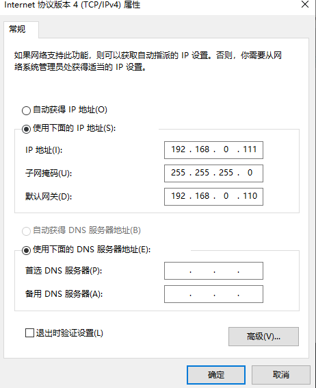
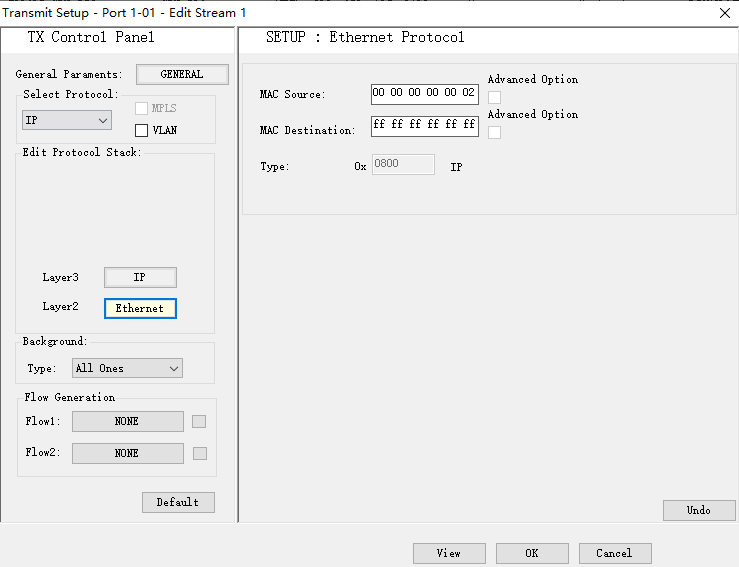
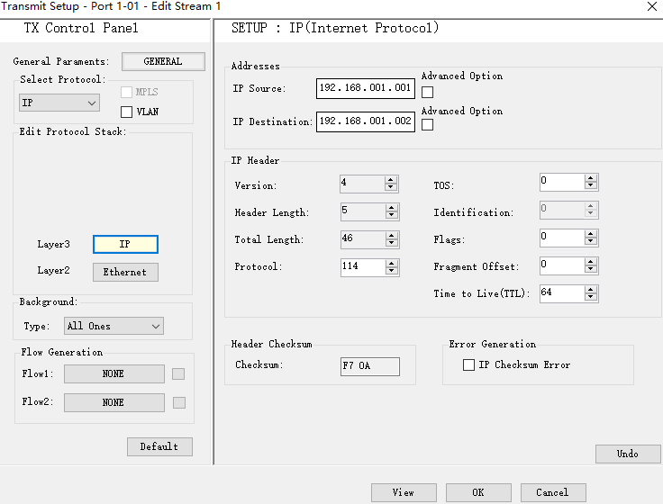

# 一、环境搭建

## 1.1 个人PC端网络设置

> ​	将默认网关设置为流量仪 ip，然后将PC的 ip 地址设置为和流量仪相同网段的 ip



​	使用PTSWindow软件连接流量仪，验证是否可以连接成功


## 1.2 服务器配置

> 1. 清除服务器上两个网卡的 ip 和 服务器的路由规则
> 2. 配置网桥，将两个网口直接桥接


### 配置网桥

> ​	使用 brctl 进行网络桥接

1. 验证服务器是否有 brctl 工具

   ```
   brctl
   ```

2. 如果没有 brctl 工具，需要安装

   ```
   apt-get install bridge-utils
   ```

   可能出现 Temporary failure resolving ... 的问题，导致无法安装软件，则先进行一下操作：

   ```
   cat >> /etc/resolv.conf << EOF
   >nameserver 8.8.8.8
   >nameserver 8.8.4.4
   >EOF
   ```

3. 配置网桥，将两个网卡桥接

   > 在配置网桥之前，需要先进行如下两步操作

   ```
   modprobe bridge                             ## 加载 bridge 模块
   echo "1">/proc/sys/net/ipv4/ip_forward      ## 开启转发，多个网卡之间进行数据交互
   ```

   而后可以进行网桥的配置：

   ```
   brctl addbr br0                          ## br0是自定义的网桥名
   brctl stp br0 off
   brctl addif br0 eno2
   brctl addif br0 eno3
   ifconfig eno2 down
   ifconfig eno3 down
   ifconfig eno2 0.0.0.0 up
   ifconfig eno3 0.0.0.0 up
   ifconfig br0 up
   ```


## 1.3 软件配置

> 在port中添加 stream，mac层地址使用默认的就可以了，ip地址应该可以随便填，保证两个ip在同一网段下即可






# 二、Linux相关配置&过程中遇到的小问题

## 2.1  xxx Command not found

​	系统安装完成，进入root权限下后，明明已经安装完成什么软件，当输入新安装的软件命令时，出现 xxx Command not found 的提示，原因应该是rout权限下没有配置Path中的相关路径。

​	可以参考：https://stackoverflow.com/questions/48288790/nb-roots-path-should-usually-contain-usr-local-sbin-usr-sbin-and-sbin-ubun

> 解决步骤：
>
> ```shell
> # 1.进入以下路径
> vim /root/.bashrc
> 
> # 2.在文件的最后加入以下一行
> export PATH=/sbin:/bin:/usr/bin:/usr/sbin:/usr/local/sbin:/usr/local/bin
> 
> # 3.使刚刚的配置文件生效
> source /root/.bashrc
> ```


## 2.2  服务器开启ssh登录

```shell
# 1.进入配置文件
vim /etc/ssh/sshd_config

# 2.将以下两个配置打开(将前面的注释符号去掉，并将属性改为yes)
PasswordAuthentication yes
PermitRootLogin yes

# 3.退出配置文件，并重启sshd服务
service sshd restart
```


## 2.3  查看服务器上正在运行的 java 进程

```shell
# 1.查看
ps -ef | grep java
# 2.杀掉某个进程
kill threadNum
```

