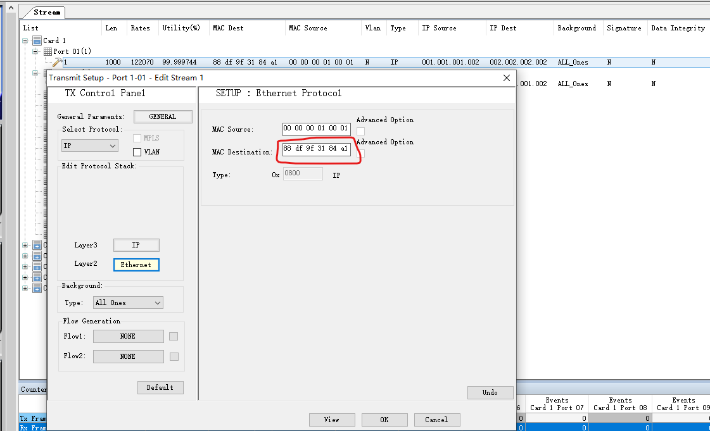

# 新华三环境配置

服务器ip: 172.30.20.225

用户名：shuniu  密码：123456

---

## 方案一：服务器网口桥接

> 在没有交换机的情况下，通过在服务器两个网口间配置网桥的方法，可以实现包数据由流量仪-服务器-流量仪的流通


### 1.1 PC配置


​	使用网线将个人PC接入公司网口(这种方式不好，好像经常会出现连接断开的情况，最好还是流量仪和个人PC直连)，之后在PC网络适配器选项中做如上设置，子网掩码和默认网关（默认网关是流量仪的IP）按图设置，IP地址需要在192.168.0网段下，末位的111自己任意修改，避免IP冲突。

​	配置完成后，就可以使用PTSWindow软件进行连接，验证是否可以连接成功


### 1.2 服务器配置

> 1. 清除服务器上两个网卡的 ip 和 服务器的路由规则
> 2. 配置网桥，将两个网口直接桥接

**配置网桥**

> ​	使用 brctl 进行网络桥接

1. 验证服务器是否有 brctl 工具

   ```shell
   brctl
   ```

2. 如果没有 brctl 工具，需要安装

   ```shell
   apt-get install bridge-utils
   ```

   可能出现 Temporary failure resolving ... 的问题，导致无法安装软件，则先进行一下操作：

   ```shell
   cat >> /etc/resolv.conf << EOF
   >nameserver 8.8.8.8
   >nameserver 8.8.4.4
   >EOF
   ```

3. 配置网桥，将两个网卡桥接

   > 在配置网桥之前，需要先进行如下两步操作

   ```shell
   modprobe bridge                             ## 加载 bridge 模块
   echo "1">/proc/sys/net/ipv4/ip_forward      ## 开启转发，多个网卡之间进行数据交互
   ```

   而后可以进行网桥的配置：

   ```shell
   brctl addbr br0                          ## br0是自定义的网桥名
   brctl stp br0 off
   brctl addif br0 eno2
   brctl addif br0 eno3
   ifconfig eno2 down
   ifconfig eno3 down
   ifconfig eno2 0.0.0.0 up
   ifconfig eno3 0.0.0.0 up
   ifconfig br0 up
   ```


### 1.3 流量仪软件配置

> 在Port01中添加 stream，mac层地址使用默认的就可以了，IP Source和IP Destination配置如下


### 1.4 验证流量环路是否连通 

> 之后就可以通过流量仪发送数据了，验证Counter面板下相同颜色的两个数据是否相等（下图不相等，表明环路没有流通）


## 方案二：新华三提出的方案

> ​	该方案同样是在没有交换机的情况下进行的网络配置，但是目前该方案没有。不在服务器中配置网桥，通过配置静态路由和arp的方式，在服务器的两个网口间进行转发


### 2.1 PC配置

​	个人PC配置内容和方案一中相同


### 2.2 服务器配置

* **静态 IP 配置**

  将流量入口（eno2）和流量出口（eno3）配置如下：

  ```shell
  # 1.进入网络配置
  vim /etc/network/interfaces
  # 2.配置静态IP
  auto eno2
  allow-hotplug eno2
  iface eno2 inet static
  	address 1.1.1.1/24
  	gateway 1.1.1.10		# 网关不确定是不是一定要配置，在之前的试验中是随便配置了一个
  
  auto eno3
  allow-hotplug eno3
  iface eno3 inet static
  	address 2.2.2.1/24
  	gateway 2.2.2.10		# 网关不确定是不是一定要配置，在之前的试验中是随便配置了一个
  ```

* **开启转发功能**

  ```shell
  # 1.可以使用命令查看服务器是否已开启转发功能
  cat /proc/sys/net/ipv4/ip_forward
  # 2.若显示0，则使用如下命令开启转发功能，允许多个网卡之间进行数据交互
  echo "1">/proc/sys/net/ipv4/ip_forward
  ```

* **配置静态路由**

  ```shell
  route add -net 1.1.1.0 netmask 255.255.255.0 dev eno2
  route add -net 2.2.2.0 netmask 255.255.255.0 dev eno3
  ```

* **配置arp**

  ```shell
  arp -s 1.1.1.2 00:00:00:01:00:01		# 这里的MAC地址是在流量仪上port1配置的mac source
  arp -s 2.2.2.2 00:00:00:02:00:02		# 这里的MAC地址是在流量仪上port2配置的mac source
  ```


### 2.3 流量仪软件配置

> 在Port01中添加 stream，IP层和MAC层配置分别如下
>
> 
>
> 
>
> ​	其中， MAC Destination是eno2网口的mac地址

​	此时，可以使用流量仪进行打流操作并验证发送的包的数量和接收的包的数量是否一致了，如果出现丢失了很多包，同时也接收到很多包的情况，将包的长度加大（邹工说的是包太小服务器压力会增大？他是这么说，我不是特别理解，总之将包的大小有原来的60改到1000后，所有发送的包就会被全部接收了），更改的方式如下：

1. Port01上右键->Edit

   

2. Stream记录上右键->Edit

   

3. 将Length改为1000

   


## 方案三：增加交换机

> ​	在方案二的基础上，在流量仪和服务器之间增加一台交换机，流量仪与交换机形成一个数据环路，另外在交换机的某个端口上配置镜像，将流量包镜像到服务器端口上
>
> ​	交换机17口是从流量仪打过来的流量入口，19口是由交换机回到流量仪的流量出口，18口是交换机镜像到服务器的端口

### 3.1 交换机配置

​	邹工指导使用超级终端配置交换机(可能使用到的命令，并不是每一条都是必要的)

```shell
dis inter brief

vlan 100

vlan 200

sys

port g 1/0/17

int vlan 100

ip add 1.1.1.1 24

vlan 200

port g1/0/19

int vlan 200

ip add 2.2.2.1 24

arp static 1.1.1.2 0-1-1 g1/0/17

quit

arp static 1.1.1.2 0-1-1 100  g1/0/17

arp static 2.2.2.2 0-2-2 200  g1/0/19

dis int vlan 100

dis int vlan 200

ping 1.1.1.2

mirror 1 ?

mirror 1 mirroring-port g1/0/17 ?

mirror 1 moni?

monitor-port g1/0/18

mirror 1 monitor-port g1/0/18

dis cu 

save
```


### 3.2 修改流量仪软件配置

  在方案二的流量仪配置基础上，只需要将流配置中设置的目的mac地址修改为17号端口的mac即可




## 其他的一些命令

```shell
# 1.服务器跑tpcdump抓包程序（使用PF_Ring编译的底层库） 
 # 根目录下执行
./tcpdump --direction=in -i eno2 -s 0 -w my100w.pcap       # “my100w.pcap”是文件名

# 2.跑PF_Ring程序: 
pfcount -i eno2 -e 1

# 3.杀死PF_Ring程序：
pkill pfcount
```

