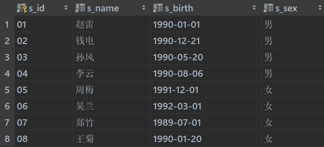
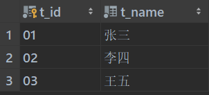
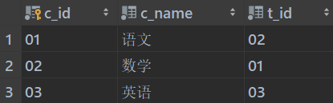
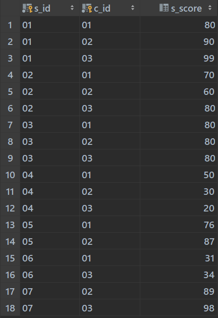

## 反转链表

```java
/** 
* Definition for a node.
* public class Node {
 *     int val;
 *     Node next;
 *     Node() {}
 *     Node(int val) { this.val = val; }
 *     Node(int val, Node next) { this.val = val; this.next = next; }
 * }
 */

// 非递归实现
class Solution {
    public Node reverse(Node head) {
        // if(head == null) return head;		// 可省略
        Node pre = null, cur = head;
        Node tem;
        while(cur!=null){
            tem = cur.next;
            cur.next = pre;
            pre = cur;
            cur = tem;
        }
        return pre;
    }
}

// 递归实现
class Solution {
    public Node reverse(Node head) {
        if (head.next == null) return head;
        ListNode last = reverse(head.next);
        head.next.next = head;
        head.next = null;
        return last;
    }
}
```


## 二叉树遍历

```java
/**
 * Definition for a binary tree node.
 * public class TreeNode {
 *     int val;
 *     TreeNode left;
 *     TreeNode right;
 *     TreeNode() {}
 *     TreeNode(int val) { this.val = val; }
 *     TreeNode(int val, TreeNode left, TreeNode right) {
 *         this.val = val;
 *         this.left = left;
 *         this.right = right;
 *     }
 * }
 */
class Solution {
    List<Integer> res = new ArrayList<Integer>();
    public List<Integer> preorderTraversal(TreeNode root) {
        if(root!=null){
            // 位置1：res.add(root.val);		前序遍历
            preorderTraversal(root.left);
            // 位置2：res.add(root.val);		中序遍历
            preorderTraversal(root.right);
            // 位置3：res.add(root.val);		后序遍历
        }
        return res;    
    }
}
```


## 二叉树层序遍历

```java
public void levelOrder(TreeNode root){
        if (root == null){
            return;
        }

        Queue<TreeNode> queue = new LinkedList<>();
        // 先将根节点放入队列
        queue.add(root);

        while (!queue.isEmpty()){
            // 从队列中取出节点
            TreeNode node = queue.remove();
            System.out.println(node.val);

            // 如果其左子树不为空，则将左子树加入队列
            if (node.left != null){
                queue.add(node.left);
            }
            // 如果其右子树不为空，则将其右子树加入队列
            if (node.right != null){
                queue.add(node.right);
            }
        }
}    
```


## 二分查找

```java
class Solution {
    public int search(int[] nums, int target) {
        int length = nums.length;
        if (nums == null || length == 0
            // 避免当target小于nums中的最小数或者大于最大数时多次循环
            || target < nums[0] || target > nums[length - 1]) {
            return -1;
        }
        int left = 0;
        // (1)
        int right = length - 1;
        // (2) 注意这里写得是 <= , 当然也可以写成 < , 不过(1)处要改为right=length，（3）处要改为right=mid
        while (left <= right) {
            int mid = left + ((right - left) / 2);
            if (target == nums[mid]) {
                return mid;
            }
            else if (target > nums[mid]) {
                left = mid + 1;
            } else {
                // （3）
                right = mid - 1;
            }
        }
        return -1;
    }
}
```


## 冒泡排序

```java
public class BubbleSort {
    public static void bubbleSort(int[] arr){
        if(arr == null || arr.length <2){
            return;
        }
        for (int end = arr.length-1; end>0; end--){
            for (int i = 0; i < end; i++) {
                if(arr[i] > arr[i+1]){
                    swap(arr, i, i+1);
                }
            }
        }
    }

    private static void swap(int[] arr, int i, int j) {
        int tem = arr[i];
        arr[i] = arr[j];
        arr[j] = tem;
    }

    public static void main(String[] args) {
        int a[] = { 49, 38, 65, 97, 76, 13, 27, 49 };
        bubbleSort(a);
        System.out.println(Arrays.toString(a));
    }
}
```


## 快速排序

```java
public class QuickSort {
    public static void sort(int a[], int low, int hight) {
        int i, j, index;
        if (low > hight) {
            return;
        }
        i = low;
        j = hight;
        index = a[i]; // 用子表的第一个记录做基准
        while (i < j) { // 从表的两端交替向中间扫描
            while (i < j && a[j] >= index)
                j--;
            if (i < j)
                a[i++] = a[j];// 用比基准小的记录替换低位记录
            while (i < j && a[i] < index)
                i++;
            if (i < j) // 用比基准大的记录替换高位记录
                a[j--] = a[i];
        }
        a[i] = index;// 将基准数值替换回 a[i]
        sort(a, low, i - 1); // 对低子表进行递归排序
        sort(a, i + 1, hight); // 对高子表进行递归排序

    }

    public static void quickSort(int a[]) {
        sort(a, 0, a.length - 1);
    }

    public static void main(String[] args) {

        int a[] = { 49, 38, 65, 97, 76, 13, 27, 49 };
        quickSort(a);
        System.out.println(Arrays.toString(a));
    }
}
```


## 单例模式

```java
class Singleton1 {
    private static final Singleton1 instance = new Singleton1();
    private Singleton1(){}

    public static Singleton1 getInstance(){
        return instance;
    }
}

class Singleton2 {
    private static volatile Singleton2 instance;
    private Singleton2(){}

    public static Singleton2 getInstance(){
        if(instance==null){
            synchronized (Singleton2.class){
                if(instance == null){
                    instance = new Singleton2();
                }
            }
        }
        return instance;
    }
}

/**
 * 静态内部类    实现方式
 * 比带有双重检验的懒汉式更加简洁，同时支持延迟加载
 */
class Singleton3{
    private Singleton3(){ }

    private static class SingletonHoler{
        private static final Singleton3 instance = new Singleton3();
    }

    public static Singleton3 getInstance(){
        return SingletonHoler.instance;
    }
}

/**
 * 枚举   实现方式
 */
enum Singleton4{
    INSTANCE;
}
```


## MySQL

> 表结构
>
>  student表
>
>  teacher表
>
>  course表
>
>  score表

```sql
-- 1、查询"01"课程比"02"课程成绩高的学生的信息及课程分数
select st.*,sc.s_score as '语文' ,sc2.s_score as '数学'
from student st
left join score sc on sc.s_id=st.s_id and sc.c_id='01'
left join score sc2 on sc2.s_id=st.s_id and sc2.c_id='02'
where sc.s_score>sc2.s_score;

-- 2、查询"01"课程比"02"课程成绩低的学生的信息及课程分数
select st.*, sc1.s_score as '语文', sc2.s_score as '数学'
from student st
left join score sc1 on st.s_id = sc1.s_id and sc1.c_id = '01'
left join score sc2 on st.s_id = sc2.s_id and sc2.c_id = '02'
where sc1.s_score < sc2.s_score;

-- 3、查询平均成绩大于等于60分的同学的学生编号和学生姓名和平均成绩
select st.s_id, st.s_name, ROUND(AVG(sc.s_score), 2) as '平均分'
from student st
left join score sc on st.s_id = sc.s_id
group by st.s_id having AVG(sc.s_score)>=60;

-- 4、查询平均成绩小于60分的同学的学生编号和学生姓名和平均成绩
        -- (包括有成绩的和无成绩的)
select st.s_id, st.s_name, (case when ROUND(AVG(sc.s_score), 2) is NULL then 0 else ROUND(AVG(sc.s_score), 2) end ) as '平均分'
from student st
left join score sc on st.s_id = sc.s_id
group by st.s_id having AVG(sc.s_score)<60 or AVG(sc.s_score) is NULL;

-- 5、查询所有同学的学生编号、学生姓名、选课总数、所有课程的总成绩
select st.s_id, st.s_name, count(sc.c_id) as '选课总数', SUM(case when sc.s_score is null then 0 else sc.s_score end) as '总成绩'
from student st
left join score sc on st.s_id = sc.s_id
group by sc.s_id;

-- 6、查询"李"姓老师的数量
select count(1) as '李姓老师数量'
from teacher where teacher.t_name like '李%';

-- 7、查询学过"张三"老师授课的同学的信息
select st.* from student st
left join score sc on sc.s_id=st.s_id
left join course c on c.c_id=sc.c_id
left join teacher t on t.t_id=c.t_id
where t.t_name='张三';

-- 8、查询没学过"张三"老师授课的同学的信息
select st1.* from student st1 where st1.s_id not in
(
        select st2.s_id from student st2
        left join score sc on sc.s_id=st2.s_id
        left join course c on c.c_id=sc.c_id
        left join teacher t on t.t_id=c.t_id
        where t.t_name='张三'
);

-- 9、查询学过编号为"01"并且也学过编号为"02"的课程的同学的信息
select st.* from student st
inner join score sc on sc.s_id = st.s_id
inner join course c on c.c_id=sc.c_id and c.c_id='01'
where st.s_id in (
    select st2.s_id from student st2
    inner join score sc2 on sc2.s_id = st2.s_id
    inner join course c2 on c2.c_id=sc2.c_id and c2.c_id='02'
);

-- 10、查询学过编号为"01"但是没有学过编号为"02"的课程的同学的信息
select st.* from student st
inner join score sc on st.s_id = sc.s_id
inner join course c on sc.c_id = c.c_id and c.c_id = '01'
where st.s_id not in(
    select st2.s_id from student st2
    inner join score sc2 on st2.s_id = sc2.s_id
    inner join course c2 on sc2.c_id = c2.c_id and c2.c_id = '02'
);

-- 11、查询没有学全所有课程的同学的信息
select * from student where s_id not in (
    select st.s_id from student st
    inner join score sc on sc.s_id = st.s_id and sc.c_id='01'
    where st.s_id  in (
        select st1.s_id from student st1
        inner join score sc2 on sc2.s_id = st1.s_id and sc2.c_id='02'
    )
      and st.s_id in (
        select st2.s_id from student st2
        inner join score sc2 on sc2.s_id = st2.s_id and sc2.c_id='03'
));

-- 12、查询至少有一门课与学号为"01"的同学所学相同的同学的信息
select distinct st.* from student st
inner join score sc on st.s_id = sc.s_id where sc.c_id in(
select sc.c_id from score sc where sc.s_id = '01');

-- 13、查询和"01"号的同学学习的课程完全相同的其他同学的信息
select st.* from student st
inner join score sc on st.s_id = sc.s_id
group by st.s_id having group_concat(sc.c_id) = (
    select group_concat(sc2.c_id) from score sc2
    where sc2.s_id = '01'
);

-- 14、查询没学过"张三"老师讲授的任一门课程的学生姓名
select st.s_name from student st
where st.s_id not in (
select sc.s_id from score sc
inner join course c on c.c_id=sc.c_id
inner join teacher t on t.t_id=c.t_id and t.t_name='张三'
);

-- 15、查询两门及其以上不及格课程的同学的学号，姓名及其平均成绩
explain select st.s_id,st.s_name,avg(sc.s_score) from student st
left join score sc on sc.s_id=st.s_id
where sc.s_id in (
    select sc2.s_id from score sc2
    where sc2.s_score<60 or sc2.s_score is NULL
    group by sc2.s_id having COUNT(1)>=2
)
group by st.s_id;

-- 16、检索"01"课程分数小于60，按分数降序排列的学生信息
explain select st.*, sc.s_score from student st
inner join score sc on st.s_id = sc.s_id
where sc.s_score < 60 and sc.c_id = '01'
order by sc.s_score desc;

-- 17、按平均成绩从高到低显示所有学生的所有课程的成绩以及平均成绩
select st.s_id,st.s_name,avg(sc4.s_score) "平均分",sc.s_score "语文",sc2.s_score "数学",sc3.s_score "英语" from student st
left join score sc  on sc.s_id=st.s_id  and sc.c_id='01'
left join score sc2 on sc2.s_id=st.s_id and sc2.c_id='02'
left join score sc3 on sc3.s_id=st.s_id and sc3.c_id='03'
left join score sc4 on sc4.s_id=st.s_id
group by st.s_id
order by avg(sc4.s_score) desc;

-- 20、查询学生的总成绩并进行排名
select st.s_id, st.s_name, sum(sc.s_score) as '总成绩' from student st
left join score sc on st.s_id = sc.s_id
group by st.s_id order by sum(sc.s_score) desc;

-- 21、查询不同老师所教课程的平均分从高到低显示
select t.*, c.c_name, avg(sc.s_score) from teacher t
left join course c on t.t_id = c.t_id
left join score sc on c.c_id = sc.c_id
group by t.t_id order by avg(sc.s_score) desc;

-- 23、统计各科成绩各分数段人数：课程编号,课程名称,[100-85],[85-70],[70-60],[0-60]及所占百分比
select c.c_id,c.c_name
,((select count(1) from score sc where sc.c_id=c.c_id and sc.s_score<=100 and sc.s_score>80)/(select count(1) from score sc where sc.c_id=c.c_id )) "100-85"
,((select count(1) from score sc where sc.c_id=c.c_id and sc.s_score<=85 and sc.s_score>70)/(select count(1) from score sc where sc.c_id=c.c_id )) "85-70"
,((select count(1) from score sc where sc.c_id=c.c_id and sc.s_score<=70 and sc.s_score>60)/(select count(1) from score sc where sc.c_id=c.c_id )) "70-60"
,((select count(1) from score sc where sc.c_id=c.c_id and sc.s_score<=60 and sc.s_score>=0)/(select count(1) from score sc where sc.c_id=c.c_id )) "60-0"
from course c order by c.c_id
```

