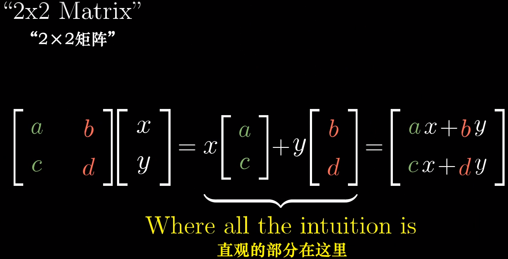
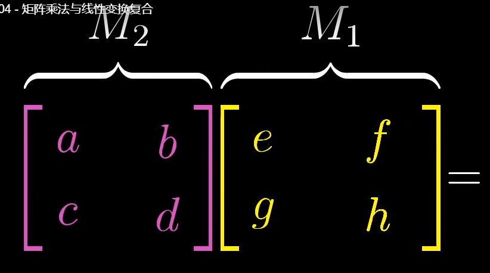
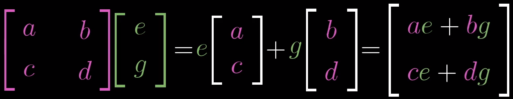
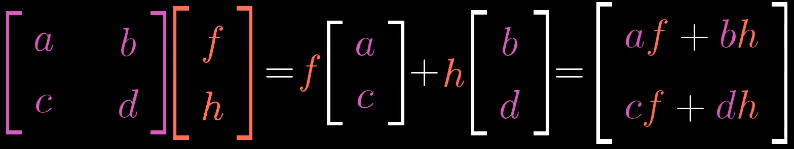

[toc]

---

## 1.线性变换

线性变换可视为保持网格线平行且等距分布，并保持原点不动的变换

### 1.1矩阵-向量乘积

将变换矩阵的每一列看做==线性变换以后基向量的坐标==，变换矩阵代表一个特定的线性变换。矩阵和向量的乘积，就是将某种特定的线性变换作用于那个向量

### 1.2矩阵-矩阵乘积

矩阵和矩阵相乘的直观意义是：两个线性变换相继作用（==按从右到左的矩阵变换顺序进行==）

矩阵-矩阵乘法不具有交换律，具有结合律：
$$
AB\not=BA
\\ABC=A(BC)
$$

## 2.行列式

