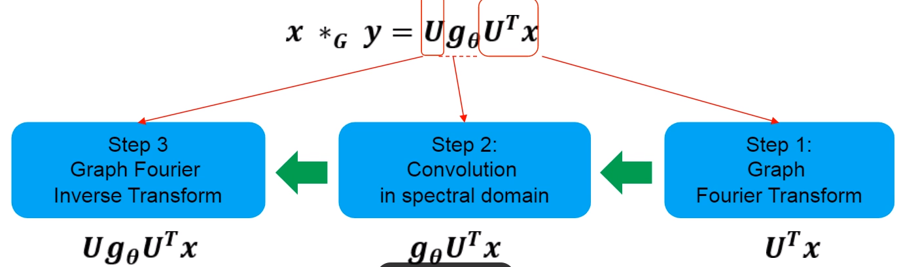
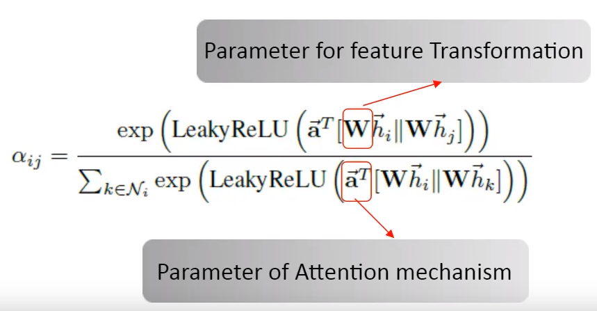

[toc]

---

---

# 一、大纲

## 摘要

1. 本文针对推荐系统的什么问题提出解决方案；
2. 本文的针对这些问题的具体做法是什么；
3. 达到了什么样的效果

## 前言

1. 介绍推荐系统定义，它的好处是什么
2. 概要介绍推荐系统以往都有哪些方法
3. 过渡到本文采用的方法，并提出基于本方法之前的工作存在的问题
4. 为解决该问题本文是怎样做的，优势或贡献体现在哪些方面

## 相关工作

​	目前想法是围绕引入辅助信息的各种推荐算法展开，简要略过FM和一种表示学习模型==(参考有道云笔记)==，着重讲知识图谱和深度学习结合的算法：可从三种类型展开

* direct-relation based methods(CKE,KTUP,MKR);
* path-based methods(RKGE,KPRN)
* propagation based methods(Ripplenet,KGCN,KGAT)

## 模型介绍

​	介绍模型实现过程

---

# 二、GCN

*问题:针对原始GCN无法提取中心节点自身信息和度大的节点,其计算出的特征值越大而影响特征提取*

*解决方法:引入拉普拉斯矩阵变换*

## **2.1谱方法 Spectral methods**

### 2.1.1**具体操作**

图上没有平移不变性，无法进行卷积操作，将图信号变换到谱域做处理，之后再逆变换到图上，实现卷积操作

> 详细的三步：1.Graph Fourier Transform:arrow_right:2.Convolution in spectral domain:arrow_right:3.​Graph Fourier Inverse Transform

### 2.1.2**Graph Fourier Transform**

> **Fourier Basis of Graph**
> $$
> L = U \Lambda U^T\\
> U是拉普拉斯矩阵L的正交特征向量的完备集合，\Lambda是对角矩阵，对角元素是拉普拉斯矩阵的特征值\\
> where\ U=[u_1,\ ...,\ u_n],and\ \Lambda=diag([\lambda_1,\ ...,\ \lambda_n])
> $$

> **Graph Fourier transform**
> $$
> {\rm Graph\ Fourier\ transform\ of\ a\ signal}\ x\in R^n {\rm \ is\ defined\ as}\\
> \hat{x}=U^Tx\\
> {\rm Graph\ Fourie\ inverse\ transform\ is}\\
> x = U\hat{x}
> $$

### **2.1.3卷积定理**

两个信号的卷积，等于两个信号分别在傅里叶变换后的点积，所以2.1.1中三步的<a name="gongshi1">公式</a>如下:
$$
x \ * _G\ y = U\big((U^Tx)\odot(U^Ty)\big)\\
\textbf{这里，谱域的卷积核是}U^Ty\\
{\rm Let}\ U^Ty=[\theta_0,\ ...,\ \theta_{n-1}]^T\ and \ g_\theta={\rm diga}\big([\theta_0,\ ...,\ \theta_{n-1}]\big),{\rm \ then\ we\ have}\\
x \ * _G\ y = Ug_\theta U^Tx\ \ \ \ \ \ \ \ \ \ (1)
$$

### **2.1.4缺点**

1. 依赖于拉普拉斯矩阵分解，而该过程复杂度很高

2. 高计算代价

3. 非localized，即当前节点的更新的信息来源不仅是其邻域信息，而是来自于所有节点的信息

> 《 Convolutional Neural Networks on Graphs with Fast Localized Spectral Filtering 》

$$
{\rm 该论文对卷积核}\ g_\theta\ {\rm 做了约束}\\
{\rm 通过多项式近似将卷积核参数化：}\\
g_\beta(\Lambda)=\sum_{k=0}^{K-1}\beta_k\Lambda^k\ \ \ \ \ \ \ \ \Lambda={\rm diag}(\lambda_1,\ ...,\ \lambda_n)\\
x \ * _G\ y =Ug_\beta(\Lambda)U^Tx=\sum_{k=0}^{K-1}\beta_kL^kx\\
{\rm The\ number\ of\ free\ parameters\ reduces\ from\ n\ to\ K，同时解决了上述三个问题}
$$

> 《 GRAPH WAVELET NEURAL NETWORK 》

​				该论文则是通过改变上述公式[(1)](#gongshi1)中的U，将傅里叶变换替换为小波变换来解决上述的三个问题

## **2.2空间方法 Spatial Methods**

步骤：采样邻居节点:arrow_right:给定序号:arrow_right:参数共享

* **GraphSAGE**:随机行走选择邻居节点，聚合选择的==固定数量==的邻居节点的信息来更新中心节点信息

* **GCN**——《SEMI-SUPERVISED CLASSIFICATION WITH GRAPH CONVOLUTIONAL NETWORKS》 名称为GCN，实际没有卷积操作，聚合了一阶邻居信息。

> 1.Aggregating information from neighborhood via a normalized Laplacian matrix
>
> ​	通过标准化拉普拉斯矩阵从邻域聚合信息
>
> 2.Shared paremters are from feature transformation
>
> ​	共享参数来自于特征变换
>
> 3.A reduced version of ChebNet
>
> ​	切比雪夫网络的简化版

* **GAT**

> Learning the aggregation matrix,i.e.,Laplacian matrix in GCN,via attention mechanism
>
> Shared parameters contain two parts
>
> > Parameters for feature transformation
> >
> > 
> >
> > Parameters for attention

**更一般的空间方法**

​	Define ==multiple kernel functions==, parameterized or not, to measure the similarity between target node and other nodes

> 每个核函数定义了一种度量图中任意两个节点相似度的方式，==所说的卷积，就是对这些不同相似度定义方式的加权平均==

​	Convolution kernels are the ==weights== of these kernel funcions

## **2.3谱方法和空间方法的关系**

谱方法是空间方法的特例：谱方法需要显式地定义卷积核，而空间方法不需要

> 在定义谱方法时，我们需要明确的知道将节点投影到哪个空间中，如果是傅里叶变换则投影到拉普拉斯矩阵的特征向量张开的空间中，如果是小波变换，则是小波基特征向量张开的空间。而空间方法不需要，只需要知道卷积核是什么

